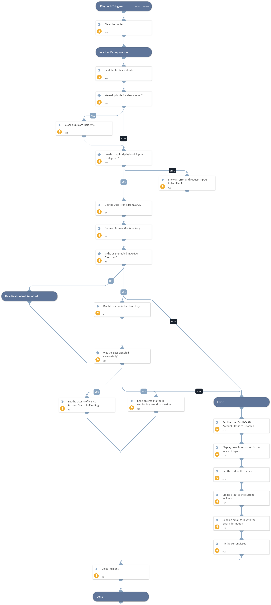

This playbook deactivates users in Active Directory.

## Dependencies
This playbook uses the following sub-playbooks, integrations, and scripts.

### Sub-playbooks
This playbook does not use any sub-playbooks.

### Integrations
* Active Directory Query v2

### Scripts
* SetAndHandleEmpty
* DeleteContext
* GetServerURL
* FindSimilarIncidents
* PrintErrorEntry

### Commands
* findIndicators
* iam-get-user
* closeInvestigation
* iam-disable-user
* send-mail
* setIndicator
* setIncident

## Playbook Inputs
---

| **Name** | **Description** | **Default Value** | **Required** |
| --- | --- | --- | --- |
| ITNotificationEmail | Email to confirm user deactivation and to notify about errors in the provisioning process. |  | Required |

## Playbook Outputs
---
There are no outputs for this playbook.

## Playbook Image
---
