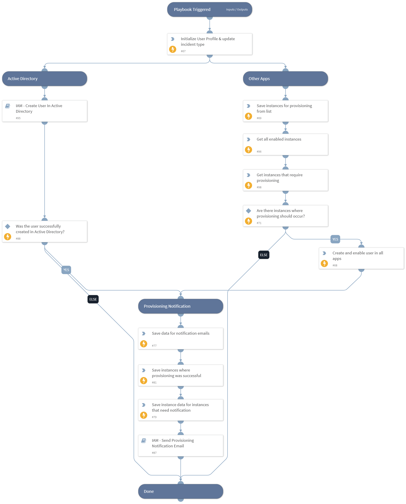

This playbook creates users across all available organization applications from new hire events fetched from Workday.

## Dependencies
This playbook uses the following sub-playbooks, integrations, and scripts.

### Sub-playbooks
* IAM - Create User In Active Directory
* IAM - Send Provisioning Notification Email

### Integrations
This playbook does not use any integrations.

### Scripts
* SetAndHandleEmpty
* GetEnabledInstances
* Set

### Commands
* setIndicator
* iam-create-user

## Playbook Inputs
---

| **Name** | **Description** | **Default Value** | **Required** |
| --- | --- | --- | --- |
| CreatedIndicator | The created User Profile indicator, if created previously in the IAM - Sync User playbook. | CreatedIndicator.None | Optional |
| indicator | The User Profile indicator, if found during a previous search. | indicator.None | Optional |
| SuccessfulVendors | Vendors where provisioning was successful. This input is used to ensure that on playbook reruns, provisioning will be retried only with vendors that previously failed. | IAM.Vendor.None | Optional |
| NotificationEmailHTMLList | Optional - the name of the list that contains an HTML template for the email that will be sent to the users that need to be notified for successful app provisioning.   Note: the list of emails of users that need to be notified can be configured in the "app-provisioning-settings" list, for each instance configured, in fields called "create_user_email_notification_ids",  "enable_user_email_notification_ids" and "disable_user_email_notification_ids". |  | Optional |

## Playbook Outputs
---

| **Path** | **Description** | **Type** |
| --- | --- | --- |
| IAM.Vendor | Command context path | unknown |
| IAM.Vendor.active | Indicates if the user is active or not. Can be true or false | unknown |
| IAM.Vendor.brand | Name of the integration | unknown |
| IAM.Vendor.details | Gives the detail error information | unknown |
| IAM.Vendor.email | Value of email ID passed as argument | unknown |
| IAM.Vendor.errorCode | HTTP error response code | unknown |
| IAM.Vendor.errorMessage | Reason why the API failed | unknown |
| IAM.Vendor.id | Value of id passed as an argument | unknown |
| IAM.Vendor.instanceName | Name of the instance used for testing | unknown |
| IAM.Vendor.success | Indicates if the vendor was successfully updated. Can be true or false | unknown |
| IAM.Vendor.username | Value of the username passed as an argument | unknown |
| IAM.Vendor.action | Value of the action passed as an argument | unknown |
| IAM.UserProfile | The user's profile. | unknown |

## Playbook Image
---
