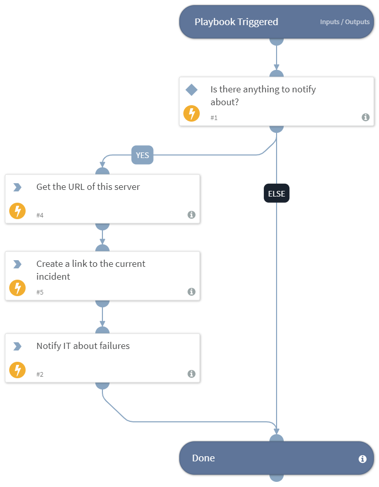

Sends notifications about applications where provisioning failed.

## Dependencies
This playbook uses the following sub-playbooks, integrations, and scripts.

### Sub-playbooks
This playbook does not use any sub-playbooks.

### Integrations
This playbook does not use any integrations.

### Scripts
* SetAndHandleEmpty
* GetServerURL

### Commands
* send-mail

## Playbook Inputs
---

| **Name** | **Description** | **Default Value** | **Required** |
| --- | --- | --- | --- |
| FailedInstances | A list of instances where provisioning failed. | IAM.Vendor.None | Optional |
| ITNotificationEmail | The email of an IT personnel that should address instance failure errors. | inputs.ITNotificationEmail.None | Optional |

## Playbook Outputs
---
There are no outputs for this playbook.

## Playbook Image
---
