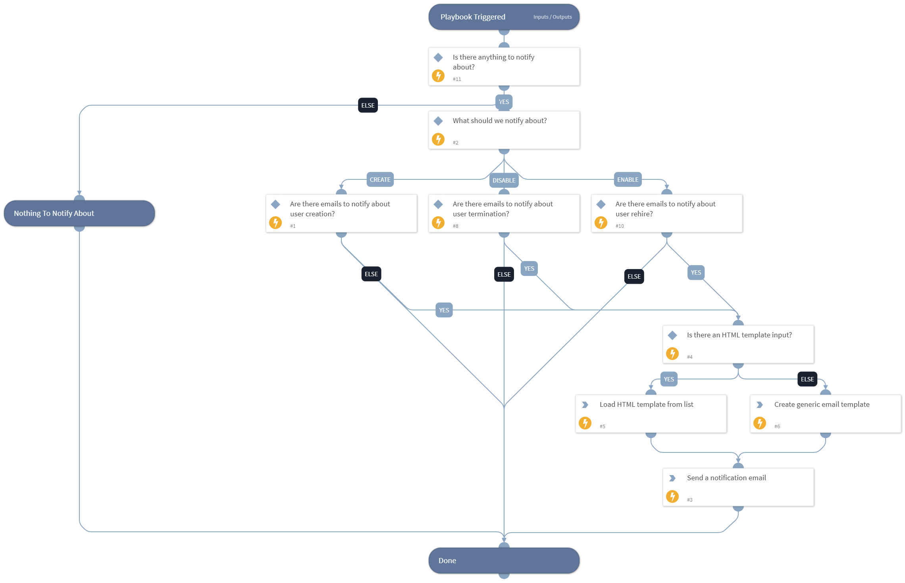

Sends an email notification to the recipients configured in the app-provisioning-list, based on the CRUD command that ran.

## Dependencies
This playbook uses the following sub-playbooks, integrations, and scripts.

### Sub-playbooks
This playbook does not use any sub-playbooks.

### Integrations
This playbook does not use any integrations.

### Scripts
* CreateEmailHtmlBody
* Set

### Commands
* send-mail

## Playbook Inputs
---

| **Name** | **Description** | **Default Value** | **Required** |
| --- | --- | --- | --- |
| InstanceDataForNotification | Instance information for instances that need email notification. This must contain only 1 instance \(use this playbook as a loop\). |  | Optional |
| NotificationEmailHTMLList | Optional - list name for HTML template for the email. |  | Optional |

## Playbook Outputs
---
There are no outputs for this playbook.

## Playbook Image
---
