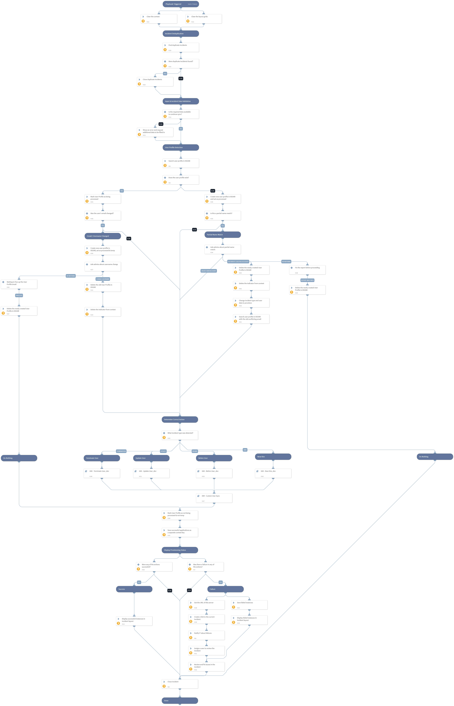

This playbook runs on fetched Workday events. The events are changes to employee data, which in turn require a CRUD operation across your organization's apps. The playbook examines the data received from Workday, and provisions the changes in a User Profile indicator in Cortex XSOAR as well as all the supported IAM integrations that are active.

## Dependencies
This playbook uses the following sub-playbooks, integrations, and scripts.

### Sub-playbooks
* IAM - Rehire User
* IAM - Custom User Sync
* IAM - New Hire
* IAM - Terminate User
* IAM - Update User

### Integrations
This playbook does not use any integrations.

### Scripts
* AssignAnalystToIncident
* DeleteContext
* SetGridField
* FindSimilarIncidents
* SetAndHandleEmpty
* Set
* PrintErrorEntry
* GetServerURL

### Commands
* findIndicators
* createNewIndicator
* setIncident
* send-mail
* closeInvestigation
* deleteIndicators
* setIndicator

## Playbook Inputs
---

| **Name** | **Description** | **Default Value** | **Required** |
| --- | --- | --- | --- |
| ITNotificationEmail | Email to notify about errors in the provisioning process. |  | Required |
| ServiceDeskEmail | Email to send the domain user password \(from Active directory\) of new users, so that their equipment can be prepared by IT when they're being hired. |  | Required |
| UserRoleToAssignForFailures | The Cortex XSOAR role from which to assign users to the incident when a CRUD operation fails. This can be left empty to assign users from all roles. |  | Optional |
| UserAssignmentMethod | Determines the way in which user assignments will be decided in Cortex XSOAR for the failed incidents. Can be one of the following: "random", "machine-learning", "top-user", "less-busy-user", "online", "current". If left empty, users will be assigned randomly. |  | Optional |
| AssignOnlyOnCall | Determines whether to assign only users that are currently on a shift to failed incidents. Set to "true" to assign only users that are currently working, or set to "false" or leave empty to assign any user. |  | Optional |

## Playbook Outputs
---
There are no outputs for this playbook.

## Playbook Image
---
