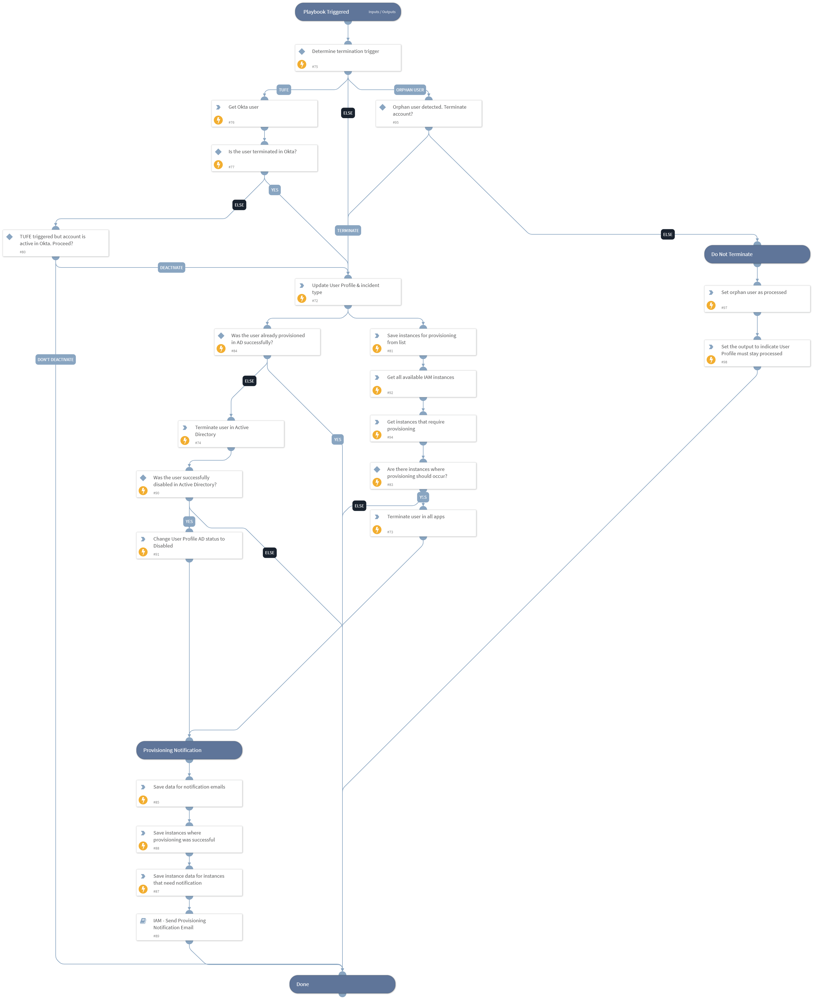

This playbook sets the user status to terminated in the organization by updating the incident information and User Profile indicator with values indicating termination, and disabling the account in the supported apps.

## Dependencies

This playbook uses the following sub-playbooks, integrations, and scripts.

### Sub-playbooks

* IAM - Send Provisioning Notification Email

### Integrations

* Okta IAM
* Active Directory Query v2

### Scripts

* GetEnabledInstances
* SetAndHandleEmpty
* Set

### Commands

* iam-disable-user
* iam-get-user
* setIndicator

## Playbook Inputs

---

| **Name** | **Description** | **Default Value** | **Required** |
| --- | --- | --- | --- |
| indicator | The User Profile indicator, if found during previous search. | indicator.None | Optional |
| CreatedIndicator | The created User Profile indicator, if created previously in the IAM - Sync User playbook. | CreatedIndicator.None | Optional |
| ITNotificationEmail | Email to notify about errors in the provisioning process. |  | Optional |
| SuccessfulVendors | Vendors where provisioning was successful. This input is used to ensure that on playbook reruns, provisioning will be retried only with vendors that previously failed. | IAM.Vendor.None | Optional |
| NotificationEmailHTMLList | Optional - the name of the list that contains an HTML template for the email that will be sent to the users that need to be notified for successful app provisioning. The list of emails of users that need to be notified can be configured in the "app-provisioning-settings" list, for each instance configured, in fields called "create_user_email_notification_ids",  "enable_user_email_notification_ids" and "disable_user_email_notification_ids". |  | Optional |

## Playbook Outputs

---

| **Path** | **Description** | **Type** |
| --- | --- | --- |
| IAM.Vendor | Details the changes that were made in Active Directory or Okta. | unknown |
| IAM.Vendor.active | Indicates if the user is active or not. Can be true or false. | unknown |
| IAM.Vendor.details | Lists the user details as they appear in the vendor. | unknown |
| IAM.Vendor.email | The user email as it appears in the vendor records. | unknown |
| IAM.Vendor.errorCode | HTTP error response code. | unknown |
| IAM.Vendor.errorMessage | Reason why the API failed. | unknown |
| IAM.Vendor.id | The user ID as it appears in the vendor records. | unknown |
| IAM.Vendor.instanceName | Name of the instance used for provisioning. | unknown |
| IAM.Vendor.success | Indicates if the vendor was successfully updated. Can be true or false | unknown |
| IAM.Vendor.brand | Name of the integration. | unknown |
| IAM.Vendor.username | The username as it appears in the vendor records. | unknown |
| IAM.Vendor.action | The action that was performed on the user record. | unknown |
| IAM.UserProfile | The user's profile. | unknown |
| LeaveUserProfileAsProcessed | Whether the User Profile should stay as processed or not. Can be True or False. | unknown |

## Playbook Image

---
