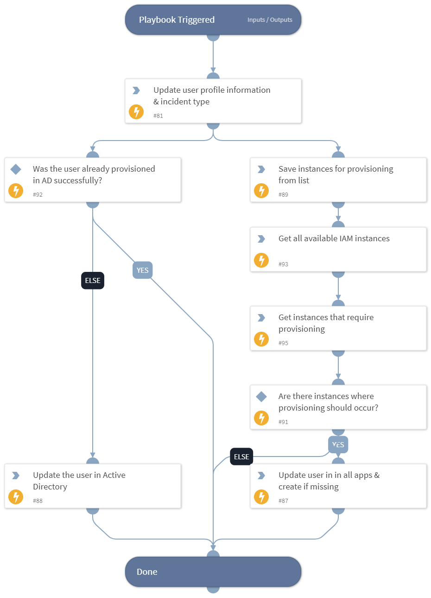

This playbook updates users in the organization by updating the incident information and User Profile indicator with the updated values, and updating the account in the supported apps. with the new information.

## Dependencies
This playbook uses the following sub-playbooks, integrations, and scripts.

### Sub-playbooks
This playbook does not use any sub-playbooks.

### Integrations
* Active Directory Query v2

### Scripts
* SetAndHandleEmpty
* GetEnabledInstances
* Set

### Commands
* iam-update-user
* setIndicator

## Playbook Inputs
---

| **Name** | **Description** | **Default Value** | **Required** |
| --- | --- | --- | --- |
| indicator | The User Profile indicator, if the indicator was found on the system during previous search. | indicator.None | Optional |
| CreatedIndicator | The created User Profile indicator, if created previously in the IAM - Sync User playbook. | CreatedIndicator.None | Optional |
| SuccessfulVendors | Vendors where provisioning was successful. This input is used to ensure that on playbook reruns, provisioning will be retried only with vendors that previously failed. | IAM.Vendor.None | Optional |

## Playbook Outputs
---

| **Path** | **Description** | **Type** |
| --- | --- | --- |
| IAM.Vendor | Command context path | unknown |
| IAM.Vendor.active | Gives the active status of user. Can be true or false. | unknown |
| IAM.Vendor.brand | Name of the Integration | unknown |
| IAM.Vendor.details | Gives the detail error information | unknown |
| IAM.Vendor.email | Value of email ID passed as argument | unknown |
| IAM.Vendor.errorCode | HTTP error response code | unknown |
| IAM.Vendor.errorMessage | Reason why the API is failed | unknown |
| IAM.Vendor.id | Value of id passed as argument | unknown |
| IAM.Vendor.instanceName | Name of the instance used for testing | unknown |
| IAM.Vendor.success | Status of the result. Can be true or false. | unknown |
| IAM.Vendor.username | Value of username passed as argument | unknown |
| IAM.Vendor.action | Value of action passed as argument | unknown |
| IAM.UserProfile | The user's profile. | unknown |

## Playbook Image
---
