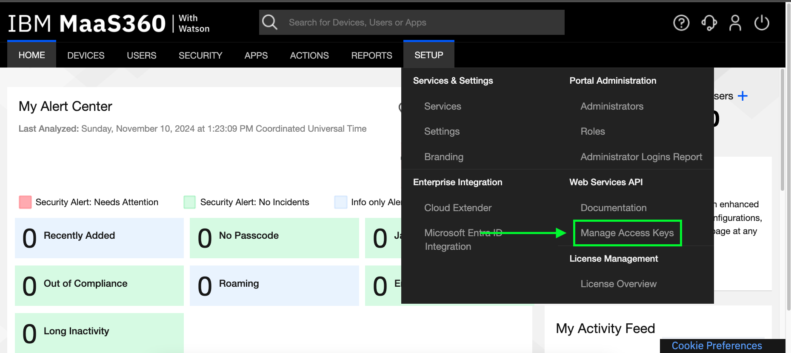
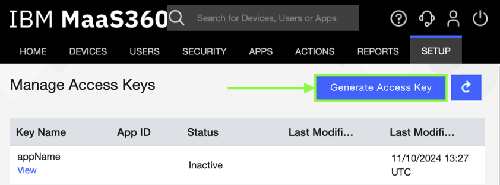
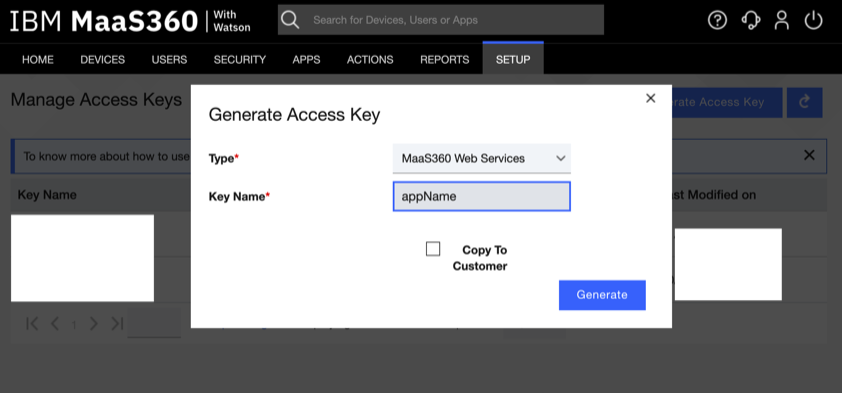
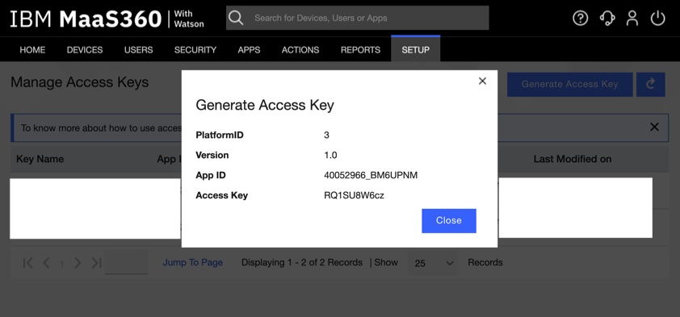
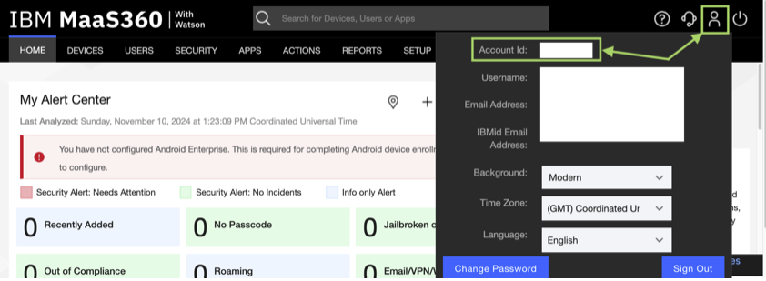
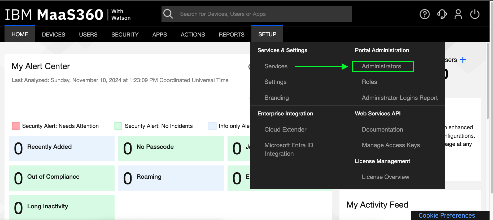
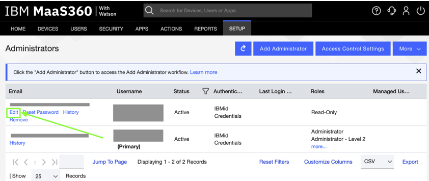
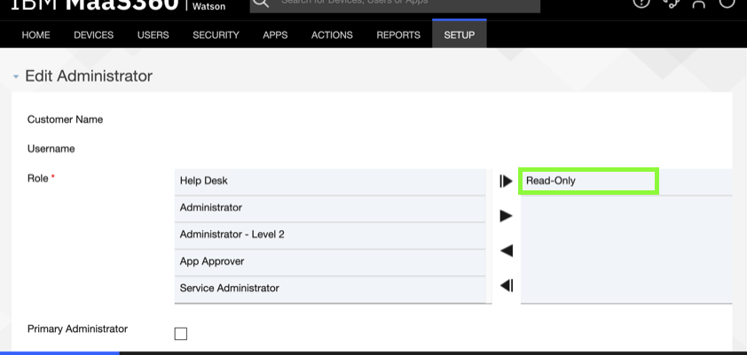

This is the IBM MaaS360 Security integration for Cortex XSIAM.

## Create App credentials

To access the IBM MaaS360 Security API, you first need to generate an App access key.
Follow these steps:

1. Log in to the IBM MaaS360 portal.  

2. Go to **Setup** > **Manage Access Keys**.
  

3. Click **Generate Access Key**.
  

4. Create a new `MaaS360 Web Services` key.
  

5. Get **App ID**, **App Version**, **Platform ID**, and **App Access Key**.
  

For further assistance, you may contact IBM MaaS360 support to request these credentials as well.  
See [Configuring provisioning for MaaS360](https://www.ibm.com/docs/en/security-verify?topic=endpoints-configuring-provisioning-maas360)

## Find your Billing ID

1. Log in to the IBM MaaS360 portal.

2. Hover over the profile menu on the top right and copy the **Account ID** value. This is your Billing ID.

## Account permissions

To collect events, the user requires read-only permissions.
Follow these steps to modify user permissions:

1. Log in to the IBM MaaS360 portal.  

2. Go to **Setup** > **Administrators**
  

3. Find the relevant administrator account or create a new one.  

4. Click **Edit**. (Note: This does not appear for the primary admin account.)
  

5. Add the **Read-Only** permission.
  

## Configure IBM MaaS360 Security on Cortex XSIAM

1. Navigate to **Settings** > **Configurations** > **Data Collection** > **Automations & Feed Integrations**.
2. Search for IBM MaaS360 Security.
3. Click **Add instance** to create and configure a new integration instance.

    | **Parameter** | **Description** | **Required** |
    | --- | --- | --- |
    | Server URL |  | True |
    | User Name |  | True |
    | Password |  | True |
    | App ID |  | True |
    | App Version |  | True |
    | Platform ID |  | True |
    | App Access Key |  | True |
    | Billing ID |  | True |
    | Maximum number of Admin Login Reports events per fetch | Rounds up to the nearest page size increment. \(250\) | False |
    | Maximum number of Admin Changes Audit events per fetch | Rounds up to the nearest page size increment. \(250\) | False |
    | Trust any certificate (not secure) |  | False |
    | Use system proxy settings |  | False |

4. Click **Test** to validate the URLs, token, and connection.

## Commands

You can execute these commands from the Cortex XSIAM CLI, as part of an automation, or in a playbook.
After you successfully execute a command, a DBot message appears in the War Room with the command details.

### ibm-maas360-security-get-events

***
Gets events from IBM MaaS360 Security.

#### Base Command

`ibm-maas360-security-get-events`

#### Input

| **Argument Name** | **Description** | **Required** |
| --- | --- | --- |
| should_push_events | If true, the command will create events, otherwise it will only display them. Possible values are: true, false. Default is false. | Required |
| limit | Maximum number of results to return. | Required |
| from_date | Date from which to get events. | Optional |

#### Context Output

There is no context output for this command.

#### Human Readable Output

>### Admin audits
>
>|_time|source_log_type|updateDate|performedBy|operationType|ipAddress|administrator|
>|---|---|---|---|---|---|---|
>| 2024-10-29T13:39:32Z | admin_changes_audit | 1730209172000 | <test@mail.com> | CHANGE | 1.1.1.1 | email: <test@mail.com> username: <test@mail.com> firstName: tester middleName:  lastName: tester address:  phone:  jobTitle:  watchSubscription: Y accountStatus: Active managedUserGroups: All groups lastLoginTime:  rolesAdded:  rolesDeleted:  previousState:  |
>| 2024-10-29T13:39:32Z | admin_changes_audit | 1730209172000 | <test@mail.com> | CHANGE | 1.1.1.1 | email: <test@mail.com> username: <test@mail.com> firstName: tester middleName:  lastName: tester address:  phone:  jobTitle:  watchSubscription: Y accountStatus: Active managedUserGroups: All groups lastLoginTime:  rolesAdded: Help Desk rolesDeleted:  previousState:  |
>| 2024-10-29T12:53:49Z | admin_changes_audit | 1730206429000 | <test@mail.com> | CHANGE | 1.1.1.1 | email: <test@mail.com> username: <test@mail.com> firstName: tester middleName:  lastName: tester address:  phone:  jobTitle:  watchSubscription: Y accountStatus: Active managedUserGroups: All groups lastLoginTime:  rolesAdded:  rolesDeleted:  previousState:  |
>| 2024-10-29T12:53:49Z | admin_changes_audit | 1730206429000 | <test@mail.com> | CHANGE | 1.1.1.1 | email: <test@mail.com> username: <test@mail.com> firstName: tester middleName:  lastName: tester address:  phone:  jobTitle:  watchSubscription: Y accountStatus: Active managedUserGroups: All groups lastLoginTime:  rolesAdded:  rolesDeleted: Help Desk previousState:  |
>| 2024-10-29T12:41:31Z | admin_changes_audit | 1730205691000 | <test@mail.com> | CHANGE | 1.1.1.1 | email: <test@mail.com> username: <test@mail.com> firstName: tester middleName:  lastName: tester address:  phone:  jobTitle:  watchSubscription: Y accountStatus: Active managedUserGroups: All groups lastLoginTime:  rolesAdded:  rolesDeleted:  previousState:  |
