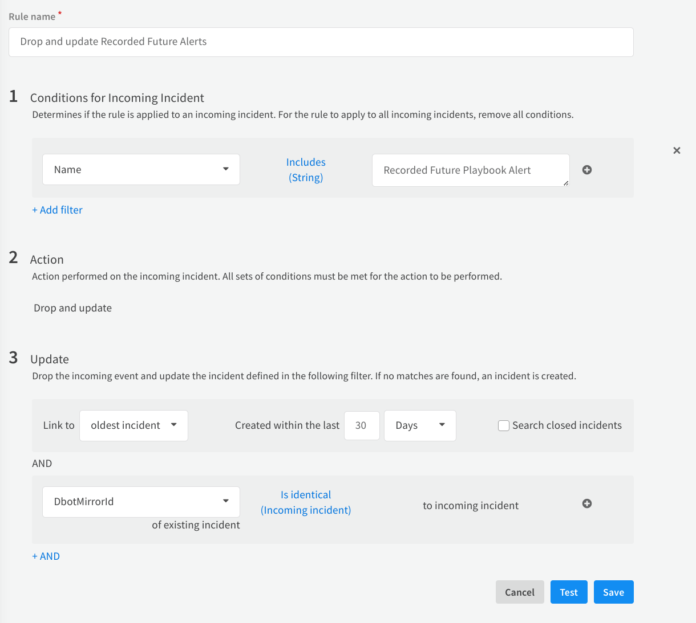

## Recorded Future Identity Integration

## Overview

This integration allows you to leverage Recorded Future's identity-related threat intelligence within Cortex XSOAR. It
provides commands to search and lookup identity data, fetch playbook alerts, and manage incident statuses, enhancing
your security operations with actionable intelligence.

## Setup

A valid API Token for Recorded Future Identity Intelligence needed to fetch information.
[Get help with Recorded Future for Cortex XSOAR](https://www.recordedfuture.com/integrations/).

### Configuration

1. **Navigate to Integrations**:
    - Go to **Settings** > **Integrations** > **Servers & Services**.

2. **Search for Recorded Future Identity**:
    - In the search bar, type **Recorded Future Identity**.

3. **Add a New Instance**:
    - Click **Add instance** to create and configure a new integration instance.

4. **Enter Configuration Parameters**:
    - Fill in the required parameters such as Server URL and API Token.
    - Adjust optional settings like proxy usage and incident fetching as needed.

5. **Test the Configuration**:
    - Click **Test** to ensure the settings are correct and that the connection to Recorded Future is successful.

### Configuration Parameters

| **Parameter**                                 | **Description**                                                                                                      | **Required** |
|-----------------------------------------------|----------------------------------------------------------------------------------------------------------------------|--------------|
| Server URL                                    | The URL to the Recorded Future ConnectAPI.                                                                           | True         |
| API Token                                     | Valid API Token from Recorded Future.                                                                                | True         |
| Trust any certificate                         | Trust any certificate (not secure).                                                                                  | False        |
| Use system proxy settings                     | Use system proxy settings.                                                                                           | False        |
| Fetch incidents                               | Enable fetching incidents.                                                                                           | False        |
| First Incident Fetch: Time Range              | Limit incidents to include in the first fetch by time range. Input format: "NN hours" or "NN days".                  | False        |
| Maximum number of incidents per fetch         | Limit the number of incidents returned per single fetch. Default value: 50.                                          | False        |
| Incident type                                 | The type of incidents to fetch.                                                                                      | False        |
| Password properties                           | Password properties that are used as a filter.                                                                       | False        |
| Limit Identities                              | Limit of identities to get, minimum is 0 and maximum is 10,000.                                                      | False        |
| Domains                                       | List of domains to use in search and lookup commands (e.g., mycompany.com, nextcompany.com).                         | True         |
| Playbook Alerts: Fetched Statuses             | Choose what statuses are included in the fetch (New, In Progress, Dismissed, Resolved).                              | False        |
| Playbook Alerts: Fetched Priorities Threshold | Choose the priority threshold to fetch alerts of the selected priority and higher (Informational < Moderate < High). | False        |

6. Click **Test** to validate the URLs, token, and connection.

## Pre-Process Rule

The integration pulls in Playbook alerts from Recorded Future based on its updates, creating the need for a
preprocessing rule that updates existing incidents instead of creating duplicates. Follow the guidelines below to
configure the preprocessing rule.

1. Navigate to **Settings** > **Objects Setup** > **Pre-Process Rules**.
2. Click **New Rule**.
3. Name the rule appropriately.
4. In the **Conditions for Incoming Incident** section, enter:
    - **Name** - **Includes** - **Recorded Future Playbook Alert**
5. In the **Action** section, select **Drop and update**.
6. In the **Update** section, enter
    - **Link to** - **Oldest incident** - **Created within the last** - *Your desired timeframe*
    - **DbotMirrorId** - **Is identical (Incoming Incident)** - **to incoming incident**

> The configuration of the preprocessing rule is optional, but highly recommended.



## Commands

You can execute these commands from the Cortex XSOAR CLI, as part of an automation, or in a playbook. After executing a
command, a DBot message appears in the War Room with the command details.

### recordedfuture-identity-search

Search for identities in the Recorded Future dataset.

#### Base Command

`recordedfuture-identity-search`

#### Input

| **Argument Name** | **Description**                                                                                                                              | **Required** |
|-------------------|----------------------------------------------------------------------------------------------------------------------------------------------|--------------|
| first-downloaded  | Time period for "first_downloaded_gte" filter (e.g., "7 days ago", "Three months ago", "Last Year", "All time"). Default value: "All time".  | Optional     |
| latest-downloaded | Time period for "last_downloaded_gte" filter (e.g., "7 days ago", "Three months ago", "Last Year", "All time"). Default value: "All time".   | Optional     |
| exfiltration-date | Time period for "exfiltration_date_gte" filter (e.g., "7 days ago", "Three months ago", "Last Year", "All time"). Default value: "All time". | Optional     |
| domain-type       | Type of the domain (Email, Authorization, All).                                                                                              | Optional     |
| domains           | Domains separated by comma (if not specified, domains from app instance will be used).                                                       | Optional     |

#### Context Output

| **Path**                                    | **Type** | **Description**                                      |
|---------------------------------------------|----------|------------------------------------------------------|
| RecordedFuture.Credentials.SearchIdentities | List     | List of Identities that were found in search command |

#### Command Example

```
!recordedfuture-identity-search latest-downloaded="All time" domain-type=Authorization
```

#### Context Example

```
{
    "RecordedFuture": {
        "Credentials": {
            "SearchIdentities": [
                {
                    "login": "30fake",
                    "domain": "fakeyahoo.com"
                },
                {
                    "login": "3072882fake",
                    "domain": "fakeyahoo.com"
                },
                "fake3@fake.com",
                "test@fakeyahoo.com"
            ]
        }
    }
}
```

#### Human Readable Output

> ##### This is search results for fakeyahoo.com, fake.com :
>
>- **30fake**  in domain fakeyahoo.com
>- **3072882fake**  in domain fakeyahoo.com
>- **fake3@fake.com**
>- **test@fakeyahoo.com**

### recordedfuture-identity-lookup

Get detailed information regarding identities.

#### Base Command

`recordedfuture-identity-lookup`

#### Input

| **Argument Name** | **Description**                                                                                                                              | **Required** |
|-------------------|----------------------------------------------------------------------------------------------------------------------------------------------|--------------|
| identities        | String of identities separated by comma.                                                                                                     | Required     |
| first-downloaded  | Time period for "first_downloaded_gte" filter (e.g., "7 days ago", "Three months ago", "Last Year", "All time"). Default value: "All time".  | Optional     |
| latest-downloaded | Time period for "last_downloaded_gte" filter (e.g., "7 days ago", "Three months ago", "Last Year", "All time"). Default value: "All time".   | Optional     |
| exfiltration-date | Time period for "exfiltration_date_gte" filter (e.g., "7 days ago", "Three months ago", "Last Year", "All time"). Default value: "All time". | Optional     |
| domains           | Domains separated by comma.                                                                                                                  | Optional     |

#### Context Output

| **Path**                                                                                 | **Type** | **Description**                                            |
|------------------------------------------------------------------------------------------|----------|------------------------------------------------------------|
| RecordedFuture.Credentials.Identities.identity.subjects                                  | string   | Identity value                                             |
| RecordedFuture.Credentials.Identities.count                                              | number   | Leaked credentials count number                            |
| RecordedFuture.Credentials.Identities.credentials.subject                                | string   | Identity value                                             |
| RecordedFuture.Credentials.Identities.credentials.dumps.name                             | string   | Dump name                                                  |
| RecordedFuture.Credentials.Identities.credentials.dumps.description                      | string   | Dump description                                           |
| RecordedFuture.Credentials.Identities.credentials.dumps.downloaded                       | string   | Datetime string that show the day when dump was downloaded |
| RecordedFuture.Credentials.Identities.credentials.type                                   | string   | Dump type                                                  |
| RecordedFuture.Credentials.Identities.credentials.breaches.name                          | string   | Breach name                                                |
| RecordedFuture.Credentials.Identities.credentials.breaches.domain                        | string   | Breach domain                                              |
| RecordedFuture.Credentials.Identities.credentials.breaches.type                          | string   | Breach type                                                |
| RecordedFuture.Credentials.Identities.credentials.breaches.breached                      | string   | Datetime string that show the day when breach happened     |
| RecordedFuture.Credentials.Identities.credentials.breaches.description                   | string   | Breach description                                         |
| RecordedFuture.Credentials.Identities.credentials.breaches.site_description              | string   | Breach site description                                    |
| RecordedFuture.Credentials.Identities.credentials.first_downloaded                       | string   | Datetime string representing firs time downloaded          |
| RecordedFuture.Credentials.Identities.credentials.latest_downloaded                      | string   | Datetime string representing last time downloaded          |
| RecordedFuture.Credentials.Identities.credentials.exposed_secret.type                    | string   | Exposed secret type                                        |
| RecordedFuture.Credentials.Identities.credentials.exposed_secret.hashes.algorithm        | string   | Exposed secret hash algorithm                              |
| RecordedFuture.Credentials.Identities.credentials.exposed_secret.hashes.hash             | string   | Exposed secret hash value                                  |
| RecordedFuture.Credentials.Identities.credentials.exposed_secret.effectively_clear       | boolean  | Exposed secret clear or not                                |
| RecordedFuture.Credentials.Identities.credentials.exposed_secret.details.properties      | string   | Exposed secret properties                                  |
| RecordedFuture.Credentials.Identities.credentials.exposed_secret.details.clear_text_hint | string   | Exposed secret text hint                                   |
| RecordedFuture.Credentials.Identities.credentials.exposed_secret.details.rank            | string   | Rank for the exposed password                              |

#### Command Example

```
!recordedfuture-identity-lookup identities="fake@fakeyahoo.com,real@notfake.com" first-downloaded="3 Months ago"
```

#### Context Example

```
{
    "RecordedFuture": {
        "Credentials": {
            "Identities": [
                {
                    "identity":{
                        "subjects":[
                            "fake@yahoo.com"
                        ]
                    },
                    "count":4,
                    "credentials":[
                        {
                            "subject":"fake@yahoo.com",
                            "dumps":[
                                {
                                    "name":"FAKE Dump November 2020",
                                    "description":"This SQL Dump linked to the 2020",
                                    "downloaded":"2020-11-05T00:00:00.000Z",
                                    "type":"SQL Dump",
                                    "breaches":[
                                        {
                                            "name":"FAKE",
                                            "domain":"fake.com",
                                            "type":"breach",
                                            "breached":"2020-10-01T00:00:00.000Z",
                                            "description":"In October 2020, fake suffered a breach that exposed a portion of their backup data from November 2017. The exposed data included",
                                            "site_description":"Fale provides backup and related services for mobile devices."
                                        }
                                    ]
                                }
                            ],
                            "first_downloaded":"2020-11-05T00:00:00.000Z",
                            "latest_downloaded":"2020-11-05T00:00:00.000Z",
                            "exposed_secret":{
                                "type":"pbkdf2_sha256",
                                "hashes":[
                                    {
                                        "algorithm":"PBKDF2_SHA256",
                                        "hash":"12000$IWIs9x2tM7U3afasdasd3d23nRfo0sFRjpkMlim2GA2+p/2Y7RQLpODP4S0="
                                    }
                                ],
                                "effectively_clear":false
                            }
                        },
                        {
                            "subject":"fake@yahoo.com",
                            "dumps":[
                                {
                                    "name":"Dark Web Dump October 2019",
                                    "description":"This combo list of email addresses and clear passwords is not associated with any specific breach",
                                    "downloaded":"2019-10-31T00:00:00.000Z",
                                    "type":"Combo List"
                                },
                                {
                                    "name":"Dark Web Dump September 2019",
                                    "description":"This combo list of email addresses and clear passwords is not associated with any specific breach..",
                                    "downloaded":"2019-09-02T00:00:00.000Z",
                                    "type":"Combo List"
                                }
                            ],
                            "first_downloaded":"2019-09-02T00:00:00.000Z",
                            "latest_downloaded":"2019-10-31T00:00:00.000Z",
                            "exposed_secret":{
                                "type":"clear",
                                "hashes":[
                                    {
                                        "algorithm":"SHA1",
                                        "hash":"bbebf4e24e6631570cd8f60e1b0f77c"
                                    },
                                    {
                                        "algorithm":"SHA256",
                                        "hash":"7bf5626ca4944595aa89bf5fdsdfsdf9c9a1e9b014356d9b10ef31c9e9aadc7835e4"
                                    },
                                    {
                                        "algorithm":"NTLM",
                                        "hash":"1b408e981311312e21eefc0f5e37a20808"
                                    },
                                    {
                                        "algorithm":"MD5",
                                        "hash":"a6b9607b296pfk941dd390d9e690ade8e"
                                    }
                                ],
                                "details":{
                                    "properties":[
                                        "Letter",
                                        "Number",
                                        "UpperCase",
                                        "LowerCase",
                                        "AtLeast8Characters"
                                    ],
                                    "clear_text_hint":"oo"
                                },
                                "effectively_clear":true
                            }
                        }
                    ]
                },
                {
                    "identity":{
                        "subjects":[
                            "007"
                        ]
                    },
                    "count":1,
                    "credentials":[
                        {
                            "subject":"007",
                            "dumps":[
                                {
                                    "name":"Dark Web Password Dump 2020-11-07"
                                },
                                {
                                    "name":"Dark Web Password Dump 2020-09-28"
                                }
                            ],
                            "first_downloaded":"2020-09-28T15:52:05.000Z",
                            "latest_downloaded":"2020-11-07T08:38:56.000Z",
                            "exposed_secret":{
                                "type":"clear",
                                "hashes":[
                                    {
                                        "algorithm":"SHA1",
                                        "hash":"6204f1659eb8dasdas871be7f4b3ee560207bda2c5"
                                    },
                                    {
                                        "algorithm":"SHA256",
                                        "hash":"2fff03500b9335t4g5427fa105aa0bb0d5b3e770d314352aef010b6ae0dff7ab9a"
                                    },
                                    {
                                        "algorithm":"NTLM",
                                        "hash":"a2abf21c7669d58137kffsa83381d55cc"
                                    },
                                    {
                                        "algorithm":"MD5",
                                        "hash":"c399d3ec33214df310b11dcb30b1b5e03"
                                    }
                                ],
                                "details":{
                                    "properties":[
                                        "Letter",
                                        "LowerCase"
                                    ],
                                    "clear_text_hint":"lo"
                                },
                                "effectively_clear":true
                            },
                            "compromise":{
                                "exfiltration_date":"2020-11-07T08:38:56.000Z"
                            },
                            "authorization_service":{
                                "url":"https://login.fakeyahoo.com/",
                                "domain":"fakeyahoo.com"
                            }
                        }
                    ]
                }
            ]
        }
    }
}
```

#### Human Readable Output

> ## Credentials Lookup
>*****
>## Results for **fake1@fake.com**:
>## We found 1 passwords that were leaked for this identity:
>*****
>## Password 1:
>Rank: TopMillionCommonPasswords
>
>Properties: Letter, Number, LowerCase, AtLeast8Characters
>
>Type: clear
>
>Effectively Clear: True
>
>Clear Text Hint: wa
>
>Algorithm: SHA1 Hash:21b1ee2d6764b61b038605378f361599a8b503ed
>
>Algorithm: SHA256 Hash:99dbda619dfd82cf9dae074b5c3168e75961b642f3245fe7f400ad03940a0bd8
>
>Algorithm: NTLM Hash:da89071afe87527dc0e89a09d35cb9c0
>
>Algorithm: MD5 Hash:a0b1c21221b29780fc5e3373e626ab9b
>
>Authorization service url: <https://signup.norsegods.online/signup>
> Authorization service url: <https://signup.norsegods.online/signup>
> Authorization service url: https://signup.norsegods.online/signup
> Authorization service url: <https://signup.norsegods.online/signup>
> Authorization service url: <https://signup.norsegods.online/signup>
>
>Domain: norsegods.online
>
>First Downloaded: Nov 2022
>
>Last Downloaded: Nov 2022
>
>Exfiltration date: N/A
>
>Malware Family: RedLine Stealer
>
>## Information about dumps where we found for Password 1:
>*****
> Stealer Malware Logs 2022-11-03, Nov 2022
>
>Description: This credential data was derived from stealer malware logs.
> Dump type: N/A
>
>Compromised Host
> Operating System: Windows 10 Enterprise x64
>
>    OS User Name: gabi2
>
>    File Path Location: C:\Windows\Microsoft.NET\Framework\v4.0.30319\AppLaunch.exe
>
>    Time Zone: UTC+01:00
>
>    Name of the Machine: N/A
>
>    User Account Control Setting: AllowAll
>
>    Antivirus: Windows Defender
>
>IP Address: 138.255.250.246
>
>Country: DO
>
>Postal Code: 11403

### recordedfuture-password-lookup

Lookup for password in Recorded Future Dataset.

#### Base Command

`recordedfuture-password-lookup`

#### Input

| **Argument Name** | **Description**                                                                   | **Required** |
|-------------------|-----------------------------------------------------------------------------------|--------------|
| password-hash     | Password hash value.                                                              | Required     |
| hash-algorithm    | Password hash algorithm (e.g., SHA1, SHA256, NTLM, MD5). Default value: "SHA256". | Required     |

#### Context Output

| **Path**                                           | **Type** | **Description**                                                                 |
|----------------------------------------------------|----------|---------------------------------------------------------------------------------|
| RecordedFuture.Credentials.Password.Hash           | String   | Recorded Future password hash value.                                            |
| RecordedFuture.Credentials.Password.Algorithm      | String   | Recorded Future password hash algorithm.                                        |
| RecordedFuture.Credentials.Password.ExposureStatus | String   | Recorded Future password exposure status. One of Common, UnCommon, NeverExposed |

#### Command Example

```
!recordedfuture-password-lookup password-hash="0e44ce7308af2b3de5232e4616403ce7d49ba2aec83f79c196409556422a4927" hash-algorithm="SHA256"
```

#### Context Example

```
{
    "RecordedFuture": {
        "Credentials": {
            "Password": [
                {
                    "password": {
                        "algorithm": "SHA256"
                        "hash": "da6a0f1c706df7e864f9d6f9431de9950450880e"
                    }
                    "exposure_status": NeverExposed
                },
                {
                    "password": {
                        "algorithm": "SHA256"
                        "hash": "0e44ce7308af2b3de5232e4616403ce7d49ba2aec83f79c196409556422a"
                    }
                    "exposure_status": Common
                },
            ]
        }
    }
}
```

#### Human Readable Output

> ## This is search results for password you provided:
>Password hash: 0e44ce7308af2b3de5232e4616403ce7d49ba2aec83f79c196409556422a4927
>
>Password hash algorithm: SHA256
>
>Password status: Common

### recordedfuture-identity-playbook-alerts-search

Search Playbook alerts based on filters.

#### Base Command

`recordedfuture-identity-playbook-alerts-search`

#### Input

| **Argument Name**     | **Description**                                                                                                                     | **Required** |
|-----------------------|-------------------------------------------------------------------------------------------------------------------------------------|--------------|
| limit                 | The maximum number of alerts to fetch. Default: 50.                                                                                 | Optional     |
| time_since_update     | The amount of time since the last update. E.g., "2 hours" or "7 days" ago. Default: "24 hours".                                     | Optional     |
| playbook_alert_status | The statuses to retrieve. Defaults to only new status if not specified. Possible values are: new, in-progress, dismissed, resolved. | Optional     |
| priority              | Actions priority assigned in Recorded Future. Possible values are: high, moderate, informational.                                   | Optional     |
| order_search_by       | The order by which to search for playbook alerts. Possible values are: updated, created.                                            | Optional     |

#### Context Output

| **Path**                                                | **Type** | **Description**                             |
|---------------------------------------------------------|----------|---------------------------------------------|
| IdentityRecordedFuture.PlaybookAlerts.playbook_alert_id | String   | Unique ID of the playbook alert             |
| IdentityRecordedFuture.PlaybookAlerts.category          | String   | Playbook alert category                     |
| IdentityRecordedFuture.PlaybookAlerts.priority          | String   | Recommended Priority of the alert           |
| IdentityRecordedFuture.PlaybookAlerts.status            | String   | Current alert status in Recorded Future     |
| IdentityRecordedFuture.PlaybookAlerts.title             | String   | Title of the alert                          |
| IdentityRecordedFuture.PlaybookAlerts.updated           | date     | Date of last update                         |
| IdentityRecordedFuture.PlaybookAlerts.created           | date     | Date of creation                            |
| IdentityRecordedFuture.PlaybookAlerts.organization_id   | String   | Organization uhash                          |
| IdentityRecordedFuture.PlaybookAlerts.organization_name | String   | Plaintext Organization name                 |
| IdentityRecordedFuture.PlaybookAlerts.assignee_id       | String   | uhash of the assigned user                  |
| IdentityRecordedFuture.PlaybookAlerts.assignee_name     | unknown  | name of the assigned user                   |
| IdentityRecordedFuture.PlaybookAlerts.owner_id          | String   | uhash of the enterprise that owns the alert |
| IdentityRecordedFuture.PlaybookAlerts.owner_name        | String   | Name of the enterprise that owns the alert  |

##### Command Example

```
!recordedfuture-identity-playbook-alerts-search

!recordedfuture-identity-playbook-alerts-search

!recordedfuture-identity-playbook-alerts-search limit=10

!recordedfuture-identity-playbook-alerts-search playbook_alert_status=in-progress

!recordedfuture-identity-playbook-alerts-search priority=high

!recordedfuture-identity-playbook-alerts-search order_search_by=updated
```

### recordedfuture-identity-playbook-alerts-details

Get Playbook alert details by ID.

#### Base Command

`recordedfuture-identity-playbook-alerts-details`

#### Input

| **Argument Name** | **Description**                                                                         | **Required** |
|-------------------|-----------------------------------------------------------------------------------------|--------------|
| alert_ids         | IDs of the playbook alert that should be fetched.                                       | Required     |
| detail_sections   | What evidence sections to include in the fetch, fetches all available if not specified. | Optional     |

#### Context Output

| **Path**                                                                                      | **Type** | **Description**                                                           |
|-----------------------------------------------------------------------------------------------|----------|---------------------------------------------------------------------------|
| IdentityRecordedFuture.PlaybookAlerts.playbook_alert_id                                       | String   | Unique ID of the playbook alert.                                          |
| IdentityRecordedFuture.PlaybookAlerts.category                                                | String   | Playbook alert category.                                                  |
| IdentityRecordedFuture.PlaybookAlerts.priority                                                | String   | Recommended Priority of the alert.                                        |
| IdentityRecordedFuture.PlaybookAlerts.status                                                  | String   | Current alert status in Recorded Future.                                  |
| IdentityRecordedFuture.PlaybookAlerts.title                                                   | String   | Title of the alert.                                                       |
| IdentityRecordedFuture.PlaybookAlerts.updated                                                 | date     | Date of last update.                                                      |
| IdentityRecordedFuture.PlaybookAlerts.created                                                 | date     | Date of creation.                                                         |
| IdentityRecordedFuture.PlaybookAlerts.organization_id                                         | String   | Organization uhash.                                                       |
| IdentityRecordedFuture.PlaybookAlerts.organization_name                                       | String   | Plaintext Organization name.                                              |
| IdentityRecordedFuture.PlaybookAlerts.assignee_id                                             | String   | uhash of the assigned user.                                               |
| IdentityRecordedFuture.PlaybookAlerts.assignee_name                                           | String   | name of the assigned user.                                                |
| IdentityRecordedFuture.PlaybookAlerts.owner_id                                                | String   | uhash of the enterprise that owns the alert.                              |
| IdentityRecordedFuture.PlaybookAlerts.owner_name                                              | String   | Name of the enterprise that owns the alert.                               |
| IdentityRecordedFuture.PlaybookAlerts.panel_status.playbook_alert_id                          | String   | Unique ID of the playbook alert.                                          |
| IdentityRecordedFuture.PlaybookAlerts.panel_status.category                                   | String   | Playbook alert category.                                                  |
| IdentityRecordedFuture.PlaybookAlerts.panel_status.priority                                   | String   | Recommended Priority of the alert.                                        |
| IdentityRecordedFuture.PlaybookAlerts.panel_status.status                                     | String   | Current alert status in Recorded Future.                                  |
| IdentityRecordedFuture.PlaybookAlerts.panel_status.title                                      | String   | Title of the alert.                                                       |
| IdentityRecordedFuture.PlaybookAlerts.panel_status.updated                                    | date     | Date of last update.                                                      |
| IdentityRecordedFuture.PlaybookAlerts.panel_status.created                                    | date     | Date of creation.                                                         |
| IdentityRecordedFuture.PlaybookAlerts.panel_status.organization_id                            | String   | Organization uhash.                                                       |
| IdentityRecordedFuture.PlaybookAlerts.panel_status.organization_name                          | String   | Plaintext Organization name.                                              |
| IdentityRecordedFuture.PlaybookAlerts.panel_status.assignee_id                                | String   | uhash of the assigned user.                                               |
| IdentityRecordedFuture.PlaybookAlerts.panel_status.assignee_name                              | unknown  | name of the assigned user.                                                |
| IdentityRecordedFuture.PlaybookAlerts.panel_status.owner_id                                   | String   | uhash of the enterprise that owns the alert.                              |
| IdentityRecordedFuture.PlaybookAlerts.panel_status.owner_name                                 | String   | Name of the enterprise that owns the alert.                               |
| IdentityRecordedFuture.PlaybookAlerts.panel_status.case_rule_id                               | String   | ID of the playbook alert category.                                        |
| IdentityRecordedFuture.PlaybookAlerts.panel_status.case_rule_label                            | String   | Name of the playbook alert category.                                      |
| IdentityRecordedFuture.PlaybookAlerts.panel_status.context_list.context                       | Array    | Context of entity connected to the Playbook alert.                        |
| IdentityRecordedFuture.PlaybookAlerts.panel_status.created                                    | String   | Date marking the creation of the Playbook alert in Recorded Future.       |
| IdentityRecordedFuture.PlaybookAlerts.panel_status.entity_criticality                         | String   | Criticality of the Playbook alert.                                        |
| IdentityRecordedFuture.PlaybookAlerts.panel_status.entity_id                                  | String   | ID of the entity in Recorded Future.                                      |
| IdentityRecordedFuture.PlaybookAlerts.panel_status.entity_name                                | String   | Name of the entity.                                                       |
| IdentityRecordedFuture.PlaybookAlerts.panel_status.risk_score                                 | String   | Risk score of the entity in Recorded Future.                              |
| IdentityRecordedFuture.PlaybookAlerts.panel_status.targets                                    | Array    | List of targets of the Playbook alert.                                    |
| IdentityRecordedFuture.PlaybookAlerts.panel_status.lifecycle_stage                            | String   | Indicates what lifecycle the vulerability is in.                          |
| IdentityRecordedFuture.PlaybookAlerts.panel_summary.explanation                               | String   | Entails the explanation to the triggering of the Playbook alert.          |
| IdentityRecordedFuture.PlaybookAlerts.panel_summary.resolved_record_list.context_list.context | String   | Context of entity connected to the Playbook alert.                        |
| IdentityRecordedFuture.PlaybookAlerts.panel_summary.resolved_record_list.criticality          | String   | Level of criticality.                                                     |
| IdentityRecordedFuture.PlaybookAlerts.panel_summary.resolved_record_list.entity               | String   | ID of the entitiy in Recorded Future.                                     |
| IdentityRecordedFuture.PlaybookAlerts.panel_summary.resolved_record_list.record_type          | String   | Type of record A, CNAME or MX.                                            |
| IdentityRecordedFuture.PlaybookAlerts.panel_summary.resolved_record_list.risk_score           | String   | Risk score of the entity in Recorded Future.                              |
| IdentityRecordedFuture.PlaybookAlerts.panel_summary.screenshots.description                   | String   | Description of the image.                                                 |
| IdentityRecordedFuture.PlaybookAlerts.panel_summary.screenshots.image_id                      | String   | ID of the screenshot in recorded future.                                  |
| IdentityRecordedFuture.PlaybookAlerts.panel_summary.screenshots.tag                           | String   | Image Analisys tag.                                                       |
| IdentityRecordedFuture.PlaybookAlerts.panel_summary.screenshots.created                       | String   | When the image was created.                                               |
| IdentityRecordedFuture.PlaybookAlerts.panel_summary.screenshots.base64                        | String   | The image binary encoded as a base64 string.                              |
| IdentityRecordedFuture.PlaybookAlerts.panel_summary.summary.targets.name                      | String   | Target affected by the vulnerability.                                     |
| IdentityRecordedFuture.PlaybookAlerts.panel_summary.summary.lifecycle_stage                   | String   | The current lifecycle stage of the Playbook Alert.                        |
| IdentityRecordedFuture.PlaybookAlerts.panel_summary.summary.riskrules.rule                    | String   | Name of the rule that triggered.                                          |
| IdentityRecordedFuture.PlaybookAlerts.panel_summary.summary.riskrules.description             | String   | Short description of the trigger \(E.g 13 sightings on 1 source..\).      |
| IdentityRecordedFuture.PlaybookAlerts.panel_summary.affected_products.name                    | String   | Name of of affected product.                                              |
| IdentityRecordedFuture.PlaybookAlerts.panel_summary.insikt_notes.id                           | String   | The ID of the Insikt note.                                                |
| IdentityRecordedFuture.PlaybookAlerts.panel_summary.insikt_notes.title                        | String   | The title of the Insikt note.                                             |
| IdentityRecordedFuture.PlaybookAlerts.panel_summary.insikt_notes.topic                        | String   | The topic of the Insikt note.                                             |
| IdentityRecordedFuture.PlaybookAlerts.panel_summary.insikt_notes.published                    | String   | The time at which the Insikt note was published.                          |
| IdentityRecordedFuture.PlaybookAlerts.panel_summary.insikt_notes.fragment                     | String   | A fragment of the Insikt note text.                                       |
| IdentityRecordedFuture.PlaybookAlerts.panel_log.id                                            | String   | Log ID in Recorded Future.                                                |
| IdentityRecordedFuture.PlaybookAlerts.panel_log.actor_id                                      | String   | ID of the actor.                                                          |
| IdentityRecordedFuture.PlaybookAlerts.panel_log.created                                       | String   | When was the log created.                                                 |
| IdentityRecordedFuture.PlaybookAlerts.panel_log.modified                                      | String   | When was the log last modified.                                           |
| IdentityRecordedFuture.PlaybookAlerts.panel_log.action_priority                               | String   | The priority of the Playbook alert.                                       |
| IdentityRecordedFuture.PlaybookAlerts.panel_log.message                                       | String   | Log message.                                                              |
| IdentityRecordedFuture.PlaybookAlerts.panel_log.changes.assigne_change.old                    | String   | Previous assignee.                                                        |
| IdentityRecordedFuture.PlaybookAlerts.panel_log.changes.assigne_change.new                    | String   | New assignee.                                                             |
| IdentityRecordedFuture.PlaybookAlerts.panel_log.changes.assigne_change.type                   | String   | Type of change.                                                           |
| IdentityRecordedFuture.PlaybookAlerts.panel_log.changes.status_change.old                     | String   | Previous status.                                                          |
| IdentityRecordedFuture.PlaybookAlerts.panel_log.changes.status_change.new                     | String   | New status.                                                               |
| IdentityRecordedFuture.PlaybookAlerts.panel_log.changes.status_change.type                    | String   | Type of change.                                                           |
| IdentityRecordedFuture.PlaybookAlerts.panel_log.changes.title_change.old                      | String   | Previous title.                                                           |
| IdentityRecordedFuture.PlaybookAlerts.panel_log.changes.title_change.new                      | String   | New title.                                                                |
| IdentityRecordedFuture.PlaybookAlerts.panel_log.changes.title_change.type                     | String   | Type of change.                                                           |
| IdentityRecordedFuture.PlaybookAlerts.panel_log.changes.priority_change.old                   | String   | Previous priority.                                                        |
| IdentityRecordedFuture.PlaybookAlerts.panel_log.changes.priority_change.new                   | String   | New priority.                                                             |
| IdentityRecordedFuture.PlaybookAlerts.panel_log.changes.priority_change.type                  | String   | Type of change.                                                           |
| IdentityRecordedFuture.PlaybookAlerts.panel_log.changes.reopen_strategy_change.old            | String   | Previous reopen strategy.                                                 |
| IdentityRecordedFuture.PlaybookAlerts.panel_log.changes.reopen_strategy_change.new            | String   | New reopen strategy.                                                      |
| IdentityRecordedFuture.PlaybookAlerts.panel_log.changes.reopen_strategy_change.type           | String   | Type of change.                                                           |
| IdentityRecordedFuture.PlaybookAlerts.panel_log.changes.entities_change.removed               | String   | Removed entity.                                                           |
| IdentityRecordedFuture.PlaybookAlerts.panel_log.changes.entities_change.added                 | String   | Added entity.                                                             |
| IdentityRecordedFuture.PlaybookAlerts.panel_log.changes.entities_change.type                  | String   | Type of change.                                                           |
| IdentityRecordedFuture.PlaybookAlerts.panel_log.changes.related_entities_change.removed       | String   | Removed related entity.                                                   |
| IdentityRecordedFuture.PlaybookAlerts.panel_log.changes.related_entities_change.added         | String   | Added related entity.                                                     |
| IdentityRecordedFuture.PlaybookAlerts.panel_log.changes.related_entities_changetype           | String   | Type of change.                                                           |
| IdentityRecordedFuture.PlaybookAlerts.panel_log.changes.description_change.old                | String   | Previous description.                                                     |
| IdentityRecordedFuture.PlaybookAlerts.panel_log.changes.description_change.new                | String   | New description.                                                          |
| IdentityRecordedFuture.PlaybookAlerts.panel_log.changes.description_change.type               | String   | Type of change.                                                           |
| IdentityRecordedFuture.PlaybookAlerts.panel_log.changes.external_id_change.old                | String   | Previous external ID.                                                     |
| IdentityRecordedFuture.PlaybookAlerts.panel_log.changes.external_id_change.new                | String   | New external ID.                                                          |
| IdentityRecordedFuture.PlaybookAlerts.panel_log.changes.external_id_change.type               | String   | Type of change.                                                           |
| IdentityRecordedFuture.PlaybookAlerts.panel_action.action                                     | String   | The name of the action.                                                   |
| IdentityRecordedFuture.PlaybookAlerts.panel_action.updated                                    | String   | When was the action last updated.                                         |
| IdentityRecordedFuture.PlaybookAlerts.panel_action.assignee_name                              | String   | Full name of the assignee.                                                |
| IdentityRecordedFuture.PlaybookAlerts.panel_action.assignee_id                                | String   | ID of the assignee.                                                       |
| IdentityRecordedFuture.PlaybookAlerts.panel_action.status                                     | String   | The status of the action.                                                 |
| IdentityRecordedFuture.PlaybookAlerts.panel_action.description                                | String   | A short description of the action.                                        |
| IdentityRecordedFuture.PlaybookAlerts.panel_action.link                                       | String   | A link associated with the action.                                        |
| IdentityRecordedFuture.PlaybookAlerts.panel_dns.ip_list.record                                | String   | The DNS record.                                                           |
| IdentityRecordedFuture.PlaybookAlerts.panel_dns.ip_list.risk_score                            | String   | Risk score associated with the record.                                    |
| IdentityRecordedFuture.PlaybookAlerts.panel_dns.ip_list.criticality                           | String   | The level of criticality.                                                 |
| IdentityRecordedFuture.PlaybookAlerts.panel_dns.ip_list.record_type                           | String   | Type of record A, CNAME or MX.                                            |
| IdentityRecordedFuture.PlaybookAlerts.panel_dns.ip_list.context_list.context                  | String   | Labels of malicious behavior types that can be associated with an entity. |
| IdentityRecordedFuture.PlaybookAlerts.panel_dns.mx_list.record                                | String   | The DNS record.                                                           |
| IdentityRecordedFuture.PlaybookAlerts.panel_dns.mx_list.risk_score                            | String   | Risk score associated with the record.                                    |
| IdentityRecordedFuture.PlaybookAlerts.panel_dns.mx_list.criticality                           | String   | The level of criticality.                                                 |
| IdentityRecordedFuture.PlaybookAlerts.panel_dns.mx_list.record_type                           | String   | Type of record A, CNAME or MX.                                            |
| IdentityRecordedFuture.PlaybookAlerts.panel_dns.mx_list.context_list.context                  | String   | Labels of malicious behavior types that can be associated with an entity. |
| IdentityRecordedFuture.PlaybookAlerts.panel_dns.ns_list.record                                | String   | The DNS record.                                                           |
| IdentityRecordedFuture.PlaybookAlerts.panel_dns.ns_list.risk_score                            | String   | Risk score associated with the record.                                    |
| IdentityRecordedFuture.PlaybookAlerts.panel_dns.ns_list.criticality                           | String   | The level of criticality.                                                 |
| IdentityRecordedFuture.PlaybookAlerts.panel_dns.ns_list.record_type                           | String   | Type of record A, CNAME or MX.                                            |
| IdentityRecordedFuture.PlaybookAlerts.panel_dns.ns_list.context_list.context                  | String   | Labels of malicious behavior types that can be associated with an entity. |
| IdentityRecordedFuture.PlaybookAlerts.panel_whois.body.added                                  | String   | When the whois information was added.                                     |
| IdentityRecordedFuture.PlaybookAlerts.panel_whois.body.attribute                              | String   | Attribute, either whois or whoisContancts.                                |
| IdentityRecordedFuture.PlaybookAlerts.panel_whois.body.entity                                 | String   | ID of whois entity.                                                       |
| IdentityRecordedFuture.PlaybookAlerts.panel_whois.body.provider                               | String   | Name of provider.                                                         |
| IdentityRecordedFuture.PlaybookAlerts.panel_whois.body.value.createdDate                      | String   | When was it created.                                                      |
| IdentityRecordedFuture.PlaybookAlerts.panel_whois.body.value.nameServers                      | Array    | List of name server IDs.                                                  |
| IdentityRecordedFuture.PlaybookAlerts.panel_whois.body.value.privateRegistration              | Bool     | Boolean indicating private registration.                                  |
| IdentityRecordedFuture.PlaybookAlerts.panel_whois.body.value.registrarName                    | String   | Name of the registrar.                                                    |
| IdentityRecordedFuture.PlaybookAlerts.panel_whois.body.value.status                           | String   | Status of registrar.                                                      |
| IdentityRecordedFuture.PlaybookAlerts.panel_whois.body.value.city                             | String   | Contact located in this city.                                             |
| IdentityRecordedFuture.PlaybookAlerts.panel_whois.body.value.country                          | String   | Contact located in this city.                                             |
| IdentityRecordedFuture.PlaybookAlerts.panel_whois.body.value.name                             | String   | Name of contact.                                                          |
| IdentityRecordedFuture.PlaybookAlerts.panel_whois.body.value.organization                     | String   | Name of contact organization.                                             |
| IdentityRecordedFuture.PlaybookAlerts.panel_whois.body.value.postalCode                       | String   | Postal code of contact organization.                                      |
| IdentityRecordedFuture.PlaybookAlerts.panel_whois.body.value.state                            | String   | Contact located in state.                                                 |
| IdentityRecordedFuture.PlaybookAlerts.panel_whois.body.value.street1                          | String   | Street name of contact.                                                   |
| IdentityRecordedFuture.PlaybookAlerts.panel_whois.body.value.telephone                        | String   | Phone number of contact.                                                  |
| IdentityRecordedFuture.PlaybookAlerts.panel_whois.body.value.type                             | String   | Type of contact.                                                          |

#### Command Example

```
!recordedfuture-identity-playbook-alerts-details alert_ids="12312312-1231-1231-1231-123123123123" detail_sections="status,log"
```

### recordedfuture-identity-playbook-alerts-update

Update the status of one or multiple Playbook alerts.

#### Base Command

`recordedfuture-identity-playbook-alerts-update`

#### Input

| **Argument Name**    | **Description**                                                                                                                                                                                                                                                                                          | **Required** |
|----------------------|----------------------------------------------------------------------------------------------------------------------------------------------------------------------------------------------------------------------------------------------------------------------------------------------------------|--------------|
| alert_ids            | IDs of the playbook alerts that will be updated.                                                                                                                                                                                                                                                         | Required     |
| new_status           | New status to set for all alerts in alert_ids (e.g., new, in-progress, dismissed, resolved).                                                                                                                                                                                                             | Required     |
| add_actions_taken    | Add 'actions taken' to all alerts in alert_ids. Can only be used with 'new_status=resolved' or 'new_status=dismissed'. Possible values: enforced_password_reset, placed_in_risky_group, reviewed_incident_report, account_disabled_or_terminated, account_remediated, other.                             | Optional     |
| remove_actions_taken | Remove 'actions taken' from all alerts in alert_ids. You can specify multiple values by providing a quoted string with values separated by commas. Possible values: enforced_password_reset, placed_in_risky_group, reviewed_incident_report, account_disabled_or_terminated, account_remediated, other. | Optional     |
| comment              | Add a comment to all alerts in alert_ids.                                                                                                                                                                                                                                                                | Optional     |
| reopen               | Set the reopen strategy for the alert. Reopen on significant updates or keep the alert Resolved. Default: reopen on significant updates. Can only be used with new_status=resolved.                                                                                                                      | Optional     |


#### Context Output

| **Path**                                                | **Type** | **Description**                                      |
|---------------------------------------------------------|----------|------------------------------------------------------|
| IdentityRecordedFuture.PlaybookAlerts.playbook_alert_id | string   | Unique ID of the playbook alert in Recorded Future.  |
| IdentityRecordedFuture.PlaybookAlerts.current_status    | string   | Current status of playbook alert in Recorded Future. |
| IdentityRecordedFuture.PlaybookAlerts.title             | string   | Title of the playbook alert in Recorded Future.      |
| IdentityRecordedFuture.PlaybookAlerts.status_message    | string   | Message describing the outcome of the update.        |

#### Command Example

```
!recordedfuture-identity-playbook-alerts-update alert_ids="12312312-1231-1231-1231-123123123123" new_status="in-progress"

!recordedfuture-identity-playbook-alerts-update alert_ids="12312312-1231-1231-1231-123123123123" new_status="resolved" comment="Resolved in XSOAR" add_actions_taken=""
```

---