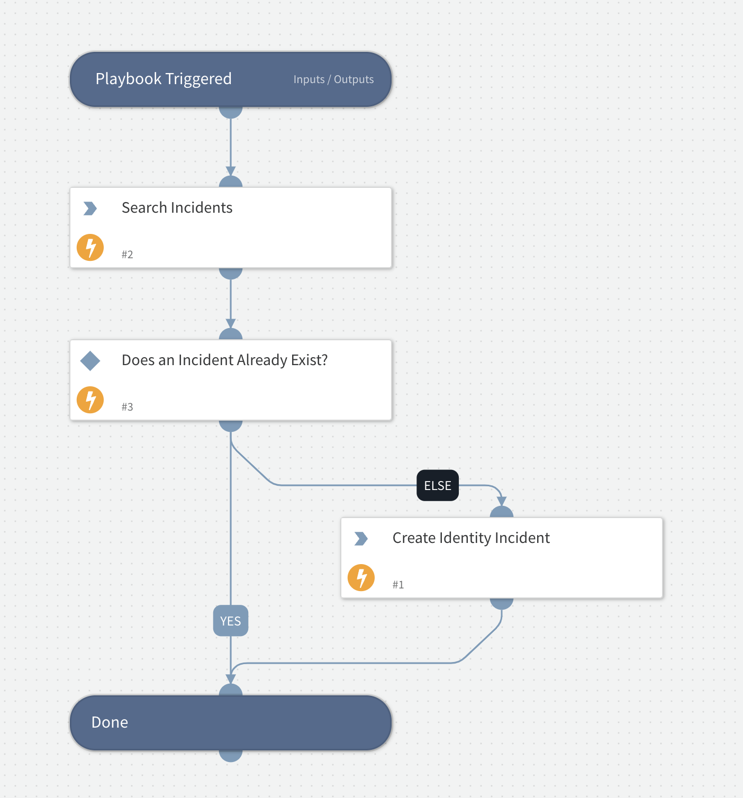

This playbook was developed as a template to handle the ingestion of Recorded Future Identity data.

## Dependencies

This playbook uses the following sub-playbooks, integrations, and scripts.

### Sub-playbooks

This playbook does not use any sub-playbooks.

### Integrations

* IdentityRecordedFuture

### Scripts

This playbook does not use any scripts.

### Commands

* recordedfuture-identity-search
* createNewIncident

## Playbook Inputs

* ExposedIdentity
* Domain

## Playbook Outputs

*CreatedIncidentID

## Playbook Image

---

