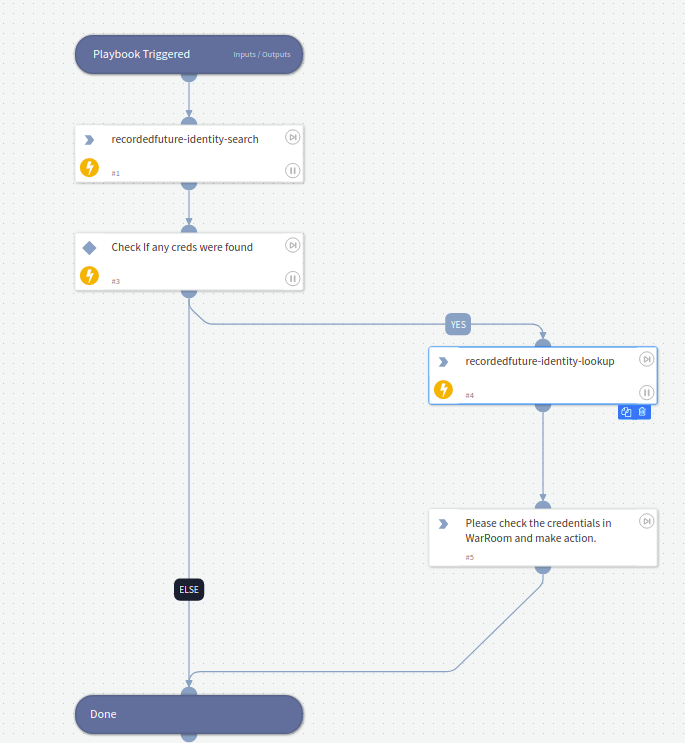

External use case for Identity search and lookup using Recorded Future Identity

## Dependencies
This playbook uses the following sub-playbooks, integrations, and scripts.

### Sub-playbooks
This playbook does not use any sub-playbooks.

### Integrations
* Recorded Future Identity

### Scripts
This playbook does not use any scripts.

### Commands
* recordedfuture-identity-search
* recordedfuture-identity-lookup

## Playbook Inputs
---

| **Name** | **Description** | **Default Value** | **Required** |
| --- | --- | --- | --- |
| latest-downloaded | Time frame for the leaked identities          | Last Year | Optional |
| domain-type       | Type of the domain(Email, Authorization, All) | Authorization | Optional |
| identities        | String of identities separated by semicolon   | RecordedFuture.Credentials.SearchIdentities | Required |
| first-downloaded  | Time frame for the leaked identities          | Last Year | Oprional |

## Playbook Outputs
---

| **Path** | **Type** | **Description** |
| --- | --- | --- |
| RecordedFuture.Credentials.SearchIdentities | List | List of Identities that were found in search command |
| RecordedFuture.Credentials.Identities.identity.subjects | string | Identity value |
| RecordedFuture.Credentials.Identities.count | number | Leaked credentials count number  |
| RecordedFuture.Credentials.Identities.credentials.subject | string | Identity value |
| RecordedFuture.Credentials.Identities.credentials.dumps.name | string | Dump name |
| RecordedFuture.Credentials.Identities.credentials.dumps.description | string | Dump description|
| RecordedFuture.Credentials.Identities.credentials.dumps.downloaded | string | Datetime string that show the day when dump was downloaded|
| RecordedFuture.Credentials.Identities.credentials.type | string | Dump type |
| RecordedFuture.Credentials.Identities.credentials.breaches.name | string | Breach name |
| RecordedFuture.Credentials.Identities.credentials.breaches.domain | string | Breach domain |
| RecordedFuture.Credentials.Identities.credentials.breaches.type | string | Breach type |
| RecordedFuture.Credentials.Identities.credentials.breaches.breached | string | Datetime string that show the day when breach happened |
| RecordedFuture.Credentials.Identities.credentials.breaches.description | string | Breach description |
| RecordedFuture.Credentials.Identities.credentials.breaches.site_description | string | Breach site description |
| RecordedFuture.Credentials.Identities.credentials.first_downloaded | string | Datetime string representing firs time downloaded |
| RecordedFuture.Credentials.Identities.credentials.latest_downloaded | string | Datetime string representing last time downloaded |
| RecordedFuture.Credentials.Identities.credentials.exposed_secret.type | string | Exposed secret type |
| RecordedFuture.Credentials.Identities.credentials.exposed_secret.hashes.algorithm | string | Exposed secret hash algorithm |
| RecordedFuture.Credentials.Identities.credentials.exposed_secret.hashes.hash | string | Exposed secret hash value |
| RecordedFuture.Credentials.Identities.credentials.exposed_secret.effectively_clear | boolean | Exposed secret clear or not |
| RecordedFuture.Credentials.Identities.credentials.exposed_secret.details.properties | string | Exposed secret properties |
| RecordedFuture.Credentials.Identities.credentials.exposed_secret.details.clear_text_hint | string | Exposed secret text hint |
| RecordedFuture.Credentials.Identities.credentials.exposed_secret.details.clear_text_hint | string | Exposed secret |

## Playbook Image
---

