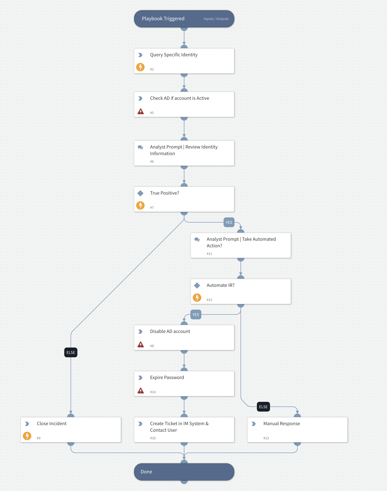

This playbook was developed as a template to handle the ingestion of Recorded Future Identity data.

## Dependencies

This playbook uses the following sub-playbooks, integrations, and scripts.

### Sub-playbooks

This playbook does not use any sub-playbooks.

### Integrations

* IdentityRecordedFuture

### Scripts

This playbook does not use any scripts.

### Commands

* recordedfuture-identity-lookup
* closeInvestigation
* ad-expire-password (Active Directory Query v2)
* ad-disable-account (Active Directory Query v2)
* ad-get-user (Active Directory Query v2)

## Playbook Inputs

* ExposedIdentity

## Playbook Outputs

---
There are no outputs for this playbook.

## Playbook Image

---

