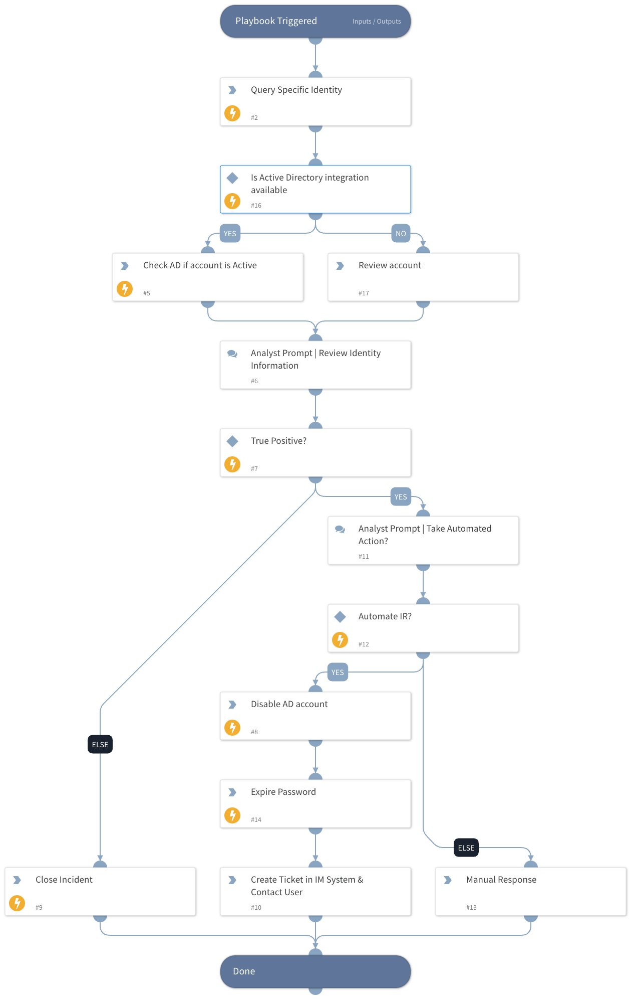

Identity playbook for Incident when the Identity has been found in Recorded Future Identity Dataset.

## Dependencies

This playbook uses the following sub-playbooks, integrations, and scripts.

### Sub-playbooks

This playbook does not use any sub-playbooks.

### Integrations

* Active Directory Query v2
* Recorded Future Identity

### Scripts

This playbook does not use any scripts.

### Commands

* ad-disable-account
* ad-get-user
* closeInvestigation
* recordedfuture-identity-lookup
* ad-expire-password

## Playbook Inputs

---

| **Name** | **Description** | **Default Value** | **Required** |
| --- | --- | --- | --- |
| ExposedIdentity |  |  | Optional |

## Playbook Outputs

---
There are no outputs for this playbook.

## Playbook Image

---

