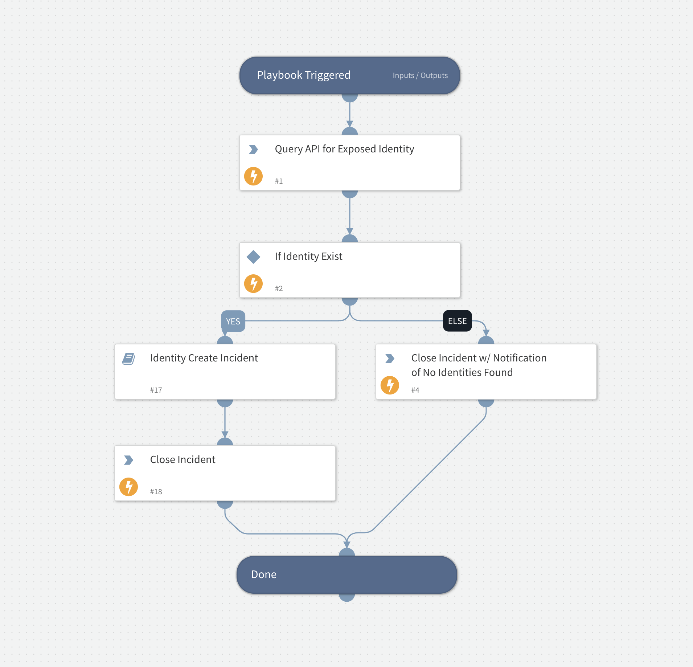

This playbook was developed as a template to handle the ingestion of Recorded Future Identity data.

## Dependencies

This playbook uses the following sub-playbooks, integrations, and scripts.

### Sub-playbooks

* playbook-Recorded_Future_Identity_Create_Incident_(subplaybook)

### Integrations

* IdentityRecordedFuture

### Scripts

This playbook does not use any scripts.

### Commands

* recordedfuture-identity-search
* closeInvestigation

## Playbook Inputs

---
There are no inputs for this playbook.

## Playbook Outputs

---
There are no outputs for this playbook.

## Playbook Image

---

