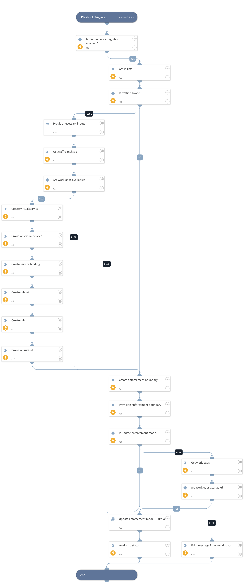

Isolate one or more workloads based on traffic flows to a given port/protocol.

## Dependencies
This playbook uses the following sub-playbooks, integrations, and scripts.

### Sub-playbooks
* Update enforcement mode - Illumio

### Integrations
* IllumioCore

### Scripts
* Print

### Commands
* illumio-object-provision
* illumio-workloads-list
* illumio-ip-lists-get
* illumio-ruleset-create
* illumio-enforcement-boundary-create
* illumio-service-binding-create
* illumio-virtual-service-create
* illumio-rule-create
* illumio-traffic-analysis

## Playbook Inputs
---

| **Name** | **Description** | **Default Value** | **Required** |
| --- | --- | --- | --- |
| Port | Provide Port to be blocked. |  | Required |
| Protocol | Protocol of Port. | TCP | Optional |
| Allow Traffic? | Do You want to allow traffic on this port? \(Yes or No\) | Yes | Optional |
| Update the enforcement mode? | Do you want to update the enforcement mode?\(Yes or No\) | Yes | Optional |

## Playbook Outputs
---
There are no outputs for this playbook.

## Playbook Image
---
