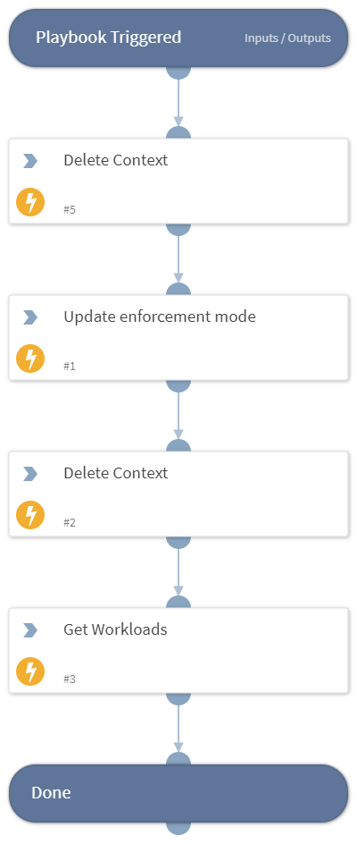

Update the enforcement mode for one or more workloads.

## Dependencies
This playbook uses the following sub-playbooks, integrations, and scripts.

### Sub-playbooks
This playbook does not use any sub-playbooks.

### Integrations
* IllumioCore

### Scripts
* DeleteContext

### Commands
* illumio-enforcement-mode-update
* illumio-workloads-list

## Playbook Inputs
---
There are no inputs for this playbook.

## Playbook Outputs
---
There are no outputs for this playbook.

## Playbook Image
---
