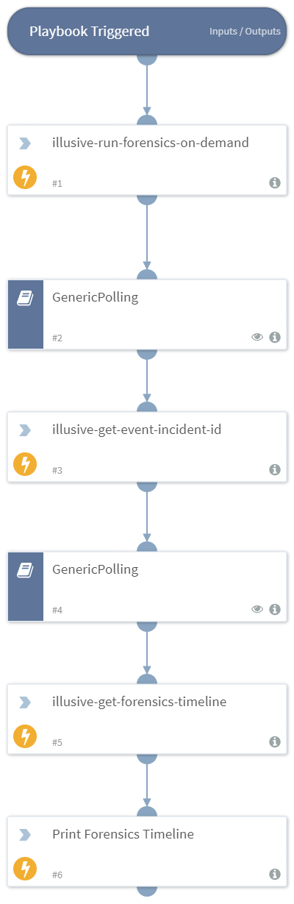

This playbook is used to collect forensics on-demand on any compromised host and retrieve the forensics timeline upon successful collection.

## Dependencies
This playbook uses the following sub-playbooks, integrations, and scripts.

### Sub-playbooks
* GenericPolling

### Integrations
* IllusiveNetworks

### Scripts
* Print

### Commands
* illusive-run-forensics-on-demand
* illusive-get-forensics-timeline
* illusive-get-event-incident-id

## Playbook Inputs
---

| **Name** | **Description** | **Default Value** | **Required** |
| --- | --- | --- | --- |
| fqdn_or_ip  | The host fqdn or IP address on which to collect forensics |  | Required |
| start_date | The starting date of the forensics timeline.
 |  | Optional |
| end_date | The last date of the forensics timeline.
 |  | Optional |

## Playbook Outputs
---

| **Path** | **Description** | **Type** |
| --- | --- | --- |
| Illusive.Forensics.Evidence.details | The forensics evidence details | unknown |
| Illusive.Forensics.Evidence.eventId | The event ID | unknown |
| Illusive.Forensics.Evidence.id | The forensics evidence ID | unknown |
| Illusive.Forensics.Evidence.source | The Evidence source | unknown |
| Illusive.Forensics.Evidence.starred | Whether the forensics evidence has been starred | unknown |
| Illusive.Forensics.Evidence.time | Date and time of the forensics evidence  | unknown |
| Illusive.Forensics.Evidence.title | The forensics evidence description | unknown |
| Illusive.Forensics.IncidentId | The Incident Id | unknown |

