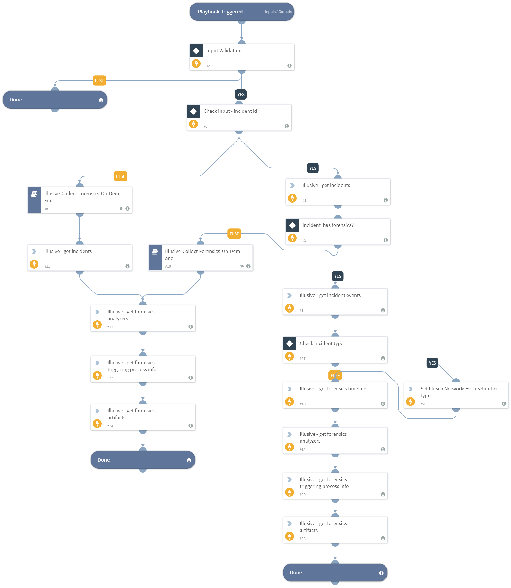

This playbook is used for automatic enrichment of incidents in the organization network, with Illusive's set of forensics and data

## Dependencies
This playbook uses the following sub-playbooks, integrations, and scripts.

### Sub-playbooks
* Illusive-Collect-Forensics-On-Demand

### Integrations
* IllusiveNetworks

### Scripts
This playbook does not use any scripts.

### Commands
* illusive-get-forensics-analyzers
* illusive-get-incidents
* illusive-get-forensics-artifacts
* illusive-get-forensics-timeline
* setIncident
* illusive-get-incident-events
* illusive-get-forensics-triggering-process-info

## Playbook Inputs
---

| **Name** | **Description** | **Default Value** | **Required** |
| --- | --- | --- | --- |
| illusive_incident_id | Illusive incident ID
 | ${incident.illusivenetworksid} | Optional |
| fqdn_or_ip | The endpoint's fqdn or IP address
 | ${Endpoint.Hostname} | Optional |

## Playbook Outputs
---

| **Path** | **Description** | **Type** |
| --- | --- | --- |
| Illusive.Incident.incidentId | The Incident ID | number |
| Illusive.Incident.sourceHostname | The compromised host's name | string |
| Illusive.Incident.sourceIp | The compromised host's IP address | string |
| Illusive.Incident.sourceOperatingSystem | The compromised host's operating system | string |
| Illusive.Incident.lastSeenUser | The user who last reviewed the incident | string |
| Illusive.Incident.deceptionFamilies | The deception families of the deceptions used to trigger
the incident | string |
| Illusive.Incident.riskInsights.stepsToCrownJewel | The compromised host's lateral distance from Crown Jewels | number |
| Illusive.Incident.riskInsights.stepsToDomainAdmin | The compromised host's lateral distance from domain admin accounts | number |
| Illusive.Incident.eventsNumber | The number of associated events | number |
| Illusive.Event.eventId | The corresponding event ID | number |
| Illusive.Event.incidentId | The corresponding incident ID | number |
| Illusive.Event.ForensicsAnalyzers | The forensics analyzer | string |
| Illusive.Event.ForensicsTriggeringProcess.commandLine | The triggering process command line | string |
| Illusive.Event.ForensicsTriggeringProcess.connectionsNum | The triggering process active connections | number |
| Illusive.Event.ForensicsTriggeringProcess.md5 | The triggering process md5 | string |
| Illusive.Event.ForensicsTriggeringProcess.sha256 | The triggering process sha256 | string |
| Illusive.Event.ForensicsTriggeringProcess.name | The triggering process name | string |
| Illusive.Event.ForensicsTriggeringProcess.parent | The parent process of the triggering process | string |
| Illusive.Event.ForensicsTriggeringProcess.path | The triggering process path | string |
| Illusive.Event.ForensicsTriggeringProcess.startTime | The triggering process start time | date |
| Illusive.Incident.incidentTimeUTC | Date and time of the incident | date |
| Illusive.Incident.closed | Whether the incident has been closed | boolean |
| Illusive.Incident.flagged | Whether the incident has been flagged | boolean |
| Illusive.Incident.hasForensics | Whether incident has forensics | boolean |
| Illusive.Incident.incidentTypes | Type of events detected | string |
| Illusive.Incident.policyName | The compromised host's policy | string |
| Illusive.Incident.unread | Whether the incident has been read | boolean |
| Illusive.Incident.userNotes | The analyst's comments | string |

## Playbook Image
---
