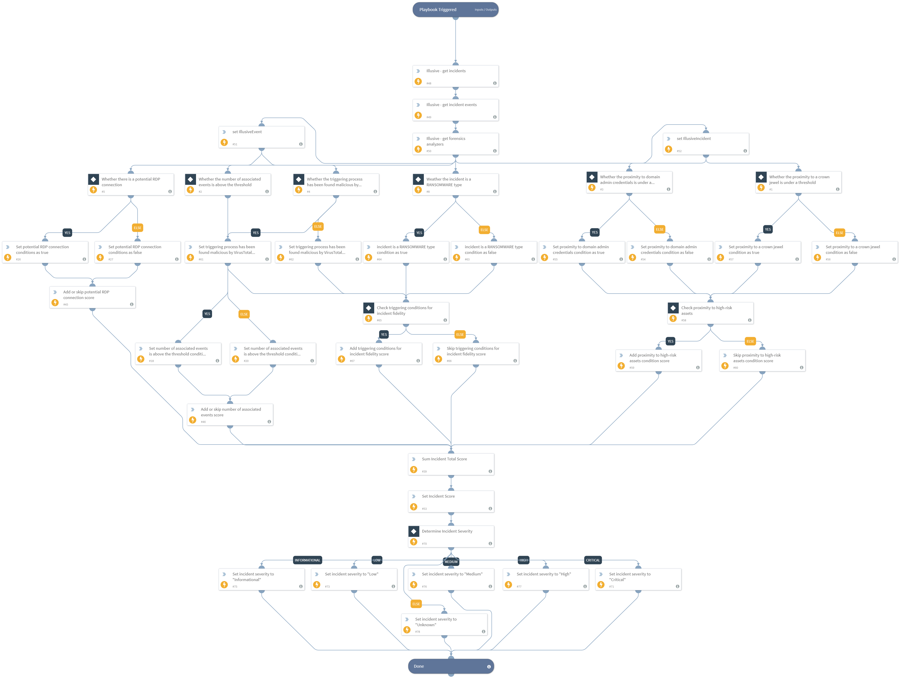

This playbook is used for creating an automatic analysis of the Illusive's incident details, in order to end up with a certain score or a set of insights that will enable automatic decisions and actions.

## Dependencies
This playbook uses the following sub-playbooks, integrations, and scripts.

### Sub-playbooks
This playbook does not use any sub-playbooks.

### Integrations
* IllusiveNetworks

### Scripts
* Set

### Commands
* illusive-get-incidents
* setIncident
* illusive-get-forensics-analyzers
* illusive-get-incident-events

## Playbook Inputs
---

| **Name** | **Description** | **Default Value** | **Required** |
| --- | --- | --- | --- |
| proximity_threshold | The maximum number of steps from crown jewel, or domain admin credentials to determine the proximity as high\-risk | 3 | Optional |
| events_threshold | The minimum number of associated events to determine this incident as a multiple\-events incident | 1 | Optional |
| proximity_weight | The unified score in case the proximity to a crown jewel and/ or the proximity to domain admin credentials is under the specified threshold | 30 | Optional |
| triggering_weight | The unified score in case the triggering process has been found malicious and/ or the triggering deception is ransomware | 60 | Optional |
| events_weight | The score in case the number of events in the inspected incident is above the specified threshold | 5 | Optional |
| rdp_weight | The score in case there is an active RDP connection to the source host | 5 | Optional |
| illusive_incident_id | The incident ID of the Illusive Networks Incident | ${incident.illusivenetworksid} | Required |

## Playbook Outputs
---

| **Path** | **Description** | **Type** |
| --- | --- | --- |
| Illusive.IncidentEscalationPlaybook.incidentId | The corresponding incident ID | number |
| Illusive.IncidentEscalationPlaybook.isCloseToCrownJewel | Whether the proximity to a crown jewel is under a certain threshold  | boolean |
| Illusive.IncidentEscalationPlaybook.isCloseToAdminCredentials | Whether the proximity to domain admin credentials is under a certain threshold | boolean |
| Illusive.IncidentEscalationPlaybook.isMultipleEvents | Whether the number of associated events is above a certain threshold | boolean |
| Illusive.IncidentEscalationPlaybook.isTriggeringProcessMalicious | Whether the triggering process has been found malicious by VirusTotal | boolean |
| Illusive.IncidentEscalationPlaybook.isActiveRdpConnection | Whether there is an active RDP connection to the source host | boolean |
| Illusive.IncidentEscalationPlaybook.isRansomware | Whether the triggering deception is ransomware | boolean |
| Illusive.IncidentEscalationPlaybook.incidentScore | The accumulated score of the incident | boolean |

## Playbook Image
---
