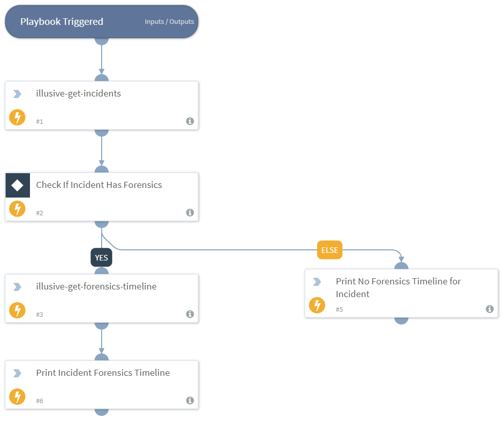

This playbook is used for retrieving an extensive view over a detected incident by retrieving the incident details and a forensics timeline if and when forensics have been successfully collected.

## Dependencies
This playbook uses the following sub-playbooks, integrations, and scripts.

### Sub-playbooks
This playbook does not use any sub-playbooks.

### Integrations
* IllusiveNetworks

### Scripts
* Print

### Commands
* illusive-get-forensics-timeline
* illusive-get-incidents

## Playbook Inputs
---

| **Name** | **Description** | **Default Value** | **Required** |
| --- | --- | --- | --- |
| incident_id | The desired incident ID to retrieve. | 3 | Required |
| start_date | The starting date of the forensics timeline. |  | Optional |
| end_date | The last date of the forensics timeline. |  | Optional |

## Playbook Outputs
---

| **Path** | **Description** | **Type** |
| --- | --- | --- |
| Illusive.Forensics.Evidence.details | The forensics evidence details | unknown |
| Illusive.Forensics.Evidence.eventId | The event ID | unknown |
| Illusive.Forensics.Evidence.id | The forensics evidence ID | unknown |
| Illusive.Forensics.Evidence.source | The Evidence source | unknown |
| Illusive.Forensics.Evidence.starred | Whether the forensics evidence has been starred | unknown |
| Illusive.Forensics.Evidence.time | Date and time of the forensics evidence  | unknown |
| Illusive.Forensics.Evidence.title | The forensics evidence description | unknown |
| Illusive.Forensics.IncidentId | The Incident Id | unknown |

