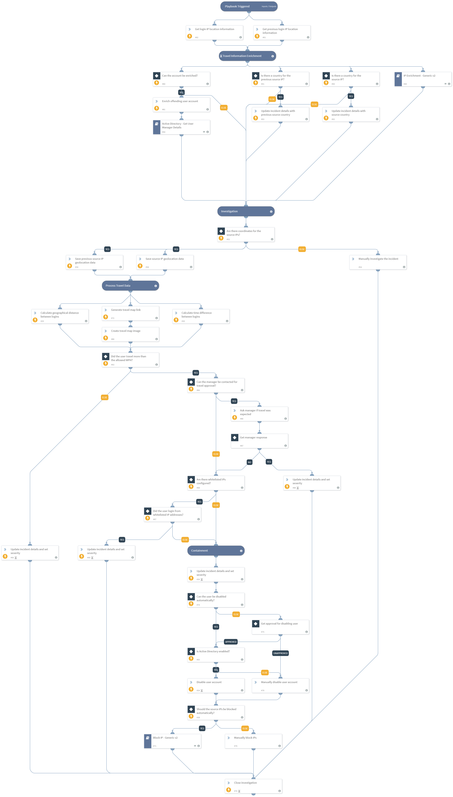

These days when modern applications are moving to cloud computing, access often requires that various authentications take place in order to remotely access company resources. This remote access comes with risks, one of which is the risk of an “impossible traveler”. When the user supposedly connects to the company network more than once from two different faraway locations, in a very short period of time, the connection raises suspicion as to the authenticity of the user. This kind of incident needs to be quickly investigated and treated accordingly.

This pack provides the necessary configuration and checks for determining the legitimacy of remote access attempts, and takes appropriate steps to quickly contain any malicious user activity.

##### What does this pack do?
- Gathers IP-based information from the addresses used to initiate the connections
- Retrieves information about the user account that initiated the connections
- Calculates the time and distance between user login attempts
- Generates a geographical map of the deduced travel path of the user
- Determines, based on IPs on allow list, manager decision and supposed speed of travel, whether the traveler is an impossible traveler
- Allows the analyst to block IPs used by the user and disable the user in case of compromise

As part of this pack, you will also get out-of-the-box incident fields, layouts and a playbook for impossible traveler investigations. All of these are easily customizable to suit the needs of your organization.

_For more information, visit our [Cortex XSOAR Developer Docs](https://xsoar.pan.dev/docs/reference/playbooks/impossible-traveler)_

