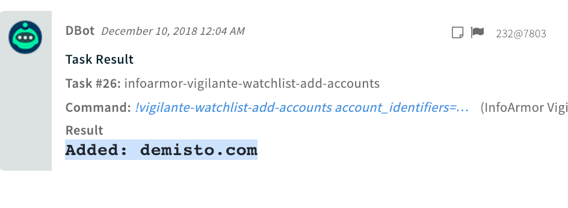

<!-- HTML_DOC -->
<h2>Overview</h2>

VigilanteATI redefines Advanced Threat Intelligence. InfoArmor's VigilanteATI platform and cyber threat services act as an extension of your IT security team.

<h2>Configure InfoArmor VigilanteATI on Cortex XSOAR</h2>

<ol>
<li>Navigate to <strong>Settings</strong> &gt; <strong>Integrations</strong> &gt; <strong>Servers &amp; Services</strong>.</li>
<li>Search for InfoArmor VigilanteATI.</li>
<li>Click <strong>Add instance</strong> to create and configure a new integration instance. 
<ul>
<li>
<strong>Name</strong>: a textual name for the integration instance.</li>
<li><strong>Server URL</strong></li>
<li><strong>API Key</strong></li>
<li><strong>API Secret</strong></li>
<li><strong>Trust any certificate (not secure)</strong></li>
<li><strong>Use system proxy</strong></li>
</ul>
</li>
<li>Click <strong>Test</strong> to validate the URLs, token, and connection.</li>
</ol>
<h2>Commands</h2>

You can execute these commands from the Cortex XSOAR CLI, as part of an automation, or in a playbook. After you successfully execute a command, a DBot message appears in the War Room with the command details.

<ol>
<li><a href="#h_70776485851544438865041">Query infected host data: vigilante-query-infected-host-data</a></li>
<li><a href="#h_9859333831101544438869332">Get vulnerable host data: vigilante-get-vulnerable-host-data</a></li>
<li><a href="#h_4215884202141544438873779">Query the eCrime intelligence database: vigilante-query-ecrime-db</a></li>
<li><a href="#h_599773643171544438878899">Get a list of leaks: vigilante-search-leaks</a></li>
<li><a href="#h_8615483124191544438887298">Get a list of account credentials for a leak: vigilante-get-leak</a></li>
<li><a href="#h_1539199975201544438893444">Search for an account in the leaked credentials database: vigilante-query-accounts</a></li>
<li><a href="#h_7889907516201544438899059">Search for a domain in the leaked credentials database: vigilante-query-domains</a></li>
<li><a href="#h_6098850267191544438904644">Add account details to a watchlist: vigilante-watchlist-add-accounts</a></li>
<li><a href="#h_3846228398161544438908724">Remove account details from a watchlist: vigilante-watchlist-remove-accounts</a></li>
<li><a href="#h_6117574289121544438913677">Get a list of identifiers on a watchlist: vigilante-get-watchlist</a></li>
<li><a href="#h_76879043810931544438920077">Get usage data for your account: vigilante-account-usage-info</a></li>
</ol>
<h3 id="h_70776485851544438865041">1. Query infected host data</h3>

Query all infected host data. This is the API call you want to use to lookup infected host data using an IP address or a network range.

<h5>Base Command</h5>

<code>vigilante-query-infected-host-data</code>

<h5>Input</h5>
<table style="width: 748px;" border="2" cellpadding="6">
<thead>
<tr>
<th style="width: 133px;"><strong>Argument Name</strong></th>
<th style="width: 504px;"><strong>Description</strong></th>
<th style="width: 71px;"><strong>Required</strong></th>
</tr>
</thead>
<tbody>
<tr>
<td style="width: 133px;">days_ago</td>
<td style="width: 504px;">Specifies how many days ago (in history) we should go back to fetch data for. By default, this parameter is set to 1 which means it returns all infected host data added to the database within the last 1 day. To return data for all infected hosts you can set this value to be equal to 0, or set it a high value such as 3650 days (or 10 years).</td>
<td style="width: 71px;">Optional</td>
</tr>
<tr>
<td style="width: 133px;">limit</td>
<td style="width: 504px;">Specifies the maximum number of entries to return from this request. By default this parameter is set to 20 which means it returns up to the first 20 infected hosts. The valid range for value of limit is from 1 (minimum) to 50,000 (maximum).</td>
<td style="width: 71px;">Optional</td>
</tr>
<tr>
<td style="width: 133px;">token</td>
<td style="width: 504px;">The token required to retrieve the next page of results; if necessary. When the result set is larger than the value of limit the API will return a token along with the response so the client can request the next page of results appropriately with the next API request.</td>
<td style="width: 71px;">Optional</td>
</tr>
<tr>
<td style="width: 133px;">q_address</td>
<td style="width: 504px;">Query parameter specifying the alphanumeric version of the IPv4 address that will be used to query the database.</td>
<td style="width: 71px;">Optional</td>
</tr>
<tr>
<td style="width: 133px;">cc_ipaddress</td>
<td style="width: 504px;">Query parameter specifying the IP address of the infected host was seen communicating with.</td>
<td style="width: 71px;">Optional</td>
</tr>
</tbody>
</table>
<h5> </h5>
<h5>Context Output</h5>
<table style="width: 748px;" border="2" cellpadding="6">
<thead>
<tr>
<th style="width: 265px;"><strong>Path</strong></th>
<th style="width: 66px;"><strong>Type</strong></th>
<th style="width: 377px;"><strong>Description</strong></th>
</tr>
</thead>
<tbody>
<tr>
<td style="width: 265px;">VigilanteATI.InfectedHosts.ip</td>
<td style="width: 66px;">string</td>
<td style="width: 377px;">Alphanumeric version of the IPv4 address belonging to this infected host.</td>
</tr>
<tr>
<td style="width: 265px;">VigilanteATI.InfectedHosts.port</td>
<td style="width: 66px;">number</td>
<td style="width: 377px;">Port number used by the infected host.</td>
</tr>
<tr>
<td style="width: 265px;">VigilanteATI.InfectedHosts.domain</td>
<td style="width: 66px;">string</td>
<td style="width: 377px;">Domain name associated with the infected host. (e.g sample.com)</td>
</tr>
<tr>
<td style="width: 265px;">VigilanteATI.InfectedHosts.country</td>
<td style="width: 66px;">string</td>
<td style="width: 377px;">Country code representing the country the host is located in. (e.g US)</td>
</tr>
<tr>
<td style="width: 265px;">VigilanteATI.InfectedHosts.malware</td>
<td style="width: 66px;">string</td>
<td style="width: 377px;">Name of the malware family we believe has infected the host. (e.g c_zeroaccess)</td>
</tr>
<tr>
<td style="width: 265px;">VigilanteATI.InfectedHosts.c_and_c</td>
<td style="width: 66px;">string</td>
<td style="width: 377px;">IP address of the C&amp;C the infected host was seen communicating with.</td>
</tr>
<tr>
<td style="width: 265px;">VigilanteATI.InfectedHosts.timestamp</td>
<td style="width: 66px;">date</td>
<td style="width: 377px;">Timestamp of when we last saw this infected host and imported it into our database. (e.g 2015-10-10 12:01:01)</td>
</tr>
<tr>
<td style="width: 265px;">VigilanteATI.GetInfectedHostsToken</td>
<td style="width: 66px;">string</td>
<td style="width: 377px;">Token required to paginate the next set of results in. This is only provided if host number of items in the response exceeds our max pagination size. Otherwise it is set to an empty string. If empty, it means there is no next page</td>
</tr>
<tr>
<td style="width: 265px;">VigilanteATI.InfectedHosts</td>
<td style="width: 66px;">unknown</td>
<td style="width: 377px;">Container for infected host objects. This is basically a list of dictionaries (hosts).</td>
</tr>
</tbody>
</table>
<h5> </h5>
<h5>Command Example</h5>
<pre>!vigilante-query-infected-host-data days_ago="10" limit="4"</pre>
<h5>Context Example</h5>
<pre><code>{
  "VigilanteATI": {
    "InfectedHost": [
      {
        "c&amp;c": "184.105.192.2",
        "country": "Asia",
        "domain": "sancharnet.in",
        "ip": "117.194.21.62",
        "malware": "s_gamarue",
        "timestamp": "2018-12-01T12:57:22"
      },
      {
        "c&amp;c": "184.105.192.2",
        "country": "Asia",
        "domain": "airtel.in",
        "ip": "122.175.240.173",
        "malware": "s_gamarue",
        "timestamp": "2018-12-01T12:57:22"
      },
      {
        "c&amp;c": "184.105.192.2",
        "country": "Asia",
        "domain": "vnnic.net.vn",
        "ip": "113.186.213.226",
        "malware": "s_gamarue",
        "timestamp": "2018-12-01T12:57:22"
      },
      {
        "c&amp;c": "184.105.192.2",
        "country": "Asia",
        "domain": "parsonline.net",
        "ip": "37.27.67.92",
        "malware": "s_gamarue",
        "timestamp": "2018-12-01T12:57:22"
      }
    ]
  }
}
</code></pre>
<h5>Human Readable Output</h5>

<h3 id="h_9859333831101544438869332">2. Get vulnerable host data</h3>

Returns all vulnerable host data from VI feed for the given query. This is the API call you want to use to download the entire feed of vulnerable hosts that matches the query.

<h5>Base Command</h5>

<code>vigilante-get-vulnerable-host-data</code>

<h5>Input</h5>
<table style="width: 748px;" border="2" cellpadding="6">
<thead>
<tr>
<th style="width: 130px;"><strong>Argument Name</strong></th>
<th style="width: 507px;"><strong>Description</strong></th>
<th style="width: 71px;"><strong>Required</strong></th>
</tr>
</thead>
<tbody>
<tr>
<td style="width: 130px;">limit</td>
<td style="width: 507px;">Specifies the maximum number of entries to return from this request. By default this parameter is set to 20 which means it returns up to the first 20 cards. The valid range for value of limit is from 1 (minimum) to 1,000 (maximum). (optional)</td>
<td style="width: 71px;">Optional</td>
</tr>
<tr>
<td style="width: 130px;">re_token</td>
<td style="width: 507px;">The re_token required to retrieve the next page of results; if necessary. When the result set is larger than the value of limit the API will return a re_token along with the response so the client can request the next page of results appropriately with the next API request. (optional)</td>
<td style="width: 71px;">Optional</td>
</tr>
<tr>
<td style="width: 130px;">q_address</td>
<td style="width: 507px;">The q_address is IP address of the vulnerable one wishes to search. If not provided, by default this parameter is set to '*', and thus, will not have any constrains on q_address. (optional)</td>
<td style="width: 71px;">Optional</td>
</tr>
<tr>
<td style="width: 130px;">q_mask</td>
<td style="width: 507px;">The q_mask is mask one wishes to apply to the IP while searching. If not provided, by default this parameter is set to '32', and thus, will not have any constrains on q_address. (optional)</td>
<td style="width: 71px;">Optional</td>
</tr>
<tr>
<td style="width: 130px;">q_type</td>
<td style="width: 507px;">The q_type is type of the vulnerable one wishes to search. If not provided, by default this parameter is set to '*', and thus, will not have any constrains on q_type. (optional)</td>
<td style="width: 71px;">Optional</td>
</tr>
</tbody>
</table>
<h5> </h5>
<h5>Context Output</h5>
<table style="width: 748px;" border="2" cellpadding="6">
<thead>
<tr>
<th style="width: 279px;"><strong>Path</strong></th>
<th style="width: 69px;"><strong>Type</strong></th>
<th style="width: 360px;"><strong>Description</strong></th>
</tr>
</thead>
<tbody>
<tr>
<td style="width: 279px;">VigilanteATI.Hosts</td>
<td style="width: 69px;">unknown</td>
<td style="width: 360px;">Container for vulnerable host objects. This is basically a list of dictionaries (hosts).</td>
</tr>
<tr>
<td style="width: 279px;">VigilanteATI.Hosts.ip</td>
<td style="width: 69px;">unknown</td>
<td style="width: 360px;">Alphanumeric version of the IPv4 address belonging to this vulnerable host.</td>
</tr>
<tr>
<td style="width: 279px;">VigilanteATI.Hosts.hostname</td>
<td style="width: 69px;">unknown</td>
<td style="width: 360px;">Hostname of the host. Obtained by doing a lookup using the given IPv4 address. (e.g "sample.hostname.com")</td>
</tr>
<tr>
<td style="width: 279px;">VigilanteATI.Hosts.type</td>
<td style="width: 69px;">unknown</td>
<td style="width: 360px;">Vulnerability type/name. (e.g heartbleed)</td>
</tr>
<tr>
<td style="width: 279px;">VigilanteATI.Hosts.port</td>
<td style="width: 69px;">unknown</td>
<td style="width: 360px;">Port numbers that this might affect. (e.g 443)</td>
</tr>
<tr>
<td style="width: 279px;">VigilanteATI.Hosts.protocols</td>
<td style="width: 69px;">unknown</td>
<td style="width: 360px;">Protocols that this might affect. (e.g "ssh")</td>
</tr>
<tr>
<td style="width: 279px;">VigilanteATI.Hosts.url</td>
<td style="width: 69px;">unknown</td>
<td style="width: 360px;">URL field. Only applicable with certain vulnerability types such as web shell.</td>
</tr>
<tr>
<td style="width: 279px;">VigilanteATI.Hosts.geoip</td>
<td style="width: 69px;">unknown</td>
<td style="width: 360px;">JSon of all the data we have about the IP and its location.</td>
</tr>
<tr>
<td style="width: 279px;">VigilanteATI.Hosts.geoip.timezone</td>
<td style="width: 69px;">unknown</td>
<td style="width: 360px;">Timezone (e.g Asia/Tokyo)</td>
</tr>
<tr>
<td style="width: 279px;">VigilanteATI.Hosts.geoip.ip</td>
<td style="width: 69px;">string</td>
<td style="width: 360px;">IPv4 addresss</td>
</tr>
<tr>
<td style="width: 279px;">VigilanteATI.Hosts.geoip.continent_code</td>
<td style="width: 69px;">string</td>
<td style="width: 360px;">Contient Code (e.g AS)</td>
</tr>
<tr>
<td style="width: 279px;">VigilanteATI.Hosts.geoip.city_name</td>
<td style="width: 69px;">string</td>
<td style="width: 360px;">City Name (e.g Tokyo)</td>
</tr>
<tr>
<td style="width: 279px;">VigilanteATI.Hosts.geoip.country_code2</td>
<td style="width: 69px;">string</td>
<td style="width: 360px;">Country Code (e.g JP)</td>
</tr>
<tr>
<td style="width: 279px;">VigilanteATI.Hosts.geoip.country_name</td>
<td style="width: 69px;">string</td>
<td style="width: 360px;">Country Name (e.g Japan)</td>
</tr>
<tr>
<td style="width: 279px;">VigilanteATI.Hosts.geoip.country_code3</td>
<td style="width: 69px;">string</td>
<td style="width: 360px;">Country Code (e.g JP)</td>
</tr>
<tr>
<td style="width: 279px;">VigilanteATI.Hosts.geoip.region_name</td>
<td style="width: 69px;">unknown</td>
<td style="width: 360px;">Region Name(e.g Tokyo)</td>
</tr>
<tr>
<td style="width: 279px;">VigilanteATI.Hosts.geoip.latitude</td>
<td style="width: 69px;">number</td>
<td style="width: 360px;">Latitude (e.g 35.6502)</td>
</tr>
<tr>
<td style="width: 279px;">VigilanteATI.Hosts.geoip.longitude</td>
<td style="width: 69px;">number</td>
<td style="width: 360px;">Longitude (e.g 139.6939)</td>
</tr>
<tr>
<td style="width: 279px;">VigilanteATI.Hosts.geoip.postal_code</td>
<td style="width: 69px;">string</td>
<td style="width: 360px;">Postal Code (e.g 153-0042)</td>
</tr>
<tr>
<td style="width: 279px;">VigilanteATI.Hosts.geoip.region_code</td>
<td style="width: 69px;">string</td>
<td style="width: 360px;">Region Code (e.g 13)</td>
</tr>
<tr>
<td style="width: 279px;">VigilanteATI.Hosts.timestamp</td>
<td style="width: 69px;">date</td>
<td style="width: 360px;">Timestamp of when we found this vulnerable host and imported it into our database. (e.g 2015-10-10 12:01:01)</td>
</tr>
<tr>
<td style="width: 279px;">VigilanteATI.GetVulnerableHostsToken</td>
<td style="width: 69px;">unknown</td>
<td style="width: 360px;">The re_token parameter value required to retrieve the next page of results. The token is valid for 5 minutes. The value is null if count is equal to either 0 or total.</td>
</tr>
</tbody>
</table>
<h5> </h5>
<h5>Command Example</h5>
<pre>!vigilante-get-vulnerable-host-data limit="5" q_address="9.9.9.9"</pre>
<h5>Context Example</h5>
<pre><code>{
  "VigilanteATI": {
    "Hosts": [
      {
        "geoip": {
          "postal_code": "27709",
          "ip": "9.9.9.9",
          "latitude": 35.994,
          "longitude": -78.8986,
          "dma_code": 560,
          "country_name": "United States",
          "location": {
            "lat": 35.994,
            "lon": -78.8986
          },
          "region_name": "North Carolina",
          "region_code": "NC",
          "continent_code": "NA",
          "timezone": "America/New_York",
          "country_code2": "US",
          "country_code3": "US",
          "city_name": "Durham"
        },
        "hostname": [
          "dns.quad9.net"
        ],
        "ip": "9.9.9.9",
        "port": 53,
        "protocols": "udp",
        "timestamp": "2018-03-27 08:33:42",
        "type": "accessible port 53",
        "url": [
          "quad9.net"
        ]
      }
    ]
  }
}
</code></pre>
<h5>Human Readable Output</h5>

<h3 id="h_4215884202141544438873779">3. Query the eCrime intelligence database</h3>

Queries the eCrime intelligence database. This is the API call you want to use to do a full text search on eCrime intelligence data, such as hacker chatter.

<h5>Base Command</h5>

<code>vigilante-query-ecrime-db</code>

<h5>Input</h5>
<table style="width: 744px;" border="2" cellpadding="6">
<thead>
<tr>
<th style="width: 136px;"><strong>Argument Name</strong></th>
<th style="width: 501px;"><strong>Description</strong></th>
<th style="width: 71px;"><strong>Required</strong></th>
</tr>
</thead>
<tbody>
<tr>
<td style="width: 136px;">query</td>
<td style="width: 501px;">Specifies the search query; may be a lucene query.</td>
<td style="width: 71px;">Required</td>
</tr>
<tr>
<td style="width: 136px;">q_forum</td>
<td style="width: 501px;">Specifies a specific forum to search.</td>
<td style="width: 71px;">Optional</td>
</tr>
<tr>
<td style="width: 136px;">q_start_date</td>
<td style="width: 501px;">Specifies the search start date; only posts on or after q_start_date are retrieved. e.g 2017-10-01)</td>
<td style="width: 71px;">Optional</td>
</tr>
<tr>
<td style="width: 136px;">q_end_date</td>
<td style="width: 501px;">Specifies the search end date; only posts on or before q_end_date are retrieved. (e.g 2017-10-03)</td>
<td style="width: 71px;">Optional</td>
</tr>
<tr>
<td style="width: 136px;">limit</td>
<td style="width: 501px;">Specifies the maximum number of posts to return. By default limit is set to 10, which means the result set is limited to the first 10 posts. limit must be between 1 and 100, inclusive.</td>
<td style="width: 71px;">Optional</td>
</tr>
<tr>
<td style="width: 136px;">re_token</td>
<td style="width: 501px;">The re_token required to retrieve the next page of results when the result set is larger than limit. If this parameter is specified, all other parameters are ignored.</td>
<td style="width: 71px;">Optional</td>
</tr>
</tbody>
</table>
<h5> </h5>
<h5>Context Output</h5>
<table style="width: 748px;" border="2" cellpadding="6">
<thead>
<tr>
<th style="width: 224px;"><strong>Path</strong></th>
<th style="width: 45px;"><strong>Type</strong></th>
<th style="width: 439px;"><strong>Description</strong></th>
</tr>
</thead>
<tbody>
<tr>
<td style="width: 224px;">VigilanteATI.ECrimeQueryToken</td>
<td style="width: 45px;">string</td>
<td style="width: 439px;">The re_token parameter value required to retrieve the next page of results. The token is valid for 5 minutes. The value is null if count is equal to either 0 or total.</td>
</tr>
<tr>
<td style="width: 224px;">VigilanteATI.ECrimePosts.title</td>
<td style="width: 45px;">string</td>
<td style="width: 439px;">base64 encoded, matching search terms highlighted via tags</td>
</tr>
<tr>
<td style="width: 224px;">VigilanteATI.ECrimePosts.date</td>
<td style="width: 45px;">date</td>
<td style="width: 439px;">Post date (format YYYY-MM-DD)</td>
</tr>
<tr>
<td style="width: 224px;">VigilanteATI.ECrimePosts.forum</td>
<td style="width: 45px;">string</td>
<td style="width: 439px;">Forum (e.g rstforums.com)</td>
</tr>
<tr>
<td style="width: 224px;">VigilanteATI.ECrimePosts.author</td>
<td style="width: 45px;">string</td>
<td style="width: 439px;">Author</td>
</tr>
<tr>
<td style="width: 224px;">VigilanteATI.ECrimePosts.post</td>
<td style="width: 45px;">string</td>
<td style="width: 439px;">base64 encoded, matching search terms highlighted via tags</td>
</tr>
</tbody>
</table>
<h5> </h5>
<h5>Command Example</h5>
<pre>!vigilante-query-ecrime-db query="netflix" q_start_date="2018-05-20" limit="5"</pre>
<h5>Context Example</h5>
<pre><code>{
  "VigilanteATI": {
    "ECrimePosts": [
      {
        "author": "fb_official2",
        "date": "2018-12-10",
        "forum": "bcbm4y7yusdxthg3.onion",
        "post": "&lt;mark&gt;NETFLIX&lt;/mark&gt; TODAY\n\nACCOUNT:  example@gmail.com\nPASS: THEdonbone",
        "thread_url": "http://bcbm4y7yusdxthg3.onion/showthread.php?t=28120",
        "title": "FREE &lt;mark&gt;NETFLIX&lt;/mark&gt; ACCOUNT DAILY.."
      },
      {
        "author": "fb_official2",
        "date": "2018-12-10",
        "forum": "bcbm4y7yusdxthg3.onion",
        "post": "https://ibb.co/miywTp\nhttps://ibb.co/g6xZEU",
        "thread_url": "http://bcbm4y7yusdxthg3.onion/showthread.php?t=28120",
        "title": "FREE &lt;mark&gt;NETFLIX&lt;/mark&gt; ACCOUNT DAILY.."
      },
      {
        "author": "fb_official2",
        "date": "2018-12-09",
        "forum": "sky-fraud",
        "post": "https://www.lifewire.com/thmb/3AYgoVf77283d151.jpg\n\n\n\n\n&lt;mark&gt;NETFLIX&lt;/mark&gt; TODAY\n\nACCOUNT:  example.gmail.com\nPASS: THEdonbone",
        "thread_url": "https://sky-fraud.ru/showthread.php?t=28120",
        "title": "FREE &lt;mark&gt;NETFLIX&lt;/mark&gt; ACCOUNT DAILY.."
      },
      {
        "author": "piscedor",
        "date": "2018-12-09",
        "forum": "https://bitshacking.com",
        "post": "grosspam@msn.com:dylan1\r\nCaptured Keys:\r\n&lt;------------&gt;\r\nFirstname: Pam\r\nLastname: Gross\r\nCountry: US\n\n\example.gmail.com:matthew\r\nCaptured Keys:\r\n&lt;------------&gt;\r\nFirstname: Jim\r\nLastname: Dutton\r\nCountry: US\n\n\example.gmail.com:axleaxle\r\nCaptured Keys:\r\n&lt;------------&gt;\r\nFirstname: Berni\r\nLastname: Hartford\r\nCountry: CA\n\n\example@gmail.com:jtrocks\r\nCaptured Keys:\r\n&lt;------------&gt;\r\nFirstname: James\r\nLastname: Roselle\r\nCountry: US\n\n\example.gmail.com:helpme\r\nCaptured Keys:\r\n&lt;------------&gt;\r\nFirstname: Jessica\r\nLastname: Cacciola\r\nCountry: US\n\n\njbur1111@yahoo.com:wilson\r\nCaptured Keys:\r\n&lt;------------&gt;\r\nFirstname: Colleen\r\nLastname: Burke\r\nCountry: US\n\n\example.gmail.com:callie\r\nCaptured Keys:\r\n&lt;------------&gt;\r\nFirstname: Donald\r\nLastname: Graves\r\nCountry: US\n\n\nglennzenner@yahoo.com:colorado\r\nCaptured Keys:\r\n&lt;------------&gt;\r\nFirstname: Glenn\r\nLastname: Zenner\r\nCountry: US\n\n\example@gmail.com:anthony13\r\nCaptured Keys:\r\n&lt;------------&gt;\r\nFirstname: Anthony D.\r\nLastname: ORTIZ\r\nCountry: US\n\n\example.gmail.com:goodguys1\r\nCaptured Keys:\r\n&lt;------------&gt;\r\nFirstname: Garrick\r\nLastname: Lew\r\nCountry: US",
        "thread_url": "http://www.bitshacking.com/forum/accounts-database-section/146703-10-x-netflix-premium-accounts.html",
        "title": "10 x &lt;mark&gt;Netflix&lt;/mark&gt; premium accounts"
      },
      {
        "author": "piscedor",
        "date": "2018-12-09",
        "forum": "https://bitshacking.com",
        "post": "example.gmail.com|alphadog666\example.gmail.com|slamdunk1991\example@gmail.com|dennick6892",
        "thread_url": "http://www.bitshacking.com/forum/accounts-database-section/146705-3x-netflix-account.html",
        "title": "3x &lt;mark&gt;netflix&lt;/mark&gt; account"
      }
    ]
  }
}
</code></pre>
<h5>Human Readable Output</h5>

<h3 id="h_599773643171544438878899">4. Get a list of leaks</h3>

Retrieves the list of leaks from database.

<h5>Base Command</h5>

<code>vigilante-search-leaks</code>

<h5>Input</h5>
<table style="width: 744px;" border="2" cellpadding="6">
<thead>
<tr>
<th style="width: 136px;"><strong>Argument Name</strong></th>
<th style="width: 501px;"><strong>Description</strong></th>
<th style="width: 71px;"><strong>Required</strong></th>
</tr>
</thead>
<tbody>
<tr>
<td style="width: 136px;">leak_id</td>
<td style="width: 501px;">If set this parameter determines which leak the user wants to return metadata for. This is used primarily when you want to get information on just a single leak instead of a set of leaks.</td>
<td style="width: 71px;">Optional</td>
</tr>
<tr>
<td style="width: 136px;">days_ago</td>
<td style="width: 501px;">Specifies how many days ago (in history) we should go back to fetch leak data for. By default this parameter is set to 7 which means it returns all leaks added to the database within the last 7 days. To return data for all leaks you can set this value to be equal to 0.</td>
<td style="width: 71px;">Optional</td>
</tr>
<tr>
<td style="width: 136px;">keyword</td>
<td style="width: 501px;">Allows you to specify a string keyword to search for. The keyword specified is used to search metadata associated with a leak and return any matching results. You can search by domain names, hacker groups, affected companies, etc.</td>
<td style="width: 71px;">Optional</td>
</tr>
<tr>
<td style="width: 136px;">limit</td>
<td style="width: 501px;">Specifies the maximum number of leaks to return from this request. By default this parameter is set to 20 which means it returns up to the first 20 leaks. The valid range for value of limit is from 1 (minimum) to 1,000 (maximum). (optional)</td>
<td style="width: 71px;">Optional</td>
</tr>
<tr>
<td style="width: 136px;">token</td>
<td style="width: 501px;">The token required to retrieve the next page of results; if necessary. When the result set is larger than the value of limit the API will return a token along with the response so the client can request the next page of results appropriately with the next API request. (optional)</td>
<td style="width: 71px;">Optional</td>
</tr>
</tbody>
</table>
<h5> </h5>
<h5>Context Output</h5>
<table style="width: 748px;" border="2" cellpadding="6">
<thead>
<tr>
<th style="width: 297px;"><strong>Path</strong></th>
<th style="width: 67px;"><strong>Type</strong></th>
<th style="width: 344px;"><strong>Description</strong></th>
</tr>
</thead>
<tbody>
<tr>
<td style="width: 297px;">VigilanteATI.Leaks.leak_id</td>
<td style="width: 67px;">string</td>
<td style="width: 344px;">Unique identifier for the leak. We internally use MD5 sums to identify leaks, so this will be a MD5 sum</td>
</tr>
<tr>
<td style="width: 297px;">VigilanteATI.Leaks.title</td>
<td style="width: 67px;">unknown</td>
<td style="width: 344px;">Title of the leak.</td>
</tr>
<tr>
<td style="width: 297px;">VigilanteATI.Leaks.description</td>
<td style="width: 67px;">unknown</td>
<td style="width: 344px;">A short leak description</td>
</tr>
<tr>
<td style="width: 297px;">VigilanteATI.Leaks.leak_type</td>
<td style="width: 67px;">unknown</td>
<td style="width: 344px;">Type of the leak. Currently we feature the following leak designations: "Database dump", "Credentials dump" or "Credit card dump". As our service grows we will add new leak types into the system.</td>
</tr>
<tr>
<td style="width: 297px;">VigilanteATI.Leaks.source_refs</td>
<td style="width: 67px;">string</td>
<td style="width: 344px;">List of sources (URIs) where this leak was available at the time VigilanteATI team harvested it.</td>
</tr>
<tr>
<td style="width: 297px;">VigilanteATI.Leaks.import_date</td>
<td style="width: 67px;">date</td>
<td style="width: 344px;">The date the leak was first imported into the VigilanteATI database.</td>
</tr>
<tr>
<td style="width: 297px;">VigilanteATI.Leaks.attackers</td>
<td style="width: 67px;">string</td>
<td style="width: 344px;">A list of attackers (hackers) who claimed responsibility for the breach/leak.</td>
</tr>
<tr>
<td style="width: 297px;">VigilanteATI.Leaks.score</td>
<td style="width: 67px;">number</td>
<td style="width: 344px;">An integer, in a range of 0 to 100, of how confident we are this leak is legitimate.</td>
</tr>
<tr>
<td style="width: 297px;">VigilanteATI.Leaks.num_domains_affected</td>
<td style="width: 67px;">number</td>
<td style="width: 344px;">Number of domains affected by the leak.</td>
</tr>
<tr>
<td style="width: 297px;">VigilanteATI.Leaks.target_industries</td>
<td style="width: 67px;">string</td>
<td style="width: 344px;">A list of target industry verticals affected by the leak.</td>
</tr>
<tr>
<td style="width: 297px;">VigilanteATI.Leaks.attack_method</td>
<td style="width: 67px;">string</td>
<td style="width: 344px;">The method of attack on the target; if published. This is usually "SQLi", "phishing", "social engineering", etc.</td>
</tr>
<tr>
<td style="width: 297px;">VigilanteATI.Leaks.media_refs</td>
<td style="width: 67px;">unknown</td>
<td style="width: 344px;">A list of media articles covering the data leak.</td>
</tr>
<tr>
<td style="width: 297px;">VigilanteATI.Leaks.targets</td>
<td style="width: 67px;">string</td>
<td style="width: 344px;">List of entities targeted by this leak.</td>
</tr>
<tr>
<td style="width: 297px;">VigilanteATI.Leaks.num_entries</td>
<td style="width: 67px;">number</td>
<td style="width: 344px;">Total number of account credentials (email/password pairs) harvested from this leak.</td>
</tr>
<tr>
<td style="width: 297px;">VigilanteATI.Leaks.password_hash</td>
<td style="width: 67px;">string</td>
<td style="width: 344px;">Type of password hash; only present if leaked passwords have been hashed.</td>
</tr>
<tr>
<td style="width: 297px;">VigilanteATI.LeakInfoToken</td>
<td style="width: 67px;">string</td>
<td style="width: 344px;">Token required to paginate the next set of results in. This is only provided if the number of items in the response exceeds our max pagination size. Otherwise it is set to an empty string.</td>
</tr>
</tbody>
</table>
<h5> </h5>
<h5>Command Example</h5>
<pre>!vigilante-search-leaks days_ago="100" keyword="apple" limit="5"</pre>
<h5>Context Example</h5>
<pre><code>{
    "VigilanteATI": {
        "Leaks": [
            {
                "leak_id": "aa66573902ed4f4bfb2ae08ebac390c3", 
                "password_type": null, 
                "description": "part of solenya collection of dumps www.shareapple.com.txt. Many smaller breaches from smaller websites. Original breach dates unknown, but most likely happened before Jan 2017. Often repacked in to larger combolists. ", 
                "source_refs": [], 
                "attack_method": "", 
                "title": "www.shareapple.com.txt solenya collection leak", 
                "import_date": "2018-03-17 00:00:00", 
                "breach_date": "", 
                "targets": [
                    "www.shareapple.com.txt"
                ], 
                "attackers": [], 
                "num_entries": 5669, 
                "score": 30, 
                "num_domains_affected": 5669, 
                "leak_type": "Database dump", 
                "target_industries": "", 
                "password_hash": "", 
                "leak_date": "2017-01-01 00:00:00", 
                "media_refs": []
            }, 
            {
                "leak_id": "5892cc3edb5ee8463a6ebbfd54b1b2ad", 
                "password_type": null, 
                "description": "part of solenya collection of dumps www.applebeebook.co.kr.txt. Many smaller breaches from smaller websites. Original breach dates unknown, but most likely happened before Jan 2017. Often repacked in to larger combolists. ", 
                "source_refs": [], 
                "attack_method": "", 
                "title": "www.applebeebook.co.kr.txt solenya collection leak", 
                "import_date": "2018-03-16 00:00:00", 
                "breach_date": "", 
                "targets": [
                    "www.applebeebook.co.kr.txt"
                ], 
                "attackers": [], 
                "num_entries": 64147, 
                "score": 30, 
                "num_domains_affected": 64147, 
                "leak_type": "Database dump", 
                "target_industries": "", 
                "password_hash": "", 
                "leak_date": "2017-01-01 00:00:00", 
                "media_refs": []
            }, 
            {
                "leak_id": "a6eb0ca9fb47777aa81ce58d71a30495", 
                "password_type": "plaintext", 
                "description": "An unknown hacker or hacker group posted what they're claiming is a listing of Apple ID accounts, with email addresses and passwords. The listing also denotes the location of the users.", 
                "source_refs": [
                    "http://pastebin.com/raw.php?i=E8n5cBRf"
                ], 
                "attack_method": "", 
                "title": "Alleged dump of Apple accounts", 
                "import_date": "2015-09-14 00:00:00", 
                "breach_date": "", 
                "targets": [], 
                "attackers": [], 
                "num_entries": 14, 
                "score": 60, 
                "num_domains_affected": 14, 
                "leak_type": "Credentials dump", 
                "target_industries": "", 
                "password_hash": "", 
                "leak_date": "2015-09-14 00:00:00", 
                "media_refs": []
            }, 
            {
                "leak_id": "ff2fe066c6f6289e70be0157d3b2e24e", 
                "password_type": "hashes", 
                "description": "A hacker group calling themselves Kim Jong-Cracks have supposedly breached the database of Insanelyi, a product of Cydia. Cydia is the jailbraker's App Store alternative for iOS apps on Apple devices. The hacker group posted a CSV file containing usernames, email addresses, MD5 password hashes, password salts and more. ", 
                "source_refs": [
                    "http://apt.ripbigboss.com/insanelyi.nfo"
                ], 
                "attack_method": "", 
                "title": "Cydia database dumped", 
                "import_date": "2014-07-30 00:00:00", 
                "breach_date": "", 
                "targets": [], 
                "attackers": [], 
                "num_entries": 104079, 
                "score": 90, 
                "num_domains_affected": 104079, 
                "leak_type": "Credentials dump", 
                "target_industries": "", 
                "password_hash": "MD5", 
                "leak_date": "2014-07-29 00:00:00", 
                "media_refs": [
                    "http://www.technobuffalo.com/2014/07/20/cydias-popular-bigboss-repo-allegedly-gets-hacked/"
                ]
            }, 
            {
                "leak_id": "128e4664c1712016e80678dad86c7a7b", 
                "password_type": "plaintext", 
                "description": "A hacker or hacker group named An0nGhost posted a data dump from store.apple.com. The leak contains what appears to be emails and passwords.", 
                "source_refs": [
                    "http://pastebin.com/raw.php?i=BBXjnNxj"
                ], 
                "attack_method": "", 
                "title": "store.apple.com accounts hacked", 
                "import_date": "2014-06-02 00:00:00", 
                "breach_date": "", 
                "targets": [
                    "store.apple.com"
                ], 
                "attackers": [
                    "An0nGhost"
                ], 
                "num_entries": 210, 
                "score": 60, 
                "num_domains_affected": 210, 
                "leak_type": "Credentials dump", 
                "target_industries": "", 
                "password_hash": "", 
                "leak_date": "2014-06-02 00:00:00", 
                "media_refs": []
            }
        ], 
        "LeakInfoToken": "Bwz/okTPVNIldyAYJQ6bFanwA/VYIAjy2BjSuSuceCv0Xi/pEVbsniqOYZP61tLbSxjkTAcgTpfDdaJqy8Eu3Q=="
    }
}
</code></pre>
<h5>Human Readable Output</h5>

<h3 id="h_8615483124191544438887298">5. Get a list of account credentials for a leak</h3>

Retrieves the list of account credentials that belong to a particular leak.

<h5>Base Command</h5>

<code>vigilante-get-leak</code>

<h5>Input</h5>
<table style="width: 746px;" border="2" cellpadding="6">
<thead>
<tr>
<th style="width: 137px;"><strong>Argument Name</strong></th>
<th style="width: 500px;"><strong>Description</strong></th>
<th style="width: 71px;"><strong>Required</strong></th>
</tr>
</thead>
<tbody>
<tr>
<td style="width: 137px;">leak_id</td>
<td style="width: 500px;">An identifier (MD5 sum) that uniquely represents this leak in our database.</td>
<td style="width: 71px;">Required</td>
</tr>
<tr>
<td style="width: 137px;">limit</td>
<td style="width: 500px;">Specifies the maximum number of account credentials to return from this request. By default this parameter is set to 20 which means it returns up to the first 20 accounts harvested from this leak. The valid range for value of limit is from 1 (minimum) to 10,000 (maximum). (optional)</td>
<td style="width: 71px;">Optional</td>
</tr>
<tr>
<td style="width: 137px;">domains</td>
<td style="width: 500px;">A comma delimited list of domains to use a filter for returning the harvested credentials. This parameter is used to return only a subset of the leak that matches a particular email domain, rather than the whole leak. By default this parameter is set to empty string which means it returns all harvested credentials, regardless of the email domain they belong to. (optional)</td>
<td style="width: 71px;">Optional</td>
</tr>
<tr>
<td style="width: 137px;">token</td>
<td style="width: 500px;">The token required to retrieve the next page of results; if necessary. When the result set is larger than the value of limit the API will return a token along with the response so the client can request the next page of results appropriately with the next API request. (optional)</td>
<td style="width: 71px;">Optional</td>
</tr>
</tbody>
</table>
<h5> </h5>
<h5>Context Output</h5>
<table style="width: 748px;" border="2" cellpadding="6">
<thead>
<tr>
<th style="width: 264px;"><strong>Path</strong></th>
<th style="width: 69px;"><strong>Type</strong></th>
<th style="width: 375px;"><strong>Description</strong></th>
</tr>
</thead>
<tbody>
<tr>
<td style="width: 264px;">VigilanteATI.Leaks.leak_id</td>
<td style="width: 69px;">string</td>
<td style="width: 375px;">Unique identifier for the leak from which the accounts come from. (MD5 sum)</td>
</tr>
<tr>
<td style="width: 264px;">VigilanteATI.Leaks.accounts</td>
<td style="width: 69px;">unknown</td>
<td style="width: 375px;">Container for account objects. This is just a list of dictionaries.</td>
</tr>
<tr>
<td style="width: 264px;">VigilanteATI.Leaks.accounts.domain</td>
<td style="width: 69px;">string</td>
<td style="width: 375px;">Email domain which the account belongs to.</td>
</tr>
<tr>
<td style="width: 264px;">VigilanteATI.Leaks.accounts.type_id</td>
<td style="width: 69px;">number</td>
<td style="width: 375px;">Type of account. At the moment we only support accounts of type 1, which are email addresses. As we expand our service we will add support for additional types such as usernames.</td>
</tr>
<tr>
<td style="width: 264px;">VigilanteATI.Leaks.accounts.email</td>
<td style="width: 69px;">string</td>
<td style="width: 375px;">A plaintext form of the email address from the account. The email address will always be lowercased.</td>
</tr>
<tr>
<td style="width: 264px;">VigilanteATI.Leaks.accounts.password</td>
<td style="width: 69px;">string</td>
<td style="width: 375px;">The encrypted password found in this leaked account credential. This field is the BASE64 encoded representation of the encrypted data. You will need to decrypt this password using a decryption key provided to you.</td>
</tr>
<tr>
<td style="width: 264px;">VigilanteATI.LeakAccountsToken</td>
<td style="width: 69px;">string</td>
<td style="width: 375px;">Token required to paginate the next set of results in. This is only provided if the number of items in the response exceeds our max pagination size. Otherwise it is set to an empty string.</td>
</tr>
</tbody>
</table>
<h5> </h5>
<h5>Command Example</h5>
<pre>!vigilante-get-leak leak_id="aa66573902ed4f4bfb2ae08ebac390c3" limit="3" domains="hotmail.com,sina.com"</pre>
<h5>Context Example</h5>
<pre><code>{
    "VigilanteATI": {
        "LeakAccountsToken": "p2V99rXakNhn3mafVJ6WJ6MEEfcPGh+q+DY9sO1SlNo2AR3D4akFOWTY+8T53rX4FJWc4LjylGORXKKp9Zl52PYhViNR1P3+Z1Sn3pYKrvC5iDTXwXVe5eqcomd44qbx", 
        "Leaks": {
            "leak_id": "aa66573902ed4f4bfb2ae08ebac390c3", 
            "accounts": [
                {
                    "leak_id": "aa66573902ed4f4bfb2ae08ebac390c3", 
                    "domain": "hotmail.com", 
                    "password": "dummypassword", 
                    "email": "dummy1@hotmail.com", 
                    "type_id": 1
                }, 
                {
                    "leak_id": "aa66573902ed4f4bfb2ae08ebac390c3", 
                    "domain": "sina.com", 
                    "password": "dummypassword", 
                    "email": "dummy2@sina.com", 
                    "type_id": 1
                }, 
                {
                    "leak_id": "aa66573902ed4f4bfb2ae08ebac390c3", 
                    "domain": "hotmail.com", 
                    "password": "dummypassword", 
                    "email": "dummy3@hotmail.com", 
                    "type_id": 1
                }
            ]
        }
    }
}
</code></pre>
<h5>Human Readable Output</h5>

<h3 id="h_1539199975201544438893444">6. Search for an account in the leaked credentials database</h3>

Performs a query to match the given account identifier against database of leaked credentials.

<h5>Base Command</h5>

<code>vigilante-query-accounts</code>

<h5>Input</h5>
<table style="width: 748px;" border="2" cellpadding="6">
<thead>
<tr>
<th style="width: 135px;"><strong>Argument Name</strong></th>
<th style="width: 502px;"><strong>Description</strong></th>
<th style="width: 71px;"><strong>Required</strong></th>
</tr>
</thead>
<tbody>
<tr>
<td style="width: 135px;">emails</td>
<td style="width: 502px;">The string (or comma delimited list of strings) that uniquely identifier the account we are trying to match on. In the current version of the API the only acceptable types of account identifiers are email address and SHA-512 hashes of email addresses. Please note that if you're populating this argument with a list of email addresses or SHA-512 hashes we do not allow mixing of the two types. The list must be either only email addresses, or only hashes. Any email address provided in account_identifier must adhere to RFC 2822. (required)</td>
<td style="width: 71px;">Required</td>
</tr>
<tr>
<td style="width: 135px;">limit</td>
<td style="width: 502px;">Upper bounds for how many results we will return. By default this is set to 20. (optional)</td>
<td style="width: 71px;">Optional</td>
</tr>
<tr>
<td style="width: 135px;">days_ago</td>
<td style="width: 502px;">Used to specify a time range on matching against the given account identifier. By default we will run the query against our entire database, without restricting results to a time range. (optional)</td>
<td style="width: 71px;">Optional</td>
</tr>
</tbody>
</table>
<h5> </h5>
<h5>Context Output</h5>
<table style="width: 748px;" border="2" cellpadding="6">
<thead>
<tr>
<th style="width: 231px;"><strong>Path</strong></th>
<th style="width: 61px;"><strong>Type</strong></th>
<th style="width: 416px;"><strong>Description</strong></th>
</tr>
</thead>
<tbody>
<tr>
<td style="width: 231px;">VigilanteATI.Account.leak_id</td>
<td style="width: 61px;">string</td>
<td style="width: 416px;">Leak ID related to that account</td>
</tr>
<tr>
<td style="width: 231px;">VigilanteATI.Account.type_id</td>
<td style="width: 61px;">number</td>
<td style="width: 416px;">Type of account. At the moment we only support accounts of type 1, which are email addresses. As we expand our service we will add support for additional types such as usernames.</td>
</tr>
<tr>
<td style="width: 231px;">VigilanteATI.Account.source_type</td>
<td style="width: 61px;">number</td>
<td style="width: 416px;">Denotes type of data. Value of 1 indicates compromised credentials. Value of 2 means that these are Endangered Credentials, and the password field contains a JSON dictionary instead of a password.</td>
</tr>
<tr>
<td style="width: 231px;">VigilanteATI.Account.email</td>
<td style="width: 61px;">string</td>
<td style="width: 416px;">A plaintext form of the email address from the account. The email address will always be lowercased.</td>
</tr>
<tr>
<td style="width: 231px;">VigilanteATI.Account.password</td>
<td style="width: 61px;">string</td>
<td style="width: 416px;">The encrypted password found in this leaked account credential. This field is the BASE64 encoded representation of the encrypted data. You will need to decrypt this password using a decryption key provided to you.</td>
</tr>
<tr>
<td style="width: 231px;">VigilanteATI.AccountQueryToken</td>
<td style="width: 61px;">string</td>
<td style="width: 416px;">Token required to paginate the next set of results in. This is only provided if the number of items in the response exceeds our max pagination size. Otherwise it is set to an empty string.</td>
</tr>
</tbody>
</table>
<h5> </h5>
<h5>Command Example</h5>
<pre>!vigilante-query-accounts emails="<a href="mailto:example@gmail.com">example@gmail.com</a>,<a href="mailto:example.gmail.com">example.gmail.com</a>" limit="3"</pre>
<h5>Context Example</h5>
<pre><code>{
  "VigilanteATI": {
    "Account": [
      {
        "email": "16@gmail.com",
        "leak_id": "792b3740220e53017d3d0c16b87b5750",
        "password": "6FQS8sui06wUvI1voAEupvgMip30C+WqGjqQpIh/oC4YJSD2yPv8xpNVgCULgkGPQs6SYcnSrcIT4+qFB0mu/Q==",
        "source_type": 1,
        "type_id": 1
      },
      {
        "email": "16@gmail.com",
        "leak_id": "a657545e1ee7e4f1c4d2cc8aed217f3b",
        "password": "lW/it+jISMOKXK1DIE8Q3w==",
        "source_type": 1,
        "type_id": 1
      },
      {
        "email": "16@gmail.com",
        "leak_id": "a657545e1ee7e4f1c4d2cc8aed217f3b",
        "password": "rVWiTDWzwulB2HZPYv+3Ng==",
        "source_type": 1,
        "type_id": 1
      }
    ]
  }
}
</code></pre>
<h5>Human Readable Output</h5>

<h3 id="h_7889907516201544438899059">7. Search for a domain in the leaked credentials database</h3>

Performs a query to match the given domain name against our database of leaked credentials.

Notice: Submitting indicators using this command might make the indicator data publicly available. See the vendor’s documentation for more details.

<h5>Base Command</h5>

<code>vigilante-query-domains</code>

<h5>Input</h5>
<table style="width: 746px;" border="2" cellpadding="6">
<thead>
<tr>
<th style="width: 132px;"><strong>Argument Name</strong></th>
<th style="width: 505px;"><strong>Description</strong></th>
<th style="width: 71px;"><strong>Required</strong></th>
</tr>
</thead>
<tbody>
<tr>
<td style="width: 132px;">domain</td>
<td style="width: 505px;">The string that uniquely identifies the domain we are trying to match on. Domain names provided as domain_identifier must adhere to RFC 1035.</td>
<td style="width: 71px;">Required</td>
</tr>
<tr>
<td style="width: 132px;">days_ago</td>
<td style="width: 505px;">If this parameter is supplied, the API will only search the previous n days for the domains. The maximum value allowed is 365 days if supplied. If this parameter is not included, the will not be restricted by time.</td>
<td style="width: 71px;">Optional</td>
</tr>
<tr>
<td style="width: 132px;">limit</td>
<td style="width: 505px;">Upper bounds for how many results we will return. By default this is set to 20.</td>
<td style="width: 71px;">Optional</td>
</tr>
<tr>
<td style="width: 132px;">token</td>
<td style="width: 505px;">The token required to retrieve the next page of results; if necessary. When the result set is larger than our max page size the API returns a token along with the response so the client can request the next page appropriately with the next API request. (optional)</td>
<td style="width: 71px;">Optional</td>
</tr>
</tbody>
</table>
<h5> </h5>
<h5>Context Output</h5>
<table style="width: 748px;" border="2" cellpadding="6">
<thead>
<tr>
<th style="width: 299px;"><strong>Path</strong></th>
<th style="width: 67px;"><strong>Type</strong></th>
<th style="width: 342px;"><strong>Description</strong></th>
</tr>
</thead>
<tbody>
<tr>
<td style="width: 299px;">VigilanteATI.Domain.domain</td>
<td style="width: 67px;">string</td>
<td style="width: 342px;">The domain name you queried for.</td>
</tr>
<tr>
<td style="width: 299px;">VigilanteATI.Domain.accounts</td>
<td style="width: 67px;">unknown</td>
<td style="width: 342px;">Container for results. List of dictionaries, each representing a single pair of account credentials with associated metadata.</td>
</tr>
<tr>
<td style="width: 299px;">VigilanteATI.Domain.accounts.source_type</td>
<td style="width: 67px;">number</td>
<td style="width: 342px;">Denotes type of data. Value of 1 indicates compromised credentials. Value of 2 means that these are Endangered Credentials, and the password field contains a JSON dictionary instead of a password.</td>
</tr>
<tr>
<td style="width: 299px;">VigilanteATI.Domain.accounts.email</td>
<td style="width: 67px;">string</td>
<td style="width: 342px;">A plaintext form of the email address from the account. The email address will always be lowercased.</td>
</tr>
<tr>
<td style="width: 299px;">VigilanteATI.Domain.accounts.password</td>
<td style="width: 67px;">string</td>
<td style="width: 342px;">The encrypted password found in this leaked account credential. This field is the BASE64 encoded representation of the encrypted data. You will need to decrypt this password using a decryption key provided to you.</td>
</tr>
<tr>
<td style="width: 299px;">VigilanteATI.DomainQueryToken</td>
<td style="width: 67px;">string</td>
<td style="width: 342px;">Token required to paginate the next set of results in. This is only provided if the number of items in the response exceeds our max pagination size. Otherwise it is set to an empty string.</td>
</tr>
<tr>
<td style="width: 299px;">VigilanteATI.Domain.accounts.leak_id</td>
<td style="width: 67px;">string</td>
<td style="width: 342px;">Identifier of the leak where this account came from. You can use this ID to correlate account data to the leak.</td>
</tr>
</tbody>
</table>
<h5> </h5>
<h5>Command Example</h5>
<pre>!vigilante-query-domains domain="yahoo.com" limit="3"</pre>
<h5>Context Example</h5>
<pre><code>{
  "VigilanteATI": {
    "Domain": [
      {
        "accounts": [
          {
            "email": "foo4@yahoo.com",
            "leak_id": "e1c5019aaf21ca585cb9f630d95e2301",
            "password": "//dummypass==",
            "source_type": 1,
            "type_id": 1
          },
          {
            "email": "foo6@yahoo.com",
            "leak_id": "e1c5019aaf21ca585cb9f630d95e2301",
            "password": "dummypass/stw==",
            "source_type": 1,
            "type_id": 1
          },
          {
            "email": "foo7@yahoo.com",
            "leak_id": "e1c5019aaf21ca585cb9f630d95e2301",
            "password": "dummypass==",
            "source_type": 1,
            "type_id": 1
          }
        ],
        "domain": "yahoo.com"
      }
    ]
  }
}
</code></pre>
<h5>Human Readable Output</h5>

<h3 id="h_6098850267191544438904644">8. Add account identifiers to a watchlist</h3>

Adds account identifiers to your watchlist.

<h5>Base Command</h5>

<code>vigilante-watchlist-add-accounts</code>

<h5>Input</h5>
<table style="width: 748px;" border="2" cellpadding="6">
<thead>
<tr>
<th style="width: 138px;"><strong>Argument Name</strong></th>
<th style="width: 499px;"><strong>Description</strong></th>
<th style="width: 71px;"><strong>Required</strong></th>
</tr>
</thead>
<tbody>
<tr>
<td style="width: 138px;">account_identifiers</td>
<td style="width: 499px;">Command separated string containing account identifiers to add to your watchlist. All identifiers must be of the same type as specified by the type parameter. Identifiers cannot be longer than 255 characters. Multiple occurrences of an identifier in the array are treated as a single identifier. The maximum number of account identifiers allowed per request is 100. Email addresses must adhere to RFC 2822.</td>
<td style="width: 71px;">Required</td>
</tr>
<tr>
<td style="width: 138px;">type</td>
<td style="width: 499px;">The type of each account identifier, either "email" or "domain"</td>
<td style="width: 71px;">Required</td>
</tr>
<tr>
<td style="width: 138px;">tag</td>
<td style="width: 499px;">A textual note to associate with each account identifier. Tags cannot be longer than 255 characters. (optional)</td>
<td style="width: 71px;">Optional</td>
</tr>
</tbody>
</table>
<h5> </h5>
<h5>Context Output</h5>

There is no context output for this command.

<h5>Command Example</h5>
<pre>!vigilante-watchlist-add-accounts account_identifiers="demisto.com" type="domain"</pre>
<h5>Context Example</h5>

N/A

<h5>Human Readable Output</h5>

<h3 id="h_3846228398161544438908724">9. Remove account identifiers from a watchlist</h3>

Removes account identifiers from your watchlist.

<h5>Base Command</h5>

<code>vigilante-watchlist-remove-accounts</code>

<h5>Input</h5>
<table style="width: 748px;" border="2" cellpadding="6">
<thead>
<tr>
<th style="width: 129px;"><strong>Argument Name</strong></th>
<th style="width: 508px;"><strong>Description</strong></th>
<th style="width: 71px;"><strong>Required</strong></th>
</tr>
</thead>
<tbody>
<tr>
<td style="width: 129px;">account_identifiers</td>
<td style="width: 508px;">Comma-separated string containing account identifiers to remove from your watchlist. Multiple occurrences of an identifier in the array are treated as a single identifier. The maximum number of account identifiers allowed per request is 100. (required)</td>
<td style="width: 71px;">Required</td>
</tr>
</tbody>
</table>
<h5> </h5>
<h5>Context Output</h5>

There is no context output for this command.

<h5>Command Example</h5>
<pre>!vigilante-watchlist-remove-accounts account_identifiers="demisto.com"</pre>
<h5>Context Example</h5>

N/A

<h5>Human Readable Output</h5>

<h3 id="h_6117574289121544438913677">10. Get a list of account identifiers on a watchlist</h3>

Retrieve account identifiers on your watchlist.

<h5>Base Command</h5>

<code>vigilante-get-watchlist</code>

<h5>Input</h5>
<table style="width: 746px;" border="2" cellpadding="6">
<thead>
<tr>
<th style="width: 145px;"><strong>Argument Name</strong></th>
<th style="width: 492px;"><strong>Description</strong></th>
<th style="width: 71px;"><strong>Required</strong></th>
</tr>
</thead>
<tbody>
<tr>
<td style="width: 145px;">limit</td>
<td style="width: 492px;">Specifies the maximum number of identifiers to return. By default limit is set to 20, which means the result set is limited to the most recently added 20 identifiers. limit must be between 1 and 5000, inclusive. (optional)</td>
<td style="width: 71px;">Optional</td>
</tr>
<tr>
<td style="width: 145px;">token</td>
<td style="width: 492px;">The token required to retrieve the next page of results. If this parameter is specified, the limit parameter is ignored. (optional)</td>
<td style="width: 71px;">Optional</td>
</tr>
</tbody>
</table>
<h5> </h5>
<h5>Context Output</h5>
<table style="width: 748px;" border="2" cellpadding="6">
<thead>
<tr>
<th style="width: 248px;"><strong>Path</strong></th>
<th style="width: 67px;"><strong>Type</strong></th>
<th style="width: 393px;"><strong>Description</strong></th>
</tr>
</thead>
<tbody>
<tr>
<td style="width: 248px;">VigilanteATI.Watchlist</td>
<td style="width: 67px;">unknown</td>
<td style="width: 393px;">Watchlist of accounts</td>
</tr>
<tr>
<td style="width: 248px;">VigilanteATI.Watchlist.identifier</td>
<td style="width: 67px;">unknown</td>
<td style="width: 393px;">account identifier (e.g "<a href="mailto:john@domain.com">john@domain.com</a>")</td>
</tr>
<tr>
<td style="width: 248px;">VigilanteATI.Watchlist.type</td>
<td style="width: 67px;">unknown</td>
<td style="width: 393px;">identifer type ("email" or "domain")</td>
</tr>
<tr>
<td style="width: 248px;">VigilanteATI.Watchlist.date_added</td>
<td style="width: 67px;">unknown</td>
<td style="width: 393px;">date identifier added to watchlist (YYYY-MM-DD)</td>
</tr>
<tr>
<td style="width: 248px;">VigilanteATI.Watchlist.date_notified</td>
<td style="width: 67px;">unknown</td>
<td style="width: 393px;">latest matching intelligence date (YYYY-MM-DD)</td>
</tr>
<tr>
<td style="width: 248px;">VigilanteATI.Watchlist.tag</td>
<td style="width: 67px;">unknown</td>
<td style="width: 393px;">identifier tag</td>
</tr>
<tr>
<td style="width: 248px;">VigilanteATI.WatchlistQueryToken</td>
<td style="width: 67px;">string</td>
<td style="width: 393px;">The token parameter value required to retrieve the next page of results. The value is null if there are no more pages of results to retrieve.</td>
</tr>
</tbody>
</table>
<h5> </h5>
<h5> </h5>
<h3 id="h_76879043810931544438920077">11. Get usage data for your account</h3>

Returns the usage data for your account.

<h5>Base Command</h5>

<code>vigilante-account-usage-info</code>

<h5>Input</h5>

There is no input for this command.

<h5>Context Output</h5>

There is no context output for this command.

<h5>Command Example</h5>
<pre>!vigilante-get-watchlist limit="1"</pre>
<h5>Context Example</h5>
<pre><code>{
  "VigilanteATI": {
    "Watchlist": [
      {
        "date added": "2018-06-19",
        "date notified": "",
        "identifier": "example.gmail.com",
        "tag": "",
        "type": "email"
      }
    ]
  }
}
</code></pre>
<h5>Human Readable Output</h5>

