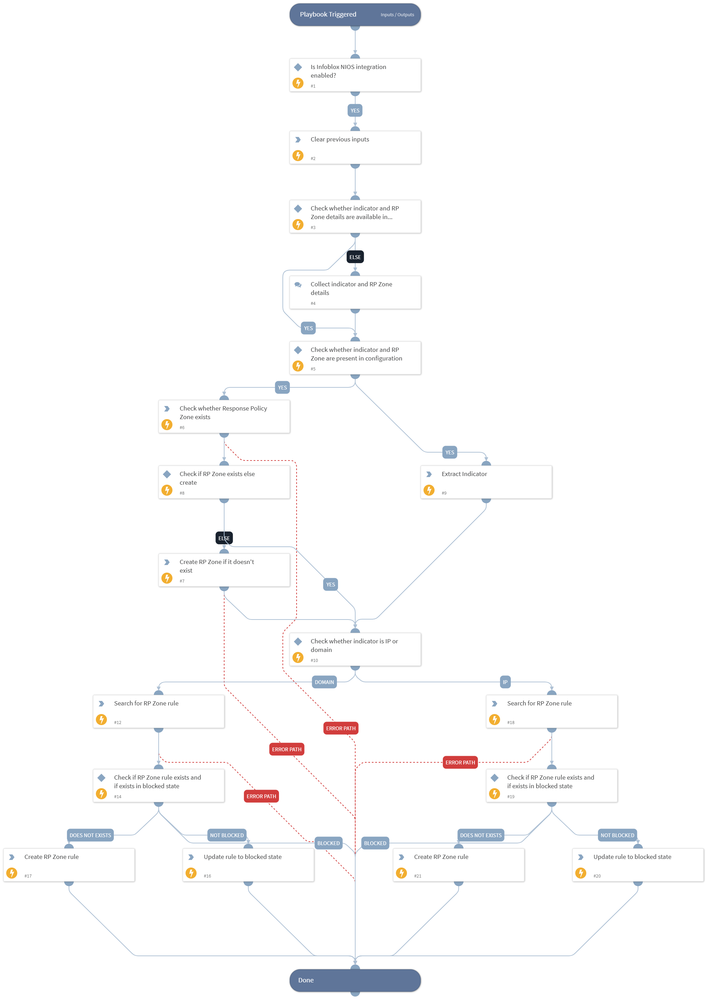

This playbook blocks the given Indicator by creating or updating RP Zone rule in Infoblox NIOS platform.

## Dependencies

This playbook uses the following sub-playbooks, integrations, and scripts.

### Sub-playbooks

This playbook does not use any sub-playbooks.

### Integrations

This playbook does not use any integrations.

### Scripts

* DeleteContext

### Commands

* extractIndicators
* infoblox-create-response-policy-zone
* infoblox-create-rpz-rule
* infoblox-list-response-policy-zones
* infoblox-search-rule
* infoblox-update-rpz-rule

## Playbook Inputs

---

| **Name** | **Description** | **Default Value** | **Required** |
| --- | --- | --- | --- |
| indicator | The indicator to block. |  | Optional |
| target_rp_zone | The target Response Policy Zone. |  | Optional |

## Playbook Outputs

---
There are no outputs for this playbook.

## Playbook Image

---

