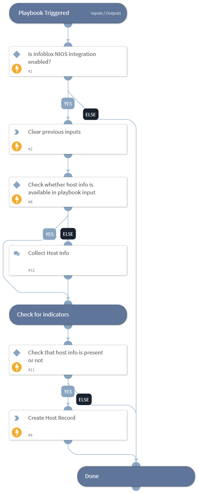

This playbook brings asset data back that creates a host record using Infoblox NIOS integration.

## Dependencies

This playbook uses the following sub-playbooks, integrations, and scripts.

### Sub-playbooks

This playbook does not use any sub-playbooks.

### Integrations

This playbook does not use any integrations.

### Scripts

* DeleteContext

### Commands

* infoblox-create-host-record

## Playbook Inputs

---

| **Name** | **Description** | **Default Value** | **Required** |
| --- | --- | --- | --- |
| name | The name of the host record. |  | Optional |
| ipv4_addresses | The  IPv4 addresses to create host record with. Example: \[\{"ipv4addr": "192.168.1.0"\}\], \[\{"ipv4addr": "192.168.1.1", "configure_for_dhcp": true\}\]. |  | Optional |
| ipv6_addresses | The  IPv6 addresses to create host record with. Example: \[\{"ipv6addr": "2001:db8::1"\}\], \[\{"ipv6addr": "2001:db8::2", "configure_for_dhcp": true\}\]. |  | Optional |
| view | The DNS view in which the records are located. |  | Optional |
| comment | The comment for this host record. |  | Optional |
| configure_for_dns | Boolean value to decide whether to configure the host record for DNS. Default is True. |  | Optional |

## Playbook Outputs

---
There are no outputs for this playbook.

## Playbook Image

---

