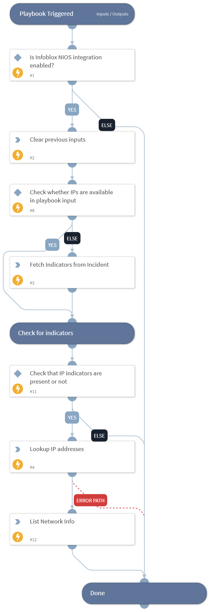

This playbook looks up IP addresses using Infoblox NIOS integration.

## Dependencies

This playbook uses the following sub-playbooks, integrations, and scripts.

### Sub-playbooks

This playbook does not use any sub-playbooks.

### Integrations

This playbook does not use any integrations.

### Scripts

* DeleteContext

### Commands

* findIndicators
* infoblox-get-ip
* infoblox-list-network-info

## Playbook Inputs

---

| **Name** | **Description** | **Default Value** | **Required** |
| --- | --- | --- | --- |
| ip_addresses | The optional comma-separated list of IP addresses to lookup. |  | Optional |

## Playbook Outputs

---
There are no outputs for this playbook.

## Playbook Image

---

