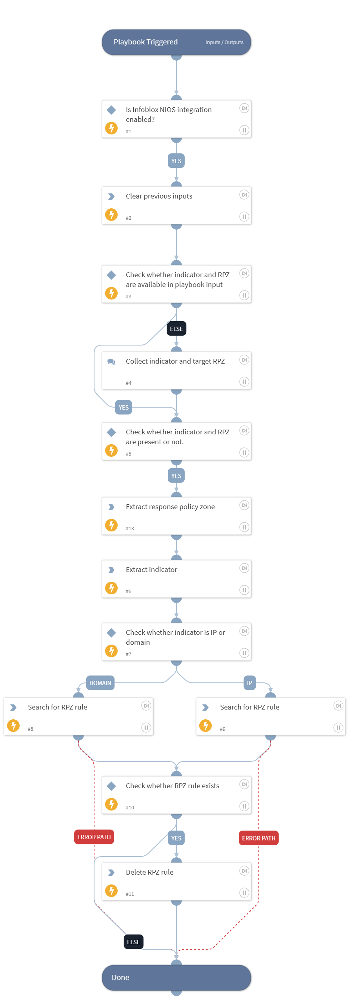

This playbook unblocks the given Indicator by deleting its RP Zone rule from Infoblox NIOS platform.

## Dependencies

This playbook uses the following sub-playbooks, integrations, and scripts.

### Sub-playbooks

This playbook does not use any sub-playbooks.

### Integrations

This playbook does not use any integrations.

### Scripts

* DeleteContext
* Set

### Commands

* extractIndicators
* infoblox-delete-rpz-rule
* infoblox-search-rule

## Playbook Inputs

---

| **Name** | **Description** | **Default Value** | **Required** |
| --- | --- | --- | --- |
| indicator | The indicator to unblock. |  | Optional |
| target_rp_zone | The target Response Policy Zone. |  | Optional |

## Playbook Outputs

---
There are no outputs for this playbook.

## Playbook Image

---

