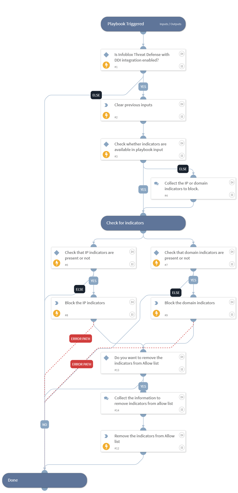

This playbook blocks the given IP or domain by adding it to the given block type custom list of the Infoblox Cloud platform. If prompted it also removes the provided indicators from given allow list.

## Dependencies

This playbook uses the following sub-playbooks, integrations, and scripts.

### Sub-playbooks

This playbook does not use any sub-playbooks.

### Integrations

* InfobloxBloxOneThreatDefense

### Scripts

* DeleteContext

### Commands

* infobloxcloud-block-domain
* infobloxcloud-block-ip
* infobloxcloud-customlist-indicator-remove

## Playbook Inputs

---

| **Name** | **Description** | **Default Value** | **Required** |
| --- | --- | --- | --- |
| ip_addresses | The IP addresses to block. |  | Optional |
| domains | The domains to block. |  | Optional |
| custom_list_name | Specify the name of the custom list to add the given IP addresses or domains to.  Default is "Default Block".  | Default Block | Optional |
| custom_list_type | Specify the type of the custom list to add the given IP addresses or domains to. Possible values are: default_block, custom_list, threat_insight, dga, dnsm, zero_day_dns, threat_insight_nde. Default is "default_block". | default_block | Optional |

## Playbook Outputs

---
There are no outputs for this playbook.

## Playbook Image

---

