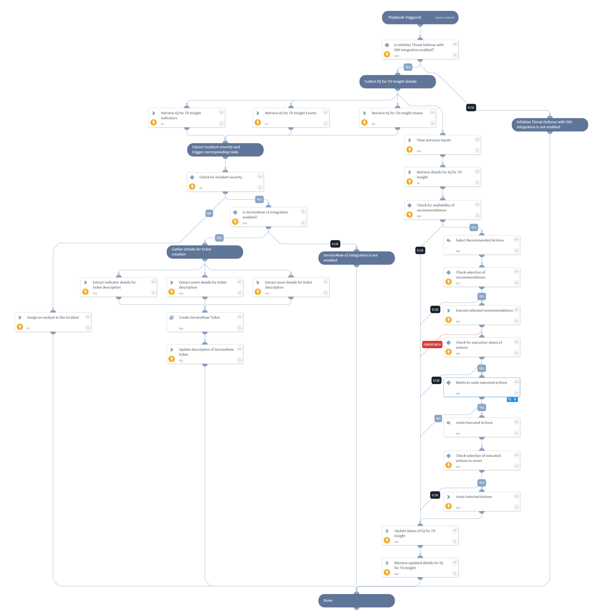

Collects the insight's full detail (including AI-generated recommendations), indicators, assets, and events. Executes the insight's pending recommendation actions along with undo option. If incident severity is Low, notifies the SOC and assigns an analyst; if severity is Medium, High, or Critical, creates a ServiceNow ticket. Updates the insight's workflow status on Infoblox at the end of the run.

## Dependencies

This playbook uses the following sub-playbooks, integrations, and scripts.

### Sub-playbooks

* Create ServiceNow Ticket

### Integrations

This playbook does not use any integrations.

### Scripts

* AssignAnalystToIncident
* DeleteContext
* Exists
* SetAndHandleEmpty

### Commands

* infobloxcloud-iq-for-td-insight-action-execute
* infobloxcloud-iq-for-td-insight-action-undo
* infobloxcloud-iq-for-td-insight-asset-list
* infobloxcloud-iq-for-td-insight-event-list
* infobloxcloud-iq-for-td-insight-get
* infobloxcloud-iq-for-td-insight-indicator-list
* infobloxcloud-iq-for-td-insight-status-update
* servicenow-update-ticket

## Playbook Inputs

---

| **Name** | **Description** | **Default Value** | **Required** |
| --- | --- | --- | --- |
| insight_id | Collect IQ for TD Insight ID from incident. | incident.infobloxcloudinsightid | Optional |
| incident_severity | Collect incident severity from incident. | incident.severity | Optional |
| limit | No of indicators, events or assets to fetch for the provided IQ for TD Insight. | 50 | Optional |
| onCall | Set to true \(case-insensitive\) to assign only the user that is currently on shift. Default is False. | false | Optional |
| insight_status | Workflow status to set on the insight at the end of the run. | Needs Review | Optional |

## Playbook Outputs

---
There are no outputs for this playbook.

## Playbook Image

---

