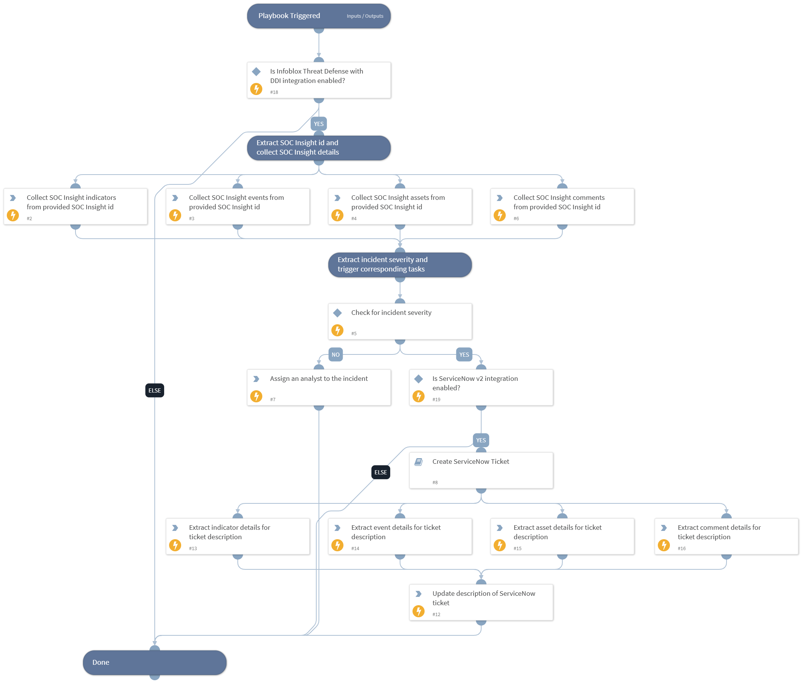

This playbook is used to initiate the incident response. This playbook runs when an incident is selected for investigation. It will change the state from pending to active and it will list the available indicators, events, assets, and comments from Infoblox corresponding to the incident. If incident severity is found to be higher than or equivalent to medium, it will create a ServiceNow incident otherwise the given incident will be assigned to an analyst.

## Dependencies

This playbook uses the following sub-playbooks, integrations, and scripts.

### Sub-playbooks

* Create ServiceNow Ticket

### Integrations

This playbook does not use any integrations.

### Scripts

* AssignAnalystToIncident
* SetAndHandleEmpty

### Commands

* infobloxcloud-insight-assets-list
* infobloxcloud-insight-comments-list
* infobloxcloud-insight-events-list
* infobloxcloud-insight-indicators-list
* servicenow-update-ticket

## Playbook Inputs

---

| **Name** | **Description** | **Default Value** | **Required** |
| --- | --- | --- | --- |
| insight_id | Collect incident severity from incident. | incident.infobloxcloudinsightid | Optional |
| incident_severity | Collect incident severity from incident. | incident.severity | Optional |
| limit | No of indicators, events, assets or comments to fetch of the provided insight. | 50 | Optional |
| onCall | Set to true to assign only the user that is currently on shift. Default is False. | false | Optional |

## Playbook Outputs

---
There are no outputs for this playbook.

## Playbook Image

---

