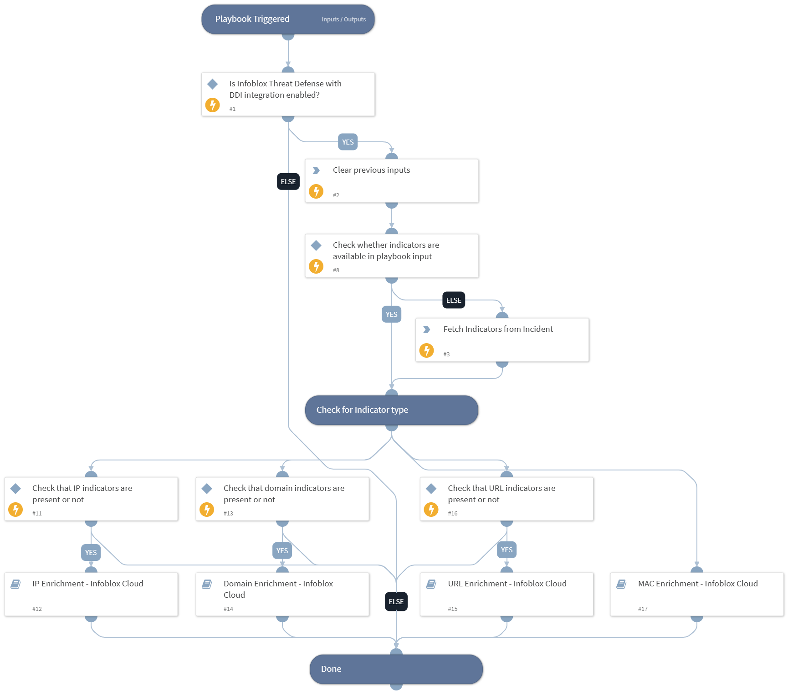

This playbook enriches IP addresses, MAC addresses, domains and URLs with the dossier, DHCP lease, TIDE and asset data using Infoblox Threat Defense with DDI integration.

## Dependencies

This playbook uses the following sub-playbooks, integrations, and scripts.

### Sub-playbooks

* Domain Enrichment - Infoblox Cloud
* IP Enrichment - Infoblox Cloud
* MAC Enrichment - Infoblox Cloud
* URL Enrichment - Infoblox Cloud

### Integrations

This playbook does not use any integrations.

### Scripts

* DeleteContext

### Commands

* findIndicators

## Playbook Inputs

---

| **Name** | **Description** | **Default Value** | **Required** |
| --- | --- | --- | --- |
| ip_addresses | The optional comma-separated list of IP addresses to enrich. |  | Optional |
| domains | The optional comma-separated list of domains or hosts to enrich. |  | Optional |
| urls | The optional comma-separated list of URLs to enrich. |  | Optional |
| mac_addresses | The optional comma-separated list of MAC addresses to enrich. |  | Optional |

## Playbook Outputs

---
There are no outputs for this playbook.

## Playbook Image

---

