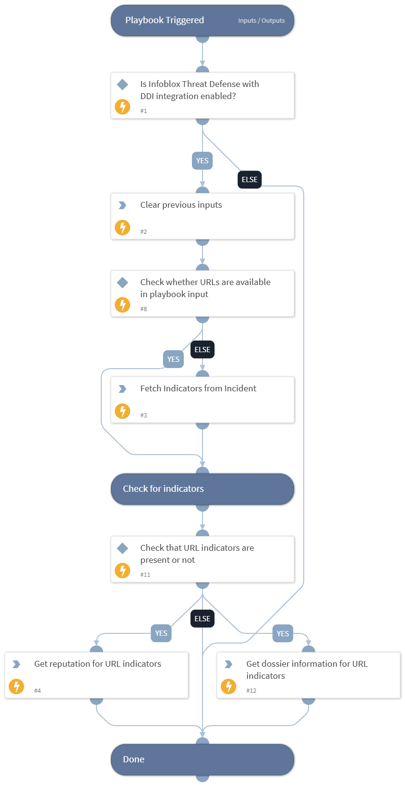

This playbook enriches URL with the dossier and TIDE data using Infoblox Threat Defense with DDI integration.

## Dependencies

This playbook uses the following sub-playbooks, integrations, and scripts.

### Sub-playbooks

This playbook does not use any sub-playbooks.

### Integrations

* InfobloxBloxOneThreatDefense

### Scripts

* DeleteContext

### Commands

* bloxone-td-dossier-lookup-get
* findIndicators
* url

## Playbook Inputs

---

| **Name** | **Description** | **Default Value** | **Required** |
| --- | --- | --- | --- |
| urls | The optional comma-separated list of URLs to enrich. |  | Optional |

## Playbook Outputs

---
There are no outputs for this playbook.

## Playbook Image

---

