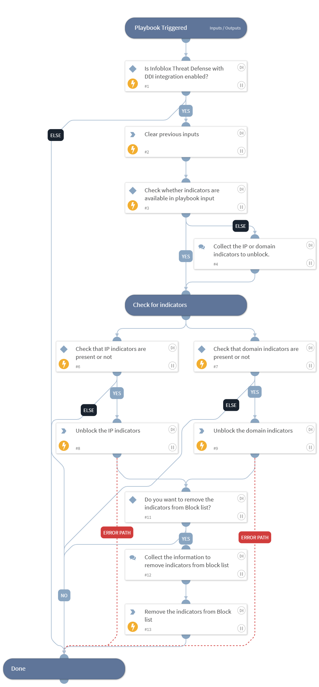

This playbook unblocks the given IP or domain by adding it to the given allow type custom list of the Infoblox Cloud platform.

## Dependencies

This playbook uses the following sub-playbooks, integrations, and scripts.

### Sub-playbooks

This playbook does not use any sub-playbooks.

### Integrations

* InfobloxBloxOneThreatDefense

### Scripts

* DeleteContext

### Commands

* infobloxcloud-customlist-indicator-remove
* infobloxcloud-unblock-domain
* infobloxcloud-unblock-ip

## Playbook Inputs

---

| **Name** | **Description** | **Default Value** | **Required** |
| --- | --- | --- | --- |
| ip_addresses | The IP addresses to unblock. |  | Optional |
| domains | The domains to unblock. |  | Optional |
| custom_list_name | Specify the name of the custom list to add the given IP addresses or domains to. Default is "Default Allow". | Default Allow | Optional |
| custom_list_type | Specify the type of the custom list to add the given IP addresses or domains to. Possible values are: default_allow, custom_list, threat_insight, threat_insight_nde. Default is "default_allow". | default_allow | Optional |

## Playbook Outputs

---
There are no outputs for this playbook.

## Playbook Image

---

