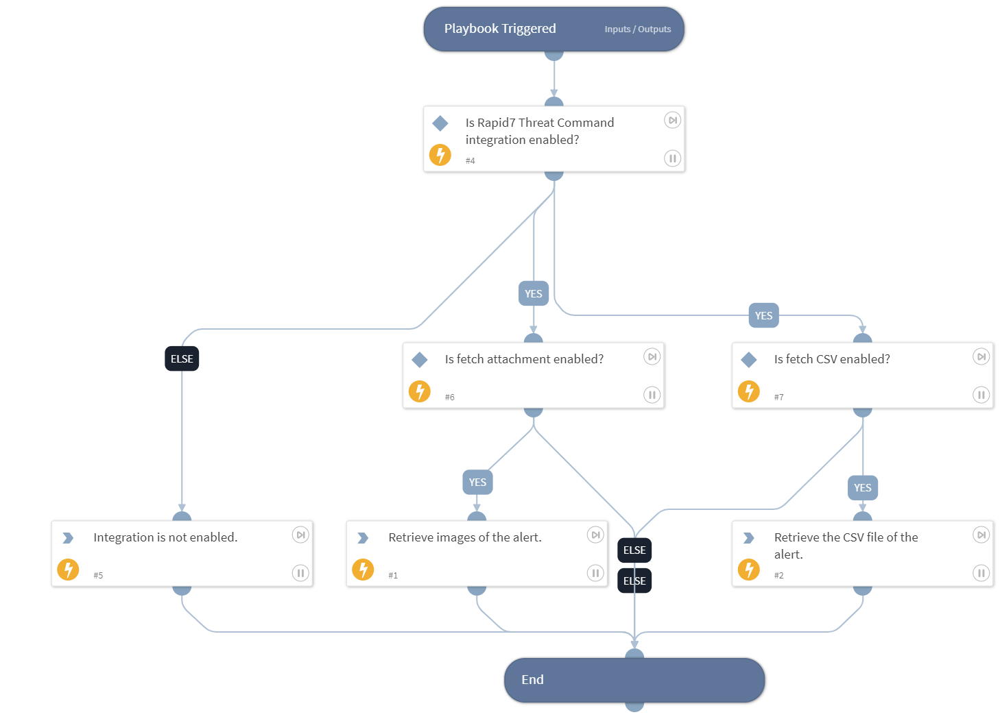

This playbook is used by default for the Rapid7 ThreatCommand alerts being ingested as XSOAR incidents. This playbook retrieves attachments (CSV file and images) using the Alert ID incident field.

## Dependencies

This playbook uses the following sub-playbooks, integrations, and scripts.

### Sub-playbooks

This playbook does not use any sub-playbooks.

### Integrations

This playbook does not use any integrations.

### Scripts

* AreValuesEqual
* Exists
* Print

### Commands

* threat-command-alert-image-list
* threat-command-alert-csv-get

## Playbook Inputs

---

| **Name** | **Description** | **Default Value** | **Required** |
| --- | --- | --- | --- |
| alert_id | Alert ID of the Rapid7 Threat Command incident. | ${incident.alertid} | Required |
| fetch_attachments | Boolean value indicating to include image files of alerts. If set to "true", then it fetches image files; otherwise, it does not. | ${incident.labels.fetch_attachments} | Optional |
| fetch_csv | Boolean value indicating to include CSV file of alerts. If set to "true", then it fetches CSV file; otherwise, it does not. | ${incident.labels.fetch_csv} | Optional |

## Playbook Outputs

---
There are no outputs for this playbook.

## Playbook Image

---

