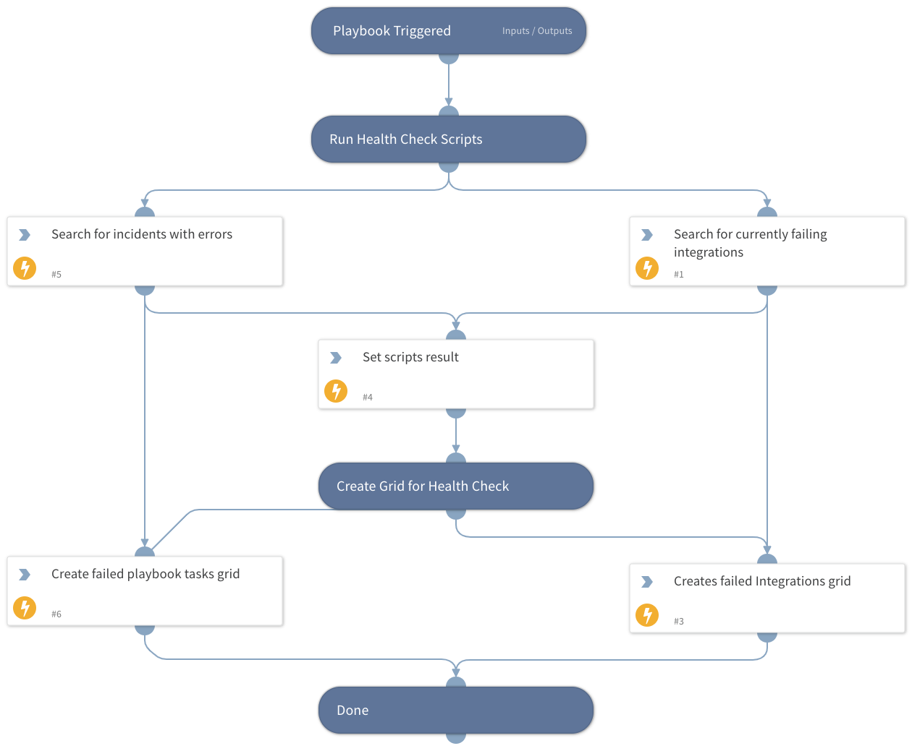

This playbook is triggered by a 'JOB - Integrations and Playbooks Health' playbook and is responsible for running failed integrations and failed incidents scripts. The playbook may run separately from the main playbook to run health tests on enabled integrations and open incidents.

## Dependencies
This playbook uses the following sub-playbooks, integrations, and scripts.

### Sub-playbooks
This playbook does not use any sub-playbooks.

### Integrations
This playbook does not use any integrations.

### Scripts
* FailedInstances
* SetGridField
* GetFailedTasks

### Commands
* setIncident

## Playbook Inputs
---
There are no inputs for this playbook.

## Playbook Outputs
---
There are no outputs for this playbook.

## Playbook Image
---
