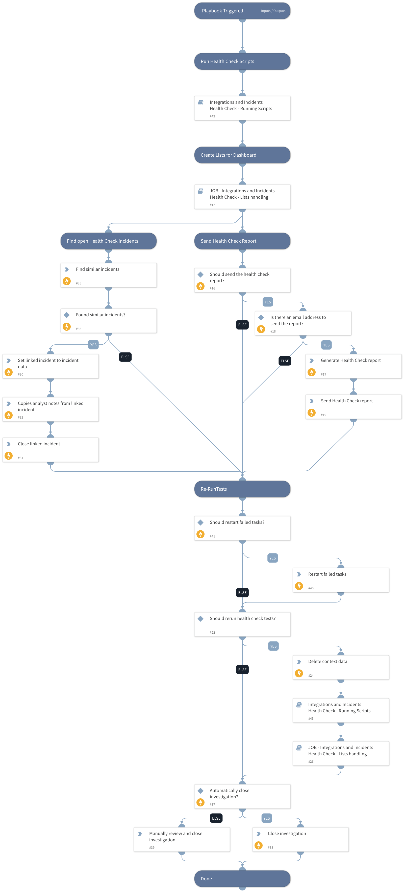

You should run this playbook as a scheduled job.  The playbook checks the health of all enabled integrations and open incidents.

## Dependencies
This playbook uses the following sub-playbooks, integrations, and scripts.

### Sub-playbooks
* JOB - Integrations and Incidents Health Check - Lists handling
* Integrations and Incidents Health Check - Running Scripts

### Integrations
This playbook does not use any integrations.

### Scripts
* RestartFailedTasks
* CopyLinkedAnalystNotes
* DeleteContext
* FindSimilarIncidents

### Commands
* setIncident
* generateGeneralReport
* closeInvestigation
* send-mail

## Playbook Inputs
---

| **Name** | **Description** | **Default Value** | **Required** |
| --- | --- | --- | --- |
| SendHealthCheckReport | This input determines if the health check report should be sent automatically after running the playbook. True - Yes. |  | Optional |
| EmailReportTo | In case the 'SendHealthCheckReport' input equals to 'True', the email address the report will be sent to. |  | Optional |
| AutoCloseInvestigation | This input determines if the investigation should close automatically after the re-run of the scripts. | False | Optional |
| playbookExclusion | Comma separated list of playbook names to exclude from restarting their failed tasks. |  | Optional |
| AutoRestartFailedTasks | Whether to automatically run the RestartFailedTasks automation. | False | Optional |

## Playbook Outputs
---
There are no outputs for this playbook.

## Playbook Image
---
