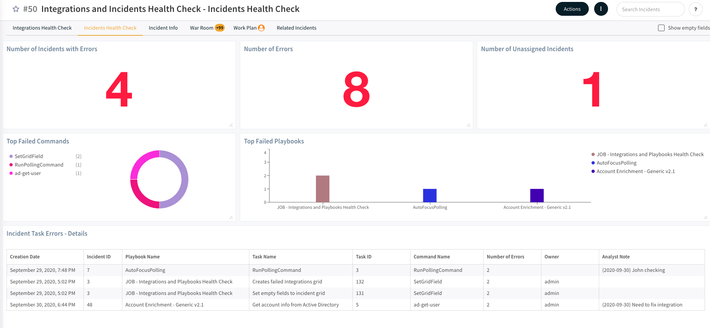
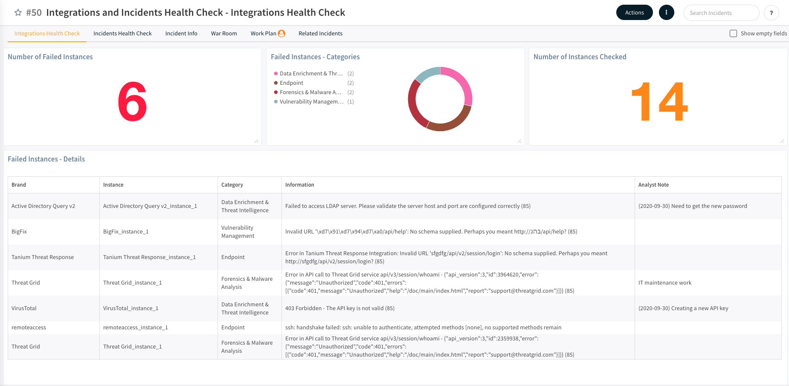

This Integrations and Incidents Health Check content pack enables system users to review all of the failed integrations, incidents, and playbooks. 

As part of this pack, you will get out-of-the-box, full layouts, dashboards, an incident type, and incident fields. All of these are easily customizable to suit the needs of your organization. You can configure the job on an hourly/daily/weekly basis to perform the health check. The job will run the checkup playbook that tests all enabled integrations and searches for open incidents with errors to get their status and retrieve the error information. Additionally, this job will update the dashboards for visibility.

##### What does this pack do?
The content included in this pack allows you to view all your failed integrations and open incidents in a single incident:
- Run tests on all enabled integrations, error messages, and track notes.
- Search for errors in open incidents. Detail the playbooks and commands that fail and track notes.
- Optionally re-run the playbook.
- Send report

_For more information about the pack, visit our [Cortex XSOAR Developer Docs](https://xsoar.pan.dev/docs/reference/packs/integrations-and-incident-health-check)

