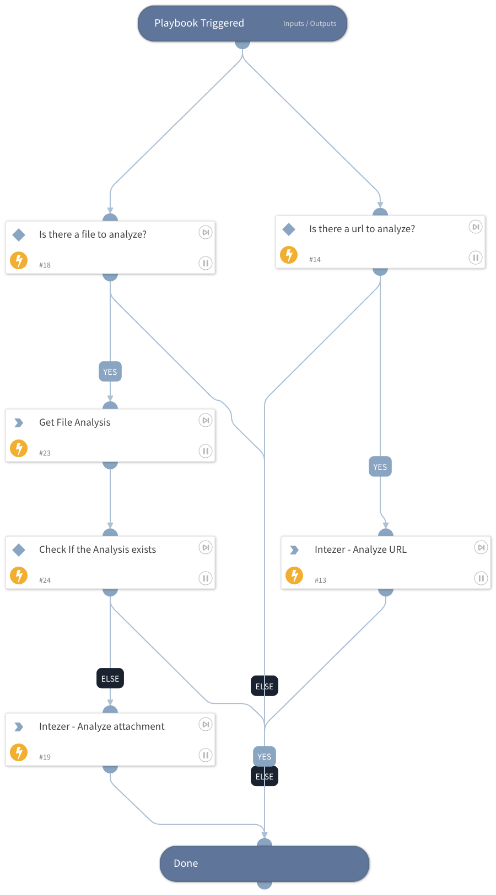

Analyze Files and URLs on Intezer Analyze.

## Dependencies
This playbook uses the following sub-playbooks, integrations, and scripts.

### Sub-playbooks
* GenericPolling
* Calculate Severity - Generic v2

### Integrations
* Intezer v2

### Scripts
This playbook does not use any scripts.

### Commands
* intezer-analyze-by-file
* intezer-analyze-url
* intezer-get-latest-report

## Playbook Inputs
---

| **Name**     | **Description**                                                  | **Default Value** | **Source** | **Required** |
|--------------|------------------------------------------------------------------|-------------------|------------|--------------|
| File         | A file object that represents an email attachment.               |                   | Context    | Optional     |
| URL          | The URL object.                                                  |                   | Context    | Optional     |
| Interval     | How often the polling command should run (in minutes).           | 1                 | -          | Required     |
| Timeout      | The amount of time to wait before a timeout occurs (in minutes). | 15                | -          | Required     |

## Playbook Outputs
---

| **Path**              | **Description**                                                                                                                                                               | **Type** |
|-----------------------|-------------------------------------------------------------------------------------------------------------------------------------------------------------------------------|----------|
| File.Malicious.Vendor | For malicious files, the vendor that made the decision                                                                                                                        | string   |
| File.Metadata         | Metadata returned from Intezer analysis \(analysis id, analysis url, family, family type, sha256, verdict, sub_verdict\). Metadata will be returned only for supported files. | unknown  |
| File.ExistsInIntezer  | Does the file exists on intezer genome database                                                                                                                               | boolean  |
| URL.Malicious.Vendor  | For malicious Url, the vendor that made the decision                                                                                                                          | string   | 
| URL.Metadata          | Metadata returned from Intezer analysis                                                                                                                                       | unknown  | 
| URL.ExistsInIntezer   | Does the url exists on intezer                                                                                                                                                | boolean  |
| DBotScore             | The DBotScore object.                                                                                                                                                         | unknown  |
| DBotScore.Indicator   | The indicator that was tested.                                                                                                                                                | string   |
| DBotScore.Type        | The indicator type.                                                                                                                                                           | string   |
| DBotScore.Vendor      | The vendor used to calculate the score.                                                                                                                                       | string   |
| DBotScore.Score       | The actual score.                                                                                                                                                             | number   |

## Playbook Image
---

