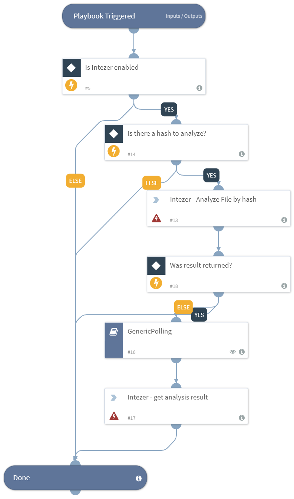

Analyzes the given file hash on Intezer Analyze and enriches the file reputation. Supports SHA256, SHA1, and MD5 hashes.

## Dependencies
This playbook uses the following sub-playbooks, integrations, and scripts.

### Sub-playbooks
* GenericPolling

### Integrations
* Intezer v2

### Scripts
This playbook does not use any scripts.

### Commands
* intezer-get-analysis-result
* intezer-analyze-by-hash

## Playbook Inputs
---

| **Name** | **Description**                                                  | **Default Value** | **Source** | **Required** |
|----------|------------------------------------------------------------------|-------------------|------------|--------------|
| Interval | How often the polling command should run (in minutes).           | 1                 | -          | Required     |
| Timeout  | The amount of time to wait before a timeout occurs (in minutes). | 10                | -          | Required     |
| hash     | The file hash of the file.                                       | SHA256            | File       | Optional     |

## Playbook Outputs
---

| **Path**              | **Description**                                              | **Type** |
|-----------------------|--------------------------------------------------------------|----------|
| File.SHA256           | The SHA256 hash of the file.                                 | string   |
| File.Malicious        | The description of the malicious file.                       | unknown  |
| File.Type             | The file type. For example, "PE".                            | string   |
| File.Size             | The file size.                                               | number   |
| File.MD5              | The MD5 hash of the file.                                    | string   |
| File.Name             | The file name.                                               | string   |
| File.SHA1             | The SHA1 hash of the file.                                   | string   |
| File                  | The file object.                                             | unknown  |
| File.Malicious.Vendor | The vendor that made the decision tha the file is malicious. | string   |
| DBotScore             | The DBotScore object.                                        | unknown  |
| DBotScore.Indicator   | The indicator that was tested.                               | string   |
| DBotScore.Type        | The indicator type.                                          | string   |
| DBotScore.Vendor      | Vendor used to calculate the score.                          | string   |
| DBotScore.Score       | The actual score.                                            | number   |

## Playbook Image
---

