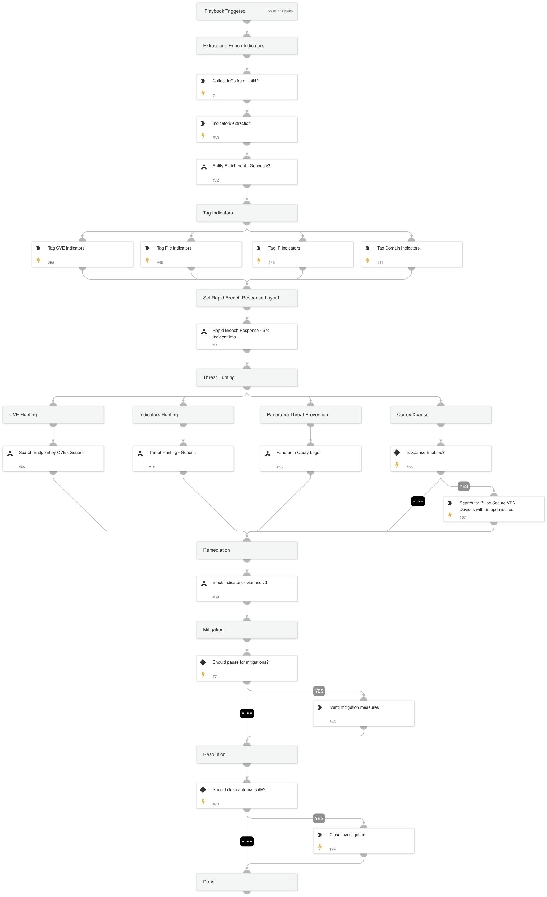

Ivanti has recently disclosed four critical vulnerabilities in their VPN devices, identified as CVE-2023-46805, CVE-2024-21887, CVE-2024-21888, and CVE-2024-21893, with active exploitation reported. These security flaws impact all supported versions of Ivanti Connect Secure and Ivanti Policy Secure gateways, including versions 9.x and 22.x, and Ivanti Neurons for ZTA.

#### Disclosed Vulnerabilities

* CVE-2023-46805, a high-severity vulnerability, allows attackers to bypass authentication checks in the web component, granting access to restricted resources without credentials.

* CVE-2024-21887, of critical severity, enables command injection through specially crafted requests by authenticated administrators, leading to arbitrary command execution.

* CVE-2024-21888, another critical vulnerability, permits privilege escalation within the web component, enabling users to gain administrative rights.

* CVE-2024-21893 exposes a server-side request forgery (SSRF) vulnerability within the SAML component, allowing unauthorized access to specific restricted resources.

The combination of these vulnerabilities, particularly CVE-2023-46805 and CVE-2024-21887, facilitates attackers to execute commands on the compromised system sans authentication, posing a significant security risk. Organizations utilizing affected Ivanti products are urged to apply mitigations and patches to safeguard their systems against potential exploits.

**This playbook should be triggered manually or can be configured as a job.** 

**IoCs Collection**
- Unit42 IoCs download

**Hunting**
- PANW Hunting:
  - Panorama Threat IDs hunting
  - Cortex Xpanse issues hunting
- Indicators hunting
- Endpoints by CVE hunting

**Mitigations**

Ivanti recommended workaround and patch.

**References**

[Unit42 Threat Brief: Multiple Ivanti Vulnerabilities](https://unit42.paloaltonetworks.com/threat-brief-ivanti-cve-2023-46805-cve-2024-21887/#ivanti-2024-addit-resources)

[CVE-2023-46805 (Authentication Bypass) & CVE-2024-21887 (Command Injection) for Ivanti Connect Secure and Ivanti Policy Secure Gateways](https://forums.ivanti.com/s/article/CVE-2023-46805-Authentication-Bypass-CVE-2024-21887-Command-Injection-for-Ivanti-Connect-Secure-and-Ivanti-Policy-Secure-Gateways?language=en_US)

Note: This is a beta playbook, which lets you implement and test pre-release software. Since the playbook is beta, it might contain bugs. Updates to the pack during the beta phase might include non-backward compatible features. We appreciate your feedback on the quality and usability of the pack to help us identify issues, fix them, and continually improve.

## Dependencies

This playbook uses the following sub-playbooks, integrations, and scripts.

### Sub-playbooks

* Rapid Breach Response - Set Incident Info
* Entity Enrichment - Generic v3
* Search Endpoint by CVE - Generic
* Block Indicators - Generic v3
* Panorama Query Logs
* Threat Hunting - Generic

### Integrations

This playbook does not use any integrations.

### Scripts

* ParseHTMLIndicators

### Commands

* extractIndicators
* createNewIndicator
* closeInvestigation
* expanse-get-issues

## Playbook Inputs

---

| **Name** | **Description** | **Default Value** | **Required** |
| --- | --- | --- | --- |
| PlaybookDescription | The playbook description to be used in the Rapid Breach Response - Set Incident Info sub-playbook. | Ivanti has recently disclosed four critical vulnerabilities in their VPN devices, identified as CVE-2023-46805, CVE-2024-21887, CVE-2024-21888, and CVE-2024-21893, with active exploitation reported. These security flaws impact all supported versions of Ivanti Connect Secure and Ivanti Policy Secure gateways, including versions 9.x and 22.x, and Ivanti Neurons for ZTA.  #### Disclosed Vulnerabilities  * CVE-2023-46805, a high-severity vulnerability, allows attackers to bypass authentication checks in the web component, granting access to restricted resources without credentials.  * CVE-2024-21887, of critical severity, enables command injection through specially crafted requests by authenticated administrators, leading to arbitrary command execution.  * CVE-2024-21888, another critical vulnerability, permits privilege escalation within the web component, enabling users to gain administrative rights.  * CVE-2024-21893 exposes a server-side request forgery (SSRF) vulnerability within the SAML component, allowing unauthorized access to specific restricted resources.  The combination of these vulnerabilities, particularly CVE-2023-46805 and CVE-2024-21887, facilitates attackers to execute commands on the compromised system sans authentication, posing a significant security risk. Organizations utilizing affected Ivanti products are urged to apply mitigations and patches to safeguard their systems against potential exploits.  **This playbook should be triggered manually or can be configured as a job.**   **IoCs Collection** - Unit42 IoCs download  **Hunting** - PANW Hunting:   - Panorama Threat IDs hunting   - Cortex Xpanse issues hunting - Indicators hunting - Endpoints by CVE hunting  **Mitigations**  Ivanti recommended workaround and patch.  **References**  [Unit42 Threat Brief: Multiple Ivanti Vulnerabilities](https://unit42.paloaltonetworks.com/threat-brief-ivanti-cve-2023-46805-cve-2024-21887/#ivanti-2024-addit-resources)  [CVE-2023-46805 (Authentication Bypass) &amp; CVE-2024-21887 (Command Injection) for Ivanti Connect Secure and Ivanti Policy Secure Gateways](https://forums.ivanti.com/s/article/CVE-2023-46805-Authentication-Bypass-CVE-2024-21887-Command-Injection-for-Ivanti-Connect-Secure-and-Ivanti-Policy-Secure-Gateways?language=en_US)  Note: This is a beta playbook, which lets you implement and test pre-release software. Since the playbook is beta, it might contain bugs. Updates to the pack during the beta phase might include non-backward compatible features. We appreciate your feedback on the quality and usability of the pack to help us identify issues, fix them, and continually improve.  | Optional |
| autoBlockIndicators | Wether to block the indicators automatically. | False | Optional |
| QRadarTimeRange | QRadar hunting time range. | LAST 14 DAYS | Optional |
| SplunkEarliestTime | Splunk hunting earliest time. | -14d@d | Optional |
| ShouldPauseForMitigation | Whether to wait for the analyst's response for the mitigation phase or let the playbook continue with the automated flow. | False | Optional |
| ShouldCloseAutomatically | Whether to close the investigation automatically. | False | Optional |

## Playbook Outputs

---
There are no outputs for this playbook.

## Playbook Image

---

