Use the Atlassian Jira v2 integration to manage Jira issues and create Cortex XSOAR incidents from Jira projects.

This integration was integrated and tested with: Jira Cloud, Jira v8.19.1.
For more information about JQL syntax, go to https://www.atlassian.com/software/jira/guides/expand-jira/jql.

## Use Cases
---
1. Create, edit, delete, and query Jira issues.
2. Get or add to the comments of an issue.
3. Add a link or upload an attachment to an issue.

## Configure jira-v2 on Cortex XSOAR

1. Navigate to **Settings** > **Integrations** > **Servers & Services**.
2. Search for jira-v2.
3. **Authentiction**: As of June 2019, basic authentication using passwords for Jira Cloud is no longer supported. Use an API token or OAuth 1.0 instead. As of this writing, Jira Data Center (unlike Jira Cloud) still supports basic authentication.
4. Click **Add instance** to create and configure a new integration instance.
    *  ______________ Basic Authentication ________________
    
        To use basic authentication, follow [this tutorial](https://confluence.atlassian.com/cloud/api-tokens-938839638.html) to get the API token. Authorizing the use of basic authentication requires:
    
        * __Username__
        * __Password (Deprecated)__
        * __API token__
        
    * ____________________ OAuth 1.0 __________________
           
      To use OAuth1.0 follow [this tutorial](https://developer.atlassian.com/cloud/jira/platform/jira-rest-api-oauth-authentication/) to get the Access token. Authorizing the use of OAuth1.0 requires:

        * __ConsumerKey__
        * __AccessToken__
        * __PrivateKey__

    | **Parameter** | **Description** | **Required** |
    | --- | --- | --- |
    | Jira URL, for example: https://demisto.atlassian.net/ |  | True |
    | Username (API or Basic Authentication) |  | False |
    | Password (Deprecated - Use API token) |  | False |
    | API token |  | False |
    | Consumer key (OAuth 1.0) | Will be ignored if other required fields are not provided (for example both the Access Token and the Private Key). | False |
    | Access token | Used for both OAuth 1.0 and Personal Access Token authentication methods. | False |
    | Private key (PKCS8 format) |  | False |
    | Query (in JQL) for fetching incidents |  | False |
    | Issue index to start fetching incidents from |  | False |
    | Trust any certificate (not secure) |  | False |
    | Use system proxy settings |  | False |
    | Fetch incidents |  | False |
    | Mirror incoming incidents |  | False |
    | Incident type |  | False |
    | Use created field to fetch incidents |  | False |
    | Mirror outgoing incidents |  | False |
    | File entry tag | Choose the tag to add to an entry to mirror it as an attachment in Jira. | False |
    | Comment entry tag | Choose the tag to add to an entry to mirror it as a comment in Jira. | False |
    | Fetch comments | Fetch comments for Jira ticket. | False |
    | Fetch attachments | Fetch attachments for Jira ticket. | False |

5. Click **Test** to validate the URLs, token, and connection.

## Fetched Incidents Data
---
When you enable incidents fetching, Cortex XSOAR fetches the first batch of Jira issues from the 10 minutes prior to when the integration was added. After the first batch of fetched issues, Cortex XSOAR fetches new Jira issues as soon as they are generated in Jira. By default, 50 issues are fetched for each call. To fetch older Jira issues, use the query to fetch issues option.
If `Fetch comments` is enabled, The fetched incident will include the comments in the Jira issue.
If `Fetch attachments` is enabled, The fetched incident will include the attachments in the Jira issue.

## Commands
You can execute these commands from the Cortex XSOAR CLI, as part of an automation, or in a playbook.
After you successfully execute a command, a DBot message appears in the War Room with the command details.
### jira-issue-query
***
Queries Jira issues.


#### Base Command

`jira-issue-query`
#### Input

| **Argument Name** | **Description**                                                                                                                                                                                                                                                                     | **Required** |
|-------------------|-------------------------------------------------------------------------------------------------------------------------------------------------------------------------------------------------------------------------------------------------------------------------------------| --- |
| query             | The JQL query string.                                                                                                                                                                                                                                                               | Required | 
| startAt           | The index (integer) of the first issue to return (0-based).                                                                                                                                                                                                                         | Optional | 
| maxResults        | The maximum number of users to fetch when searching for a matching user (default is 50). The maximum allowed value is dictated by the Jira property 'jira.search.views.default.max'. If you specify a value that is higher than this number, your search results will be truncated. | Optional | 
| headers           | Display the headers in human readable format.                                                                                                                                                                                                                                       | Optional | 
| extraFields       | Specify the result fields.                                                                                                                                                                                                                                                          | Optional | 


#### Context Output

| **Path** | **Type** | **Description** |
| --- | --- | --- |
| Ticket.Id | Unknown | The ID of the ticket. | 
| Ticket.Key | Unknown | The key of the ticket. | 
| Ticket.Assignee | Unknown | The user assigned to the ticket. | 
| Ticket.Creator | Unknown | The user who created the ticket. | 
| Ticket.Summary | Unknown | The summary of the ticket. | 
| Ticket.Status | Unknown | The status of the ticket. | 
| Ticket.Priority | String | The priority of the ticket. | 
| Ticket.Description | String | The description of the ticket. | 
| Ticket.Labels | String | The labels of the ticket. | 
| Ticket.ProjectName | String | The ticket project name. | 
| Ticket.DueDate | Date | The due date. | 
| Ticket.Created | Date | The time the ticket was created. | 
| Ticket.LastSeen | Date | The last time the ticket was viewed. | 
| Ticket.LastUpdate | Date | The last time the ticket was updated. | 

#### Command Example
```!jira-issue-query query="status=done"```

##### Context Example
```
{
    "Ticket": [
        {
            "Status": "Done", 
            "Creator": "{creator}", 
            "Summary": "HelloBlocked11", 
            "Assignee": "null(null)", 
            "Key": "TES-25", 
            "Id": "12658"
        }, 
        {
            "Status": "Done", 
            "Creator": "{creator}", 
            "Summary": "Test2", 
            "Assignee": "null(null)", 
            "Key": "SOC-40", 
            "Id": "10986"
        }
    ]
}
```

#### Human Readable Output
**jira-issue-query**
|assignee|created|creator|description|duedate|id|issueType|key|labels|priority|project|reporter|status|summary|ticket_link|
|---|---|---|---|---|---|---|---|---|---|---|---|---|---|---|
| null(null) | 2019-05-04T02:45:09.909+0300 | {creator} | TypeofIssueIdList |  | 12658 | A task that needs to be done. | TES-25 |  | Medium | test1 | {creator} | Done | HelloBlocked11 | https://demistodev.atlassian.net/rest/api/latest/issue/12658 |
| null(null) | 2019-01-27T15:59:03.134+0200 | {creator} |  |  | 10986 | jira.translation.issuetype.bug.name.desc | SOC-40 |  | Medium | SOC | {creator} | Done | Test2 | https://demistodev.atlassian.net/rest/api/latest/issue/10986 |

### jira-get-issue
***
Fetches an issue from Jira.

#### Base Command

`jira-get-issue`
#### Input

| **Argument Name** | **Description** | **Required** |
| --- | --- | --- |
| issueId | The ID of the issue. | Required | 
| headers | Display the headers in human readable format. | Optional | 
| getAttachments | If "true", retrieves the issue's attachments. Possible values are: true, false. Default is false. | Optional | 
| expandLinks | If "true", expands the issue's links. Possible values are: true, false. Default is false. | Optional | 


#### Context Output

| **Path** | **Type** | **Description** |
| --- | --- | --- |
| Ticket.Id | Unknown | The ID of the ticket. | 
| Ticket.Key | Unknown | The key of ticket. | 
| Ticket.Assignee | Unknown | The user assigned to the ticket. | 
| Ticket.Creator | Unknown | The user who created the ticket. | 
| Ticket.Summary | Unknown | The summary of the ticket. | 
| Ticket.Status | Unknown | The status of the ticket. | 
| File.Size | Unknown | The size of the file \(Jira attachments are saved as files in Cortex XSOAR\). | 
| File.SHA256 | Unknown | The SHA256 hash of the file \(Jira attachments are saved as files in Cortex XSOAR\). | 
| File.Name | Unknown | The name of the file \(Jira attachments are saved as files in Cortex XSOAR\). | 
| File.SHA1 | Unknown | The SHA1 hash of the file \(Jira attachments are saved as files in Cortex XSOAR\). | 
| Ticket.Priority | String | The priority of the ticket. | 
| Ticket.ProjectName | String | The ticket project name. | 
| Ticket.DueDate | Date | The due date. | 
| Ticket.Created | Date | The time the ticket was created. | 
| Ticket.LastSeen | Date | The last time the ticket was viewed. | 
| Ticket.LastUpdate | Date | The last time the ticket was updated. | 

##### Command Example
```!jira-get-issue issueId=15572 getAttachments=true```

##### Context Example
```
{
    "Ticket": [
        {
            "Status": "To Do", 
            "Creator": "{creator}", 
            "Summary": "Test issue23", 
            "Assignee": "{assignee}", 
            "attachment": "", 
            "Key": "DEM-5415", 
            "Id": "15572"
        }
    ]
}
```

#### Human Readable Output
**jira-get-issue**
|assignee|attachment|created|creator|description|duedate|id|issueType|key|labels|priority|project|reporter|status|summary|ticket_link|
|---|---|---|---|---|---|---|---|---|---|---|---|---|---|---|---|
| null(null) |  | 2020-01-19T12:34:13.784+0200 | {creator} | lala |  | 15572 | Request for Action | DEM-5415 |  | Medium | demistodev | {assignee} | To Do | Test issue23 | https://demistodev.atlassian.net/rest/api/latest/issue/15572 |


### jira-create-issue
***
Creates a new issue in Jira.


#### Base Command

`jira-create-issue`
#### Input

| **Argument Name** | **Description** | **Required** |
| --- | --- | --- |
| issueJson | The issue object (in JSON format). | Optional | 
| summary | The summary of the issue. | Required | 
| projectKey | The project key with which to associate the issue. | Optional | 
| issueTypeName | Select an issue type by name, for example: "Problem". | Optional | 
| issueTypeId | Select an issue type by its numeric ID. | Optional | 
| projectName | The project name with which to associate the issue. | Optional | 
| description | A description of the issue. | Optional | 
| labels | A CSV list of labels. | Optional | 
| priority | The priority of the issue, for example: High, Medium. | Optional | 
| dueDate | The due date for the issue (in the format: 2018-03-11). | Optional | 
| assignee | The name of the assignee. Relevant for Jira Server only. If you are using Jira Cloud, please provide the assignee_id argument instead. | Optional | 
| assignee_id | The account ID of the assignee. Use the jira-get-id-by-attribute command to get the user's account ID. | Optional | 
| reporter | The name of the reporter. | Optional | 
| reporter_id | The account ID of the reporter. Use the jira-get-id-by-attribute command to get the user's account ID. | Optional | 
| parentIssueKey | The parent issue key (if you're creating a sub-task). | Optional | 
| parentIssueId | The parent issue ID (if you're creating a sub-task). | Optional | 
| environment | A text field for describing the environment in which the issue occurred (for example - environment="IE9 on Windows 7"). | Optional | 
| security | The security level name of the issue, (for example - security="Anyone"). | Optional | 
| components | The components names of the issue, (for example - components="component1,component2"). | Optional | 


#### Context Output

| **Path** | **Type** | **Description** |
| --- | --- | --- |
| Ticket.Id | Unknown | The ID of the ticket. | 
| Ticket.Key | Unknown | The key of the ticket. | 


##### Command Example
```!jira-create-issue summary="test SOC issue26" issueTypeId=10008 projectKey=DEM issueJson=`{"fields":{"issuetype":{"name":"Request for Action"}}}` ```

##### Context Example
```
{
    "Ticket": [
        {
            "Id": "15576", 
            "Key": "DEM-5419"
        }
    ]
}
```

#### Human Readable Output
**jira-create-issue**
|id|key|projectKey|self|
|---|---|---|---|
| 15576 | DEM-5419 | DEM | https://demistodev.atlassian.net/rest/api/latest/issue/15576 |


### jira-issue-upload-file
***
Uploads a file attachment to an issue.


#### Base Command

`jira-issue-upload-file`
#### Input

| **Argument Name** | **Description** | **Required** |
| --- | --- | --- |
| issueId | The ID of the issue. | Required | 
| upload | The entry ID to upload. | Optional | 
| attachmentName | The attachment name to be displayed in Jira (overrides original file name). | Optional | 


#### Context Output

There is no context output for this command.

##### Command Example
```!jira-issue-upload-file issueId=15572 upload=19@75```


##### Human Readable Output
**jira-issue-upload-file**
|attachment_link|attachment_name|id|issueId|
|---|---|---|---|
| https://demistodev.atlassian.net/rest/api/2/attachment/13456 | jira_v2_yml.yml | 13456 | 15572 |

### jira-issue-add-comment
***
Adds a new comment to an existing Jira issue.


#### Base Command

`jira-issue-add-comment`
#### Input

| **Argument Name** | **Description** | **Required** |
| --- | --- | --- |
| issueId | The ID of the issue. | Required | 
| comment | The comment body. | Required | 
| visibility | The roles that can view the comment, for example: Administrators. | Optional | 


#### Context Output

There is no context output for this command.

##### Command Example
```!jira-issue-add-comment issueId=15572 comment="test comment"```


##### Human Readable Output
**jira-issue-add-comment**
|comment|id|key|ticket_link|
|---|---|---|---|
| test comment | 13779 | admin | https://demistodev.atlassian.net/rest/api/2/issue/15572/comment/13779 |


### jira-issue-add-link
***
Creates (or updates) an issue link.


#### Base Command

`jira-issue-add-link`
#### Input

| **Argument Name** | **Description** | **Required** |
| --- | --- | --- |
| globalId | If a globalId is provided, and a remote issue link exists with that globalId, the remote issue link is updated. | Optional | 
| relationship | The object relationship to issue, for example: causes. | Optional | 
| url | The URL link. | Required | 
| title | The title of the link. | Required | 
| summary | The summary of the link. | Optional | 
| issueId | The ID of the issue. | Required | 
| applicationType | The application type of the linked remote application. E.g., "com.atlassian.confluence". | Optional | 
| applicationName | The application name of the linked remote application. E.g., "My Confluence Instance". | Optional | 


#### Context Output

There is no context output for this command.

##### Command Example
```!jira-issue-add-link issueId=15572 title=test url=https://www.demisto.com/```


##### Human Readable Output
**jira-issue-add-link**
|id|ticket_link|
|---|---|
| 13722 | https://demistodev.atlassian.net/rest/api/latest/issue/DEM-5415/remotelink/13722 |

### jira-edit-issue
***
Modifies an issue in Jira.


#### Base Command

`jira-edit-issue`
#### Input

| **Argument Name** | **Description** | **Required** |
| --- | --- | --- |
| issueId | The ID of the issue to edit. | Required | 
| issueJson | The issue object (in JSON format). E.g., {"fields":{"customfield_10037": "field_value"}}. | Optional | 
| summary | The summary of the issue. | Optional | 
| description | The description of the issue. | Optional | 
| labels | A CSV list of labels. | Optional | 
| priority | The issue priority, for example: High, Medium. | Optional | 
| dueDate | The due date for the issue (in the format 2018-03-11). | Optional | 
| assignee | The name of the assignee. Relevant for Jira Server only. If you are using Jira Cloud, please provide the assignee_id argument instead. | Optional | 
| assignee_id | The account ID of the assignee. Use the jira-get-id-by-attribute command to get the user's account ID. | Optional | 
| status | The issue status. | Optional | 
| transition | The issue transition. | Optional | 
| environment | A text field for describing the environment in which the issue occurred (for example - environment="IE9 on Windows 7"). | Optional | 
| security | The security level name of the issue, (for example - security="Anyone"). | Optional | 
| components | The components names of the issue, (for example - components="component1,component2"). | Optional | 


#### Context Output

| **Path** | **Type** | **Description** |
| --- | --- | --- |
| Ticket.Id | Unknown | The ID of the ticket. | 
| Ticket.Key | Unknown | The key of the ticket. | 
| Ticket.Assignee | Unknown | The user assigned to the ticket. | 
| Ticket.Creator | Unknown | The user who created the ticket. | 
| Ticket.Summary | Unknown | The summary of the ticket. | 
| Ticket.Status | Unknown | The status of the ticket. | 


#### Command Example
```!jira-edit-issue issueId=DEM-5415 issueJson=`{"fields":{"description":"testing3"}}` ```

#### Context Example
```json
{
    "Ticket": {
        "Assignee": "{assignee}",
        "Creator": "{creator}",
        "Id": "10044",
        "Key": "DEM-5415",
        "Status": "To Do",
        "Summary": "Phishing Incident Declared",
        "attachment": ""
    }
}
```

#### Human Readable Output

**jira-edit-issue**
|assignee|attachment|created|creator|description|duedate|id|issueType|key|labels|priority|project|reporter|status|summary|ticket_link|
|---|---|---|---|---|---|---|---|---|---|---|---|---|---|---|---|
| {assignee} |  | 2021-06-02T10:45:15.838-0400 | {creator} | testing3 |  | 10044 | A small, distinct piece of work. | DEM-5415 |  | Medium | SomethingGreat | {reporter} | To Do | Phishing Incident Declared | https://somejira.atlassian.net/rest/api/latest/issue/10044 |

Issue #DEM-5415 was updated successfully

### jira-get-comments
***
Returns the comments added to a ticket.


#### Base Command

`jira-get-comments`
#### Input

| **Argument Name** | **Description** | **Required** |
| --- | --- | --- |
| issueId | The ID of the issue from which to get the comments. | Required | 


#### Context Output

| **Path** | **Type** | **Description** |
| --- | --- | --- |
| Ticket.Comment.Comment | string | The text of the comment. | 
| Ticket.Comment.Created | string | The issue creation date. | 
| Ticket.Comment.User | string | The user that created the comment. | 


##### Command Example
```!jira-get-comments issueId=15572```

##### Context Example
```
{
    "Ticket": {
        "Comment": [
            {
                "Comment": "test comment", 
                "User": "admin", 
                "Created": "2020-01-19T12:35:49.194+0200"
            }
        ], 
        "Id": "15572"
    }
}
```
##### Human Readable Output
**Comments**
|Comment|Created|User|
|---|---|---|
| test comment | 2020-01-19T12:35:49.194+0200 | admin |


### jira-delete-issue
***
Deletes an issue in Jira.


#### Base Command

`jira-delete-issue`
#### Input

| **Argument Name** | **Description** | **Required** |
| --- | --- | --- |
| issueIdOrKey | The ID or key of the issue. | Required | 


#### Context Output

There is no context output for this command.

##### Command Example
```!jira-delete-issue issueIdOrKey=DEM-5415```

##### Human Readable Output
Issue deleted successfully.


### jira-get-id-offset
***
Returns the ID offset, for example, the first issue ID.


#### Base Command

`jira-get-id-offset`
#### Input

There are no input arguments for this command.

#### Context Output

| **Path** | **Type** | **Description** |
| --- | --- | --- |
| Ticket.idOffSet | string | The ID offset. | 


##### Command Example
```!jira-get-id-offset```

##### Context Example
```
{
    "Ticket.idOffSet": "10161"
}
```
##### Human Readable Output
ID Offset: 10161

### jira-get-id-by-attribute
*** 
Gets the Account ID for a given user's attribute.

#### Base Command

`jira-get-id-by-attribute`
#### Input

| **Argument Name** | **Description** | **Required** |
| --- | --- | --- |
| attribute | The user's attribute value. Can be Username or Email address. | Required | 
| max_results | The maximum number of users to pull when searching for a matching user (default is 50). The maximum allowed value is dictated by the JIRA property 'jira.search.views.default.max'. If you specify a value that is higher than this number, your search results will be truncated. | Optional |
| is_jirav2api | Whether the server is on prem and uses the REST v2 API. | Optional |


#### Context Output

| **Path** | **Type** | **Description** |
| --- | --- | --- |
| Jira.User.Attribute | String | The user's attribute. | 
| Jira.User.AccountID | String | The user's Account ID. | 


#### Command Example
```!jira-get-id-by-attribute attribute="XSOAR User"```

#### Context Example
```json
{
    "Jira": {
        "User": {
            "AccountID": "5e4ds952052b790c97509a7c",
            "Attribute": "XSOAR User"
        }
    }
}
```

#### Human Readable Output

Account ID for attribute: XSOAR User is: 5e4ds952052b790c97509a7c

### jira-list-transitions
***
Lists all possible transitions for a given ticket.


### jira-append-to-field
***
Modifies a specific field in an issue in Jira by appending to it instead of replacing its content. 
Field must be either of type string (appending by using ',') or arrayd.


#### Base Command

`jira-append-to-field`
#### Input

| **Argument Name** | **Description** | **Required** |
| --- | --- | --- |
| issueId | The ID of the issue to edit. | Required | 
| fieldJson | The field object (in JSON format). For example {"customfield_10037": "New value"}. | Required | 


#### Context Output

| **Path** | **Type** | **Description** |
| --- | --- | --- |
| Ticket.Id | Unknown | The ticket ID. | 
| Ticket.Key | Unknown | The ticket key. | 
| Ticket.Assignee | Unknown | The user assigned to the ticket. | 
| Ticket.Creator | Unknown | The user who created the ticket. | 
| Ticket.Summary | Unknown | The ticket summary. | 
| Ticket.Status | Unknown | The ticket status. | 

#### Command Example
```!jira-append-to-field issueId=CIAC-3597 fieldJson={\"customfield_16492\":\"example\"} ```

#### Context Example
```json
{
  "Ticket": {
    "Assignee": "User Name(user@example.com)",
    "Created": "2022-07-21T10:52:22.043+0000",
    "Creator": "User Name(user@example.com)",
    "DueDate": null,
    "Custom Field Display Name": "test,example",
    "Id": "1179420",
    "Key": "TEST-3597",
    "Labels": [
      "test",
    ],
    "LastSeen": null,
    "LastUpdate": "2022-07-27T04:47:24.214+0000",
    "Priority": "P5",
    "ProjectName": "Project Name",
    "Status": "Backlog",
    "Summary": "example",
    "attachment": ""
  }
}
```

### jira-get-specific-field
***
Gets specific fields from a Jira issue and adds it to context dynamically.

#### Base Command

`jira-get-specific-field`
#### Input

| **Argument Name** | **Description** | **Required** |
| --- | --- | --- |
| issueId | The ID of the issue to edit. | Required | 
| components | The fields to retrieve from the issue. For example field="customfield_164,labels". | Optional | 


#### Context Output

| **Path** | **Type** | **Description** |
| --- | --- | --- |
| Ticket.Id | Unknown | The ticket ID. | 
| Ticket.Key | Unknown | The ticket key. | 
| Ticket.Assignee | Unknown | The user assigned to the ticket. | 
| Ticket.Creator | Unknown | The user who created the ticket. | 
| Ticket.Summary | Unknown | The ticket summary. | 
| Ticket.Status | Unknown | The ticket status. | 

#### Command Example
```!jira-get-specific-field issueId="TEST-3597" field="labels,customfield_16492" ```

#### Context Example
```json
{
  "Ticket": {
    "Assignee": "User Name(user@example.com)",
    "Created": "2022-07-21T10:52:22.043+0000",
    "Creator": "User Name(user@example.com)",
    "DueDate": null,
    "Custom Field Display Name": "test",
    "Id": "1179420",
    "Key": "TEST-3597",
    "Labels": [
      "test"
    ],
    "LastSeen": null,
    "LastUpdate": "2022-07-27T04:47:24.214+0000",
    "Priority": "P5",
    "ProjectName": "Project Name",
    "Status": "Backlog",
    "Summary": "example",
    "attachment": ""
  }
}

```


#### Base Command

`jira-list-transitions`
#### Input

| **Argument Name** | **Description** | **Required** |
| --- | --- | --- |
| issueId | The ID of the issue. | Required | 


#### Context Output

| **Path** | **Type** | **Description** |
| --- | --- | --- |
| Ticket.Transitions.ticketId | Number | The ID of the issue. | 
| Ticket.Transitions.transitions | Unknown | A list of all possible transitions. | 


#### Command Example
```!jira-list-transitions issueId=18847 ```

#### Context Example
```json
{
    "Ticket": {
        "Transitions": {
            "ticketId": "18847",
            "transitions": ["Backlog", "Selected for Development", "In Progress", "Done", "To Do", "Build Broken"]
        }
    }
}
```
#### Human Readable Output
**List Transitions:**
|Transition Name|
|---|
| Backlog |
| Selected for Development |
| In Progress |
| Done |
| To Do |
| Build Broken |

### get-remote-data
***
Gets remote data from a remote incident. This method is only used for debugging purposes and will not update the current incident.


#### Base Command

`get-remote-data`
#### Input

| **Argument Name** | **Description** | **Required** |
| --- | --- | --- |
| id | The remote incident ID (issue ID). | Required | 
| lastUpdate | UTC timestamp in seconds. The incident is only updated if it was modified after the last update time. Default is 0. | Optional | 


#### Context Output

There is no context output for this command.


### get-mapping-fields
***
Returns the fields to map. This method is only used for debugging purposes.


#### Base Command

`get-mapping-fields`
#### Input

There are no input arguments for this command.

#### Context Output

There is no context output for this command.

### update-remote-system
***
Gets incident changes. This method is only used for debugging purposes and will not update the current incident.


#### Base Command

`update-remote-system`
#### Input

There are no input arguments for this command.

#### Context Output

There is no context output for this command.

### get-modified-remote-data
***
Available from Cortex XSOAR version 6.1.0. This command queries for incidents that were modified since the last update. This method is only used for debugging purposes.


#### Base Command

`get-modified-remote-data`
#### Input

There are no input arguments for this command.

#### Context Output

There is no context output for this command.

### jira-issue-assign

***
Edit the assignee of an existing issue.

#### Base Command

`jira-issue-assign`

#### Input

| **Argument Name** | **Description** | **Required** |
| --- | --- | --- |
| issueId | The ID of the issue to edit. | Required | 
| assignee | The name of the assignee. Relevant for Jira Server only, if you are using Jira Cloud, provide the assignee_id argument instead. | Optional | 
| assignee_id | The account ID of the assignee. Use the jira-get-id-by-attribute command to get the user's account ID. | Optional | 

#### Context Output

| **Path** | **Type** | **Description** |
| --- | --- | --- |
| Ticket.Id | String | The ticket ID. | 
| Ticket.Key | String | The ticket key. | 
| Ticket.Assignee | String | The user assigned to the ticket. | 
| Ticket.Creator | String | The user who created the ticket. | 
| Ticket.Summary | String | The ticket summary. | 
| Ticket.Status | String | The ticket status. | 

#### Command example
```!jira-issue-assign issueId=21492 assignee_id=1234```
#### Context Example
```json
{
    "Ticket": {
        "Assignee": "assignee1(null)",
        "Created": "2023-03-01T14:05:49.037+0200",
        "Creator": "assignee1(null)",
        "Description": null,
        "DueDate": null,
        "Id": "21492",
        "Key": "key",
        "Labels": [],
        "LastSeen": "2023-03-15T15:40:44.329+0200",
        "LastUpdate": "2023-05-03T16:15:32.771+0300",
        "Priority": "Medium",
        "ProjectName": "test",
        "Status": "To Do",
        "Summary": "something something",
        "attachment": "attachments"
    }
}
```

#### Human Readable Output

>### jira-issue-assign
>|assignee| attachment  |created|creator|description|duedate|id|issueType| key |labels|priority| project |reporter|status|summary| ticket_link                                           |
>|-------------|---|---|---|---|---|---|-----|---|---|---------|---|---|---|-------------------------------------------------------|---|
>| assignee1(null) | attachments | 2023-03-01T14:05:49.037+0200 | assignee1(null) |  |  | 21492 | Task (Tasks track small, distinct pieces of work.) | key |  | Medium | test    | assignee1(null) | To Do | something something | https:<span>//</span>test/rest/api/latest/issue/21492 |
>Issue #21492 was updated successfully

## Configure Incident Mirroring
**This feature is compliant with Cortex XSOAR version 6.0 and above.**
This part walks you through setting up the Jira integration to mirror incidents from Jira in Cortex XSOAR. 
The instructions below include steps for configuring the integration and the incoming and outgoing mappers. However, not every option available in the integration, nor all classification and mapping features are covered. 
For information about **Classification and Mapping** visit: [Classification and Mapping (Cortex XSOAR 6.13)](https://docs-cortex.paloaltonetworks.com/r/Cortex-XSOAR/6.13/Cortex-XSOAR-Administrator-Guide/Classification-and-Mapping) or [Classification and Mapping (Cortex XSOAR 8 Cloud)](https://docs-cortex.paloaltonetworks.com/r/Cortex-XSOAR/8/Cortex-XSOAR-Cloud-Documentation/Classification-and-mapping) or [Classification and Mapping (Cortex XSOAR 8.7 On-prem)](https://docs-cortex.paloaltonetworks.com/r/Cortex-XSOAR/8.7/Cortex-XSOAR-On-prem-Documentation/Classification-and-mapping).

When mirroring incidents, you can make changes in Jira, which will be reflected in Cortex XSOAR, or vice versa. 
You can also attach files from either of the systems, which will then be available in the other system. 

This is made possible by the addition of 3 new functions to the integration, which are applied with the following options:
- External schema support
- Can sync mirror in
- Can sync mirror out

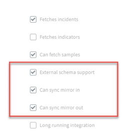

#### STEP 1 - Modify the incoming mapper.
1. Navigate to **Classification and Mapping** and click **classifier-mapper-incoming-JiraV2**.
2. Under the Incident Type dropdown, select **Jira Incident**.
3. Change the mapping according to your needs.
4. Save your changes.
    
##### 5 fields have been added to support the mirroring feature:
- **dbotMirrorDirection** - determines whether mirroring is incoming, outgoing, or both. Default is Both.
    - You can choose the mirror direction when configuring the Jira instance using the **Incident Mirroring Direction** field.

- **dbotMirrorId** - determines the incident ID in the 3rd party integration. In this case, the Jira ID field.
- **dbotMirrorInstance** - determines the Jira instance with which to mirror.
- **dbotMirrorLastSync** - determines the field by which to indicate the last time that the systems synchronized.
- **dbotMirrorTags** - determines the tags that you need to add in Cortex XSOAR for entries to be pushed to Jira.
    - You can set the tags in the instance configuration, using **File Entry Tag**, and **Comment Entry Tag**.

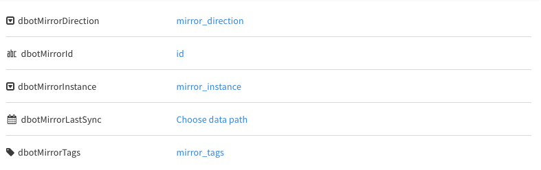

#### STEP 2 - Modify the outgoing mapper.
1. Under **Classification and Mapping**, click **classifier-mapper-outgoing-Jira**.
2. Under **Select Instance** dropdown, select the instance name you want to work with.
The left side of the screen shows the Jira fields to map and the right side of the
screen shows the Cortex XSOAR fields by which you are mapping.
  *Note: If **Select Instance** dropdown is empty, go to the integration's settings and under **Incident Type** select **Jira Incident** and try again.
3. Under **Schema Type**, select **Jira Incident**. The Schema Type represents the Jira entity that
you are mapping to. In our example it is an incident, but it can also be any other kind of ticket that
Jira supports.
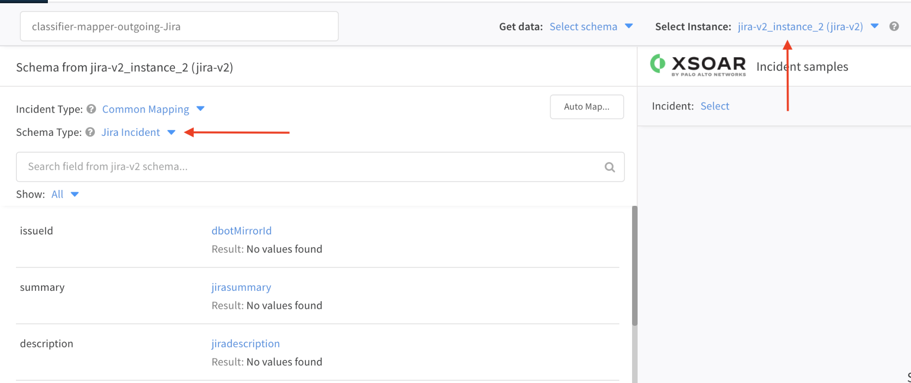
4. Under the **Incident Type** dropdown, select **Jira Incident**.
5. On the right side of the screen, under **Incident**, select the incident based on which you want to
match.
6. Change the mapping according to your needs.
7. Save your changes.

#### STEP 3 - Configure the following integration fields in order to customize the mirroring feature:
1. **Mirror outgoing incidents**: If enabled, any incident data changed in existing fetched incidents will be reflected in the remote Jira server.
2. **Mirror incoming incidents**: If enabled, any incident data changed in the remote Jira server will be reflected in existing fetched incidents.
3. **Fetch incident**s: Should be enabled in order to mirror in and out new incidents.
4. **Incident type**: In order to mirror out changes, provide an incident type that is associated with a layout containing the fields, which values you want to mirror. You can use 'Jira Incident', which already has a built-in layout. 
5. **File Entry Tag**: Choose a tag to add to an entry in order to mirror it as an attachment in Jira.
6. **Comment Entry Tag**: Choose a tag to add to an entry in order to mirror it as a comment in Jira.
7. **Fetch Comments**: Fetch comments for Jira ticket.
8. **Fetch Attachments**: Fetch attachments for Jira ticket.

#### STEP 4 - Create an incident in Jira. For the purpose of this use case, it can be a very simple incident.

#### STEP 5 - In Cortex XSOAR, the new ticket will be ingested in approximately one minute.
1. Add a note to the incident. In the example below, we have written a comment from Cortex XSOAR to Jira.
2. Click Actions -> Tags and add the **Comment Entry Tag** tag that you've selected before. If not already modified, the default is: "comment".
3. Add a file to the incident and mark it with the **File Entry Tag** tag that you've selected before. If not already modified, the default is: "attachment".  

5. Go back to **Incident Info** and locate a field you've configured in the outgoing mapper that is displayed in the incident's layout. Change its value and click 'V' in the 'V/X' menu to save the changes.
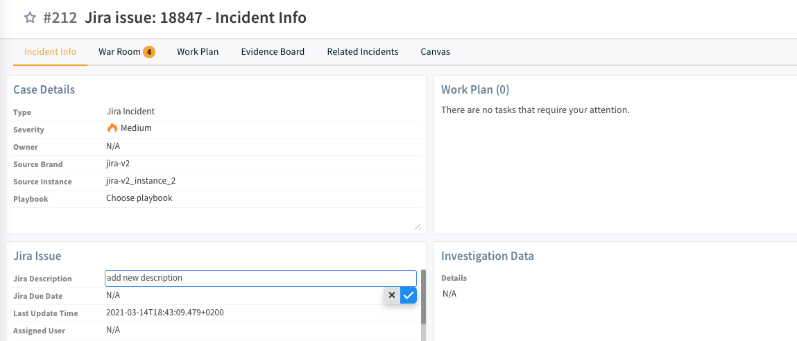
6. Navigate back to the incident in Jira and within approximately one minute, the changes will be reflected there as well.
7. Change a Jira field you've configured in the incoming mapper.
8. Go back to Cortex XSOAR and within approximately one minute, the changes will be reflected there as well.
* You can make additional changes like closing the incident or changing the description and those will be reflected in both systems.


**Notes**
- The final 'source of truth' of the incident for Cortex XSOAR are the values in Cortex XSOAR. 
  Meaning, if you change the severity in Cortex XSOAR and then change it back in Jira, the final value that will be presented is the one in Cortex XSOAR.
  You can see a list of these fields for each incident under "Context Data" -> "dbotDirtyFields".
- If you wish to mirror in and out Jira's custom fields, please see the 'Mirror In And Out Custom Fields' section below.
- If you wish to change the status of a Jira incident using transitions, please see the 'Change Ticket's Status Using Transitions' section below.


## Mirror In And Out Custom Fields:

### Add a new custom field and add it to the incident type&#39;s layout:

Add a new custom field and add it to the incident type&#39;s layout:

1.Create a new incident field:
  1. Go to settings -> advanced -> fields -> new field
  2. Under "Basic Settings":
    a.provide a name
    b.Choose field type. For example for a label, you might want to use "Tag" as a type.
  3. Click on "Attributes":  
  a.Uncheck the box under: "Add to incident types"  
  b.for “Add associated type...” Select the incident type you want to work with. In this example I’ll choose “Jira Incident”.
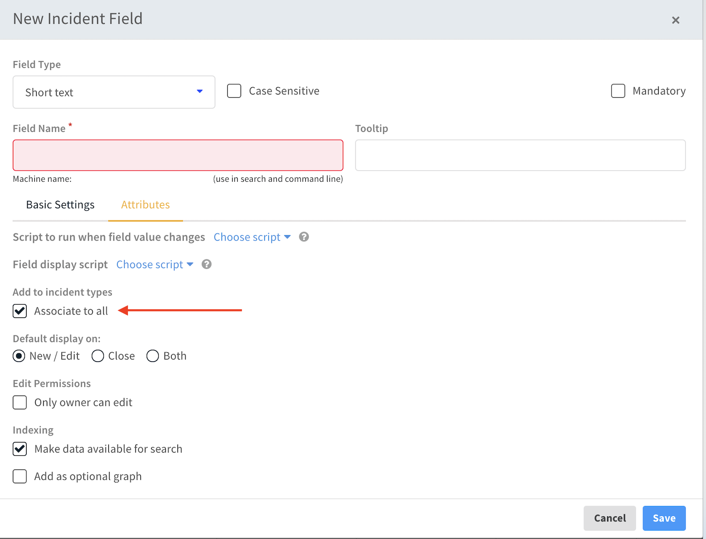

2.Add the new incident field you&#39;ve just created to the layout associated with the integration&#39;s incident type. In this example, the layout is "Jira Incident Layout":
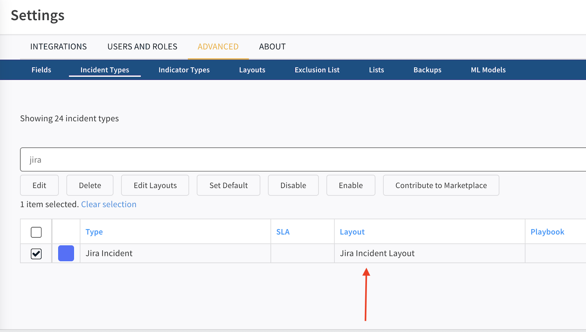

### Add the new field to the incoming mapper:

1. Go to Settings -> Integrations -> Servers & Services -> in the search bar type “Jira”.
2. Open the integration settings by clicking on the button: or by clicking on "Add instance" if you don&#39;t have Jira already configured in your system.  
1.If you don&#39;t have Jira configured yet, please provide all the needed information for authentication (Jira URL, Username if needed...) and click the "Test" button in order to see that the integration is well set.  
2.In addition: 
    * Make sure that under "Incident type" you&#39;ve selected the incident type you want to work with and it is the same one you&#39;ve selected once you created the new field. In our example: "Jira Incident".
    * The option "Fetch Incidents" is checked.
    * The option "Mirror incoming incidents" is checked.
    * The option "Mirror outgoing incidents" is checked.

  Finally, click "Done", and wait for new Jira incidents to be pulled:

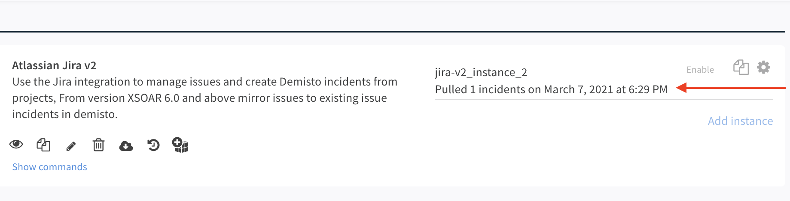

3. Once you&#39;ve finished the setup stage, go to the "Mapper (incoming)" field and select the mapper you want to work with by clicking on "Select":
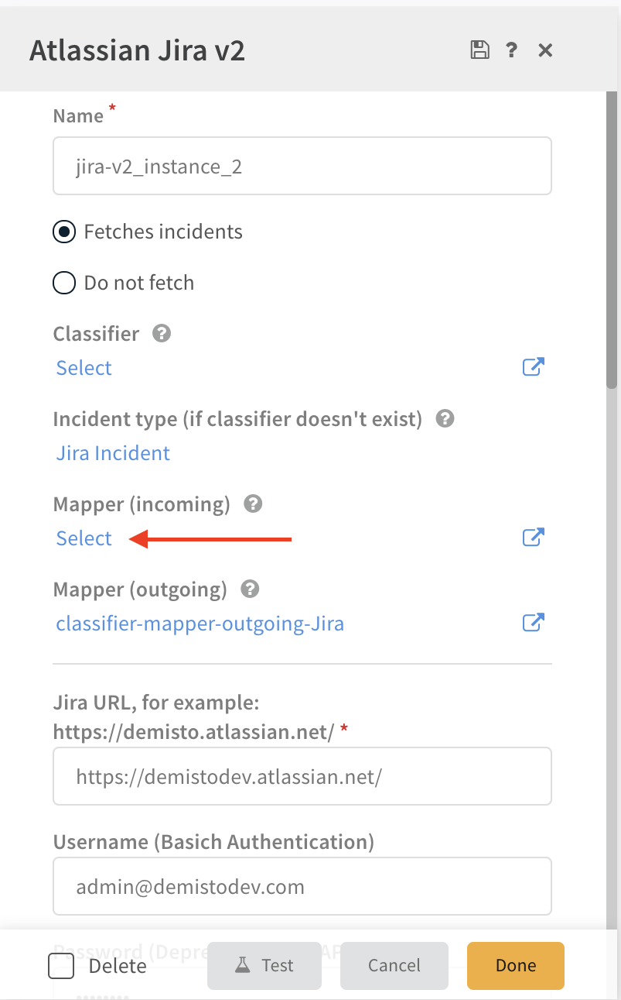

4. Click on the button: in order to edit the selected mapper. It will open the "Incident Incoming Mapping Editor".  
1.For "Incident Type", please provide the incident type you&#39;ve selected in the integration settings.  
2.In "Select Instance" choose the name of your instance. You can find it in the integration settings (you can see a screenshot above), under "Name".
   Once done, You&#39;ll see on the right side of the screen a Jira incident.  
   *Note: If you want to work with a specific incident, in "Get data" select the option: "Upload JSON" and provide the wanted incident as JSON.  
   In order to get the incident as JSON, you can see the section: "how to get an incident as JSON" below.  
   On the left side, You&#39;ll see all Jira incident fields.
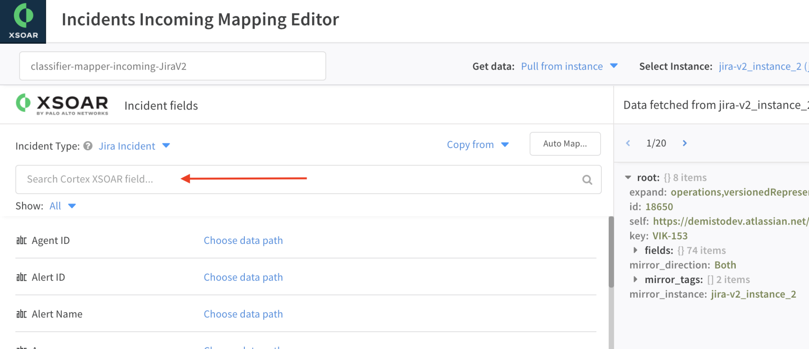
  3.Use "Search Cortex XSOAR field…" in order to find your new incident field by searching its name.  
  4.Once found, click on "Choose data path" and map it to the custom jira field:
    a.Find the jira field you want to map to this incident field on the right side, and click on its value.
    b.Then you will see the path you&#39;ve selected under your new added field:
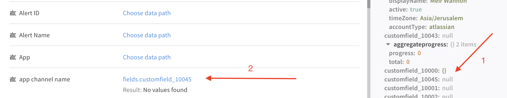
    *Note: In this example:"customfield\_ **10045**" is the Jira field ID we want to map. You can find IDs of custom fields for your field in Jira using this guide:[Click Here](https://confluence.atlassian.com/jirakb/how-to-find-id-for-custom-field-s-744522503.html)
    *Note: You can also type the path manually.
5. Click "Save Version".

### Add the new field to the outgoing mapper:

1. Go to Settings -> Integrations -> Servers & Services -> in the search bar type “Jira”.
2. Open the integration settings by clicking on the button: 
3. go to the "Mapper (outgoing)" field and select the mapper you want to work with by clicking on "Select" (the same process we did with the incoming mapper).
4. Click on the button:  in order to edit the selected mapper. It will open the "Incident Outgoing Mapping Editor".
5. In "Select Instance" choose the name of your instance. You can find it in the integration settings (you can see a screenshot above), under "Name".
  1.See that "Schema Type" changes automatically to "Jira Incident".

6. Select one incident to work with by specifying it in the "Incident" list (it can be seen in the screenshot above under "Select Instance").  
1.On the right side you are now able to see your selected incident.  
2.On the left side you are able to see all the Jira fields you can map in the system.
7. Search for the Jira field you want to map on the left side. In this example, we want to map customfield\_10045
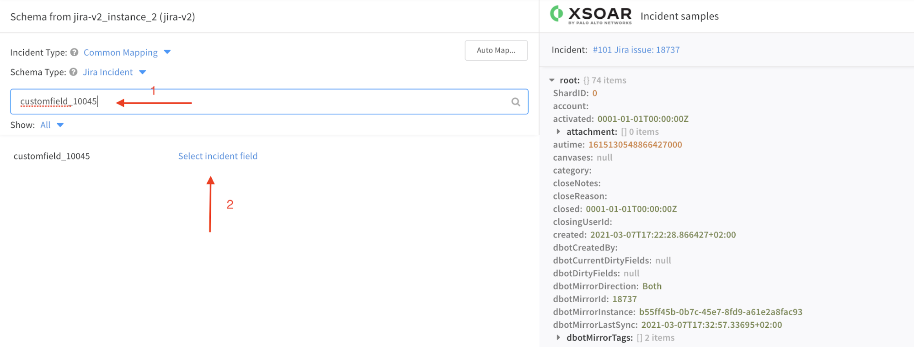
8. Map the Jira field to the incident field you&#39;ve created by clicking on "Select incident field" and type its name\*.  
*The name of the incident will not include spaces, underscores, capital letters, etc. for example: Jira Transitions will be transformed to "jiratransitions" once saved in the incident&#39;s context (you can see the name you need to select by fetching incidents after configuring the mapper in. In the "Incident" field select one of the new incidents that the edited mapper in has worked on. On the right side you should be able to see the new added field and the name you need to provide).
9. Click the "Save Version" button.

#### How to get an incident as JSON:

1. Use the !jira-get-issue command with the raw-response=true parameter. For example: ```!jira-get-issue issueId=VIK-183 raw-response=true```
2. Click on "view full JSON in a new tab"
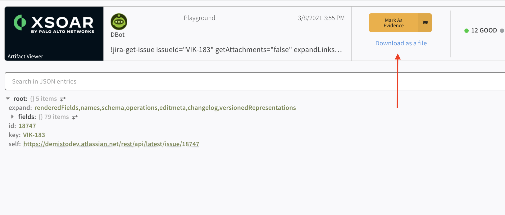
3. Click on "Download as a file".

4. Open the downloaded file and put its content inside a list, resulting in a list which contains only one item, the downloaded JSON.
5. When selecting "Upload JSON" for "Get data" as mentioned above, you can upload the file using the "Upload JSON" option:
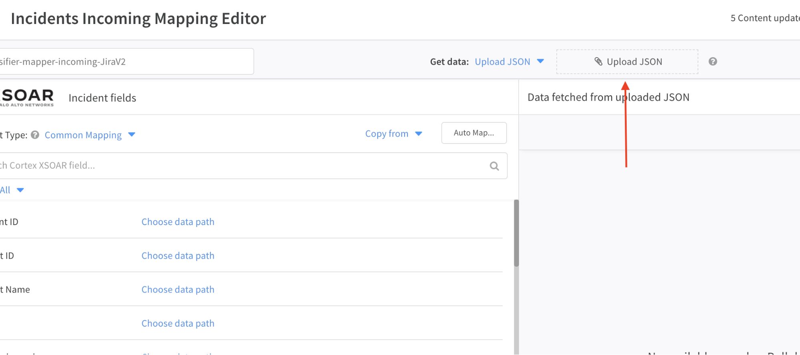

## Change Ticket's Status Using Transitions
1. Make sure you've configured your instance as described in **'Configure Incident Mirroring'** above.
2. Make sure you're using the 'Jira Incident Layout' for displaying the incident which status you want to change.
 The reason this is required is that this layout is structured in a way that both **'script-JiraChangeTransition'** and **'script-JiraListTransition'** scripts can work, which is crucial when you want to use transitions.
3. In order to change an incident status, open the incident you would like to update.
4. Under **"Incident Info"** search for the "Jira Transitions" field.
5. Click on "Select" and choose the name of the new status.
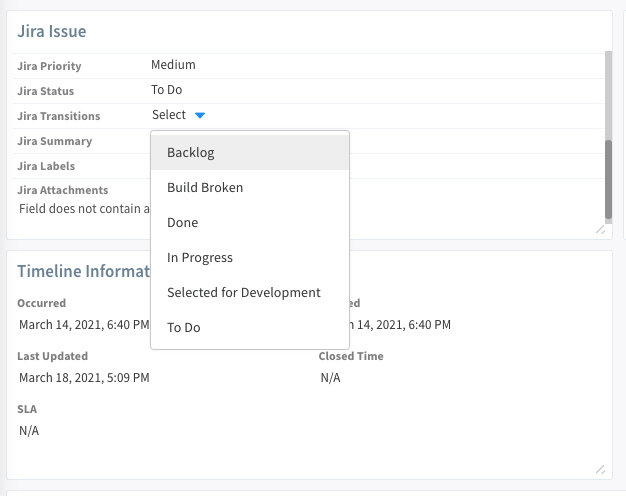
6. Click on the 'V' option in the 'V/X' menu.
7. You can see the new status under 'Jira Status'.
8. Go to Jira, within approximately one minute you will be able to see the new status there as well.
### jira-add-user-to-project

***
Adds the user to a project.

#### Base Command

`jira-add-user-to-project`

#### Input

| **Argument Name** | **Description** | **Required** |
| --- | --- | --- |
| user_email | User's email address. | Optional | 
| project_key | Project key. | Optional | 
| role_name | Role name to assign the user. | Optional | 

#### Context Output

There is no context output for this command.
### jira-get-project-role

***
Gets the information related to the role, including assigned users.

#### Base Command

`jira-get-project-role`

#### Input

| **Argument Name** | **Description** | **Required** |
| --- | --- | --- |

#### Context Output

There is no context output for this command.
### jira-get-organizations

***
Lists all the organizations.

#### Base Command

`jira-get-organizations`

#### Input

| **Argument Name** | **Description** | **Required** |
| --- | --- | --- |

#### Context Output

There is no context output for this command.