Use the Jira integration to manage issues and create Cortex XSOAR incidents from Jira projects. From Cortex XSOAR version 6.0 and above, the integration also mirrors issues to existing issue incidents in Cortex XSOAR. The integration now supports both OnPrem, and Cloud instances.
This integration was integrated and tested with: Jira Cloud Platform V3 (for Cloud), Jira Software Cloud (for Cloud), Jira Server Platform 9.6.0 (for OnPrem), Jira Software Server 9.6.0 (for OnPrem).

Some changes have been made that might affect your existing content.
If you are upgrading from a previous version of this integration, see [Breaking Changes](#breaking-changes-from-the-previous-version-of-this-integration-atlassian-jira-v3).

## Configure Atlassian Jira V3 on Cortex XSOAR

1. Navigate to **Settings** > **Integrations** > **Servers & Services**.
2. Search for Atlassian Jira V3.
3. **Authentication**: Basic Authentication, Personal Access Token, and OAuth 2.0 are used for Jira Cloud and On-prem. Read the [Authentication](#authentication) process in order to configure your instance
4. Click **Add instance** to create and configure a new integration instance.

    | **Parameter** | **Description** | **Required** |
    | --- | --- | --- |
    | Server URL | The base URL. For a Cloud instance, use the default URL as configured. For an OnPrem instance, use your respective domain. | True |
    | Cloud ID | This field is used to configure the Jira Cloud. |  |
    | User name | used only for basic authentication method | False |
    | API key | used only for basic authentication method | False |
    | Callback URL | used only for OAuth 2.0 method | False |
    | Client ID | used only for OAuth 2.0 method | False |
    | Client Secret | used only for OAuth 2.0 method | False |
    | Personal Access Token | used only for the Personal Access Token method | False |
    | Query (in JQL) for fetching incidents | The field that was selected in the "Issue Field to fetch by" can't be used. in the query. | False |
    | Issue Field to fetch by | This is how the field \(e.g, created date\) is applied to the query: created &amp;gt;= \{created date in last run\} ORDER BY created ASC | False |
    | Issue index to start fetching incidents from | This parameter is dismissed if "id" is not chosen in "Issue Field to Fetch by". This will only fetch Jira issues that are part of the same project as the issue that is configured in this parameter. If this value is 0, then the fetch mechanism will automatically start the fetch from the smallest ID with respect to the fetch query. | False |
    | Trust any certificate (not secure) |  | False |
    | Use system proxy settings |  | False |
    | Fetch incidents |  | False |
    | Incident type |  | False |
    | Close Mirrored XSOAR Incident | When selected, marking the Jira issue as resolved will be mirrored in Cortex XSOAR, and will close the corresponding incident. Please make sure the \`Resolved\` field in your Jira instance is configured in order for this to work properly, if not, it will rely on if the status of the issue is changed to \`Done\`. | False |
    | Mirroring Direction |  | False |
    | Attachment Entry Tag to Jira | Add this tag to an entry to mirror it as an attachment to Jira. | False |
    | Attachment Entry Tag from Jira | Add this tag to an entry to mirror it as an attachment from Jira. | False |
    | Comment Entry Tag to Jira | Add this tag to an entry to mirror it as a comment in Jira. | False |
    | Comment Entry Tag from Jira | Add this tag to an entry to mirror it as a comment from Jira. | False |
    | Fetch comments | Fetch comments for a Jira ticket. | False |
    | Fetch attachments | Fetch attachments for a Jira ticket. | False |
    | Max incidents per fetch | The maximum allowed value is dictated by the Jira property 'jira.search.views.default.max'. If you specify a value that is higher than this number, your search results will be truncated. Default value is 50. | False |
    | Time range for initial data fetch | The time range to consider for the initial data fetch in format: &lt;number&gt; &lt;unit&gt;. This parameter is only relevant when selecting to fetch by created time, or updated time. Default is 3 days. For example: 2 minutes, 2 hours, 2 days, 2 months, 2 years | False |

5. Check [Authorization Flow In Cortex XSOAR](#authorization-flow-in-cortex-xsoar) in order to authenticate and test the connection.


Configure only one of the following fields:

- Cloud ID - Used for Jira Cloud instance.
- OnPrem - Leave the Cloud ID empty, and fill in the rest of the fields.

##### Cloud ID

1. Go to your [Admin page](https://admin.atlassian.com/).
2. Click the **Products** tab on the top banner and choose the appropriate site under **Sites and Products** on the left side bar. Your Cloud ID will appear in the URL:
`https://admin.atlassian.com/s/{cloud_id}/users`

## Authentication
### Basic Authentication
Leave the *Client ID*, *Client Secret* and *Personal Access Token* fields empty and fill in the following fields:
- *User name* - Enter your user email.
- *API key* - Enter the API token. To generate API token, see [here](https://support.atlassian.com/atlassian-account/docs/manage-api-tokens-for-your-atlassian-account/)

##### Basic Authentication permissions
Ensure that you possess the necessary permissions by navigating to **Project Settings** > **Permissions** in the project.
Locate permissions for the tasks listed below:
* Browse projects
* Create issues
* Edit issues
* Delete issues
* Transition issues
* Create attachments
* Add comments
* Link issues

### Personal Access Token Authentication
Leave the *User name*, *API key*, *Client ID* and *Client Secret* empty and fill in the following fields:
- *Personal Access Token* - Enter the Personal Access Token you created for a user, see [here](https://confluence.atlassian.com/enterprise/using-personal-access-tokens-1026032365.html)


### OAuth 2.0
For both instances (Cloud ID & OnPrem), it is advised to use the `https://oproxy.demisto.ninja/authcode` **Callback URL**. The OProxy URL is a client side only web page which provides an easy interface to copy the obtained auth code from the authorization response to the integration configuration in the authorization flow steps. Optionally, if you don't want to use the OProxy URL, you can use a localhost URL on a port that is not used locally on your machine. For example: <http://localhost:9004>. You will then need to copy the code from the URL address bar in the response (see [OAuth 2.0 authorization Flow In Cortex XSOAR](#oauth-20-authorization-flow-in-cortex-xsoar)).

#### Cloud authentication

Go to your [Developer console](https://developer.atlassian.com/console/myapps/) page, and choose the App you want to integrate with your instance. It must be of type OAuth 2.0. For creating a new app with type OAuth 2.0, click **Create** and choose **OAuth 2.0 integration** and follow the steps.

##### Callback URL

1. Go to the **Authorization** tab, and click **Add** on the authorization with type of OAuth 2.0 (3LO).
2. Insert a **Callback URL**.

##### Client ID, Client Secret

1. Go to the **Settings** tab.
2. Copy the **Client ID** and **Secret** to the Client ID and Client Secret fields, respectively.

##### Cloud Scopes

The integration uses the *offline_access* scope, in order to retrieve refresh tokens.

##### Classic Scopes

* read:jira-work
* read:jira-user
* write:jira-work

##### Granular Scopes

* read:jql:jira
* read:issue-details:jira
* write:board-scope:jira-software
* read:board-scope:jira-software
* read:sprint:jira-software
* read:epic:jira-software
* write:sprint:jira-software

#### OnPrem authentication

1. Log in to Jira as a user with `Jira Administrator` permissions.
2. Click the Jira Administration tab (the gear icon found in the top right corner) and click **Applications**.
3. To create a new `Application link`, which will be used to integrate Cortex XSOAR with Jira:  
    a. Click **Application links** under `Integrations`, found on the left side menu.  
    b. Click **Create link** and choose **External application** with the **Incoming** direction.  
4. Fill in the required details as explained in the page, by inserting a Callback URL, and choosing the permission Write.
5. Once the link is created, you will be able to see `Client ID`, and the `Client secret`, which are required in the configuration screen. Copy these values and paste them into the respective fields in the configuration screen.

##### OnPrem Scopes

Write

#### OAuth 2.0 authorization Flow In Cortex XSOAR

1. Create the authentication application as explained in the [OAuth 2.0](#oauth-20) section.
2. Run the command `!jira-oauth-start`, where you will be presented with a URL to authenticate yourself.
3. After authenticating, you will be redirected to the configured *Callback URL*, where you will retrieve the authorization code provided as a query parameter called `code`.
4. Insert the retrieved authorization code as an argument to the `!jira-oauth-complete` command.
5. Run the `!jira-oauth-test` to test the connection of the instance.

##### Authenticating using custom callback URL


##### Authenticating using the oproxy callback URL


## Fetch Incidents

When you enable incidents fetching, you have the option to configure a query which will be used to fetch Jira issues as incidents in Cortex XSOAR. The query uses one of the following fields in order to progressively fetch incidents:

* `id` of Jira issues
* `created time` of Jira issues
* `updated time` of Jira issues (using this field may cause duplicates, so be wary)

If `created time`, or `updated time` is selected when fetching incidents for the first time, then the `Time range for initial data fetch` argument is used in the fetch query.
By default, 50 issues are fetched for each call.
If `Fetch comments` is enabled, The fetched incidents will include the comments in the Jira issue, and preview them in the form of a table in the incident info tab.
If `Fetch attachments` is enabled, The fetched incidents will include the attachments in the Jira issue.

## Commands

You can execute these commands from the Cortex XSOAR CLI, as part of an automation, or in a playbook.
After you successfully execute a command, a DBot message appears in the War Room with the command details.

**Notes**:

1. For OnPrem, all the commands use the **WRITE** scope, for Cloud, the required scopes for each command will be mentioned under the name of the command.
2. For the commands that are shared between Jira V2 and V3, we still support the arguments from V2, but are configured to be hidden, and are prioritized when supplied to the commands, to not break backwards compatibility.

### jira-issue-get-attachment

***
Download attachments for a specific issue (Will download a file to War Room).

Scope: `read:jira-work`

#### Base Command

`jira-issue-get-attachment`

#### Input

| **Argument Name** | **Description** | **Required** |
| --- | --- | --- |
| attachment_id | A CSV list of the attachments' ID, which can be retrieved using the `jira-get-issue` command. | Required |

#### Context Output

| **Path** | **Type** | **Description** |
| --- | --- | --- |
| InfoFile.Name | String | The file name. |
| InfoFile.EntryID | String | The EntryID of the file in the War Room. |
| InfoFile.Size | Number | The size of the file \(in bytes\). |
| InfoFile.Type | String | The file type, as determined by libmagic \(same as displayed in file entries\). |
| InfoFile.Extension | String | The file extension. |
| InfoFile.Info | String | Basic information of the file. |

#### Command example

```!jira-issue-get-attachment attachment_id=16477```

#### Context Example

```json
{
    "InfoFile": {
        "EntryID": "10906@33e912c0-76a9-4a08-8cc6-1b20b1980b20",
        "Extension": "pdf",
        "Info": "application/pdf",
        "Name": "dummy.pdf",
        "Size": 13264,
        "Type": "PDF document, version 1.4, 1 pages (zip deflate encoded)"
    }
}
```

#### Human Readable Output

### jira-delete-issue

***
Deletes an issue in Jira. Issue's sub-tasks will also be deleted if there are any.

Scope: `write:jira-work`

#### Base Command

`jira-delete-issue`

#### Input

| **Argument Name** | **Description** | **Required** |
| --- | --- | --- |
| issueIdOrKey | Deprecated. Please use issue_id or issue_key. | Optional |
| issue_id | The issue ID (Issue ID or key is required). | Optional |
| issue_key | The issue key (Issue ID or key is required). | Optional |

#### Context Output

There is no context output for this command.

#### Command example

```!jira-delete-issue issue_key=PROJECTKEY-114```

#### Human Readable Output

>Issue deleted successfully.

### jira-get-specific-field

***
Gets specific fields from a Jira issue and adds it to context dynamically.

Scope: `read:jira-work`

#### Base Command

`jira-get-specific-field`

#### Input

| **Argument Name** | **Description** | **Required** |
| --- | --- | --- |
| issue_id | The issue ID (Issue ID or key is required). | Optional |
| issue_key | The issue key (Issue ID or key is required). | Optional |
| issueId | Deprecated. Please use issue_id or issue_key. | Optional |
| field | Deprecated. Please use fields. | Optional |
| fields | The fields to retrieve from the issue. For example field="customfield_164,labels". | Optional |

#### Context Output

| **Path** | **Type** | **Description** |
| --- | --- | --- |
| Ticket.Id | String | The ticket ID. |
| Ticket.Key | String | The ticket key. |
| Ticket.Assignee | String | The user assigned to the ticket. |
| Ticket.Creator | String | The user who created the ticket. |
| Ticket.Summary | String | The ticket summary. |
| Ticket.Status | String | The ticket status. |

#### Command example

```!jira-get-specific-field issue_key=PROJECTKEY-35 fields="watches,rank"```

#### Context Example

```json
{
    "Ticket": {
        "Assignee": "Example User(example@example.com)",
        "Attachments": [
            {
                "created": "2023-05-04T21:11:51.286+0300",
                "filename": "dummy_attachment_content.txt",
                "id": "16475",
                "size": 13264
            },
            {
                "created": "2023-05-04T21:32:57.042+0300",
                "filename": "dummy.pdf",
                "id": "16478",
                "size": 13264
            }
        ],
        "Components": [
            "dummy-comp",
            "Integration"
        ],
        "Created": "2023-03-01T11:34:49.730+0200",
        "Creator": "Example User(example@example.com)",
        "Description": "Edited subbscription",
        "DueDate": "2023-01-01",
        "Id": "21487",
        "Key": "PROJECTKEY-35",
        "Labels": [
            "label1",
            "label2"
        ],
        "LastSeen": "2023-05-08T19:02:34.151+0300",
        "LastUpdate": "2023-05-08T19:07:44.900+0300",
        "Priority": "Highest",
        "ProjectName": "Company Snoozing App",
        "Status": "Backlog",
        "Summary": "Edited Summary",
        "customfield_10019": {
            "issueFieldDisplayName": "Rank",
            "rawData": "0|i00kjb:"
        },
        "watches": {
            "issueFieldDisplayName": "Watchers",
            "rawData": {
                "isWatching": true,
                "self": "https://api.atlassian.com/ex/jira/1234/rest/api/3/issue/PROJECTKEY-35/watchers",
                "watchCount": 1
            }
        }
    }
}
```

#### Human Readable Output

>### Issue PROJECTKEY-35
>
>|Assignee|Created|Creator|Description|Due Date|Id|Issue Type|Key|Labels|Priority|Project Name|Reporter|Status|Summary|Ticket Link|
>|---|---|---|---|---|---|---|---|---|---|---|---|---|---|---|
>| Example User(<example@example.com>) | 2023-03-01T11:34:49.730+0200 | Example User(<example@example.com>) | Edited subbscription | 2023-01-01 | 21487 | Story | PROJECTKEY-35 | label1,<br/>label2 | Highest | Company Snoozing App | Example User(<example@example.com>) | Backlog | Edited Summary | https:<span>//</span>api.atlassian.com/ex/jira/1234/rest/api/3/issue/21487 |

### jira-issue-add-link

***
Creates (or updates) an issue link.

Scope: `write:jira-work`

#### Base Command

`jira-issue-add-link`

#### Input

| **Argument Name** | **Description** | **Required** |
| --- | --- | --- |
| globalId | Deprecated. Please use global_id. | Optional |
| global_id | If the global ID is provided and a remote issue link exists with that global ID, the remote issue link is updated. | Optional |
| relationship | The object relationship to the issue, for example: causes. | Optional |
| url | The URL link. | Required |
| title | The link title. | Required |
| summary | The link summary. | Optional |
| issueId | Deprecated. Please use issue_id or issue_key. | Optional |
| issue_id | The issue ID (Issue ID or key is required). | Optional |
| issue_key | The issue key (Issue ID or key is required). | Optional |
| application_type | The application type of the linked remote application. For example "com.atlassian.confluence". | Optional |
| applicationType | Deprecated. Please use application_type. | Optional |
| application_name | The application name of the linked remote application. For example "My Confluence Instance". | Optional |
| applicationName | Deprecated. Please use application_name. | Optional |

#### Context Output

There is no context output for this command.

#### Command example

```!jira-issue-add-link title="Demo" url="https://demisto.com" issue_key=PROJECTKEY-35```

#### Human Readable Output

>### Remote Issue Link
>
>|id|ticket_link|
>|---|---|
>| 16506 | https:<span>//</span>api.atlassian.com/ex/jira/1234/rest/api/3/issue/PROJECTKEY-35/remotelink/16506 |

### jira-get-id-by-attribute

***
Gets the account ID for a given user attribute.

Scope: `read:jira-user`

#### Base Command

`jira-get-id-by-attribute`

#### Input

| **Argument Name** | **Description** | **Required** |
| --- | --- | --- |
| attribute | The user attribute value. For Jira Cloud, this value can be the display name, or email address, and for Jira OnPrem, this value can be the display name, email address, or username. | Required |
| max_results | The maximum number of users to fetch when searching for a matching user (default is 50). The maximum allowed value is dictated by the Jira property 'jira.search.views.default.max'. If you specify a value greater than this number, your search results are truncated. Default is 50. | Optional |

#### Context Output

| **Path** | **Type** | **Description** |
| --- | --- | --- |
| Jira.User.Attribute | String | The user's attribute. |
| Jira.User.AccountId | String | The user's account ID. |

#### Command example

```!jira-get-id-by-attribute attribute=Tomer```

#### Context Example

```json
{
    "Jira": {
        "User": {
            "AccountId": "12345",
            "Attribute": "Tomer"
        }
    }
}
```

#### Human Readable Output

>The account ID that holds the attribute `Tomer`: 12345

### jira-issue-query

***
Queries Jira issues.

Scope: `read:jira-work`

#### Base Command

`jira-issue-query`

#### Input

| **Argument Name** | **Description** | **Required** |
| --- | --- | --- |
| query | The JQL query string. | Required | 
| start_at | The index (integer) of the first issue to return (0-based). | Optional | 
| max_results | The maximum number of users to fetch when searching for a matching user (default is 50). The maximum allowed value is dictated by the Jira property 'jira.search.views.default.max'. If you specify a value greater than this number, your search results are truncated. | Optional | 
| headers | Displays the headers in human readable format. | Optional | 
| fields | A CSV list of fields to return (Using the name or ID of the fields) to context data. Supplying `all` will return all the issue fields (which will include nested values), except for the comments, which can be retrieved using the !jira-get-comments command. | Optional | 

#### Context Output

| **Path** | **Type** | **Description** |
| --- | --- | --- |
| Ticket.Id | String | The ticket ID. |
| Ticket.Key | String | The ticket key. |
| Ticket.Assignee | String | The user assigned to the ticket. |
| Ticket.Creator | String | The user who created the ticket. |
| Ticket.Summary | String | The ticket summary. |
| Ticket.Description | String | The ticket's description. |
| Ticket.RawDescription | String | The ticket's raw description. |
| Ticket.Labels | Array | The ticket's labels. |
| Ticket.Components | Array | The ticket's components. |
| Ticket.Status | String | The ticket status. |
| Ticket.Priority | String | The ticket priority. |
| Ticket.ProjectName | String | The ticket project name. |
| Ticket.DueDate | Date | The due date. |
| Ticket.Created | Date | The time the ticket was created. |
| Ticket.LastSeen | Date | The last time the ticket was viewed. |
| Ticket.LastUpdate | Date | The last time the ticket was updated. |

#### Command example

```!jira-issue-query query="status!=done" max_results=2 fields="watches,rank"```

#### Context Example

```json
{
    "Ticket": [
        {
            "Assignee": "",
            "Attachments": [
                {
                    "created": "2023-03-26T18:06:24.325+0300",
                    "filename": "DemistoContent-InstallContentEnvironment-160822-0023-68.pdf",
                    "id": "16426",
                    "size": 17815
                }
            ],
            "Components": [],
            "Created": "2023-03-01T11:59:18.202+0200",
            "Creator": "Example User(example@example.com)",
            "Description": "Dummy description",
            "DueDate": "",
            "Id": "21490",
            "Key": "XSOAR-19",
            "Labels": [],
            "LastSeen": "",
            "LastUpdate": "2023-05-04T21:41:44.516+0300",
            "Priority": "Highest",
            "ProjectName": "XSOARJiraV3",
            "Status": "To Do",
            "Summary": "something",
            "customfield_10019": {
                "issueFieldDisplayName": "Rank",
                "rawData": "0|i00kjr:"
            },
            "watches": {
                "issueFieldDisplayName": "Watchers",
                "rawData": {
                    "isWatching": true,
                    "self": "https://api.atlassian.com/ex/jira/1234/rest/api/3/issue/XSOAR-19/watchers",
                    "watchCount": 1
                }
            }
        },
        {
            "Assignee": "",
            "Attachments": [],
            "Components": [],
            "Created": "2023-03-01T14:10:55.495+0200",
            "Creator": "Example User(example@example.com)",
            "Description": "Dummy",
            "DueDate": "",
            "Id": "21494",
            "Key": "XSOAR-18",
            "Labels": [],
            "LastSeen": "",
            "LastUpdate": "2023-03-01T14:10:55.495+0200",
            "Priority": "Medium",
            "ProjectName": "XSOARJiraV3",
            "Status": "To Do",
            "Summary": "something something",
            "customfield_10019": {
                "issueFieldDisplayName": "Rank",
                "rawData": "0|i00kkn:"
            },
            "watches": {
                "issueFieldDisplayName": "Watchers",
                "rawData": {
                    "isWatching": true,
                    "self": "https://api.atlassian.com/ex/jira/1234/rest/api/3/issue/XSOAR-18/watchers",
                    "watchCount": 1
                }
            }
        }
    ]
}
```

#### Human Readable Output

>### Issue XSOAR-19
>
>|Assignee|Created|Creator|Description|Due Date|Id|Issue Type|Key|Labels|Priority|Project Name|Reporter|Status|Summary|Ticket Link|
>|---|---|---|---|---|---|---|---|---|---|---|---|---|---|---|
>|  | 2023-03-01T11:59:18.202+0200 | Example User(<example@example.com>) | Dummy description |  | 21490 | Task | XSOAR-19 |  | Highest | XSOARJiraV3 | Example User(<example@example.com>) | To Do | something | https:<span>//</span>api.atlassian.com/ex/jira/1234/rest/api/3/issue/21490 |

>### Issue XSOAR-18
>
>|Assignee|Created|Creator|Description|Due Date|Id|Issue Type|Key|Labels|Priority|Project Name|Reporter|Status|Summary|Ticket Link|
>|---|---|---|---|---|---|---|---|---|---|---|---|---|---|---|
>|  | 2023-03-01T14:10:55.495+0200 | Example User(<example@example.com>) | Dummy |  | 21494 | Task | XSOAR-18 |  | Medium | XSOARJiraV3 | Example User(<example@example.com>) | To Do | something something | https:<span>//</span>api.atlassian.com/ex/jira/1234/rest/api/3/issue/21494 |

### jira-get-id-offset

***
Returns the ID offset, which is the ID of the first issue that was created in the current Jira instance, or the ID of the first issue with respect to the given query argument if given. You can use its result as the initial ID when fetching incidents by the issue id field.

Scope: `read:jira-work`

#### Base Command

`jira-get-id-offset`

#### Input

| **Argument Name** | **Description** | **Required** |
| --- | --- | --- |
| query | The query that will be used to retrieve the first issue ID in it. | Optional |


#### Context Output

| **Path** | **Type** | **Description** |
| --- | --- | --- |
| Ticket.idOffSet | String | The ID offset. |

#### Command example

```!jira-get-id-offset query="status!=done"```

#### Context Example

```json
{
    "Ticket": {
        "idOffSet": "10161"
    }
}
```

#### Human Readable Output

>ID Offset: 10161

### jira-issue-add-comment

***
Adds a new comment to an existing Jira issue.

Scope: `write:jira-work`

#### Base Command

`jira-issue-add-comment`

#### Input

| **Argument Name** | **Description** | **Required** |
| --- | --- | --- |
| issueId | Deprecated. Please use issue_id or issue_key. | Optional |
| issue_id | The issue ID (Issue ID or key is required). | Optional |
| issue_key | The issue key (Issue ID or key is required). | Optional |
| comment | The comment body. | Required |
| visibility | The roles that can view the comment, for example: Administrators. | Optional |

#### Context Output

There is no context output for this command.

#### Command example

```!jira-issue-add-comment issue_key=PROJECTKEY-31 comment="New comment"```

#### Human Readable Output

>### Comment added successfully
>
>|Comment|Id|Ticket Link|
>|---|---|---|
>| New comment | 18456 | https:<span>//</span>api.atlassian.com/ex/jira/1234/rest/api/3/issue/21432/comment/18456 |

### jira-issue-upload-file

***
Uploads a file attachment to an issue.

Scope: `write:jira-work`

#### Base Command

`jira-issue-upload-file`

#### Input

| **Argument Name** | **Description** | **Required** |
| --- | --- | --- |
| issueId | Deprecated. Please use issue_id or issue_key. | Optional |
| issue_id | The issue ID (Issue ID or key is required). | Optional |
| issue_key | The issue key (Issue ID or key is required). | Optional |
| upload | The entry ID to upload. | Required |
| attachment_name | The attachment name to be displayed in Jira (overrides the original file name). | Optional |
| attachmentName | Deprecated. Please use attachment_name. | Optional |

#### Context Output

There is no context output for this command.

#### Command example

```!jira-issue-upload-file upload=10833@33e912c0-76a9-4a08-8cc6-1b20b1980b20 issue_key=PROJECTKEY-31```

#### Human Readable Output

>### Attachment added successfully
>
>|Attachment Link|Attachment Name|Id|Issue Key|
>|---|---|---|---|
>| https:<span>//</span>api.atlassian.com/ex/jira/1234/rest/api/3/attachment/16505 | dummy.pdf | 16505 | PROJECTKEY-31 |


### jira-issue-delete-file


***
Delete an attachment from an issue.

Scope: `write:jira-work`

#### Base Command

`jira-issue-delete-file
`

#### Input

| **Argument Name** | **Description** | **Required** |
| --- | --- | --- |
| attachment_id | The attachment ID. | Required |

#### Context Output

There is no context output for this command.

#### Command example

```!jira-issue-delete-file attachment_id=ATTACHMENT_ID```

#### Human Readable Output

>Attachment id ATTACHMENT_ID was deleted successfully.


### jira-list-transitions

***
Lists all possible transitions for a given ticket in its current status.

Scope: `read:jira-work`

#### Base Command

`jira-list-transitions`

#### Input

| **Argument Name** | **Description** | **Required** |
| --- | --- | --- |
| issueId | Deprecated. Please use issue_id or issue_key. | Optional |
| issue_id | The issue ID (Issue ID or key is required). | Optional |
| issue_key | The issue key (Issue ID or key is required). | Optional |

#### Context Output

| **Path** | **Type** | **Description** |
| --- | --- | --- |
| Ticket.Id | String | The ticket ID. |
| Ticket.Key | String | The ticket key. |
| Ticket.Transitions | Object | An object that holds data about all possible transitions. |
| Ticket.Transitions.transitions | Array | An array of all possible transitions. |
| Ticket.Transitions.ticketId | String | The ticket ID. |

#### Command example

```!jira-list-transitions issue_key=PROJECTKEY-35```

#### Context Example

```json
{
    "Ticket": {
        "Key": "PROJECTKEY-35",
        "Transitions": {
            "ticketId": "PROJECTKEY-35",
            "transitions": [
                "Backlog",
                "In Development"
            ]
        }
    }
}
```

#### Human Readable Output

>### List Transitions
>
>|Transition Names|
>|---|
>| Backlog |
>| In Development |

### jira-edit-issue

***
Modifies an issue in Jira. If the status or transition fields are given, then the other supplied fields should appear on the transition screen.

Scope: `write:jira-work`

#### Base Command

`jira-edit-issue`

#### Input

| **Argument Name** | **Description** | **Required** |
| --- | --- | --- |
| parent_issue_key | The parent issue key (if you're editing a sub-task). This argument is only relevant for Jira Cloud. | Optional |
| parent_issue_id | The parent issue ID (if you're editing a sub-task). This argument is only relevant for Jira Cloud. | Optional |
| action | Whether to append or rewrite the values. Only issue fields of type string or array support appending. If the field is of type string, then the new appended value will be: 'old value, new value', where they will be separated by a comma. Possible values are: append, rewrite. Default is rewrite. | Optional |
| issueId | Deprecated. Please use issue_id or issue_key. | Optional |
| issue_id | The issue ID (Issue ID or key is required). | Optional |
| issue_key | The issue key (Issue ID or key is required). | Optional |
| issue_json | The issue object (in JSON format). This argument is for advanced users, as when utilizing this argument, one cannot use other arguments (it will raise an error) except the `issue_id` `issue_eky` `action` `transition` and `status` and must input all required arguments into the issue_json. In addition, when issue_json is used, it is not possible to use the project name but only the project key. For example {"fields":{"customfield_10037":"field_value", "summary": "some summary", "project": {"key": "<project_key>"}}}. For more information about this argument, see https://developer.atlassian.com/server/jira/platform/jira-rest-api-example-create-issue-7897248/. | Optional |
| issueJson | Deprecated. Please use issue_json. | Optional |
| summary | The issue summary. | Optional |
| description | The issue description. | Optional |
| labels | A CSV list of labels. | Optional |
| priority | The issue priority, for example: High, Medium. | Optional |
| due_date | The due date for the issue (in the format yyyy-mm-dd). | Optional |
| dueDate | Deprecated. Please use due_date. | Optional |
| assignee | The name of the assignee. Relevant for Jira Server only. If you are using Jira Cloud, provide the assignee_id argument instead. Use the jira-get-id-by-attribute command to get the user's name. | Optional |
| assignee_id | The account ID of the assignee. Relevant for Jira Cloud only. Use the jira-get-id-by-attribute command to get the user's account ID. | Optional |
| status | The issue status (Either choose the issue status or transition, but not both). | Optional |
| transition | The issue transition (Either choose the issue status or transition, but not both). | Optional |
| environment | A text field for describing the environment in which the issue occurred. For example environment="IE9 on Windows 7". | Optional |
| security | The security level name of the issue. For example security="Anyone". | Optional |
| components | A CSV list of components. For example components="component1,component2". When using a Jira OnPrem instance, or using the action append, the entered components must already exist. | Optional |

#### Context Output

| **Path** | **Type** | **Description** |
| --- | --- | --- |
| Ticket.Id | String | The ticket ID. |
| Ticket.Key | String | The ticket key. |
| Ticket.Assignee | String | The user assigned to the ticket. |
| Ticket.Creator | String | The user who created the ticket. |
| Ticket.Summary | String | The ticket summary. |
| Ticket.Description | String | The ticket's project description. |
| Ticket.RawDescription | String | The ticket's project raw description. |
| Ticket.Labels | Array | The ticket's project labels. |
| Ticket.Status | String | The ticket status. |
| Ticket.Priority | String | The ticket priority. |
| Ticket.ProjectName | String | The ticket project name. |
| Ticket.DueDate | Date | The due date. |
| Ticket.Created | Date | The time the ticket was created. |
| Ticket.LastSeen | Date | The last time the ticket was viewed. |
| Ticket.LastUpdate | Date | The last time the ticket was updated. |

#### Command example

```!jira-edit-issue action=rewrite issue_key=PROJECTKEY-35 assignee_id=12345 description="Edited subbscription" due_date="2023-01-01" environment="Windows XP" labels="label1,label2" priority="Highest" security=Anyone status="Backlog" summary="Edited Summary"```

#### Context Example

```json
{
    "Ticket": {
        "Assignee": "Example User(example@example.com)",
        "Attachments": [
            {
                "created": "2023-05-07T20:00:59.121+0300",
                "filename": "dummy_attachment_content.txt",
                "id": "16504",
                "size": 13264
            },
            {
                "created": "2023-05-04T21:29:49.246+0300",
                "filename": "dummy.pdf",
                "id": "16477",
                "size": 13264
            }
        ],
        "Components": [
            "dummy-comp",
            "Integration"
        ],
        "Created": "2023-03-01T11:34:49.730+0200",
        "Creator": "Example User(example@example.com)",
        "Description": "Edited subbscription",
        "DueDate": "2023-01-01",
        "Id": "21487",
        "Key": "PROJECTKEY-35",
        "Labels": [
            "label1",
            "label2"
        ],
        "LastSeen": "2023-05-08T19:02:34.151+0300",
        "LastUpdate": "2023-05-08T19:07:44.900+0300",
        "Priority": "Highest",
        "ProjectName": "Company Snoozing App",
        "Status": "Backlog",
        "Summary": "Edited Summary"
    }
}
```

#### Human Readable Output

>### Issue PROJECTKEY-35
>
>|Assignee|Created|Creator|Description|Due Date|Id|Issue Type|Key|Labels|Priority|Project Name|Reporter|Status|Summary|Ticket Link|
>|---|---|---|---|---|---|---|---|---|---|---|---|---|---|---|
>| Example User(<example@example.com>) | 2023-03-01T11:34:49.730+0200 | Example User(<example@example.com>) | Edited subbscription | 2023-01-01 | 21487 | Story | PROJECTKEY-35 | label1,<br/>label2 | Highest | Company Snoozing App | Example User(<example@example.com>) | Backlog | Edited Summary | https:<span>//</span>api.atlassian.com/ex/jira/1234/rest/api/3/issue/21487 |

### jira-issue-assign

***
Assigns an assignee to an existing issue.

Scope: `write:jira-work`

#### Base Command

`jira-issue-assign`

#### Input

| **Argument Name** | **Description** | **Required** |
| --- | --- | --- |
| issue_id | The issue ID (Issue ID or key is required). | Optional |
| issue_key | The issue key (Issue ID or key is required). | Optional |
| assignee | The name of the assignee. Relevant for Jira Server only. If you are using Jira Cloud, provide the assignee_id argument instead. Use the jira-get-id-by-attribute command to get the user's name. | Optional |
| assignee_id | The account ID of the assignee. Relevant for Jira Cloud only. Use the jira-get-id-by-attribute command to get the user's account ID. | Optional |

#### Context Output

| **Path** | **Type** | **Description** |
| --- | --- | --- |
| Ticket.Id | String | The ticket ID. |
| Ticket.Key | String | The ticket key. |
| Ticket.Assignee | String | The user assigned to the ticket. |
| Ticket.Creator | String | The user who created the ticket. |
| Ticket.Summary | String | The ticket summary. |
| Ticket.Description | String | The ticket's project description. |
| Ticket.RawDescription | String | The ticket's project raw description. | 
| Ticket.Labels | Array | The ticket's project labels. |
| Ticket.Status | String | The ticket status. |
| Ticket.Priority | String | The ticket priority. |
| Ticket.ProjectName | String | The ticket project name. |
| Ticket.DueDate | Date | The due date. |
| Ticket.Created | Date | The time the ticket was created. |
| Ticket.LastSeen | Date | The last time the ticket was viewed. |
| Ticket.LastUpdate | Date | The last time the ticket was updated. |

#### Command example

```!jira-issue-assign issue_key=PROJECTKEY-35 assignee_id=12345```

#### Context Example

```json
{
    "Ticket": {
        "Assignee": "Example User(example@example.com)",
        "Attachments": [
            {
                "created": "2023-05-07T20:00:59.121+0300",
                "filename": "dummy_attachment_content.txt",
                "id": "16504",
                "size": 13264
            },
            {
                "created": "2023-05-04T21:29:49.246+0300",
                "filename": "dummy.pdf",
                "id": "16477",
                "size": 13264
            }
        ],
        "Components": [
            "dummy-comp",
            "Integration"
        ],
        "Created": "2023-03-01T11:34:49.730+0200",
        "Creator": "Example User(example@example.com)",
        "Description": "Edited subbscription",
        "DueDate": "2023-01-01",
        "Id": "21487",
        "Key": "PROJECTKEY-35",
        "Labels": [
            "label1",
            "label2"
        ],
        "LastSeen": "2023-05-08T19:02:34.151+0300",
        "LastUpdate": "2023-05-08T19:07:44.900+0300",
        "Priority": "Highest",
        "ProjectName": "Company Snoozing App",
        "Status": "Backlog",
        "Summary": "Edited Summary"
    }
}
```

#### Human Readable Output

>### Issue PROJECTKEY-35
>
>|Assignee|Created|Creator|Description|Due Date|Id|Issue Type|Key|Labels|Priority|Project Name|Reporter|Status|Summary|Ticket Link|
>|---|---|---|---|---|---|---|---|---|---|---|---|---|---|---|
>| Example User(<example@example.com>) | 2023-03-01T11:34:49.730+0200 | Example User(<example@example.com>) | Edited subbscription | 2023-01-01 | 21487 | Story | PROJECTKEY-35 | label1,<br/>label2 | Highest | Company Snoozing App | Example User(<example@example.com>) | Backlog | Edited Summary | https:<span>//</span>api.atlassian.com/ex/jira/1234/rest/api/3/issue/21487 |

### jira-create-issue

***
Creates a new issue in Jira.

Scope: `write:jira-work`

#### Base Command

`jira-create-issue`

#### Input

| **Argument Name** | **Description** | **Required** |
| --- | --- | --- |
| issue_json | 'The issue object (in JSON format). This argument is for advanced users, as when utilizing this argument, one cannot use other arguments (it will raise an error) and must input all required arguments into the issue_json. In addition, when issue_json is used, it is not possible to use the project name but only the project key. For example {"fields":{"customfield_10037":"field_value", "summary": "some summary", "project": {"key": "<project_key>"}}}. For more information about this argument, see https://developer.atlassian.com/server/jira/platform/jira-rest-api-example-create-issue-7897248/'. | Optional |
| issueJson | Deprecated. Please use issue_json. | Optional |
| summary | The summary of the issue (Summary value is required, either from the "summary" argument, or from the "issue_json" argument). | Optional |
| project_key | The project key with which to associate the issue (Project Key or name is required). | Optional |
| projectKey | Deprecated. Please use project_key. | Optional |
| issue_type_name | Selects an issue type by name, for example: "Problem". (Issue type name or id is required). | Optional |
| issueTypeName | Deprecated. Please use issue_type_name. | Optional |
| issue_type_id | Selects an issue type by its numeric ID (Issue type name or id is required). | Optional |
| issueTypeId | Deprecated. Please use issue_type_id. | Optional |
| project_name | The project name with which to associate the issue (Project Key or name is required). | Optional |
| projectName | Deprecated. Please use project_name. | Optional |
| description | A description of the issue. | Optional |
| labels | A CSV list of labels. | Optional |
| priority | The priority of the issue, for example: High, Medium. | Optional |
| due_date | The due date for the issue (in the format yyyy-mm-dd). | Optional |
| dueDate | Deprecated. Please use due_date. | Optional |
| assignee | The name of the assignee. Relevant for Jira Server only. If you are using Jira Cloud, provide the assignee_id argument instead. Use the jira-get-id-by-attribute command to get the user's name. | Optional |
| assignee_id | The account ID of the assignee. Relevant for Jira Cloud only. Use the jira-get-id-by-attribute command to get the user's account ID. | Optional |
| reporter_id | The account ID of the reporter. Relevant for Jira Cloud only. Use the jira-get-id-by-attribute command to get the user's account ID. | Optional |
| reporter | The name of the of the reporter. Relevant for Jira Server only. Please use reporter_id for Jira Cloud. Use the jira-get-id-by-attribute command to get the user's name. | Optional |
| parent_issue_key | The parent issue key (if you're creating a sub-task). | Optional |
| parentIssueKey | Deprecated. Please use parent_issue_key. | Optional |
| parent_issue_id | The parent issue ID (if you're creating a sub-task). | Optional |
| parentIssueId | Deprecated. Please use parent_issue_id. | Optional |
| environment | A text field for describing the environment in which the issue occurred. For example environment="IE9 on Windows 7". | Optional |
| security | The security level of the issue. For example security="Anyone". | Optional |
| components | The component names of the issue. For example components="component1,component2". When using a Jira OnPrem instance, the entered components must already exist. | Optional |

#### Context Output

| **Path** | **Type** | **Description** |
| --- | --- | --- |
| Ticket.Id | String | The ticket ID. |
| Ticket.Key | String | The ticket key. |

#### Command example

```!jira-create-issue summary="Dummy Summary" assignee_id=12345 components="dummy-comp,New-Component" description="Dummy description" due_date="2023-01-01" environment="Windows XP" issue_type_name="Sub-task" labels="label1,label2" parent_issue_key=PROJECTKEY-35 priority=Highest project_name="Company Snoozing App" reporter_id=12345 security=Assignee```

#### Context Example

```json
{
    "Ticket": {
        "Id": "21619",
        "Key": "PROJECTKEY-145"
    }
}
```

#### Human Readable Output

>### Issue PROJECTKEY-145
>
>|Id|Key|Project Key|Ticket Link|
>|---|---|---|---|
>| 21619 | PROJECTKEY-145 | PROJECTKEY | https:<span>//</span>api.atlassian.com/ex/jira/1234/rest/api/3/issue/21619 |

### jira-get-issue

***
Fetches an issue from Jira.

Scope: `read:jira-work`

#### Base Command

`jira-get-issue`

#### Input

| **Argument Name** | **Description** | **Required** |
| --- | --- | --- |
| fields | A CSV list of fields to return (Using the name or ID of the fields) to context data. Supplying `all` will return all the issue fields (which will include nested values), except for the comments, which can be retrieved using the !jira-get-comments command. | Optional |
| issueId | Deprecated. Please use issue_id or issue_key. | Optional |
| issue_id | The issue ID (Issue ID or key is required). | Optional |
| issue_key | The issue key (Issue ID or key is required). | Optional |
| headers | Displays the headers in human readable format. | Optional |
| get_attachments | If "true", retrieves the issue attachments and downloads the file to the War Room. Possible values are: true, false. Default is false. | Optional |
| getAttachments | Deprecated. Please use get_attachments. Possible values are: true, false. | Optional |
| expand_links | If "true", expands the issue links (the linked issues and subtasks). Possible values are: true, false. Default is false. | Optional |
| expandLinks | Deprecated. Please use expand_links. Possible values are: true, false. | Optional |

**Note**: When supplying the `all` value to the `fields` argument, then all the issue fields will be returned, and every issue field that was not parsed by the code, will be parsed in the following format: `{customfield_1: SOME_NESTED_VALUE}` -> `{customfield_1: {issueFieldDisplayName: THE_DISPLAY_NAME_OF_THE_FIELD, rawData: SOME_NESTED_VALUE}}`

#### Context Output

| **Path** | **Type** | **Description** |
| --- | --- | --- |
| Ticket.Id | String | The ticket ID. |
| Ticket.Key | String | The ticket key. |
| Ticket.Assignee | String | The user assigned to the ticket, in the form \`Username\(User email address\)\`. |
| Ticket.Creator | String | The user who created the ticket. |
| Ticket.Summary | String | The ticket summary. |
| Ticket.Description | String | The ticket's project description. |
| Ticket.RawDescription | String | The ticket's project raw description. |
| Ticket.Status | String | The ticket status. |
| Ticket.Labels | Array | The ticket's labels. |
| Ticket.Components | Array | The ticket's components. |
| Ticket.Priority | String | The ticket priority. |
| Ticket.ProjectName | String | The ticket project name. |
| Ticket.DueDate | Date | The due date. |
| Ticket.Created | Date | The time the ticket was created. |
| Ticket.LastSeen | Date | The last time the ticket was viewed. |
| Ticket.LastUpdate | Date | The last time the ticket was updated. |
| Ticket.Attachments.created | Date | The created time of the attachment. |
| Ticket.Attachments.filename | String | The file name of the attachment. |
| Ticket.Attachments.id | String | The id of the attachment. |
| Ticket.Attachments.size | Number | The size \(in bytes\) of the attachment. |
| InfoFile.Name | String | The file name. |
| InfoFile.EntryID | String | The ID for locating the file in the War Room. |
| InfoFile.Size | Number | The size of the file \(in bytes\). |
| InfoFile.Type | String | The file type, as determined by libmagic \(same as displayed in file entries\). |
| InfoFile.Extension | String | The file extension. |
| InfoFile.Info | String | Basic information about the file. |

#### Command example

```!jira-get-issue issue_key=PROJECTKEY-35 expand_links=true fields=watches,rank get_attachments=true```

#### Context Example

```json
{
    "InfoFile": [
        {
            "EntryID": "10845@33e912c0-76a9-4a08-8cc6-1b20b1980b20",
            "Extension": "png",
            "Info": "image/png",
            "Name": "1682340338180_home_screen_background_mirrored_from_xsoar.png",
            "Size": 212597,
            "Type": "PNG image data, 430 x 932, 8-bit/color RGBA, non-interlaced"
        },
        {
            "EntryID": "10846@33e912c0-76a9-4a08-8cc6-1b20b1980b20",
            "Extension": "txt",
            "Info": "text/plain; charset=utf-8",
            "Name": "dummy_attachment_content.txt",
            "Size": 13264,
            "Type": "PDF document, version 1.4, 1 pages (zip deflate encoded)"
        }
    ],
    "Ticket": [
        {
            "Assignee": "Example User(example@example.com)",
            "Attachments": [
                {
                    "created": "2023-04-24T15:46:18.919+0300",
                    "filename": "1682340338180_home_screen_background_mirrored_from_xsoar.png",
                    "id": "16466",
                    "size": 212597
                },
                {
                    "created": "2023-05-07T20:00:59.121+0300",
                    "filename": "dummy_attachment_content.txt",
                    "id": "16504",
                    "size": 13264
                }
            ],
            "Components": [
                "dummy-comp",
                "Integration"
            ],
            "Created": "2023-03-01T11:34:49.730+0200",
            "Creator": "Example User(example@example.com)",
            "Description": "Edited subbscription",
            "DueDate": "2023-01-01",
            "Id": "21487",
            "Key": "PROJECTKEY-35",
            "Labels": [
                "label1",
                "label2"
            ],
            "LastSeen": "2023-05-08T19:02:34.151+0300",
            "LastUpdate": "2023-05-08T19:05:03.569+0300",
            "Priority": "Highest",
            "ProjectName": "Company Snoozing App",
            "Status": "Selected for Development",
            "Summary": "Edited Summary",
            "customfield_10019": {
                "issueFieldDisplayName": "Rank",
                "rawData": "0|i00kjb:"
            },
            "watches": {
                "issueFieldDisplayName": "Watchers",
                "rawData": {
                    "isWatching": true,
                    "self": "https://api.atlassian.com/ex/jira/1234/rest/api/3/issue/PROJECTKEY-35/watchers",
                    "watchCount": 1
                }
            }
        },
        {
            "Assignee": "",
            "Attachments": [
                {
                    "created": "2023-03-26T18:06:24.325+0300",
                    "filename": "DemistoContent-InstallContentEnvironment-160822-0023-68.pdf",
                    "id": "16426",
                    "size": 17815
                }
            ],
            "Components": [],
            "Created": "2023-03-01T11:59:18.202+0200",
            "Creator": "Example User(example@example.com)",
            "Description": "Dummy description",
            "DueDate": "",
            "Id": "21490",
            "Key": "XSOAR-19",
            "Labels": [],
            "LastSeen": "",
            "LastUpdate": "2023-05-04T21:41:44.516+0300",
            "Priority": "Highest",
            "ProjectName": "XSOARJiraV3",
            "Status": "To Do",
            "Summary": "something",
            "customfield_10019": {
                "issueFieldDisplayName": "Rank",
                "rawData": "0|i00kjr:"
            },
            "watches": {
                "issueFieldDisplayName": "Watchers",
                "rawData": {
                    "isWatching": true,
                    "self": "https://api.atlassian.com/ex/jira/1234/rest/api/3/issue/XSOAR-19/watchers",
                    "watchCount": 1
                }
            }
        }
    ]
}
```

#### Human Readable Output

>### Issue COMPANYSA-35
>
>|Assignee|Created|Creator|Description|Due Date|Id|Issue Type|Key|Labels|Priority|Project Name|Reporter|Status|Summary|Ticket Link|
>|---|---|---|---|---|---|---|---|---|---|---|---|---|---|---|
>| Example User(<example@example.com>) | 2023-03-01T11:34:49.730+0200 | Example User(<example@example.com>) | hi | 2023-05-24 | 21487 | Story | COMPANYSA-35 | label1,<br/>label2 | Highest | Company Snoozing App | Example User(<example@example.com>) | In Progress | XSOAR Meeting, Ammended summary | https:<span>//</span>api.atlassian.com/ex/jira/15d0e445-bd38-483c-b3fd-d15f562f369b/rest/api/3/issue/21487 |

>### Issue XSOAR-19
>
>|Assignee|Created|Creator|Description|Due Date|Id|Issue Type|Key|Labels|Priority|Project Name|Reporter|Status|Summary|Ticket Link|
>|---|---|---|---|---|---|---|---|---|---|---|---|---|---|---|
>|  | 2023-03-01T11:59:18.202+0200 | Example User(<example@example.com>) | Dummy description |  | 21490 | Task | XSOAR-19 |  | Highest | XSOARJiraV3 | Example User(<example@example.com>) | To Do | something | https:<span>//</span>api.atlassian.com/ex/jira/1234/rest/api/3/issue/21490 |

### jira-get-comments

***
Returns the comments added to a ticket.

Scope: `read:jira-work`

#### Base Command

`jira-get-comments`

#### Input

| **Argument Name** | **Description** | **Required** |
| --- | --- | --- |
| limit | The maximum number of results to return. Default is 50 and maximum is 5000. Default is 50. | Optional |
| issueId | Deprecated. Please use issue_id or issue_key. | Optional |
| issue_id | The issue ID (Issue ID or key is required). | Optional |
| issue_key | The issue key (Issue ID or key is required). | Optional |

#### Context Output

| **Path** | **Type** | **Description** |
| --- | --- | --- |
| Ticket.Id | String | The ID of the ticket. |
| Ticket.Key | String | The ticket key. |
| Ticket.Comment.Id | String | The ID of the comment. |
| Ticket.Comment.Comment | String | The text of the comment. |
| Ticket.Comment.Created | Date | The comment creation date. |
| Ticket.Comment.Updated | Date | The comment updated date. |
| Ticket.Comment.User | String | The user that created the comment. |
| Ticket.Comment.UpdateUser | String | The user that updated the comment. |

#### Command example

```!jira-get-comments issue_key=PROJECTKEY-35 limit=2```

#### Context Example

```json
{
    "Ticket": {
        "Comment": [
            {
                "Comment": "New comment",
                "Created": "2023-05-04T21:29:51.036+0300",
                "Id": "18423",
                "UpdateUser": "Example User",
                "Updated": "2023-05-04T21:29:51.036+0300",
                "User": "Example User"
            },
            {
                "Comment": "Dummy Link",
                "Created": "2023-05-04T21:30:29.599+0300",
                "Id": "18424",
                "UpdateUser": "Example User",
                "Updated": "2023-05-04T21:30:29.599+0300",
                "User": "Example User"
            }
        ],
        "Id": "21487",
        "Key": "PROJECTKEY-35"
    }
}
```

#### Human Readable Output

>### Comments
>
>|Comment|Created|Id|UpdateUser|Updated|User|
>|---|---|---|---|---|---|
>| New comment | 2023-05-04T21:29:51.036+0300 | 18423 | Example User | 2023-05-04T21:29:51.036+0300 | Example User |
>| Dummy Link | 2023-05-04T21:30:29.599+0300 | 18424 | Example User | 2023-05-04T21:30:29.599+0300 | Example User |

### jira-oauth-complete

***
Use this command to complete the authorization process. After copying the authorization code found in the query parameter `code` of the callback URL, paste the value in the command as an argument to finish the process.

#### Base Command

`jira-oauth-complete`

#### Input

| **Argument Name** | **Description** | **Required** |
| --- | --- | --- |
| code | The authorization code retrieved from the callback URL according to the documentation. | Required |

#### Context Output

There is no context output for this command.

#### Human Readable Output
>
>### Logged in successfully  
>
>A refresh token was saved to the integration context. This token will be
>used to generate a new access token once the current one expires.

### jira-oauth-start

***
Use this command to start the authorization process. In order to authorize the instance, first run the command, and complete the process in the URL that is returned. You will then be redirected to the callback URL where you will copy the authorization code found in the query parameter `code`, and paste that value in the command `!jira-ouath-complete` as an argument to finish the process.

#### Base Command

`jira-oauth-start`

#### Input

There are no input arguments for this command.

#### Context Output

There is no context output for this command.

#### Human Readable Output

>In order to retrieve the authorization code, use the following link:  
>[https://example.com](https://example.com)  
>After authorizing, you will be redirected to the configured callback URL, where you will retrieve the authorization code provided as a query parameter called `code`, and insert it as an argument to the !jira-oauth-complete command

### jira-oauth-test

***
Use this command to test the connectivity of the Jira instance.

#### Base Command

`jira-oauth-test`

#### Input

There are no input arguments for this command.

#### Context Output

There is no context output for this command.

#### Human Readable Output

>Successful connection.

### jira-issue-delete-comment

***
Delete a comment from an issue.

Scope: `write:jira-work`

#### Base Command

`jira-issue-delete-comment`

#### Input

| **Argument Name** | **Description** | **Required** |
| --- | --- | --- |
| comment_id | The comment ID. | Required |
| issue_id | The issue ID (Issue ID or key is required). | Optional |
| issue_key | The issue key (Issue ID or key is required). | Optional |

#### Context Output

There is no context output for this command.

#### Command example

```!jira-issue-delete-comment issue_key=PROJECTKEY-35 comment_id=18423```

#### Human Readable Output

>Comment deleted successfully.

### jira-issue-edit-comment

***
Edit a comment that is part of an issue.

Scope: `write:jira-work`

#### Base Command

`jira-issue-edit-comment`

#### Input

| **Argument Name** | **Description** | **Required** |
| --- | --- | --- |
| issue_id | The issue ID (Issue ID or key is required). | Optional |
| issue_key | The issue key (Issue ID or key is required). | Optional |
| comment_id | The comment ID. | Required |
| comment | The content of the comment to modify. | Required |
| visibility | The roles that can view the comment, for example: Administrators. | Optional |

#### Context Output

| **Path** | **Type** | **Description** |
| --- | --- | --- |
| Ticket.Id | String | The ID of the ticket. |
| Ticket.Comment.Id | String | The ID of the comment. |
| Ticket.Comment.Comment | String | The text of the comment. |
| Ticket.Comment.Created | String | The issue creation date. |
| Ticket.Comment.User | String | The user that created the comment. |

#### Command example

```!jira-issue-edit-comment issue_key=PROJECTKEY-35 comment_id=18425 comment="New Hello There"```

#### Context Example

```json
{
    "Ticket": {
        "Comment": [
            {
                "Comment": "Dummy Link",
                "Created": "2023-05-04T21:30:29.599+0300",
                "Id": "18424",
                "UpdateUser": "Example User",
                "Updated": "2023-05-04T21:30:29.599+0300",
                "User": "Example User"
            },
            {
                "Comment": "New Hello There",
                "Created": "2023-05-04T21:32:58.870+0300",
                "Id": "18425",
                "UpdateUser": "Example User",
                "Updated": "2023-05-08T19:08:04.346+0300",
                "User": "Example User"
            },
            {
                "Comment": "Dummy Link",
                "Created": "2023-05-04T21:33:29.986+0300",
                "Id": "18426",
                "UpdateUser": "Example User",
                "Updated": "2023-05-04T21:33:29.986+0300",
                "User": "Example User"
            }
        ],
        "Id": "21487",
        "Key": "PROJECTKEY-35"
    }
}
```

#### Human Readable Output

>The comment has been edited successfully

### jira-issue-list-fields

***
This command returns the issue fields, both system and custom fields.

Scope: `read:jira-work`

#### Base Command

`jira-issue-list-fields`

#### Input

| **Argument Name** | **Description** | **Required** |
| --- | --- | --- |
| limit | The maximum number of results to return. This argument will be ignored if page or page_size arguments were given. Default value is 50. | Optional |
| page | The page number. Default value is 0. | Optional |
| page_size | The number of requested results per page. Default value is 50. | Optional |

#### Context Output

| **Path** | **Type** | **Description** |
| --- | --- | --- |
| Jira.IssueField.id | String | The ID of the field. |
| Jira.IssueField.key | String | The key of the field. |
| Jira.IssueField.name | String | The name of the field. |
| Jira.IssueField.custom | String | Whether the field is a custom field. |
| Jira.IssueField.orderable | String | Whether the content of the field can be used to order lists. |
| Jira.IssueField.navigable | String | Whether the field can be used as a column on the issue navigator. |
| Jira.IssueField.searchable | String | Whether the content of the field can be searched. |
| Jira.IssueField.clauseNames | Array | The names that can be used to reference the field in an advanced search. |
| Jira.IssueField.scope | Object | The scope of the field. |
| Jira.IssueField.scope.type | String | The type of scope. Valid values: PROJECT, TEMPLATE |
| Jira.IssueField.scope.project | Object | The project the item has scope in. |
| Jira.IssueField.scope.project.self | String | The URL of the project details. |
| Jira.IssueField.scope.project.id | String | The ID of the project. |
| Jira.IssueField.scope.project.key | String | The key of the project. |
| Jira.IssueField.scope.project.name | String | The name of the project. |
| Jira.IssueField.scope.project.projectTypeKey | String | The project type of the project. Valid values: software, service_desk, business |
| Jira.IssueField.scope.project.simplified | Boolean | Whether or not the project is simplified. |
| Jira.IssueField.scope.project.avatarUrls | Object | The URLs of the project's avatars. |
| Jira.IssueField.scope.project.projectCategory | Object | The category the project belongs to. |
| Jira.IssueField.scope.project.projectCategory.self | String | The URL of the project category. |
| Jira.IssueField.scope.project.projectCategory.id | String | The ID of the project category. |
| Jira.IssueField.scope.project.projectCategory.description | String | The name of the project category. |
| Jira.IssueField.scope.project.projectCategory.name | String | The description of the project category. |
| Jira.IssueField.scope.type | String | The type of scope. Valid values: PROJECT, TEMPLATE |
| Jira.IssueField.schema | Object | The data schema for the field. |
| Jira.IssueField.schema.type | String | The data type of the field. |
| Jira.IssueField.schema.items | String | When the data type is an array, the name of the field items within the array. |
| Jira.IssueField.schema.system | String | If the field is a system field, the name of the field. |
| Jira.IssueField.schema.custom | String | If the field is a custom field, the URI of the field. |
| Jira.IssueField.schema.customId | Number | If the field is a custom field, the custom ID of the field. |
| Jira.IssueField.schema.configuration | Object | If the field is a custom field, the configuration of the field. |

#### Command example

```!jira-issue-list-fields page=1 page_size=2```

#### Context Example

```json
{
    "Jira": {
        "IssueField": [
            {
                "clauseNames": [],
                "custom": true,
                "id": "customfield_10070",
                "key": "customfield_10070",
                "name": "Responders",
                "navigable": true,
                "orderable": true,
                "schema": {
                    "custom": "com.atlassian.jira.modules.servicemanagement.responders-entity:responders-entity-field-cftype",
                    "customId": 10070,
                    "items": "string",
                    "type": "array"
                },
                "searchable": true,
                "untranslatedName": "Responders"
            },
            {
                "clauseNames": [
                    "cf[10071]",
                    "Time to resolution"
                ],
                "custom": true,
                "id": "customfield_10071",
                "key": "customfield_10071",
                "name": "Time to resolution",
                "navigable": true,
                "orderable": true,
                "schema": {
                    "custom": "com.atlassian.servicedesk:sd-sla-field",
                    "customId": 10071,
                    "type": "sd-servicelevelagreement"
                },
                "searchable": true,
                "untranslatedName": "Time to resolution"
            }
        ]
    }
}
```

#### Human Readable Output

>### Issue Fields
>
>|Custom|Id|Name|Schema Type|Searchable|
>|---|---|---|---|---|
>| true | customfield_10070 | Responders | array | true |
>| true | customfield_10071 | Time to resolution | sd-servicelevelagreement | true |

### jira-issue-to-backlog

***
Moves issues to backlog. If the issues supplied are NOT part of a board that supports sprints, then the board_id argument is required. At most 50 issues may be moved at once.

Scope: `write:board-scope:jira-software`

#### Base Command

`jira-issue-to-backlog`

#### Input

| **Argument Name** | **Description** | **Required** |
| --- | --- | --- |
| issues | The issues to move to backlog. | Required |
| board_id | The board ID. Can only be used with a Jira Cloud instance. Run the command `jira-board-list` to retrieve the boards' IDs. | Optional |
| rank_before_issue | To rank the issues before the stated issue (supports issue key and ID). This argument can be used when supplying the board ID. | Optional |
| rank_after_issue | To rank the issues after the stated issue (supports issue key and ID). This argument can be used when supplying the board ID. | Optional |

#### Context Output

There is no context output for this command.

#### Command example

```!jira-issue-to-backlog issues="TSTPRD-3,TSTPRD-6" rank_before_issue="TSTPRD-4" board_id=12```

#### Human Readable Output

>Issues were moved to Backlog successfully

### jira-issue-to-board

***
Moves issues from backlog to board, the command does not work with boards with sprints. At most 50 issues may be moved at once. This command is only supported for Jira Cloud instances.

Scope: `write:board-scope:jira-software`

#### Base Command

`jira-issue-to-board`

#### Input

| **Argument Name** | **Description** | **Required** |
| --- | --- | --- |
| issues | The issues to move to board. | Required |
| board_id | The board ID. | Required |
| rank_before_issue | To rank the issues before the stated issue (supports issue key and ID). | Optional |
| rank_after_issue | To rank the issues after the stated issue (supports issue key and ID). | Optional |

#### Context Output

There is no context output for this command.

#### Command example

```!jira-issue-to-board issues="PROJECTKEY-35,PROJECTKEY-39" board_id=14```

#### Human Readable Output

>Issues were moved to Board successfully

### jira-board-list

***
Get board data. If board_id is given, then only the board that corresponds to the board_id is returned, otherwise, the the command will return boards that match the project_key_id, type, or board_name arguments.

Scopes: `read:board-scope:jira-software`, `read:issue-details:jira`

#### Base Command

`jira-board-list`

#### Input

| **Argument Name** | **Description** | **Required** |
| --- | --- | --- |
| board_name | The name of the board. | Optional |
| board_id | The board ID. | Optional |
| project_key_id | The project key or ID. | Optional |
| type | The type of the board. Allowed values are: scrum, kanban, simple. Possible values are: scrum, kanban, simple. | Optional |
| limit | The maximum number of results to return. This argument will be ignored if page or page_size arguments were given. Default value is 50. | Optional |
| page | The page number. Default value is 0. | Optional |
| page_size | The number of requested results per page. Default value is 50. | Optional |

#### Context Output

| **Path** | **Type** | **Description** |
| --- | --- | --- |
| Jira.Board.id | Number | The ID of the board. |
| Jira.Board.self | String | The URL of the board. |
| Jira.Board.name | String | The name of the board. |
| Jira.Board.type | String | The type the board. |
| Jira.Board.admins | Object | The administrators of the board. |
| Jira.Board.admins.users | Object | The users who own the board. |
| Jira.Board.admins.users.self | String | The URL of the user. |
| Jira.Board.admins.users.displayName | String | The display name of the user. Depending on the user’s privacy setting, this may return an alternative value. |
| Jira.Board.admins.users.active | String | Whether the user is active. |
| Jira.Board.admins.users.accountId | String | The account ID of the user, which uniquely identifies the user across all Atlassian products. |
| Jira.Board.admins.users.avatarUrls | Object | The avatars of the user. |
| Jira.Board.admins.groups | Object | The groups who own the board. |
| Jira.Board.admins.groups.name | String | The name of the group. |
| Jira.Board.admins.groups.self | String | The URL of the group. |
| Jira.Board.location | Object | The container that the board is located in. |
| Jira.Board.location.projectId | Number | The project ID. |
| Jira.Board.location.userId | Number | The user ID. |
| Jira.Board.location.userAccountId | String | The user account ID. |
| Jira.Board.location.displayName | String | The display name of the project. |
| Jira.Board.location.projectName | String | The project name. |
| Jira.Board.location.projectKey | String | The project key. |
| Jira.Board.location.projectTypeKey | String | The type of the project. |
| Jira.Board.location.avatarURI | String | The avatar of the project. |
| Jira.Board.location.name | String | The name of the project. |
| Jira.Board.canEdit | String | Whether the board can be edited. |
| Jira.Board.isPrivate | String | Whether the board is private. |
| Jira.Board.favourite | String | Whether the board is selected as a favorite. |

#### Command example

```!jira-board-list project_key_id=PROJECTKEY type=kanban```

#### Context Example

```json
{
    "Jira": {
        "Board": {
            "id": 14,
            "location": {
                "avatarURI": "https://api.atlassian.com/ex/jira/1234/rest/api/2/universal_avatar/view/type/project/avatar/10402?size=small",
                "displayName": "Company Snoozing App (PROJECTKEY)",
                "name": "Company Snoozing App (PROJECTKEY)",
                "projectId": 10022,
                "projectKey": "PROJECTKEY",
                "projectName": "Company Snoozing App",
                "projectTypeKey": "software"
            },
            "name": "PROJECTKEY board",
            "self": "https://api.atlassian.com/ex/jira/1234/rest/agile/1.0/board/14",
            "type": "kanban"
        }
    }
}
```

#### Human Readable Output

>### Boards
>
>|ID|Name|Project ID|Project Name|Type|
>|---|---|---|---|---|
>| 14 | PROJECTKEY board | 10022 | Company Snoozing App | kanban |

### jira-board-backlog-list

***
Get issues from the backlog of a specific board. For Jira OnPrem, the board must be of type scrum.

Scopes: `read:board-scope:jira-software`, `read:issue-details:jira`

#### Base Command

`jira-board-backlog-list`

#### Input

| **Argument Name** | **Description** | **Required** |
| --- | --- | --- |
| board_id | The board ID. | Required |
| jql_query | A JQL query to filter the issues. | Optional |
| limit | The maximum number of results to return. This argument will be ignored if page or page_size arguments were given. Default value is 50. | Optional |
| page | The page number. Default value is 0. | Optional |
| page_size | The number of requested results per page. Default value is 50. | Optional |

#### Context Output

| **Path** | **Type** | **Description** |
| --- | --- | --- |
| Jira.BoardBacklog.boardId | Number | The ID of the board. |
| Jira.BoardBacklog.Ticket.Id | Number | The ticket ID. |
| Jira.BoardBacklog.Ticket.Key | String | The ticket key. |
| Jira.BoardBacklog.Ticket.Assignee | String | The user assigned to the ticket. |
| Jira.BoardBacklog.Ticket.Creator | String | The user who created the ticket. |
| Jira.BoardBacklog.Ticket.Summary | String | The ticket summary. |
| Jira.BoardBacklog.Ticket.Status | String | The ticket status. |
| Jira.BoardBacklog.Ticket.Priority | String | The ticket priority. |
| Jira.BoardBacklog.Ticket.ProjectName | String | The ticket project name. |
| Jira.BoardBacklog.Ticket.DueDate | Date | The due date. |
| Jira.BoardBacklog.Ticket.Created | Date | The time the ticket was created. |
| Jira.BoardBacklog.Ticket.LastSeen | Date | The last time the ticket was viewed. |
| Jira.BoardBacklog.Ticket.LastUpdate | Date | The last time the ticket was updated. |

#### Command example

```!jira-board-backlog-list board_id=14 jql_query="status!=done" limit=2```

#### Context Example

```json
{
    "Jira": {
        "BoardBacklog": {
            "Ticket": [
                {
                    "Assignee": "",
                    "Attachments": [],
                    "Components": [],
                    "Created": "2023-01-01T22:57:28.689+0200",
                    "Creator": "Example User(example@example.com)",
                    "Description": "",
                    "DueDate": "",
                    "Id": "21360",
                    "Key": "PROJECTKEY-1",
                    "Labels": [],
                    "LastSeen": "",
                    "LastUpdate": "2023-03-07T17:31:48.332+0200",
                    "Priority": "Medium",
                    "ProjectName": "Company Snoozing App",
                    "Status": "Backlog",
                    "Summary": "Start creating the company snoozing app"
                },
                {
                    "Assignee": "Example User()",
                    "Attachments": [],
                    "Components": [
                        "Integration"
                    ],
                    "Created": "2023-01-30T16:42:47.476+0200",
                    "Creator": "Example User(example@example.com)",
                    "Description": "Complete this issue",
                    "DueDate": "2023-09-09",
                    "Id": "21424",
                    "Key": "PROJECTKEY-30",
                    "Labels": [
                        "collab",
                        "good_job"
                    ],
                    "LastSeen": "",
                    "LastUpdate": "2023-03-13T21:09:47.898+0200",
                    "Priority": "Highest",
                    "ProjectName": "Company Snoozing App",
                    "Status": "Backlog",
                    "Summary": "Issue for demo"
                }
            ],
            "boardId": "14"
        }
    }
}
```

#### Human Readable Output

>### Backlog Issues
>
>|Assignee|Created|Creator|Description|DueDate|Id|IssueType|Key|Labels|Priority|ProjectName|Reporter|Status|Summary|TicketLink|
>|---|---|---|---|---|---|---|---|---|---|---|---|---|---|---|
>|  | 2023-01-01T22:57:28.689+0200 | Example User(<example@example.com>) |  |  | 21360 | Epic | PROJECTKEY-1 |  | Medium | Company Snoozing App | Example User(<example@example.com>) | Backlog | Start creating the company snoozing app | https:<span>//</span>api.atlassian.com/ex/jira/1234/rest/agile/1.0/issue/21360 |
>| Example User() | 2023-01-30T16:42:47.476+0200 | Example User(<example@example.com>) | Complete this issue | 2023-09-09 | 21424 | Epic | PROJECTKEY-30 | collab,<br/>good_job | Highest | Company Snoozing App | Example User() | Backlog | Issue for demo | https:<span>//</span>api.atlassian.com/ex/jira/1234/rest/agile/1.0/issue/21424 |

### jira-board-issue-list

***
Get all issues from a specific board.

Scopes: `read:board-scope:jira-software`, `read:issue-details:jira`

#### Base Command

`jira-board-issue-list`

#### Input

| **Argument Name** | **Description** | **Required** |
| --- | --- | --- |
| board_id | The board ID. | Required |
| jql_query | A JQL query to filter the issues. | Optional |
| limit | The maximum number of results to return. This argument will be ignored if page or page_size arguments were given. Default value is 50. | Optional |
| page | The page number. Default value is 0. | Optional |
| page_size | The number of requested results per page. Default value is 50. | Optional |

#### Context Output

| **Path** | **Type** | **Description** |
| --- | --- | --- |
| Jira.BoardIssue.boardId | Number | The ID of the board. |
| Jira.BoardIssue.Ticket.Id | Number | The ticket ID. |
| Jira.BoardIssue.Ticket.Key | String | The ticket key. |
| Jira.BoardIssue.Ticket.Assignee | String | The user assigned to the ticket. |
| Jira.BoardIssue.Ticket.Creator | String | The user who created the ticket. |
| Jira.BoardIssue.Ticket.Summary | String | The ticket summary. |
| Jira.BoardIssue.Ticket.Status | String | The ticket status. |
| Jira.BoardIssue.Ticket.Priority | String | The ticket priority. |
| Jira.BoardIssue.Ticket.ProjectName | String | The ticket project name. |
| Jira.BoardIssue.Ticket.DueDate | Date | The due date. |
| Jira.BoardIssue.Ticket.Created | Date | The time the ticket was created. |
| Jira.BoardIssue.Ticket.LastSeen | Date | The last time the ticket was viewed. |
| Jira.BoardIssue.Ticket.LastUpdate | Date | The last time the ticket was updated. |

#### Command example

```!jira-board-issue-list board_id=14 jql_query="status!=done" limit=2```

#### Context Example

```json
{
    "Jira": {
        "BoardIssue": {
            "Ticket": [
                {
                    "Assignee": "Example User()",
                    "Attachments": [],
                    "Components": [
                        "comp2",
                        "Integration",
                        "test_test"
                    ],
                    "Created": "2023-01-30T16:35:50.482+0200",
                    "Creator": "Example User(example@example.com)",
                    "Description": "",
                    "DueDate": "2023-09-09",
                    "Id": "21423",
                    "Key": "PROJECTKEY-29",
                    "Labels": [
                        "Demisto",
                        "XSOAR",
                        "testnow"
                    ],
                    "LastSeen": "2023-05-07T17:40:56.751+0300",
                    "LastUpdate": "2023-03-26T18:26:06.762+0300",
                    "Priority": "Low",
                    "ProjectName": "Company Snoozing App",
                    "Status": "Selected for Development",
                    "Summary": "Issue for demo"
                },
                {
                    "Assignee": "",
                    "Attachments": [
                        {
                            "created": "2023-01-22T16:43:29.878+0200",
                            "filename": "Screen Shot 2022-10-19 at 20.09.46.png",
                            "id": "16387",
                            "size": 450738
                        },
                        {
                            "created": "2023-02-05T21:11:43.429+0200",
                            "filename": "stam.png",
                            "id": "16399",
                            "size": 450738
                        }
                    ],
                    "Components": [],
                    "Created": "2023-01-03T10:25:17.257+0200",
                    "Creator": "Example User(example@example.com)",
                    "Description": "This issue is for creating the home page.",
                    "DueDate": "",
                    "Id": "21361",
                    "Key": "PROJECTKEY-2",
                    "Labels": [
                        "Demisto",
                        "testnow"
                    ],
                    "LastSeen": "",
                    "LastUpdate": "2023-02-26T18:24:04.172+0200",
                    "Priority": "Medium",
                    "ProjectName": "Company Snoozing App",
                    "Status": "Selected for Development",
                    "Summary": "Create Home Page (including the log in option)"
                }
            ],
            "boardId": "14"
        }
    }
}
```

#### Human Readable Output

>### Board Issues
>
>|Assignee|Created|Creator|Description|DueDate|Id|IssueType|Key|Labels|Priority|ProjectName|Reporter|Status|Summary|TicketLink|
>|---|---|---|---|---|---|---|---|---|---|---|---|---|---|---|
>| Example User() | 2023-01-30T16:35:50.482+0200 | Example User(<example@example.com>) |  | 2023-09-09 | 21423 | Sub-task | PROJECTKEY-29 | Demisto,<br/>XSOAR,<br/>testnow | Low | Company Snoozing App | Example User() | Selected for Development | Issue for demo | https:<span>//</span>api.atlassian.com/ex/jira/1234/rest/agile/1.0/issue/21423 |
>|  | 2023-01-03T10:25:17.257+0200 | Example User(<example@example.com>) | This issue is for creating the home page. |  | 21361 | Story | PROJECTKEY-2 | Demisto,<br/>testnow | Medium | Company Snoozing App | Example User(<example@example.com>) | Selected for Development | Create Home Page (including the log in option) | https:<span>//</span>api.atlassian.com/ex/jira/1234/rest/agile/1.0/issue/21361 |

### jira-board-sprint-list

***
Get all sprints of a specific board.

Scope: `read:sprint:jira-software`

#### Base Command

`jira-board-sprint-list`

#### Input

| **Argument Name** | **Description** | **Required** |
| --- | --- | --- |
| board_id | The board ID. | Required |
| limit | The maximum number of results to return. This argument will be ignored if page or page_size arguments were given. Default value is 50. | Optional |
| page | The page number. Default value is 0. | Optional |
| page_size | The number of requested results per page. Default value is 50. | Optional |

#### Context Output

| **Path** | **Type** | **Description** |
| --- | --- | --- |
| Jira.BoardSprint.boardId | String | The ID of the board. |
| Jira.BoardSprint.Sprints | Object | The sprints in the board. |
| Jira.BoardSprint.Sprints.id | Number | The ID of the sprint. |
| Jira.BoardSprint.Sprints.self | String | The URL of the sprint. |
| Jira.BoardSprint.Sprints.state | String | The state of the sprint. |
| Jira.BoardSprint.Sprints.name | String | The name of the sprint. |
| Jira.BoardSprint.Sprints.startDate | String | The starting date of the sprint. |
| Jira.BoardSprint.Sprints.endDate | String | The ending date of the sprint. |
| Jira.BoardSprint.Sprints.completeDate | String | The date the sprint was completed. |
| Jira.BoardSprint.Sprints.originBoardId | Number | The ID of the origin board. |
| Jira.BoardSprint.Sprints.goal | String | The goal of the sprint. |

#### Command example

```!jira-board-sprint-list board_id=12```

#### Context Example

```json
{
    "Jira": {
        "BoardSprint": {
            "Sprints": [
                {
                    "endDate": "2023-02-27T15:12:00.000Z",
                    "goal": "",
                    "id": 4,
                    "name": "TSTPRD Sprint 1",
                    "originBoardId": 12,
                    "self": "https://api.atlassian.com/ex/jira/1234/rest/agile/1.0/sprint/4",
                    "startDate": "2023-02-13T15:12:39.565Z",
                    "state": "active"
                },
                {
                    "endDate": "2023-02-23T14:57:00.000Z",
                    "goal": "Goal",
                    "id": 5,
                    "name": "TSTPRD Sprint 2",
                    "originBoardId": 12,
                    "self": "https://api.atlassian.com/ex/jira/1234/rest/agile/1.0/sprint/5",
                    "startDate": "2023-02-07T14:57:00.000Z",
                    "state": "future"
                },
                {
                    "id": 6,
                    "name": "TSTPRD Sprint 3",
                    "originBoardId": 12,
                    "self": "https://api.atlassian.com/ex/jira/1234/rest/agile/1.0/sprint/6",
                    "state": "future"
                }
            ],
            "boardId": "12"
        }
    }
}
```

#### Human Readable Output

>### Sprints
>
>|End Date|ID|Name|Start Date|State|
>|---|---|---|---|---|
>| 2023-02-27T15:12:00.000Z | 4 | TSTPRD Sprint 1 | 2023-02-13T15:12:39.565Z | active |
>| 2023-02-23T14:57:00.000Z | 5 | TSTPRD Sprint 2 | 2023-02-07T14:57:00.000Z | future |
>|  | 6 | TSTPRD Sprint 3 |  | future |

### jira-board-epic-list

***
Get all epics from a specific board

Scope: `read:epic:jira-software`

#### Base Command

`jira-board-epic-list`

#### Input

| **Argument Name** | **Description** | **Required** |
| --- | --- | --- |
| board_id | The board ID. | Required |
| done | Filters results to epics that are either done or not done. This uses the `Epic Status` field, and not the `Status` field of the issue. Possible values are: false, true. Default is false. | Optional |
| limit | The maximum number of results to return. This argument will be ignored if page or page_size arguments were given. Default value is 50. | Optional |
| page | The page number. Default value is 0. | Optional |
| page_size | The number of requested results per page. Default value is 50. | Optional |

#### Context Output

| **Path** | **Type** | **Description** |
| --- | --- | --- |
| Jira.BoardEpic.boardId | Number | The ID of the board. |
| Jira.BoardEpic.Epics | Object | Holds the data of the epic issues. |
| Jira.BoardEpic.Epics.id | Number | The ID of the epic. |
| Jira.BoardEpic.Epics.key | String | The key of the epic. |
| Jira.BoardEpic.Epics.self | String | The URL of the epic. |
| Jira.BoardEpic.Epics.name | String | The name of the epic. |
| Jira.BoardEpic.Epics.summary | String | The summary of the epic. |
| Jira.BoardEpic.Epics.done | Boolean | Whether the epic has been completed or not. |
| Jira.BoardEpic.Epics.color | Object | Data about the color of the epic. |
| Jira.BoardEpic.Epics.color.key | String | The key of the color associated with the epic. |

#### Command example

```!jira-board-epic-list board_id=14```

#### Context Example

```json
{
    "Jira": {
        "BoardEpic": {
            "Epics": [
                {
                    "color": {
                        "key": "color_4"
                    },
                    "done": false,
                    "id": 21360,
                    "key": "PROJECTKEY-1",
                    "name": "Create Company Snoozing App",
                    "self": "https://api.atlassian.com/ex/jira/1234/rest/agile/1.0/epic/21360",
                    "summary": "Start creating the company snoozing app"
                },
                {
                    "color": {
                        "key": "color_3"
                    },
                    "done": false,
                    "id": 21424,
                    "key": "PROJECTKEY-30",
                    "name": "New Epic",
                    "self": "https://api.atlassian.com/ex/jira/1234/rest/agile/1.0/epic/21424",
                    "summary": "Issue for demo"
                }
            ],
            "boardId": "14"
        }
    }
}
```

#### Human Readable Output

>### Epics
>
>|Done|ID|Key|Name|Summary|
>|---|---|---|---|---|
>| false | 21360 | PROJECTKEY-1 | Create Company Snoozing App | Start creating the company snoozing app |
>| false | 21424 | PROJECTKEY-30 | New Epic | Issue for demo |

### jira-sprint-issue-list

***
Get all issues in a sprint.

Scopes: `read:sprint:jira-software`, `read:issue-details:jira`, `read:jql:jira`

#### Base Command

`jira-sprint-issue-list`

#### Input

| **Argument Name** | **Description** | **Required** |
| --- | --- | --- |
| board_id | The board ID. | Optional |
| sprint_id | The sprint ID. | Required |
| jql_query | A JQL query to filter the issues. | Optional |
| limit | The maximum number of results to return. This argument will be ignored if page or page_size arguments were given. Default value is 50. | Optional |
| page | The page number. Default value is 0. | Optional |
| page_size | The number of requested results per page. Default value is 50. | Optional |

#### Context Output

| **Path** | **Type** | **Description** |
| --- | --- | --- |
| Jira.SprintIssues.boardId | String | The ID of the board that the sprint belongs to. |
| Jira.SprintIssues.sprintId | String | The ID of the sprint. |
| Jira.SprintIssues.Ticket.Id | Number | The ticket ID. |
| Jira.SprintIssues.Ticket.Key | String | The ticket key. |
| Jira.SprintIssues.Ticket.Assignee | String | The user assigned to the ticket. |
| Jira.SprintIssues.Ticket.Creator | String | The user who created the ticket. |
| Jira.SprintIssues.Ticket.Summary | String | The ticket summary. |
| Jira.SprintIssues.Ticket.Status | String | The ticket status. |
| Jira.SprintIssues.Ticket.Priority | String | The ticket priority. |
| Jira.SprintIssues.Ticket.ProjectName | String | The ticket project name. |
| Jira.SprintIssues.Ticket.DueDate | Date | The due date. |
| Jira.SprintIssues.Ticket.Created | Date | The time the ticket was created. |
| Jira.SprintIssues.Ticket.LastSeen | Date | The last time the ticket was viewed. |
| Jira.SprintIssues.Ticket.LastUpdate | Date | The last time the ticket was updated. |

#### Command example

```!jira-sprint-issue-list sprint_id=4```

#### Context Example

```json
{
    "Jira": {
        "SprintIssues": {
            "Ticket": [
                {
                    "Assignee": "",
                    "Attachments": [],
                    "Components": [],
                    "Created": "2023-02-02T17:59:21.527+0200",
                    "Creator": "Example User(example@example.com)",
                    "Description": "Please finish this ASAP.",
                    "DueDate": "",
                    "Id": "21430",
                    "Key": "TSTPRD-5",
                    "Labels": [],
                    "LastSeen": "2023-05-07T19:11:24.324+0300",
                    "LastUpdate": "2023-05-07T19:11:25.682+0300",
                    "Priority": "Medium",
                    "ProjectName": "TestProd",
                    "Status": "To Do",
                    "Summary": "Hire managers DO NOT DELETE OR MOVE"
                },
                {
                    "Assignee": "",
                    "Attachments": [],
                    "Components": [],
                    "Created": "2023-02-02T16:44:38.839+0200",
                    "Creator": "Example User(example@example.com)",
                    "Description": "",
                    "DueDate": "",
                    "Id": "21427",
                    "Key": "TSTPRD-2",
                    "Labels": [],
                    "LastSeen": "2023-05-07T19:37:42.323+0300",
                    "LastUpdate": "2023-05-07T19:11:33.460+0300",
                    "Priority": "Medium",
                    "ProjectName": "TestProd",
                    "Status": "To Do",
                    "Summary": "Build UI DO NOT DELETE OR MOVE"
                },
                {
                    "Assignee": "",
                    "Attachments": [],
                    "Components": [],
                    "Created": "2023-02-02T16:45:37.346+0200",
                    "Creator": "Example User(example@example.com)",
                    "Description": "",
                    "DueDate": "",
                    "Id": "21429",
                    "Key": "TSTPRD-4",
                    "Labels": [],
                    "LastSeen": "2023-05-04T20:45:40.938+0300",
                    "LastUpdate": "2023-05-04T21:03:30.876+0300",
                    "Priority": "Medium",
                    "ProjectName": "TestProd",
                    "Status": "To Do",
                    "Summary": "Build testing env"
                }
            ],
            "boardId": "12",
            "sprintId": "4"
        }
    }
}
```

#### Human Readable Output

>### Sprint Issues in board 12
>
>|Assignee|Created|Creator|Description|DueDate|Id|IssueType|Key|Labels|Priority|ProjectName|Reporter|Status|Summary|TicketLink|
>|---|---|---|---|---|---|---|---|---|---|---|---|---|---|---|
>|  | 2023-02-02T17:59:21.527+0200 | Example User(<example@example.com>) | Please finish this ASAP. |  | 21430 | Story | TSTPRD-5 |  | Medium | TestProd | Example User(<example@example.com>) | To Do | Hire managers DO NOT DELETE OR MOVE | https:<span>//</span>api.atlassian.com/ex/jira/1234/rest/agile/1.0/issue/21430 |
>|  | 2023-02-02T16:44:38.839+0200 | Example User(<example@example.com>) |  |  | 21427 | Task | TSTPRD-2 |  | Medium | TestProd | Example User(<example@example.com>) | To Do | Build UI DO NOT DELETE OR MOVE | https:<span>//</span>api.atlassian.com/ex/jira/1234/rest/agile/1.0/issue/21427 |
>|  | 2023-02-02T16:45:37.346+0200 | Example User(<example@example.com>) |  |  | 21429 | Task | TSTPRD-4 |  | Medium | TestProd | Example User(<example@example.com>) | To Do | Build testing env | https:<span>//</span>api.atlassian.com/ex/jira/1234/rest/agile/1.0/issue/21429 |

### jira-sprint-issue-move

***
Moves issues to a sprint, for a given sprint ID. Issues can only be moved to open or active sprints. At most 50 issues may be moved at once.

Scope: `write:sprint:jira-software`

#### Base Command

`jira-sprint-issue-move`

#### Input

| **Argument Name** | **Description** | **Required** |
| --- | --- | --- |
| issues | The issues to move to the sprint. | Required |
| sprint_id | The sprint ID. | Required |
| rank_before_issue | To rank the issues before the stated issue (supports issue key and ID). | Optional |
| rank_after_issue | To rank the issues after the stated issue (supports issue key and ID). | Optional |

#### Context Output

There is no context output for this command.

#### Command example

```!jira-sprint-issue-move issues=TSTPRD-4 sprint_id=4```

#### Human Readable Output

>Issues were moved to the Sprint successfully

### jira-epic-issue-list

***
Get all issues that belong to an epic (Child Issues).

Scopes: `read:epic:jira-software`, `read:issue-details:jira`, `read:jql:jira`

#### Base Command

`jira-epic-issue-list`

#### Input

| **Argument Name** | **Description** | **Required** |
| --- | --- | --- |
| epic_key | The key of the epic. (The epic ID or key is required). | Optional |
| epic_id | The ID of the epic. (The epic ID or key is required). | Optional |
| jql_query | A JQL query to filter the issues. | Optional |
| limit | The maximum number of results to return. This argument will be ignored if page or page_size arguments were given. Default value is 50. | Optional |
| page | The page number. Default value is 0. | Optional |
| page_size | The number of requested results per page. Default value is 50. | Optional |

#### Context Output

| **Path** | **Type** | **Description** |
| --- | --- | --- |
| Jira.EpicIssues.boardId | String | The ID of the board that holds the issues. |
| Jira.EpicIssues.epicId | String | The ID of the epic that holds the issues. |
| Jira.EpicIssues.key | String | The key of the epic. |
| Jira.EpicIssues.Ticket.Id | Number | The ticket ID. |
| Jira.EpicIssues.Ticket.Key | String | The ticket key. |
| Jira.EpicIssues.Ticket.Assignee | String | The user assigned to the ticket. |
| Jira.EpicIssues.Ticket.Creator | String | The user who created the ticket. |
| Jira.EpicIssues.Ticket.Summary | String | The ticket summary. |
| Jira.EpicIssues.Ticket.Status | String | The ticket status. |
| Jira.EpicIssues.Ticket.Priority | String | The ticket priority. |
| Jira.EpicIssues.Ticket.ProjectName | String | The ticket project name. |
| Jira.EpicIssues.Ticket.DueDate | Date | The due date. |
| Jira.EpicIssues.Ticket.Created | Date | The time the ticket was created. |
| Jira.EpicIssues.Ticket.LastSeen | Date | The last time the ticket was viewed. |
| Jira.EpicIssues.Ticket.LastUpdate | Date | The last time the ticket was updated. |

#### Command example

```!jira-epic-issue-list epic_key=PROJECTKEY-1 jql_query="status!=done"```

#### Context Example

```json
{
    "Jira": {
        "EpicIssues": {
            "Ticket": [
                {
                    "Assignee": "",
                    "Attachments": [
                        {
                            "created": "2023-01-22T16:43:29.878+0200",
                            "filename": "Screen Shot 2022-10-19 at 20.09.46.png",
                            "id": "16387",
                            "size": 450738
                        },
                        {
                            "created": "2023-02-05T21:11:43.429+0200",
                            "filename": "stam.png",
                            "id": "16399",
                            "size": 450738
                        }
                    ],
                    "Components": [],
                    "Created": "2023-01-03T10:25:17.257+0200",
                    "Creator": "Example User(example@example.com)",
                    "Description": "This issue is for creating the home page.",
                    "DueDate": "",
                    "Id": "21361",
                    "Key": "PROJECTKEY-2",
                    "Labels": [
                        "Demisto",
                        "testnow"
                    ],
                    "LastSeen": "",
                    "LastUpdate": "2023-02-26T18:24:04.172+0200",
                    "Priority": "Medium",
                    "ProjectName": "Company Snoozing App",
                    "Status": "Selected for Development",
                    "Summary": "Create Home Page (including the log in option)"
                },
                {
                    "Assignee": "",
                    "Attachments": [
                        {
                            "created": "2023-03-08T21:04:02.570+0200",
                            "filename": "DemistoContent-InstallContentEnvironment-160822-0023-68.pdf",
                            "id": "16401",
                            "size": 17815
                        },
                        {
                            "created": "2023-03-08T21:03:37.418+0200",
                            "filename": "Screen_Shot_2022-10-19_at_20.09.46 (2).png",
                            "id": "16400",
                            "size": 450738
                        }
                    ],
                    "Components": [
                        "comp2",
                        "Integration"
                    ],
                    "Created": "2023-03-07T17:31:48.225+0200",
                    "Creator": "Example User(example@example.com)",
                    "Description": "Dummy child description",
                    "DueDate": "",
                    "Id": "21496",
                    "Key": "PROJECTKEY-39",
                    "Labels": [
                        "Demisto",
                        "testnow"
                    ],
                    "LastSeen": "",
                    "LastUpdate": "2023-05-04T21:46:22.076+0300",
                    "Priority": "Medium",
                    "ProjectName": "Company Snoozing App",
                    "Status": "Selected for Development",
                    "Summary": "Dummy child issue - delete later"
                }
            ],
            "epicId": "21360"
        }
    }
}
```

#### Human Readable Output

>### Child Issues in epic PROJECTKEY-1
>
>|Assignee|Created|Creator|Description|DueDate|Id|IssueType|Key|Labels|Priority|ProjectName|Reporter|Status|Summary|TicketLink|
>|---|---|---|---|---|---|---|---|---|---|---|---|---|---|---|
>|  | 2023-01-03T10:25:17.257+0200 | Example User(<example@example.com>) | This issue is for creating the home page. |  | 21361 | Story | PROJECTKEY-2 | Demisto,<br/>testnow | Medium | Company Snoozing App | Example User(<example@example.com>) | Selected for Development | Create Home Page (including the log in option) | https:<span>//</span>api.atlassian.com/ex/jira/1234/rest/agile/1.0/issue/21361 |
>|  | 2023-03-07T17:31:48.225+0200 | Example User(<example@example.com>) | Dummy child description |  | 21496 | Task | PROJECTKEY-39 | Demisto,<br/>testnow | Medium | Company Snoozing App | Example User(<example@example.com>) | Selected for Development | Dummy child issue - delete later | https:<span>//</span>api.atlassian.com/ex/jira/1234/rest/agile/1.0/issue/21496 |

### jira-issue-link-type-get

***
Returns a list of all issue link types.

Scope: `read:jira-work`

#### Base Command

`jira-issue-link-type-get`

#### Input

There are no input arguments for this command.

#### Context Output

| **Path** | **Type** | **Description** |
| --- | --- | --- |
| Jira.IssueLinkType | Object | The issue link type bean. |
| Jira.IssueLinkType.id | String | The ID of the issue link type. |
| Jira.IssueLinkType.inward | String | The description of the issue link type inward link. |
| Jira.IssueLinkType.name | String | The name of the issue link type. |
| Jira.IssueLinkType.outward | String | The description of the issue link type outward link. |
| Jira.IssueLinkType.self | String | The URL of the issue link type. |

#### Command example

```!jira-issue-link-type-get```

#### Context Example

```json
{
    "Jira": {
        "IssueLinkType": [
            {
                "id": "10000",
                "inward": "is blocked by",
                "name": "Blocks",
                "outward": "blocks",
                "self": "https://api.atlassian.com/ex/jira/1234/rest/api/3/issueLinkType/10000"
            },
            {
                "id": "10001",
                "inward": "is cloned by",
                "name": "Cloners",
                "outward": "clones",
                "self": "https://api.atlassian.com/ex/jira/1234/rest/api/3/issueLinkType/10001"
            },
            {
                "id": "10002",
                "inward": "is duplicated by",
                "name": "Duplicate",
                "outward": "duplicates",
                "self": "https://api.atlassian.com/ex/jira/1234/rest/api/3/issueLinkType/10002"
            },
            {
                "id": "10202",
                "inward": "is reviewed by",
                "name": "Post-Incident Reviews",
                "outward": "reviews",
                "self": "https://api.atlassian.com/ex/jira/1234/rest/api/3/issueLinkType/10202"
            },
            {
                "id": "10201",
                "inward": "is caused by",
                "name": "Problem/Incident",
                "outward": "causes",
                "self": "https://api.atlassian.com/ex/jira/1234/rest/api/3/issueLinkType/10201"
            },
            {
                "id": "10003",
                "inward": "relates to",
                "name": "Relates",
                "outward": "relates to",
                "self": "https://api.atlassian.com/ex/jira/1234/rest/api/3/issueLinkType/10003"
            }
        ]
    }
}
```

#### Human Readable Output

>### Issue Link Types
>
>|ID|Inward|Name|Outward|
>|---|---|---|---|
>| 10000 | is blocked by | Blocks | blocks |
>| 10001 | is cloned by | Cloners | clones |
>| 10002 | is duplicated by | Duplicate | duplicates |
>| 10202 | is reviewed by | Post-Incident Reviews | reviews |
>| 10201 | is caused by | Problem/Incident | causes |
>| 10003 | relates to | Relates | relates to |

### jira-issue-to-issue-link

***
Use this command to create a link between two issues.

Scope: `write:jira-work`

#### Base Command

`jira-issue-to-issue-link`

#### Input

| **Argument Name** | **Description** | **Required** |
| --- | --- | --- |
| outward_issue | The key of the outward issue. | Required |
| inward_issue | The key of the inward issue. | Required |
| link_type | The name of the link to apply. Use `jira-issue-link-type-get` to see available links. | Required |
| comment | A comment to add to the inward issue. | Optional |

#### Context Output

There is no context output for this command.

#### Command example

```!jira-issue-to-issue-link inward_issue=PROJECTKEY-31 outward_issue=XSOAR-19 link_type="Post-Incident Reviews" comment="Dummy Link"```

#### Human Readable Output

>Issue link created successfully

### fetch-incidents

***
Dummy fetch

#### Base Command

`fetch-incidents`

#### Input

There are no input arguments for this command.

#### Context Output

There is no context output for this command.

### get-remote-data

***
Get remote data from a remote incident. This method does not update the current incident, and should be used for debugging purposes only.

#### Base Command

`get-remote-data`

#### Input

| **Argument Name** | **Description** | **Required** |
| --- | --- | --- |
| id | The remote incident ID. | Required |
| lastUpdate | The UTC timestamp in seconds of the last update. The incident is only updated if it was modified after the last update time. Default is 0. | Optional |

#### Context Output

There is no context output for this command.

### get-mapping-fields

***
Returns the list of fields to map in outgoing mirroring. This command is only used for debugging purposes.

#### Base Command

`get-mapping-fields`

#### Input

There are no input arguments for this command.

#### Context Output

There is no context output for this command.

### get-modified-remote-data

***
Get the list of incidents that were modified since the last update time. This method is used for debugging purposes. The get-modified-remote-data command is used as part of the Mirroring feature that was introduced in Cortex XSOAR version 6.1.

#### Base Command

`get-modified-remote-data`

#### Input

| **Argument Name** | **Description** | **Required** |
| --- | --- | --- |
| lastUpdate | Date string representing the local time. The incident is only returned if it was modified after the last update time. | Optional |

#### Context Output

There is no context output for this command.

### update-remote-system

***
Updates the remote incident with local incident changes. This method is only used for debugging purposes and will not update the current incident.

#### Base Command

`update-remote-system`

#### Input

There are no input arguments for this command.

#### Context Output

There is no context output for this command.

### jira-get-user-info

***
Retrieves information about a specified Jira user. For on-prem instances, you should use the user's key and username to retrieve their details. For Cloud instances, user's `account_id` is required. If no identifier is supplied, information for the user the API credentials belong to is returned.

#### Base Command

`jira-get-user-info`

#### Input

| **Argument Name** | **Description** | **Required** |
| --- | --- | --- |
| key | The user's key (On-prem only). | Optional | 
| username | The user's username (On-prem only). | Optional | 
| account_id | The user's account ID (Cloud only). | Optional | 

#### Context Output

| **Path** | **Type** | **Description** |
| --- | --- | --- |
| Jira.Users.Key | Unknown | The user's key or ID. | 
| Jira.Users.Name | Unknown | Name of the user. | 
| Jira.Users.Email | Unknown | User's email address. | 
| Jira.Users.Display Name | Unknown | Display name for the user. | 
| Jira.Users.Active | Unknown | If the user is active or not. | 
| Jira.Users.Deleted | Unknown | If the user is deleted or not. | 
| Jira.Users.Timezone | Unknown | Timezone setting for the user. | 
| Jira.Users.Locale | Unknown | Locale setting for the user. | 
| Jira.Users.AccountID | Unknown | The account ID of the user, which uniquely identifies the user across all Atlassian products. For example, 5b10ac8d82e05b22cc7d4ef5. Required in requests. | 
| Jira.Users.AccountType | Unknown | The user account type. Can take the following values: atlassian, app, customer. | 

#### Command example

```!jira-get-user-info key=JIRAUSER10000```

#### Context Example

```json
{
    "Active": true,
    "Deleted": false,
    "Display Name": "John Doe",
    "Email": "johndoe@example.com",
    "Key": "JIRAUSER10000",
    "Locale": "en_US",
    "Name": "johndoe",
    "Timezone": "America/Detroit"
}
```

### jira-issue-get-forms

***
Fetches questions and answers for forms tied to a Jira issue. This command requires Jira Service Desk, the ProForma plugin and an API user with `Service Desk Team` or higher permissions on the Jira project the forms are being pulled from.

#### Base Command

`jira-issue-get-forms`

#### Input

| **Argument Name** | **Description** | **Required** |
| --- | --- | --- |
| issue_id | The issue ID. | Required | 

#### Context Output

| **Path** | **Type** | **Description** |
| --- | --- | --- |
| JiraForms.ID | Unknown | The ID of the form. | 
| JiraForms.Issue | Unknown | Issue the form belongs to. | 
| JiraForms.Questions | Unknown | Questions for the form. | 

#### Command example

```!jira-issue-get-forms issue_id=TES-2```

#### Context Example

```json
{
    "ID": 1,
    "Issue": "TES-2",
    "Name": "8/9/2024 New Form",
    "Questions": [
        {
            "Answer": {
                "choices": [
                    {
                        "id": "26",
                        "label": "I have read and agree to the terms and conditions."
                    }
                ]
            },
            "Description": "",
            "ID": "8",
            "Key": "q_terms",
            "Label": "",
            "Type": "cm"
        },
        {
            "Answer": {},
            "Description": "",
            "ID": "4",
            "Key": "q_email",
            "Label": "Email",
            "Type": "te"
        },
        {
            "Answer": {},
            "Description": "",
            "ID": "5",
            "Key": "q_request_for",
            "Label": "Name of person needing building access",
            "Type": "tl"
        },
        {
            "Answer": {},
            "Description": "",
            "ID": "6",
            "Key": "q_description",
            "Label": "Request description",
            "Type": "pg"
        },
        {
            "Answer": {
                "text": "John"
            },
            "Description": "",
            "ID": "1",
            "Key": "q_name",
            "Label": "Name",
            "Type": "ts"
        },
        {
            "Answer": {
                "text": "555-555-1212"
            },
            "Description": "",
            "ID": "2",
            "Key": "q_phone",
            "Label": "Phone",
            "Type": "ts"
        },
        {
            "Answer": {},
            "Description": "",
            "ID": "7",
            "Key": "q_reason",
            "Label": "Reason for access",
            "Type": "pg"
        },
        {
            "Answer": {},
            "Description": "",
            "ID": "3",
            "Key": "q_job_title",
            "Label": "Job title",
            "Type": "ts"
        }
    ]
}
```

## Incident Mirroring

You can enable incident mirroring between Cortex XSOAR incidents and Atlassian Jira V3 corresponding events (available from Cortex XSOAR version 6.0.0).
To set up the mirroring:

1. Enable *Fetching incidents* in your instance configuration.
2. In the *Mirroring Direction* integration parameter, select in which direction the incidents should be mirrored:

    | **Option** | **Description** |
    | --- | --- |
    | None | Turns off incident mirroring. |
    | Incoming | Any changes in Atlassian Jira V3 events (mirroring incoming fields) will be reflected in Cortex XSOAR incidents. |
    | Outgoing | Any changes in Cortex XSOAR incidents will be reflected in Atlassian Jira V3 events (outgoing mirrored fields). |
    | Incoming And Outgoing | Changes in Cortex XSOAR incidents and Atlassian Jira V3 events will be reflected in both directions. |

3. Optional: Check the *Close Mirrored XSOAR Incident* integration parameter to close the Cortex XSOAR incident when the corresponding event is closed in Atlassian Jira V3.

When mirroring incidents, you can make changes in Jira, which will be reflected in Cortex XSOAR, or vice versa.
You can also attach files from either of the systems, which will then be available in the other system.

Newly fetched incidents will be mirrored in the chosen direction. However, this selection does not affect existing incidents.
In order for the mirroring to work properly, please keep the timezone of the Jira profile public.
**Important Note:** To ensure the mirroring works as expected, mappers are required, both for incoming and outgoing, to map the expected fields in Cortex XSOAR and Atlassian Jira V3.

### 9 Incident Fields have been added/updated to enhance the mirroring experience

* **dbotMirrorTags** - Determines the tags that you need to add in Cortex XSOAR for entries to be pushed to Jira, and entries coming from Jira (Attachments or comments entries)
  * You can set the tags for incoming entries in the instance configuration, using **Attachment Entry Tag from Jira**, and **Comment Entry Tag from Jira**.
  * You can set the tags for outgoing entries in the instance configuration, using **Attachment Entry Tag to Jira**, and **Comment Entry Tag to Jira**.
* **Jira Issue Type** - Shows the type of the Jira issue.
* **JiraV3 Status** - Shows the status of the Jira issue. You can press on it in the **JiraV3 Incident Layout** to see the available statuses that you can transition into, and press on one of them to change the status of the issue. 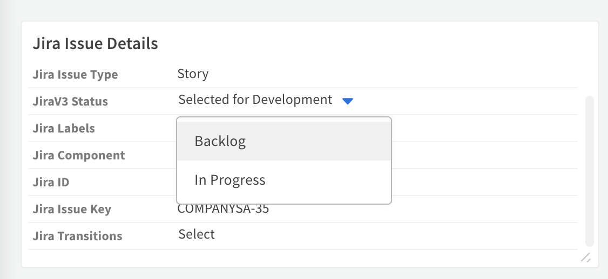
* **Jira Estimate** - Shows the estimate of the Jira issue. The field can also be edited and mirrored out. Use the format 2w 4d 6h 45m (w - weeks, d - days, h - hours, m - minutes). Please add the `Time Tracking` field to the screen in your Jira projects in order for this field to work properly.
* **Jira Component** - Shows the components of the Jira issue. The field can also be edited and mirrored out.
* **Source Created By** - Shows the display name, and email of the user who created the Jira issue.
* **Jira Subtask** - Shows the subtasks of the Jira issue in the form of a table.
* **Jira Project** - Shows the project name where the Jira issue resides in.
* **Last Update Time** - Shows the last updated time of the Jira issue.
* **Jira Comment** - Shows the comments of the Jira issue in the form of a table.

#### Modify the incoming mapper

1. Navigate to **Settings** -> **Objects Setup** -> **Classification and Mapping** and click **classifier-mapper-incoming-JiraV3**.
2. Under the Incident Type dropdown, select **JiraV3 Incident**.
3. Change the mapping according to your needs.
4. Save your changes.

#### Modify the outgoing mapper

1. Under **Classification and Mapping**, click **classifier-mapper-outgoing-Jira**.
2. Under **Select Instance** dropdown, select the instance name you want to work with.
The left side of the screen shows the Jira fields to map and the right side of the
screen shows the Cortex XSOAR fields by which you are mapping.
  *Note: If **Select Instance** dropdown is empty, go to the integration's settings and under **Incident Type** select **JiraV3 Incident** and try again.
3. Under **Schema Type**, select **JiraV3 Incident**. The Schema Type represents the Jira entity that
you are mapping to. In our example it is an incident, but it can also be any other kind of ticket that
Jira supports.
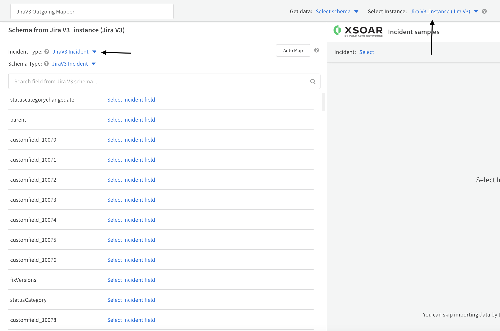
4. Under the **Incident Type** dropdown, select **JiraV3 Incident**.
5. On the right side of the screen, under **Incident**, select the incident based on which you want to
match.
6. Change the mapping according to your needs.
7. Save your changes.

#### Configure the following integration parameters in order to customize the mirroring feature

1. **Mirror Direction**:
    * **Mirror outgoing incidents**: If enabled, any incident data changed in existing fetched incidents will be reflected in the remote Jira server.
    * **Mirror incoming incidents**: If enabled, any incident data changed in the remote Jira server will be reflected in existing fetched incidents.
2. **Fetch incidents**: Should be enabled in order to mirror in, and out new incidents.
3. **Incident type**: In order to mirror out changes, and mirror in incoming changes, provide an incident type that is associated with a layout containing the fields you want to mirror. You can use 'JiraV3 Incident', which already has a built-in layout, and functionality fit for the `JiraV3 Incident` type.
4. **Attachment Entry Tag from Jira**: Choose a tag to add to an attachment entry when mirroring in an attachment from Jira.
5. **Attachment Entry Tag to Jira**: Choose a tag to add to an entry in order to mirror it as an attachment in Jira.
6. **Comment Entry Tag from Jira**: Choose a tag to add to a note entry when mirroring in comments from Jira.
7. **Comment Entry Tag to Jira**: Choose a tag to add to an entry in order to mirror it as a comment in Jira.
8. **Fetch Comments**: Fetch comments for Jira ticket.
9. **Fetch Attachments**: Fetch attachments for Jira ticket.
10. **Close Mirrored XSOAR Incident**: Marking the Jira issue as resolved will be mirrored in Cortex XSOAR, and will close the corresponding incident. Please make sure the `Resolved` field in your Jira instance is configured in order for this to work properly, if not, it will rely on if the status of the issue is changed to `Done`.

#### Simple Mirroring flow

1. Create an incident in Jira. For the purpose of this use case, it can be a very simple incident. In Cortex XSOAR, the new ticket will be ingested in approximately one minute
2. Add a note to the incident, which can be done using the `Add Comment` section in the `JiraV3 Incident Layout`. In the example below, we have written a comment from Cortex XSOAR to Jira.
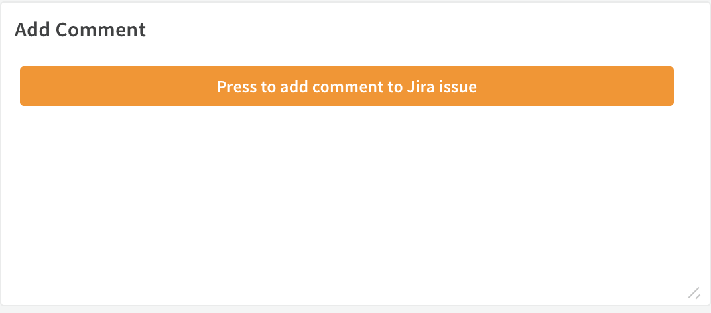
3. Add the **Comment Entry Tag to Jira** tag that you've configured in the instance before. The default is: "comment tag".
4. Add a file to the incident's War Room.
5. Click Actions -> Tags and add the **Attachment Entry Tag to Jira** tag that you've configured in the instance before. The default is: "attachment tag".  
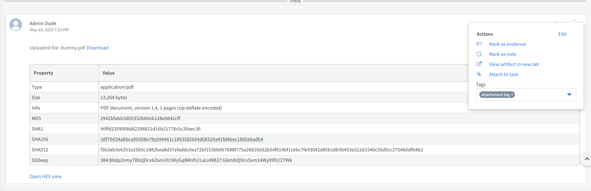
6. Go back to **Incident Info** and locate a field you've configured, or was already configured in the outgoing mapper that is displayed in the incident's layout. Change its value and click 'V' in the 'V/X' menu to save the changes.
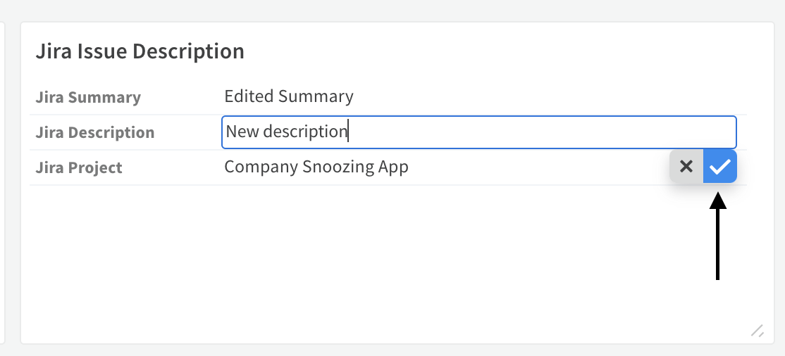
7. Navigate back to the issue in Jira, and within approximately one minute, the changes will be reflected there as well.
8. Change a Jira field you've configured in the incoming mapper.
9. Go back to Cortex XSOAR and within approximately one minute, the changes will be reflected there as well.

#### Simple Comment and Attachment Mirroring flow

##### Mirror out Comment

1. Press on the `Press to add comment to Jira issue` button in the `Add Comment` section.
2. Add a comment and the tag that was configured in the **Comment Entry Tag to Jira** parameter.
3. Once the comment is mirrored out to Jira, it will include the sentence **Mirrored from Cortex XSOAR**, to differentiate between comments mirrored from XSOAR, and normal comments.


##### Mirror in Comment

1. Add a comment inside the Jira issue.
2. The newly added comment will be mirrored in to XSOAR as a note, with the addition of the sentence **Jira Author: {Author name}**, to know the author of the comment, and tagged with the tag configured in **Comment Entry Tag from Jira** parameter.
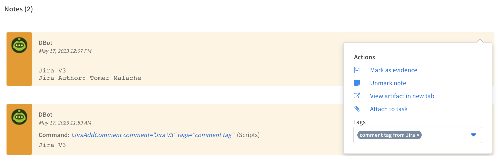

##### Mirror out Attachment

1. Add an attachment to the incident, and add the tag that was configured in the **Attachment Entry Tag to Jira** parameter.
2. Once the attachment is reflected in Jira, the name of the file will have **_mirrored_from_xsoar** in it, to differentiate between attachments mirrored from XSOAR, and normal attachments.

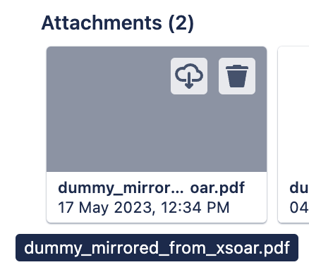

##### Mirror in Attachment

1. Once an attachment is mirrored in from Jira into XSOAR, the attachment will be tagged with the tag configured in **Attahcment Entry Tag from Jira** parameter.
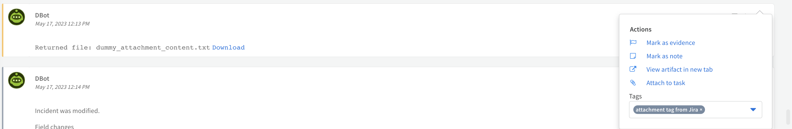

**Notes**

* The final `source of truth` of the incident for Cortex XSOAR are the values in Cortex XSOAR.
  Meaning, if you change the severity in Cortex XSOAR and then change it back in Jira, the final value that will be presented is the one in Cortex XSOAR.
  You can see a list of these fields for each incident under "Context Data" -> "dbotDirtyFields".
* If you wish to mirror in and out Jira's custom fields, please see the [Mirror In And Out Custom Fields](#mirror-in-and-out-custom-fields) section below.
* If you wish to change the status of a JiraV3 Incident using the available transitions, please see the [Change Ticket's Status Using Transitions](#change-tickets-status-using-transitions) section below.
* If you wish to change the status of a JiraV3 Incident using the available statuses, please see the [Change Ticket's Status](#change-tickets-status) section below.

## Mirror In And Out Custom Fields

### Add a new custom field and add it to the incident type&#39;s layout

Add a new custom field and add it to the incident type&#39;s layout:

1.Create a new incident field:

  1. Go to Settings -> Object Setup -> Incident Fields -> New Field
  2. Choose a field type. For example, for a label, you might want to use "Tag" as a type.
  3. Add a short description in the `Tooltip` box (not mandatory).
  4. Click on `Attributes`:  
    - Uncheck `Add to incident types` checkbox.
    - For `Add to associated type`, select the incident type you want to work with, preferably choose `JiraV3 Incident`.
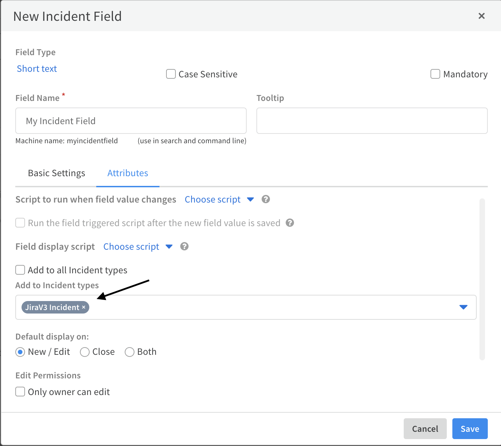

2.Add the new incident field you&#39;ve just created to the layout associated with the integration&#39;s incident type. In this example, the layout is "JiraV3 Incident Layout":
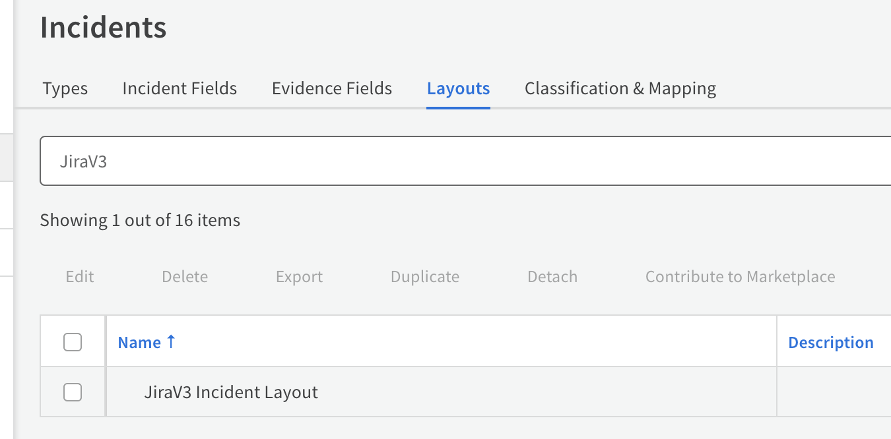

### Add the new field to the incoming mapper

1. Configure the `Atlassian Jira V3` integration, and test the connection of the instance as explained in the [Authentication](#authentication).
2. Make sure that:
    * Under "Incident type" you&#39;ve selected the incident type you want to work with and it is the same one you&#39;ve selected once you created the new field. In our example: `JiraV3 Incident`.
    * The option `Fetch Incidents` is checked.
    * You have filled the respective parameters for the fetch to work, as explained in [Fetch Incidents](#fetch-incidents)
    * The `Mirror Direction` is set to **Incoming And Outgoing**.
    Finally, click `Done`, and wait for new JiraV3 Incidents to be pulled:

3. Once you&#39;ve finished the setup stage, go to the `Mapper (incoming)` field and select the mapper you want to work with by clicking on **Select**:

4. Click on the button next to the `Mapper (incoming)` field in order to edit the selected mapper. It will open the `Incident Incoming Mapping Editor`.
    1.For "Incident Type", please provide the incident type you&#39;ve selected in the integration settings.  
    2.In "Select Instance" choose the name of your instance. You can find it in the integration settings under `Name`.
    Once done, You&#39;ll see on the right side of the screen a JiraV3 Incident.  
    * Note: If you want to work with a specific incident, in `Get data` select the option: `Upload JSON` and provide the wanted incident as JSON.  
    In order to get the incident as JSON, you can see the section: [How to get an incident as JSON](#how-to-get-an-incident-as-json) below.  
    On the left side, You&#39;ll see all JiraV3 Incident fields.
    3.Use "Search Cortex XSOAR field…" in order to find your new incident field by searching its name.  
    4.Once found, click on "Choose data path" and map it to the custom jira field:
        a.Find the jira field you want to map to this incident field on the right side, and click on its value.
        b.Then you will see the path you&#39;ve selected under your new added field:
        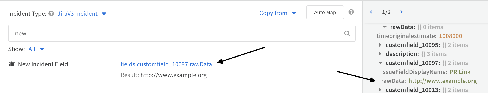
        *Note: In this example: **customfield_10097** is the Jira field ID we want to map. You can find IDs of custom fields for your field in Jira using this guide:[Click Here](https://confluence.atlassian.com/jirakb/how-to-find-id-for-custom-field-s-744522503.html)
        *Note: You can also type the path manually.
5. Click "Save Version".

### Add the new field to the outgoing mapper

1. Got to the configured `Atlassian Jira V3` instance's settings.
2. Go to the `Mapper (outgoing)` field and select the mapper you want to work with by clicking on "Select" (the same process we did with the incoming mapper).
3.
4. Click on the button next to the `Mapper (outgoing)` field in order to edit the selected mapper. It will open the "Incident Outgoing Mapping Editor".
5. In "Select Instance" choose the name of your instance. You can find it in the integration settings under `Name`.
6. Select one incident to work with by specifying it in the `Incident` list.  
    1.On the right side you are now able to see your selected incident.  
    2.On the left side you are able to see all the Jira fields you can map in the system.
7. Search for the Jira field you want to map on the left side. In this example, we want to map **customfield_10097**
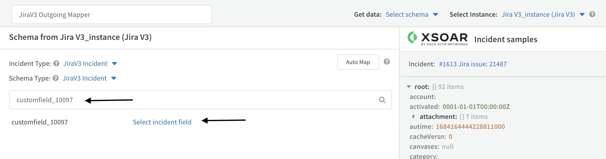
8. Map the Jira field to the incident field you&#39;ve created by clicking on `Select incident field` and type its name.  
*The name of the incident will not include spaces, underscores, capital letters, etc. for example: Jira Transitions will be transformed to "jiratransitions" once saved in the incident&#39;s context (you can see the name you need to select by fetching incidents after configuring the mapper in. In the "Incident" field select one of the new incidents that the edited mapper in has worked on. On the right side you should be able to see the new added field and the name you need to provide).
9. Click the "Save Version" button.

#### How to get an incident as JSON

1. Use the !jira-get-issue command with the raw-response=true parameter. For example: ```!jira-get-issue issue_id=VIK-183 raw-response=true```
2. Click on `view full JSON in a new tab`.
3. Click on `Download as a file`.
4. Open the downloaded file and put its content inside a list, resulting in a list which contains only one item, the downloaded JSON.
5. When selecting `Upload JSON` for `Get data` as mentioned above, you can upload the file using the `Upload JSON` option.

## Change Ticket's Status Using Transitions or Statuses

1. Make sure you're using the 'JiraV3 Incident Layout' for displaying the incident which status you want to change.
 The reason this is required is that this layout is structured in a way that the **script-JiraChangeTransition**, **script-JiraListTransition**, **JiraListStatus**, and **JiraChangeStatus** scripts can work, which is crucial when you want to change the status of the issue.
2. In order to change an incident status, open the incident you would like to update.
3. Under **Incident Info** search for the `Jira Transitions`, or `Jira Status` field.
4. Click on "Select" and choose the name of the transition or status to apply.
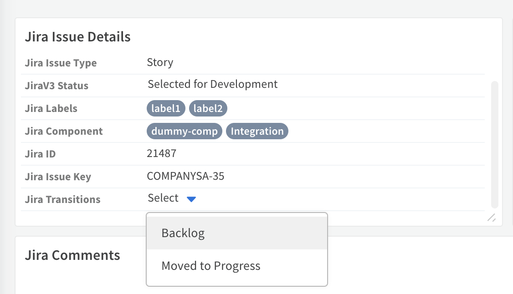

5. Click on the 'V' option in the 'V/X' menu.
6. You can see the new status under 'Jira Status'.
7. Go to Jira, and you will be able to see the new status there as well.

## Breaking changes from the previous version of this integration - Atlassian Jira V3

The following sections list the changes in this version.

### Commands

#### The following commands were removed in this version

* *jira-get-specific-field* - This command was removed, and its functionality is implemented using the *fields* argument in the *jira-get-issue* command.

* *jira-append-to-field* - This command was removed, and its functionality is implemented using the *action* argument when supplying it the value `append` in the *jira-edit-issue* command.

### Arguments

#### The following arguments were removed in this version

In the *jira-get-id-by-attribute* command:

* *is_jirav2api* - The command does not require this argument anymore.

#### The behavior of the following arguments were changed

In the *jira-create-issue* command:

* *issueJson* - This argument will override the other arguments supplied to the command.

In the *jira-edit-issue* command:

* *issueJson* - This argument will override the other arguments supplied to the command.

In the *jira-get-issue* command:

* *get_attachments* - Supplying this argument with the value `true` will return the attachments found in the specified issue as `Entry Info File`, and not as `File`.


### jira-create-metadata-issue-types-list

***
Returns a page of issue type metadata for a specified project.

#### Base Command

`jira-create-metadata-issue-types-list`

#### Input

| **Argument Name** | **Description** | **Required** |
| --- | --- | --- |
| project_id_or_key | The ID or key of the project. | Required | 
| start_at | The index of the first item to return in a page of results (page offset). Default is 0. | Optional | 
| max_results | The maximum number of items to return per page. Between 0 and 200. Default is 50. | Optional | 

#### Context Output

| **Path** | **Type** | **Description** |
| --- | --- | --- |
| Jira.IssueType.AvatarID | Number | The ID of the issue type's avatar. | 
| Jira.IssueType.Description | String | The description of the issue type. | 
| Jira.IssueType.EntityID | String | Unique ID for next-gen projects. | 
| Jira.IssueType.Expand | String | Expand options that include additional issue type metadata details in the response. | 
| Jira.IssueType.IconURL | String | The URL of the issue type's avatar. | 
| Jira.IssueType.ID | String | The ID of the issue type. | 
| Jira.IssueType.Name | String | The name of the issue type. | 
| Jira.IssueType.Self | String | The URL of these issue type details. | 
| Jira.IssueType.Subtask | Boolean | Whether this issue type is used to create subtasks. | 
| Jira.IssueType.Scope | Object | Details of the next-gen projects the issue type is available in. | 
| Jira.IssueType.Scope.type | String | The type of scope. Valid values: PROJECT, TEMPLATE. | 
| Jira.IssueType.Scope.project | Object | The project the item has scope in. | 
| Jira.IssueType.Scope.project.self | String | The URL of the project details. | 
| Jira.IssueType.Scope.project.id | String | The ID of the project. | 
| Jira.IssueType.Scope.project.key | String | The key of the project. | 
| Jira.IssueType.Scope.project.name | String | The name of the project. | 
| Jira.IssueType.Scope.project.projectTypeKey | String | The project type of the project. Valid values: software, service_desk, business. | 
| Jira.IssueType.Scope.project.simplified | Boolean | Whether or not the project is simplified. | 
| Jira.IssueType.Scope.project.avatarUrls | Object | The URLs of the project's avatars. | 
| Jira.IssueType.Scope.project.projectCategory | Object | The category the project belongs to. | 
| Jira.IssueType.Scope.project.projectCategory.self | String | The URL of the project category. | 
| Jira.IssueType.Scope.project.projectCategory.id | String | The ID of the project category. | 
| Jira.IssueType.Scope.project.projectCategory.description | String | The name of the project category. | 
| Jira.IssueType.Scope.project.projectCategory.name | String | The description of the project category. | 

### jira-create-metadata-field-list

***
Returns a page of field metadata for a specified project and issue type.

#### Base Command

`jira-create-metadata-field-list`

#### Input

| **Argument Name** | **Description** | **Required** |
| --- | --- | --- |
| project_id_or_key | The ID or key of the project. | Required | 
| issue_type_id | The issue type ID. | Required | 
| start_at | The index of the first item to return in a page of results (page offset). Default is 0. | Optional | 
| max_results | The maximum number of items to return per page. Between 0 and 200. Default is 50. | Optional | 

#### Context Output

| **Path** | **Type** | **Description** |
| --- | --- | --- |
| Jira.IssueField.AllowedValues | Array | The list of values allowed in the field. | 
| Jira.IssueField.AutoCompleteUrl | String | The URL that can be used to automatically complete the field. | 
| Jira.IssueField.Configuration | Object | The configuration properties. | 
| Jira.IssueField.DefaultValue | String | The default value of the field. | 
| Jira.IssueField.FieldID | String | The field ID. | 
| Jira.IssueField.HasDefaultValue | Boolean | Whether the field has a default value. | 
| Jira.IssueField.Key | String | The key of the field. | 
| Jira.IssueField.Name | String | The name of the field. | 
| Jira.IssueField.Operations | Array | The list of operations that can be performed on the field. | 
| Jira.IssueField.Required | Boolean | Whether the field is required. | 
| Jira.IssueField.Schema | Object | The data type for the field. | 
| Jira.IssueField.Schema.type | String | The data type of the field. | 
| Jira.IssueField.Schema.items | String | When the data type is an array, the name of the field items within the array. | 
| Jira.IssueField.Schema.system | String | If the field is a system field, the name of the field. | 
| Jira.IssueField.Schema.custom | String | If the field is a custom field, the URI of the field. | 
| Jira.IssueField.Schema.customId | Number | If the field is a custom field, the custom ID of the field. | 
| Jira.IssueField.Schema.configuration | Object | If the field is a custom field, the configuration of the field. | 
