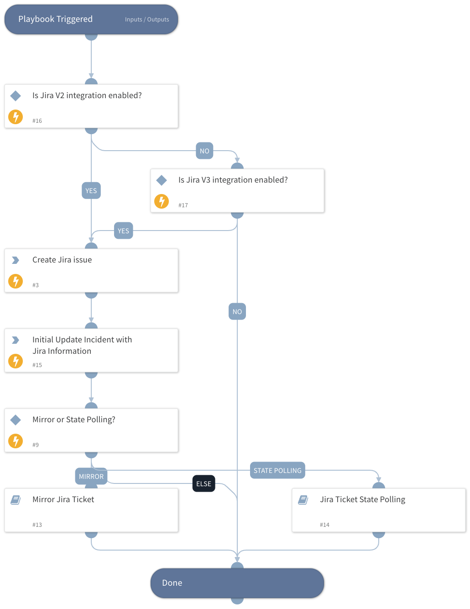

Create Jira issue allows you to open new issues.
When creating the issue, you can decide to update based on on the issue’s state, which will wait for the issue to resolve or close with StatePolling.
Alternatively, you can select to mirror the Jira issue and incident fields.  To apply either of these options, set the SyncTicket value in the playbook inputs to one of the following options:
StatePolling
Mirror
Leave Blank to use none
When creating Jira issues through XSOAR, using the mirroring function, make sure that you exclude those issues when fetching incidents. To exclude these issues, tag the relevant issues with a dedicated label and exclude that label from the JQL query (Labels!=).

## Dependencies
This playbook uses the following sub-playbooks, integrations, and scripts.

### Sub-playbooks
* Jira Ticket State Polling
* Mirror Jira Ticket

### Integrations
* JiraV2

### Scripts
* IsIntegrationAvailable

### Commands
* jira-create-issue
* jira-get-issue

## Playbook Inputs
---

| **Name** | **Description** | **Default Value** | **Required** |
| --- | --- | --- | --- |
| Summary | Set the summary of the ticket. |  | Required |
| Description | Set the description of the ticket. |  | Optional |
| ProjectKey | Jira Project Key |  | Required |
| IssueTypeName | TaskName |  | Required |
| SyncTicket | Set the value of the desired sync method with Jira Issue. you can choose one of three options: 1. StatePolling 2. Mirror  3. Blank for none   GenericPolling polls for the state of the ticket and runs until the ticket state is either resolved or closed.   Mirror - You can use the Mirror option to perform a full sync with the Jira Ticket. The ticket data is synced automatically between Jira and Cortex xSOAR with the Jira mirror feature. If this option is selected, FieldPolling is true by default.  |  | Optional |
| PollingInterval | Set interval time for the polling to run \(In minutes\) |  | Optional |
| PollingTimeout | Set the amount of time to poll the status of the ticket before declaring a timeout and resuming the playbook. \(In minutes\) |  | Optional |
| AdditionalPollingCommandName | In this use case, Additional polling commands are relevant when using StatePolling, and there is more than one Jira instance. It will specify the polling command to use a specific instance to run on.  If so, please add "Using" to the value.  The playbook will then take the instance name as the instance to use.  |  | Optional |
| InstanceName | Set the Jira Instance that will be used for mirroring/running polling commands.  |  | Optional |
| MirrorDirection | Set the mirror direction, should be one of the following:  1. In 2. Out 3. Both | Both | Optional |
| MirrorTags | Set tags for mirror comments and files to Jira. As defined in the instance settings, by default it will be comment for comments mirroring and attachment for attachments mirroring.  | comment,attachment | Optional |
| FieldPolling | Set the value to true or false to determine if the playbook will execute the FieldPolling sub playbook. This is useful when a playbook needs to wait for the Jira ticket to be resolved before continuing the parent playbook. FieldPolling will run until the ticket state is either resolved or closed |  | Optional |
| IssueLabel | Add labels to the issue.  |  | Optional |

## Playbook Outputs
---
There are no outputs for this playbook.

## Playbook Image
---
