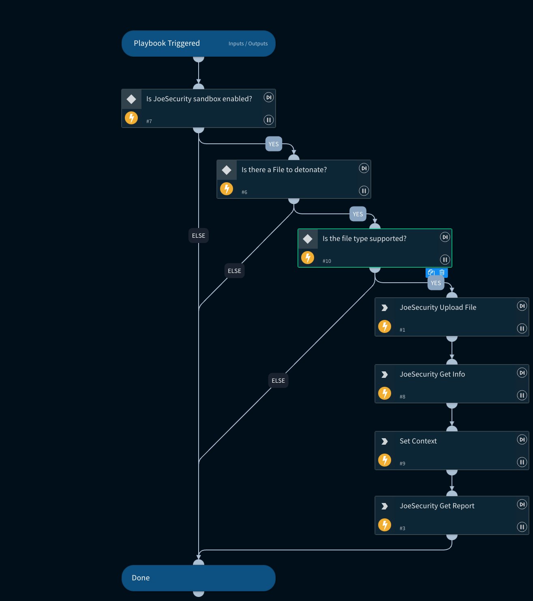

The Detonate File using Joe Sandbox Process is designed to streamline and enhance the security assessment of files. This automated system accepts a user-submitted file, sends it for in-depth analysis using Joe Sandbox technology, and returns comprehensive results as attachments to the user. The process is designed to be swift, efficient, and secure, providing users with valuable insights into potential threats and vulnerabilities within their files.

## Dependencies

This playbook uses the following sub-playbooks, integrations, and scripts.

### Sub-playbooks

This playbook does not use any sub-playbooks.

### Integrations

* JoeSecurityV2

### Scripts

* Set

### Commands

* joe-download-report
* joe-submit-sample
* joe-analysis-info

## Playbook Inputs

---

| **Name** | **Description** | **Default Value** | **Required** |
| --- | --- | --- | --- |
| File | File object of the file to detonate. The File is taken from the context. | File | Optional |
| Timeout | The duration after which to stop pooling and to resume the playbook \(in minutes\) | 1500 | Optional |
| Systems | Operating system to run the analysis on \(comma-separated\). Supported values are: w7, w7x64, w7_1, w7_2, w7native, android2, android3, mac1, w7l, w7x64l, w10, android4, w7x64native, w7_3, w10native, android5native_1, w7_4, w7_5, w10x64, w7x64_hvm, android6, iphone1, w7_sec, macvm, w7_lang_packs, w7x64native_hvm, lnxubuntu1, lnxcentos1, android7_nougat \(if no input is provided, the default is w10x64_office\) |  | Optional |
| Comments | Comments for the analysis. |  | Optional |
| ReportFileType | The resource type to download. Default is html. Supported values are: html, lighthtml, executive, pdf, classhtml, xml, lightxml, classxml, clusterxml, irxml, json, jsonfixed, lightjson, lightjsonfixed, irjson, irjsonfixed, shoots \(screenshots\), openioc, maec, misp, graphreports, memstrings, binstrings, sample, cookbook, bins \(dropped files\), unpackpe \(unpacked PE files\), unpack, ida, pcap, pcapslim, memdumps, yara |  | Optional |

## Playbook Outputs

---

| **Path** | **Description** | **Type** |
| --- | --- | --- |
| DBotScore.Vendor | The vendor used to calculate the score. | string |
| Joe.Analysis.ID | Web ID. | string |
| Joe.Analysis.Status | Analysis Status. | string |
| Joe.Analysis.Comments | Analysis Comments. | string |
| Joe.Analysis.Time | Submitted Time. | date |
| Joe.Analysis.Runs | Sub-Analysis Information. | unknown |
| Joe.Analysis.Result | Analysis Results. | string |
| Joe.Analysis.Errors | Raised errors during sampling. | unknown |
| Joe.Analysis.Systems | Analysis OS. | unknown |
| Joe.Analysis.MD5 | MD5 of analysis sample. | string |
| Joe.Analysis.SHA1 | SHA1 of analysis sample. | string |
| Joe.Analysis.SHA256 | SHA256 of analysis sample. | string |
| Joe.Analysis.SampleName | Sample Data, could be a file name or URL. | string |
| DBotScore.Indicator | The indicator that was tested. | string |
| DBotScore.Type | The indicator type. | string |
| DBotScore.Score | The actual score. | number |
| DBotScore.Malicious.Vendor | The vendor used to calculate the score. | string |
| DBotScore.Malicious.Detections | The sub analysis detection statuses. | string |
| DBotScore.Malicious.SHA1 | The SHA1 of the file. | string |
| InfoFile.Name | FileName. | string |
| InfoFile.EntryID | The EntryID of the sample. | string |
| InfoFile.Size | File Size. | number |
| InfoFile.Type | File type e.g. "PE". | string |
| InfoFile.Info | Basic information of the file. | string |
| File.Extension | File Extension. | string |
| InfoFile | Report file object. | unknown |
| File | File object. | unknown |
| Joe.Analysis | Joe Analysis object. | unknown |
| DBotScore | DBotScore object. | unknown |
| DBotScore.Malicious | DBotScore Malicious object. | unknown |
| File.MD5 | The MD5 hash of the file. | unknown |
| File.Name | The full file name. | unknown |
| File.SHA1 | The SHA1 hash of the file. | unknown |
| File.SHA256 | The SHA256 hash of the file. | unknown |

## Playbook Image

---

