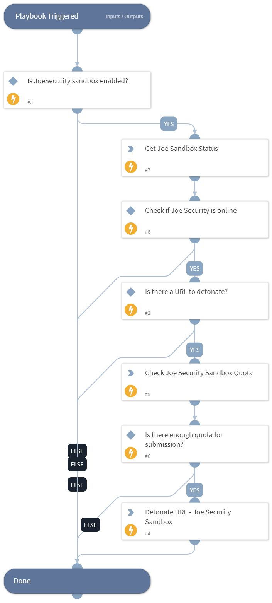

This playbook uploads, detonates, and analyzes URLs for the JoeSecurity Sandbox.

## Dependencies

This playbook uses the following sub-playbooks, integrations, and scripts.

### Sub-playbooks

This playbook does not use any sub-playbooks.

### Integrations

* JoeSecurityV2

### Scripts

* IsIntegrationAvailable

### Commands

* joe-is-online
* joe-submit-url
* joe-get-account-quota

## Playbook Inputs

---

| **Name** | **Description** | **Default Value** | **Required** |
| --- | --- | --- | --- |
| URL | The details of the URL to detonate |  | Optional |
| Interval | Duration for executing the pooling \(in minutes\). | 1 | Optional |
| Timeout | The duration after which to stop pooling and to resume the playbook \(in minutes\). | 1200 | Optional |
| Systems | Comma-separated list of operating systems to run the analysis on. Supported values are: w7, w7x64, w7_1, w7_2, w7native, android2, android3, mac1, w7l, w7x64l, w10, android4, w7x64native, w7_3, w10native, android5native_1, w7_4, w7_5, w10x64, w7x64_hvm, android6, iphone1, w7_sec, macvm, w7_lang_packs, w7x64native_hvm, lnxubuntu1, lnxcentos1, android7_nougat |  | Optional |
| Comments | Comments for the analysis. |  | Optional |
| InternetAccess | Enable internet access \(boolean\). True= internet access \(default\), False= no internet access. | True | Optional |
| ReportFileType | The resource type to download. Default is html. Supported values are: html, lighthtml, executive, pdf, classhtml, xml, lightxml, classxml, clusterxml, irxml, json, jsonfixed, lightjson, lightjsonfixed, irjson, irjsonfixed, shoots \(screenshots\), openioc, maec, misp, graphreports, memstrings, binstrings, sample, cookbook, bins \(dropped files\), unpackpe \(unpacked PE files\), unpack, ida, pcap, pcapslim, memdumps, yara |  | Optional |
| Cookbook | Uploads a cookbook together with the sample. Needs to be a file-like object or a tuple in the format \(filename, file-like object\). |  | Optional |
| FullDisplay | If set to true, will display the full indicators and dbot_scores. If set to false, will display only the summary. | True | Optional |
| Tags | A comma-separated list of tags to be added to the analysis. |  | Optional |
| SSLInspection | Whether to enable SSL inspection. | False | Optional |
| HybridCodeAnalysis | Whether to enable hybrid code analysis. | True | Optional |
| FastMode | Whether to enable fast mode. Focuses on fast analysis and detection versus deep forensic analysis. | false | Optional |
| CommandLineArgument | A command line argument is to be passed to the sample. |  | Optional |
| LiveInteraction | Whether to enable live interaction. | False | Optional |
| DocumentPassword | The document password. |  | Optional |
| ArchivePassword | An archive password. |  | Optional |
| EmailNotification | Send an email notification once the analysis completes. | False | Optional |
| StartAsNormalUser | Whether to start the analysis as a normal user. | False | Optional |
| EncryptWithPassword | The password to encrypt the analysis with. |  | Optional |

## Playbook Outputs

---

| **Path** | **Description** | **Type** |
| --- | --- | --- |
| DBotScore | The DBot score of the suspicious URL | unknown |
| Joe.Analysis | The sandbox analysis details | unknown |
| Joe.Submission.most_relevant_analysis | The URL verdict of the sandbox analysis | unknown |

## Playbook Image

---

