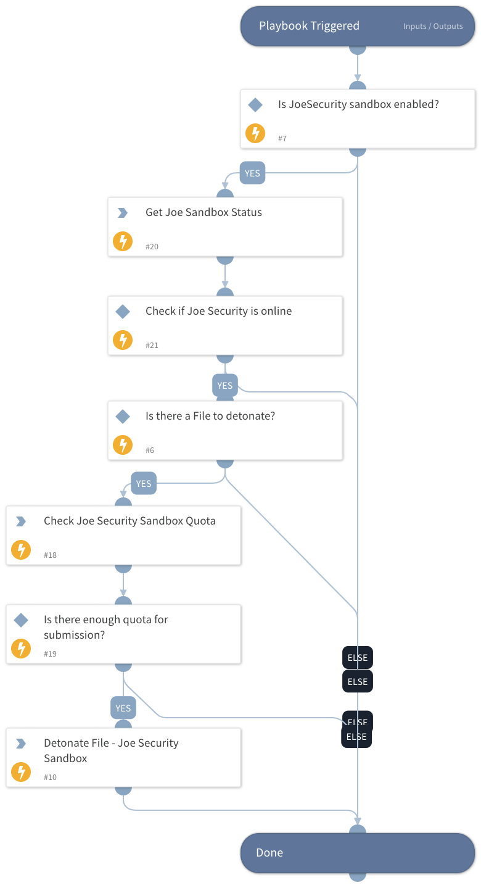

Detonates one or more files using the Joe Security - Joe Sandbox integration.
Returns relevant reports to the War Room and file reputations to the context data.
All file types are supported.

## Dependencies
This playbook uses the following sub-playbooks, integrations, and scripts.

### Sub-playbooks
This playbook does not use any sub-playbooks.

### Integrations
JoeSecurityV2

### Scripts
IsIntegrationAvailable

### Commands
* joe-get-account-quota
* joe-is-online
* joe-submit-sample

## Playbook Inputs
---

| **Name** | **Description** | **Default Value** | **Required** |
| --- | --- | --- | --- |
| File | File object of the file to detonate. The file is taken from the context. | File | Optional |
| Interval | Duration for executing the pooling \(in minutes\). | 1 | Optional |
| Timeout | The duration after which to stop pooling and to resume the playbook \(in minutes\). | 1200 | Optional |
| Systems | Comma-separated list of operating systems to run the analysis on. Supported values are: w7, w7x64, w7_1, w7_2, w7native, android2, android3, mac1, w7l, w7x64l, w10, android4, w7x64native, w7_3, w10native, android5native_1, w7_4, w7_5, w10x64, w7x64_hvm, android6, iphone1, w7_sec, macvm, w7_lang_packs, w7x64native_hvm, lnxubuntu1, lnxcentos1, android7_nougat |  | Optional |
| Comments | Comments for the analysis. |  | Optional |
| InternetAccess | Enable internet access \(boolean\). True= internet access \(default\), False= no internet access. | True | Optional |
| ReportFileType | The resource type to download. Default is html. Supported values are: html, lighthtml, executive, pdf, classhtml, xml, lightxml, classxml, clusterxml, irxml, json, jsonfixed, lightjson, lightjsonfixed, irjson, irjsonfixed, shoots \(screenshots\), openioc, maec, misp, graphreports, memstrings, binstrings, sample, cookbook, bins \(dropped files\), unpackpe \(unpacked PE files\), unpack, ida, pcap, pcapslim, memdumps, yara |  | Optional |
| Cookbook | Uploads a cookbook together with the sample. Needs to be a file-like object or a tuple in the format \(filename, file-like object\) |  | Optional |
| FullDisplay | If set to true, will display the full indicators and dbot_scores. If set to false, will display only the summary. | True | Optional |
| Tags | A comma-separated list of tags to be added to the analysis. |  | Optional |
| SSLInspection | Whether to enable SSL inspection. | False | Optional |
| HybridCodeAnalysis | Whether to enable hybrid code analysis. | True | Optional |
| FastMode | Whether to enable fast mode. Focuses on fast analysis and detection versus deep forensic analysis. | false | Optional |
| CommandLineArgument | A command line argument is to be passed to the sample. |  | Optional |
| LiveInteraction | Whether to enable live interaction. | False | Optional |
| DocumentPassword | The document password. |  | Optional |
| ArchivePassword | An archive password. |  | Optional |
| EmailNotification | Send an email notification once the analysis completes. | False | Optional |
| StartAsNormalUser | Whether to start the analysis as a normal user. | False | Optional |
| EncryptWithPassword | The password to encrypt the analysis with. |  | Optional |

## Playbook Outputs
---

| **Path** | **Description** | **Type** |
| --- | --- | --- |
| DBotScore.Vendor | The vendor used to calculate the score. | string |
| Joe.Analysis.ID | Web ID. | string |
| Joe.Analysis.Status | Analysis status. | string |
| Joe.Analysis.Comments | Analysis comments. | string |
| Joe.Analysis.Time | Submitted time. | date |
| Joe.Analysis.Runs | Sub-Analysis information. | unknown |
| Joe.Analysis.Result | Analysis results. | string |
| Joe.Analysis.Errors | Raised errors during sampling. | unknown |
| Joe.Analysis.Systems | Analysis operating system. | unknown |
| Joe.Analysis.MD5 | MD5 hash of analysis sample. | string |
| Joe.Analysis.SHA1 | SHA1 hash of analysis sample. | string |
| Joe.Analysis.SHA256 | SHA256 hash of analysis sample. | string |
| Joe.Analysis.SampleName | Sample data. Can be a file name or URL.| string |
| DBotScore.Indicator | The indicator that was tested. | string |
| DBotScore.Type | The indicator type. | string |
| DBotScore.Score | The actual score. | number |
| DBotScore.Malicious.Vendor | The vendor used to calculate the score. | string |
| DBotScore.Malicious.Detections | The sub-analysis detection statuses. | string |
| DBotScore.Malicious.SHA1 | The SHA1 hash of the file. | string |
| InfoFile.Name | File name. | string |
| InfoFile.EntryID | The entry ID of the sample. | string |
| InfoFile.Size | File size. | number |
| InfoFile.Type | File type, e.g., "PE". | string |
| InfoFile.Info | Basic information of the file. | string |
| File.Extension | File extension. | string |
| InfoFile | Report file object. | unknown |
| File | File object. | unknown |
| Joe.Analysis | Joe analysis object. | unknown |
| DBotScore | DBotScore object. | unknown |
| DBotScore.Malicious | DBotScore malicious object. | unknown |
| DBotScore.Reliability | Reailbilty of the score itself. | unknown |
| File.Hashes | The hashes of the file. | unknown |
| File.Hashes.type | Types of the hashes. | unknown |
| File.Hashes.value | Hash value. | unknown |
| File.MD5 | MD5 hash value. | unknown |
| File.Name | File name. | unknown |
| File.SHA1 | SHA1 hash value. | unknown |
| File.SHA256 | SHA256 hash value. | unknown |
| Joe.Analysis.analysisid | Joe Security Sandbox analysis ID value. | unknown |
| Joe.Analysis.classification | Joe Security Sandbox analysis classification. | unknown |
| Joe.Analysis.comments | Joe Security Sandbox analysis comments \(if any\). | unknown |
| Joe.Analysis.detection | Joe Security Sandbox analysis detection. | unknown |
| Joe.Analysis.duration | Joe Security Sandbox analysis duration. | unknown |
| Joe.Analysis.encrypted | Joe Security Sandbox value that indicates if the results are encrypted. | unknown |
| Joe.Analysis.filename | The filename information listed in the analysis. | unknown |
| Joe.Analysis.md5 | MD5 hash value. | unknown |
| Joe.Analysis.score | Joe Security Sandbox score for the anlaysis. | unknown |
| Joe.Analysis.scriptname | Joe Security Sandbox anlysis script name. | unknown |
| Joe.Analysis.sha1 | SHA1 hash value. | unknown |
| Joe.Analysis.sha256 | SHA256 hash value. | unknown |
| Joe.Analysis.status | Anlaysis Status in Joe Security Sandbox. | unknown |
| Joe.Analysis.threatname | Threat name assoicated with the Joe Security Sandbox analysis verdict. | unknown |
| Joe.Analysis.time | Analysis time. | unknown |
| Joe.Analysis.webid | WebID value for the analysis in Joe Security Sandbox. | unknown |
| Joe.Analysis.runs | Analysis running informaiotn. | unknown |
| Joe.Analysis.runs.detection | Detection in that particular run. | unknown |
| Joe.Analysis.runs.error | Indicates if any errors occured during the analysis. | unknown |
| Joe.Analysis.runs.score | Analysis score for that particular run. | unknown |
| Joe.Analysis.runs.sigma | Sigma value. | unknown |
| Joe.Analysis.runs.snort | Any snort detected rules. | unknown |
| Joe.Analysis.runs.system | The system that was involved in the analysis. | unknown |
| Joe.Analysis.runs.yara | Detected YARA rules | unknown |
| Joe.Submission.most_relevant_analysis | Joe Security Sandbox most relevant analysis information. | unknown |
| Joe.Submission.most_relevant_analysis.detection | Joe Security Sandbox most relevant analysis detection. | unknown |
| Joe.Submission.most_relevant_analysis.score | Joe Security Sandbox most relevant analysis score. | unknown |
| Joe.Submission.most_relevant_analysis.webid | Joe Security Sandbox most relevant analysis web ID. | unknown |
| Joe.Submission | Joe Security Sandbox submission information. | unknown |
| Joe.Submission.name | Joe Security Sandbox submission name. | unknown |
| Joe.Submission.status | Joe Security Sandbox Ssbmission status. | unknown |
| Joe.Submission.submission_id | Joe Security Sandbox submission submission ID. | unknown |
| Joe.Submission.time | Joe Security Sandbox submission time. | unknown |
| Joe | Joe Secuirity Sandbox information. | unknown |
| Joe.AccountQuota | The account quota. | unknown |
| Joe.AccountQuota.quota.daily | The current daily quota information. | unknown |
| Joe.AccountQuota.quota.daily.current | The current daily quota. | unknown |
| Joe.AccountQuota.quota.daily.limit | The daily quota limit. | unknown |
| Joe.AccountQuota.quota.daily.remaining | The remaining daily quota. | unknown |
| Joe.AccountQuota.quota.monthly | The remaining monthly quota information. | unknown |
| Joe.AccountQuota.quota.monthly.current | The current monthly quota. | unknown |
| Joe.AccountQuota.quota.monthly.limit | The monthly quota limit. | unknown |
| Joe.AccountQuota.quota.monthly.remaining | The remaining monthly quota. | unknown |
| Joe.AccountQuota.type | The quota type. | unknown |
| Joe.ServerStatus.Online | The server status. | unknown |
| Joe.ServerStatus | Joe Security Sandbox server Status. | unknown |

## Playbook Image
---

