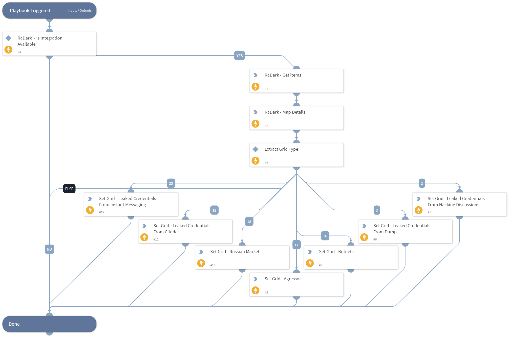

Enriches RaDark incident with detailed items.

## Dependencies
This playbook uses the following sub-playbooks, integrations, and scripts.

### Sub-playbooks
* Set RaDark Grid For Compromised Accounts
* Set RaDark Grid For Hacking Discussions
* Set RaDark Grid For Credit Cards
* Set RaDark Grid For Leaked Credentials 
* Set RaDark Grid For Network Vulnerabilities

### Integrations
* RaDark

### Scripts
* IsIntegrationAvailable
* MapRaDarkIncidentDetails

### Commands
* radark-incident-get-items

## Playbook Inputs
---
There are no inputs for this playbook.

## Playbook Outputs
---
There are no outputs for this playbook.

## Playbook Image
---
