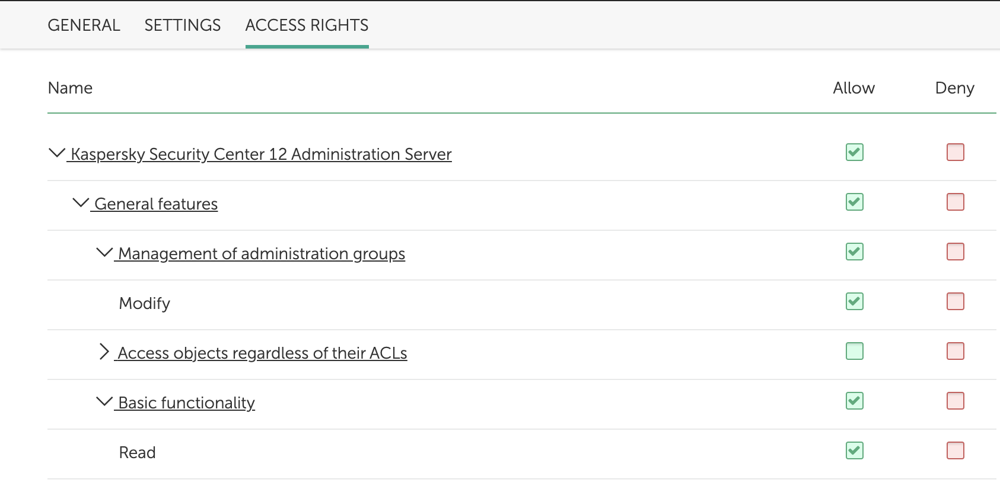

The administration console for controlling all Kaspersky Lab security solutions and system administration tools.

This integration was integrated and tested with version 12 of Kaspersky Security Center.

**Note**: The integration is in beta because it only covers a subset of the endpoints and API use cases.

## Prerequisites

The user should be assigned to a role with the relevant devices in scope, and the following access rights:
- Basic functionality - Read
- Management of administration groups - Modify

    

## Configure Kaspersky Security Center in Cortex


| **Parameter** | **Required** |
| --- | --- |
| Server URL (e.g., https://kaspersky.domain.com:13299) | True |
| Username | True |
| Password | True |
| Trust any certificate (not secure) | False |
| Use system proxy settings | False |

## Commands
You can execute these commands from the CLI, as part of an automation, or in a playbook.
After you successfully execute a command, a DBot message appears in the War Room with the command details.
### ksc-hosts-list
***
Returns a list of hosts.


#### Base Command

`ksc-hosts-list`
#### Input

| **Argument Name** | **Description** | **Required** |
| --- | --- | --- |
| filter | Filter which contains a condition over host attributes, e.g., KLHST_WKS_OS_NAME = "Microsoft Windows Server 2016". See the integration documentation for the search filter syntax. | Optional | |
| limit | The maximum number of hosts to return. Default is 50. | Optional | |

#### Context Output

| **Path** | **Type** | **Description** |
| --- | --- | --- |
| KasperskySecurityCenter.Host.KLHST_WKS_DN | String | Host display name. |
| KasperskySecurityCenter.Host.KLHST_WKS_DNSDOMAIN | String | DNS suffix. | 
| KasperskySecurityCenter.Host.KLHST_WKS_DNSNAME | String | DNS name without DNS suffix. | 
| KasperskySecurityCenter.Host.KLHST_WKS_FQDN | String | Host FQDN name. | 
| KasperskySecurityCenter.Host.KLHST_WKS_GROUPID | String | ID of administration group where host is located. | 
| KasperskySecurityCenter.Host.KLHST_WKS_HOSTNAME | String | Host name ID. | 
| KasperskySecurityCenter.Host.KLHST_WKS_OS_NAME | String | Operating system name. | 


#### Command Example
```!ksc-hosts-list filter=KLHST_WKS_OS_NAME = "Microsoft Windows Server 2016"```

#### Context Example
```json
{
    "KasperskySecurityCenter": {
        "Host": {
            "KLHST_WKS_DN": "EC2AMAZ-U66K3KL",
            "KLHST_WKS_DNSDOMAIN": "eu-west-2.compute.internal",
            "KLHST_WKS_DNSNAME": "ip-172-32-34-237",
            "KLHST_WKS_FQDN": "ip-172-32-34-237.eu-west-2.compute.internal",
            "KLHST_WKS_GROUPID": 0,
            "KLHST_WKS_HOSTNAME": "4328e16f-bf83-47c3-8d0b-0fdf79f9d673",
            "KLHST_WKS_OS_NAME": "Microsoft Windows Server 2016"
        }
    }
}
```

#### Human Readable Output

>### Hosts List
>|KLHST_WKS_HOSTNAME|KLHST_WKS_DN|KLHST_WKS_OS_NAME|KLHST_WKS_FQDN|
>|---|---|---|---|
>| 4328e16f-bf83-47c3-8d0b-0fdf79f9d673 | EC2AMAZ-U66K3JK |	Microsoft Windows Server 2016 | ip-172-32-34-237.eu-west-2.compute.internal |


### ksc-host-get
***
Returns details of a host


#### Base Command

`ksc-host-get`
#### Input

| **Argument Name** | **Description** | **Required** |
| --- | --- | --- |
| hostname | The unique hostname GUID to retrieve the details of. Can be retrieved using the ksc-hosts-list command. | Required | 


#### Context Output

| **Path** | **Type** | **Description** |
| --- | --- | --- |
| Endpoint.ID | String | The unique ID within the tool retrieving the endpoint. |
| Endpoint.OS | String | Endpoint OS. |
| Endpoint.Hostname | String | The hostname that is mapped to this endpoint. |
| Endpoint.Domain | String | The domain of the endpoint. |
| KasperskySecurityCenter.Host.KLHST_WKS_DN | String | Host display name. |
| KasperskySecurityCenter.Host.KLHST_INSTANCEID | String | Network agent ID. | 
| KasperskySecurityCenter.Host.KLHST_WKS_DNSDOMAIN | String | DNS suffix. | 
| KasperskySecurityCenter.Host.KLHST_WKS_DNSNAME | String | DNS name without DNS suffix. | 
| KasperskySecurityCenter.Host.KLHST_WKS_FQDN | String | Host FQDN name. | 
| KasperskySecurityCenter.Host.KLHST_WKS_GROUPID | String | ID of administration group where host is located. | 
| KasperskySecurityCenter.Host.KLHST_WKS_HOSTNAME | String | Host name ID. | 
| KasperskySecurityCenter.Host.KLHST_WKS_OS_NAME | String | Operating system name. | 
| KasperskySecurityCenter.Host.KLHST_WKS_ANTI_SPAM_STATUS | Number | Product component status. | 
| KasperskySecurityCenter.Host.KLHST_WKS_COLLAB_SRVS_STATUS | Number | Collaboration servers protection status. | 
| KasperskySecurityCenter.Host.KLHST_WKS_CPU_ARCH | Number | CPU architecture from the operating system point of view \(since KSC 10 SP1\). | 
| KasperskySecurityCenter.Host.KLHST_WKS_CREATED.value | Date | Time of host record creation. | 
| KasperskySecurityCenter.Host.KLHST_WKS_CTYPE | Number | Computer type. | 
| KasperskySecurityCenter.Host.KLHST_WKS_DLP_STATUS | Number | DLP status. | 
| KasperskySecurityCenter.Host.KLHST_WKS_EDR_STATUS | Number | EDR component status. | 
| KasperskySecurityCenter.Host.KLHST_WKS_LAST_VISIBLE.value | Date | Last host visibility time. | 
| KasperskySecurityCenter.Host.KLHST_WKS_NAG_VERSION | String | Network agent build number in format A.B.C\[.D\]. | 
| KasperskySecurityCenter.Host.KLHST_WKS_NAG_VER_ID | Number | Network Agent version ID. | 
| KasperskySecurityCenter.Host.KLHST_WKS_OSSP_VER_MAJOR | Number | Service Pack version major part \(since KSC 10 SP1\). | 
| KasperskySecurityCenter.Host.KLHST_WKS_OSSP_VER_MINOR | Number | Service Pack version minor part \(since KSC 10 SP1\). | 
| KasperskySecurityCenter.Host.KLHST_WKS_OS_BUILD_NUMBER | Number | Operating system version build number. | 
| KasperskySecurityCenter.Host.KLHST_WKS_OS_RELEASE_ID | Number | Operating system version release ID \(for Windows 10\). | 
| KasperskySecurityCenter.Host.KLHST_WKS_OWNER_IS_CUSTOM | Boolean | If owner was changed via UpdateHostwith KLHST_WKS_CUSTOM_OWNER_ID. | 
| KasperskySecurityCenter.Host.KLHST_WKS_PTYPE | Number | Platform type. | 
| KasperskySecurityCenter.Host.KLHST_WKS_RBT_REQUEST_REASON | Number | Reboot request reasons mask. | 
| KasperskySecurityCenter.Host.KLHST_WKS_RBT_REQUIRED | Boolean | If reboot is required. | 
| KasperskySecurityCenter.Host.KLHST_WKS_RTP_AV_BASES_TIME.value | Date | Anti-virus bases time. | 
| KasperskySecurityCenter.Host.KLHST_WKS_RTP_AV_VERSION | String | Protection build number in format A.B.C\[.D\]. | 
| KasperskySecurityCenter.Host.KLHST_WKS_STATUS | Number | Host status. | 


#### Command Example
```!ksc-host-get hostname="4328e16f-bf83-47c3-8d0b-0fdf79f9d673"```

#### Context Example
```json
{
    "Endpoint": {
        "ID": "4328e16f-bf83-47c3-8d0b-0fdf79f9d673",
        "OS": "Microsoft Windows Server 2016",
        "Hostname": "EC2AMAZ-U66K3L",
        "Domain": "eu-west-2.compute.internal"
    },
    "KasperskySecurityCenter": {
        "Host": {
            "KLHST_INSTANCEID": "025ed285-389b-44c5-a9ef-6e723f7d9466",
            "KLHST_WKS_ANTI_SPAM_STATUS": 0,
            "KLHST_WKS_COLLAB_SRVS_STATUS": 0,
            "KLHST_WKS_CPU_ARCH": 2,
            "KLHST_WKS_CREATED": {
                "type": "datetime",
                "value": "2021-02-23T10:14:33Z"
            },
            "KLHST_WKS_CTYPE": 36871,
            "KLHST_WKS_DLP_STATUS": 0,
            "KLHST_WKS_DN": "EC2AMAZ-U66K3L",
            "KLHST_WKS_DNSDOMAIN": "eu-west-2.compute.internal",
            "KLHST_WKS_DNSNAME": "ip-172-32-34-237",
            "KLHST_WKS_EDR_STATUS": 0,
            "KLHST_WKS_EMAIL_AV_STATUS": 0,
            "KLHST_WKS_FQDN": "ip-172-32-34-237.eu-west-2.compute.internal",
            "KLHST_WKS_GROUPID": 0,
            "KLHST_WKS_HOSTNAME": "4328e16f-bf83-47c3-8d0b-0fdf79f9d673",
            "KLHST_WKS_LAST_VISIBLE": {
                "type": "datetime",
                "value": "2021-03-23T08:55:52Z"
            },
            "KLHST_WKS_NAG_VERSION": "12.2.0.4376",
            "KLHST_WKS_NAG_VER_ID": 786434,
            "KLHST_WKS_OSSP_VER_MAJOR": 0,
            "KLHST_WKS_OSSP_VER_MINOR": 0,
            "KLHST_WKS_OS_BUILD_NUMBER": 14393,
            "KLHST_WKS_OS_NAME": "Microsoft Windows Server 2016",
            "KLHST_WKS_OS_RELEASE_ID": 1607,
            "KLHST_WKS_OWNER_IS_CUSTOM": false,
            "KLHST_WKS_PTYPE": 2,
            "KLHST_WKS_RBT_REQUEST_REASON": 0,
            "KLHST_WKS_RBT_REQUIRED": false,
            "KLHST_WKS_RTP_AV_BASES_TIME": {
                "type": "datetime",
                "value": "2021-03-23T00:19:00Z"
            },
            "KLHST_WKS_RTP_AV_VERSION": "11.5.0.590",
            "KLHST_WKS_STATUS": 29
        }
    }
}
```

#### Human Readable Output

>### Host 4328e16f-bf83-47c3-8d0b-0fdf79f9d673
>|KLHST_WKS_HOSTNAME|KLHST_WKS_OS_NAME|KLHST_WKS_FQDN|KLHST_WKS_DN|KLHST_WKS_NAG_VERSION|
>|---|---|---|---|---|
>| 4328e16f-bf83-47c3-8d0b-0fdf79f9d673 | 	Microsoft Windows Server 2016 | ip-172-32-34-237.eu-west-2.compute.internal | EC2AMAZ-U66K3L | 12.2.0.4376 |


### ksc-groups-list
***
Returns a list of groups.


#### Base Command

`ksc-groups-list`
#### Input

| **Argument Name** | **Description** | **Required** |
| --- | --- | --- |
| filter | Filter which contains a condition over group attributes, e.g., name = "Managed devices". See the integration documentation for the search filter syntax. | Optional | 
| limit | The maximum number of groups to return. Default is 50. | Optional | 


#### Context Output

| **Path** | **Type** | **Description** |
| --- | --- | --- |
| KasperskySecurityCenter.Group.id | Number | Group ID. | 
| KasperskySecurityCenter.Group.name | String | Group name. | 


#### Command Example
```!ksc-groups-list filter=name = "Managed devices"```

#### Context Example
```json
{
    "KasperskySecurityCenter": {
        "Group": {
            "id": 0,
            "name": "Managed devices"
        }
    }
}
```

#### Human Readable Output

>### Groups List
>|id|name|
>|---|---|
>| 0 | Managed devices |


### ksc-group-add
***
Create new administration group.


#### Base Command

`ksc-group-add`
#### Input

| **Argument Name** | **Description** | **Required** |
| --- | --- | --- |
| name | The name of the group to add. | Required | 
| parent_id | ID of group under which to create the group. Can be retrieved using the ksc-groups-list command. | Required | 


#### Context Output

| **Path** | **Type** | **Description** |
| --- | --- | --- |
| KasperskySecurityCenter.Group.id | Number | Group ID. | 
| KasperskySecurityCenter.Group.name | String | Group name. | 


#### Command Example
```!ksc-group-add name="Assigned Devices" parent_id=1```

#### Context Example
```json
{
    "KasperskySecurityCenter": {
        "Group": {
            "id": 10,
            "name": "Assigned Devices"
        }
    }
}
```

#### Human Readable Output

>### Group was added successfully
>|id|name|
>|---|---|
>| 10 | Assigned Devices |


### ksc-group-delete
***
Deletes an administrative group.


#### Base Command

`ksc-group-delete`
#### Input

| **Argument Name** | **Description** | **Required** |
| --- | --- | --- |
| group_id | ID of group to delete. Can be retrieved using the ksc-groups-list command. | Required | 
| flags | 1 = Delete group only if it is empty, 2 = delete group with subgroups, policies and tasks 3 = delete group with subgroups, hosts, policies and tasks. Possible values are: 1, 2, 3. Default is 1. | Optional | 


#### Context Output

There is no context output for this command.

#### Command Example
```!ksc-group-delete group_id=10 flags=1```

#### Human Readable Output

>Delete group action was submitted

### ksc-software-applications-list
***
Returns limited attributes for all software applications.


#### Base Command

`ksc-software-applications-list`
#### Input

There are no input arguments for this command.

#### Context Output

| **Path** | **Type** | **Description** |
| --- | --- | --- |
| KasperskySecurityCenter.Inventory.Software.ARPRegKey | String | Subkey for application under registry key for list of add-remove progamms. | 
| KasperskySecurityCenter.Inventory.Software.Comments | String | Software application comments. | 
| KasperskySecurityCenter.Inventory.Software.DisplayName | String | Software application display name. | 
| KasperskySecurityCenter.Inventory.Software.DisplayVersion | String | Software application display version. | 
| KasperskySecurityCenter.Inventory.Software.ProductID | String | Software application product ID. | 
| KasperskySecurityCenter.Inventory.Software.Publisher | String | Software application publisher. | 


#### Command Example
```!ksc-software-applications-list```

#### Context Example
```json
{
    "KasperskySecurityCenter": {
        "Inventory": {
            "Software": [
                {
                    "ARPRegKey": "{E8C99927-8E6E-4B6B-B80C-1B8B23B1767D}",
                    "CleanerProductName": "",
                    "Comments": "",
                    "DisplayName": "Microsoft SQL Server 2014 Transact-SQL ScriptDom ",
                    "DisplayVersion": "12.2.5000.0",
                    "HelpLink": "http://search.microsoft.com",
                    "HelpTelephone": "",
                    "InstallDate": "",
                    "InstallDir": "",
                    "LangId": 1033,
                    "PackageCode": "",
                    "ProductID": "03820C7E0D0202C290E1ED29F77E75F0",
                    "Publisher": "Microsoft Corporation",
                    "QuietUninstallString": "",
                    "UninstallString": "",
                    "VapmBuild": {
                        "type": "long",
                        "value": 0
                    },
                    "bIsMsi": true
                },
                {
                    "ARPRegKey": "{8CCB15BC-2D37-49A3-BF21-6D030D822CEA}",
                    "CleanerProductName": "",
                    "Comments": "",
                    "DisplayName": "Plug-in for Microsoft Exchange ActiveSync",
                    "DisplayVersion": "12.0.0.7734",
                    "HelpLink": "",
                    "HelpTelephone": "",
                    "InstallDate": "",
                    "InstallDir": "",
                    "LangId": 0,
                    "PackageCode": "",
                    "ProductID": "1F2C9666BE2192456F484CA31F0371F3",
                    "Publisher": "Kaspersky",
                    "QuietUninstallString": "",
                    "UninstallString": "",
                    "VapmBuild": {
                        "type": "long",
                        "value": 0
                    },
                    "bIsMsi": false
                }
            ]
        }
    }
}
```

#### Human Readable Output

>### Inventory Software Applications
>|DisplayName|Publisher|DisplayVersion|
>|---|---|---|
>| Microsoft SQL Server 2014 Transact-SQL ScriptDom  | Microsoft Corporation | 12.2.5000.0 |
>| Plug-in for Microsoft Exchange ActiveSync | Kaspersky | 12.0.0.7734 |


### ksc-software-patches-list
***
Returns limited attributes for all software application updates.


#### Base Command

`ksc-software-patches-list`
#### Input

There are no input arguments for this command.

#### Context Output

| **Path** | **Type** | **Description** |
| --- | --- | --- |
| KasperskySecurityCenter.Inventory.Patch.Classification | String | Classification of the update. | 
| KasperskySecurityCenter.Inventory.Patch.Comments | String | Software application patch comments. | 
| KasperskySecurityCenter.Inventory.Patch.DisplayName | String | Software application patch display name. | 
| KasperskySecurityCenter.Inventory.Patch.DisplayVersion | String | Software application patch display version. | 
| KasperskySecurityCenter.Inventory.Patch.PatchID | String | Software application patch ID. | 
| KasperskySecurityCenter.Inventory.Patch.Publisher | String | Software application patch publisher. | 


#### Command Example
```!ksc-software-patches-list```

#### Context Example
```json
{
    "KasperskySecurityCenter": {
        "Inventory": {
            "Patch": [
                {
                    "Classification": "",
                    "Comments": "",
                    "DisplayName": "Service Pack 2 for SQL Server 2014 (KB3171021) (64-bit)",
                    "DisplayVersion": "12.2.5000.0",
                    "HelpLink": "http://support.microsoft.com/?kbid=3171021",
                    "HelpTelephone": "",
                    "InstallDate": "",
                    "MoreInfoURL": "",
                    "ParentID": "",
                    "PatchID": "63EC6F65A3D1E99FB87FB0B206EED9D1",
                    "Publisher": "Microsoft Corporation",
                    "QuietUninstallString": "",
                    "UninstallString": "",
                    "bIsMsi": false
                },
                {
                    "Classification": "Update",
                    "Comments": "",
                    "DisplayName": "Update (KB3176936)",
                    "DisplayVersion": "",
                    "HelpLink": "http://support.microsoft.com/?kbid=3176936",
                    "HelpTelephone": "",
                    "InstallDate": "",
                    "MoreInfoURL": "",
                    "ParentID": "",
                    "PatchID": "KB3176936",
                    "Publisher": "Microsoft Windows",
                    "QuietUninstallString": "",
                    "UninstallString": "",
                    "bIsMsi": false
                }
            ]
        }
    }
}
```

#### Human Readable Output

>### Inventory Software Patches
>|DisplayName|Publisher|DisplayVersion|
>|---|---|---|
>| Service Pack 2 for SQL Server 2014 (KB3171021) (64-bit) | Microsoft Corporation | 12.2.5000.0 |
>| Update (KB3176936) | Microsoft Windows |  |


### ksc-host-software-applications-list
***
Retrieve software applications for a host.


#### Base Command

`ksc-host-software-applications-list`
#### Input

| **Argument Name** | **Description** | **Required** |
| --- | --- | --- |
| hostname | The unique hostname GUID to retrieve the software applications of. Can be retrieved using the ksc-hosts-list command. | Required | 


#### Context Output

| **Path** | **Type** | **Description** |
| --- | --- | --- |
| KasperskySecurityCenter.Host.Software.ARPRegKey | String | Subkey for application under registry key for list of add-remove progamms. | 
| KasperskySecurityCenter.Host.Software.Comments | String | Software application comments. | 
| KasperskySecurityCenter.Host.Software.DisplayName | String | Software application display name. | 
| KasperskySecurityCenter.Host.Software.DisplayVersion | String | Software application display version. | 
| KasperskySecurityCenter.Host.Software.ProductID | String | Software application product ID. | 
| KasperskySecurityCenter.Host.Software.Publisher | String | Software application publisher. | 


#### Command Example
```!ksc-host-software-applications-list hostname=4328e16f-bf83-47c3-8d0b-0fdf79f9d673```

#### Context Example
```json
{
    "KasperskySecurityCenter": {
        "Host": {
            "Software": [
                {
                    "ARPRegKey": "{E8C99927-8E6E-4B6B-B80C-1B8B23B1767D}",
                    "CleanerProductName": "",
                    "Comments": "",
                    "DisplayName": "Microsoft SQL Server 2014 Transact-SQL ScriptDom ",
                    "DisplayVersion": "12.2.5000.0",
                    "HelpLink": "http://search.microsoft.com",
                    "HelpTelephone": "",
                    "InstallDate": "20210223",
                    "InstallDir": "",
                    "InstanceID": {
                        "type": "binary",
                        "value": "AA=="
                    },
                    "LangId": 1033,
                    "PackageCode": "",
                    "ProductID": "03820C7E0D0202C290E1ED29F77E75F0",
                    "Publisher": "Microsoft Corporation",
                    "QuietUninstallString": "msiexec.exe /X {E8C99927-8E6E-4B6B-B80C-1B8B23B1767D} /quiet /norestart",
                    "UninstallString": "MsiExec.exe /I{E8C99927-8E6E-4B6B-B80C-1B8B23B1767D}",
                    "VapmBuild": {
                        "type": "long",
                        "value": 0
                    },
                    "bIsMsi": true
                },
                {
                    "ARPRegKey": "{8CCB15BC-2D37-49A3-BF21-6D030D822CEA}",
                    "CleanerProductName": "",
                    "Comments": "",
                    "DisplayName": "Plug-in for Microsoft Exchange ActiveSync",
                    "DisplayVersion": "12.0.0.7734",
                    "HelpLink": "",
                    "HelpTelephone": "",
                    "InstallDate": "20210223",
                    "InstallDir": "C:\\Program Files (x86)\\Kaspersky Lab\\Kaspersky Security Center\\Plugins\\",
                    "InstanceID": {
                        "type": "binary",
                        "value": "AA=="
                    },
                    "LangId": 0,
                    "PackageCode": "",
                    "ProductID": "1F2C9666BE2192456F484CA31F0371F3",
                    "Publisher": "Kaspersky",
                    "QuietUninstallString": "msiexec.exe /X {8CCB15BC-2D37-49A3-BF21-6D030D822CEA} /quiet /norestart",
                    "UninstallString": "MsiExec.exe /X{8CCB15BC-2D37-49A3-BF21-6D030D822CEA}",
                    "VapmBuild": {
                        "type": "long",
                        "value": 0
                    },
                    "bIsMsi": false
                }
            ]
        }
    }
}
```

#### Human Readable Output

>### Host 4328e16f-bf83-47c3-8d0b-0fdf79f9d673 Software Applications
>|DisplayName|Publisher|DisplayVersion|
>|---|---|---|
>| Microsoft SQL Server 2014 Transact-SQL ScriptDom  | Microsoft Corporation | 12.2.5000.0 |
>| Plug-in for Microsoft Exchange ActiveSync | Kaspersky | 12.0.0.7734 |


### ksc-host-software-patches-list
***
Retrieves patches for a host.


#### Base Command

`ksc-host-software-patches-list`
#### Input

| **Argument Name** | **Description** | **Required** |
| --- | --- | --- |
| hostname | The unique hostname GUID to retrieve the software patches of. Can be retrieved using the ksc-hosts-list command. | Required | 


#### Context Output

| **Path** | **Type** | **Description** |
| --- | --- | --- |
| KasperskySecurityCenter.Host.Patch.Classification | String | Classification of the update. | 
| KasperskySecurityCenter.Host.Patch.Comments | String | Software application patch comments. | 
| KasperskySecurityCenter.Host.Patch.DisplayName | String | Software application patch display name. | 
| KasperskySecurityCenter.Host.Patch.DisplayVersion | String | Software application patch display version. | 
| KasperskySecurityCenter.Host.Patch.PatchID | String | Software application patch ID. | 
| KasperskySecurityCenter.Host.Patch.Publisher | String | Software application patch publisher. | 


#### Command Example
```!ksc-host-software-patches-list hostname=4328e16f-bf83-47c3-8d0b-0fdf79f9d673```

#### Context Example
```json
{
    "KasperskySecurityCenter": {
        "Host": {
            "Patch": [
                {
                    "Classification": "",
                    "Comments": "",
                    "DisplayName": "Service Pack 2 for SQL Server 2014 (KB3171021) (64-bit)",
                    "DisplayVersion": "12.2.5000.0",
                    "HelpLink": "http://support.microsoft.com/?kbid=3171021",
                    "HelpTelephone": "",
                    "InstallDate": "",
                    "MoreInfoURL": "",
                    "ParentID": "F1ACBE9BCAB229A280C0C7F64FC45600",
                    "PatchID": "63EC6F65A3D1E99FB87FB0B206EED9D1",
                    "Publisher": "Microsoft Corporation",
                    "QuietUninstallString": "",
                    "UninstallString": "",
                    "bIsMsi": false
                },
                {
                    "Classification": "Update",
                    "Comments": "",
                    "DisplayName": "Update (KB3176936)",
                    "DisplayVersion": "",
                    "HelpLink": "http://support.microsoft.com/?kbid=3176936",
                    "HelpTelephone": "",
                    "InstallDate": "",
                    "MoreInfoURL": "",
                    "ParentID": "FDDE89CD0E6BCE9BD4CAAB06897AAF74",
                    "PatchID": "KB3176936",
                    "Publisher": "Microsoft Windows",
                    "QuietUninstallString": "",
                    "UninstallString": "",
                    "bIsMsi": false
                }
            ]
        }
    }
}
```

#### Human Readable Output

>### Host 4328e16f-bf83-47c3-8d0b-0fdf79f9d673 Software Patches
>|DisplayName|Publisher|DisplayVersion|
>|---|---|---|
>| Service Pack 2 for SQL Server 2014 (KB3171021) (64-bit) | Microsoft Corporation | 12.2.5000.0 |
>| Update (KB3176936) | Microsoft Windows |  |


### ksc-policies-list
***
Returns policies located in specified group.


#### Base Command

`ksc-policies-list`
#### Input

| **Argument Name** | **Description** | **Required** |
| --- | --- | --- |
| group_id | ID of group to retrieve the policies of. Can be retrieved using the ksc-groups-list command. Set to -1 to retrieve policies of all groups. Default is -1. | Required | 


#### Context Output

| **Path** | **Type** | **Description** |
| --- | --- | --- |
| KasperskySecurityCenter.Policy.KLPOL_ACTIVE | Boolean | Whether the policy is active. | 
| KasperskySecurityCenter.Policy.KLPOL_CREATED.value | Date | Policy creation date. | 
| KasperskySecurityCenter.Policy.KLPOL_MODIFIED.value | Date | Policy modification date. | 
| KasperskySecurityCenter.Policy.KLPOL_DN | String | Policy display name. | 
| KasperskySecurityCenter.Policy.KLPOL_PRODUCT | String | Policy product name. | 
| KasperskySecurityCenter.Policy.KLPOL_VERSION | String | Policy product version. | 
| KasperskySecurityCenter.Policy.KLPOL_GROUP_ID | Number | Policy group ID. | 
| KasperskySecurityCenter.Policy.KLPOL_ID | Number | Policy ID. | 


#### Command Example
```!ksc-policies-list group_id=0```

#### Context Example
```json
{
    "KasperskySecurityCenter": {
        "Policy": [
            {
                "KLPOL_ACCEPT_PARENT": true,
                "KLPOL_ACTIVE": true,
                "KLPOL_CREATED": {
                    "type": "datetime",
                    "value": "2021-02-25T08:14:39Z"
                },
                "KLPOL_DN": "Kaspersky Endpoint Security for Windows (11.5.0)",
                "KLPOL_FORCED": false,
                "KLPOL_FORCE_DISTRIB2CHILDREN": false,
                "KLPOL_GROUP_ID": 0,
                "KLPOL_GROUP_NAME": "Managed devices",
                "KLPOL_GSYN_ID": 13,
                "KLPOL_HIDE_ON_SLAVES": false,
                "KLPOL_ID": 1,
                "KLPOL_INHERITED": false,
                "KLPOL_MODIFIED": {
                    "type": "datetime",
                    "value": "2021-02-25T08:14:43Z"
                },
                "KLPOL_PRODUCT": "KES",
                "KLPOL_PROFILES_NUM": 0,
                "KLPOL_ROAMING": false,
                "KLPOL_VERSION": "11.0.0.0"
            },
            {
                "KLPOL_ACCEPT_PARENT": true,
                "KLPOL_ACTIVE": true,
                "KLPOL_CREATED": {
                    "type": "datetime",
                    "value": "2021-02-25T08:14:44Z"
                },
                "KLPOL_DN": "Kaspersky Security Center Network Agent",
                "KLPOL_FORCED": false,
                "KLPOL_FORCE_DISTRIB2CHILDREN": false,
                "KLPOL_GROUP_ID": 0,
                "KLPOL_GROUP_NAME": "Managed devices",
                "KLPOL_GSYN_ID": 14,
                "KLPOL_HIDE_ON_SLAVES": false,
                "KLPOL_ID": 2,
                "KLPOL_INHERITED": false,
                "KLPOL_MODIFIED": {
                    "type": "datetime",
                    "value": "2021-02-25T08:14:44Z"
                },
                "KLPOL_PRODUCT": "1103",
                "KLPOL_PROFILES_NUM": 0,
                "KLPOL_ROAMING": false,
                "KLPOL_VERSION": "1.0.0.0"
            }
        ]
    }
}
```

#### Human Readable Output

>### Policies List
>|KLPOL_ID|KLPOL_DN|KLPOL_PRODUCT|KLPOL_VERSION|
>|---|---|---|---|
>| 1 | Kaspersky Endpoint Security for Windows (11.5.0) | KES | 11.0.0.0 |
>| 2 | Kaspersky Security Center Network Agent | 1103 | 1.0.0.0 |


### ksc-policy-get
***
Retrieves data for specified policy.


#### Base Command

`ksc-policy-get`
#### Input

| **Argument Name** | **Description** | **Required** |
| --- | --- | --- |
| policy_id | ID of policy to retrieve details of. Can be retrieved using the ksc-policies-list command. | Required | 


#### Context Output

| **Path** | **Type** | **Description** |
| --- | --- | --- |
| KasperskySecurityCenter.Policy.KLPOL_ACTIVE | Boolean | Whether the policy is active. | 
| KasperskySecurityCenter.Policy.KLPOL_CREATED.value | Date | Policy creation date. | 
| KasperskySecurityCenter.Policy.KLPOL_MODIFIED.value | Date | Policy modification date. | 
| KasperskySecurityCenter.Policy.KLPOL_DN | String | Policy display name. | 
| KasperskySecurityCenter.Policy.KLPOL_PRODUCT | String | Policy product name. | 
| KasperskySecurityCenter.Policy.KLPOL_VERSION | String | Policy product version. | 
| KasperskySecurityCenter.Policy.KLPOL_GROUP_ID | Number | Policy group ID. | 
| KasperskySecurityCenter.Policy.KLPOL_ID | Number | Policy ID. | 


#### Command Example
```!ksc-policy-get policy_id=1```

#### Context Example
```json
{
    "KasperskySecurityCenter": {
        "Policy": {
            "KLPOL_ACCEPT_PARENT": true,
            "KLPOL_ACTIVE": true,
            "KLPOL_CREATED": {
                "type": "datetime",
                "value": "2021-02-25T08:14:39Z"
            },
            "KLPOL_DN": "Kaspersky Endpoint Security for Windows (11.5.0)",
            "KLPOL_FORCED": false,
            "KLPOL_FORCE_DISTRIB2CHILDREN": false,
            "KLPOL_GROUP_ID": 0,
            "KLPOL_GROUP_NAME": "Managed devices",
            "KLPOL_GSYN_ID": 13,
            "KLPOL_HIDE_ON_SLAVES": false,
            "KLPOL_ID": 1,
            "KLPOL_INHERITED": false,
            "KLPOL_MODIFIED": {
                "type": "datetime",
                "value": "2021-02-25T08:14:43Z"
            },
            "KLPOL_PRODUCT": "KES",
            "KLPOL_ROAMING": false,
            "KLPOL_VERSION": "11.0.0.0"
        }
    }
}
```

#### Human Readable Output

>### Policy 1
>|KLPOL_ID|KLPOL_DN|KLPOL_PRODUCT|KLPOL_VERSION|
>|---|---|---|---|
>| 1 | Kaspersky Endpoint Security for Windows (11.5.0) | KES | 11.0.0.0 |

## Search Filter Syntax
A number of commands are using a search filter that has syntax resembling one from RFC 2254.

```
    filter     = "(" filtercomp ")"
    filtercomp = and / or / not / item
    and        = "&" filterlist
    or         = "|" filterlist
    not        = "!" filter
    filterlist = 1*filter
    item       = simple
    simple     = attr filtertype value
    filtertype = equal / greater / less / notequal
    equal      = "="
    greater    = ">"
    less       = "<"
    notequal   = "<>"
    attr       = AttributeDescription 
    value      = Integer / Quoted string / UTC time / Binary
```

- **Integer** must be provided as signed decimal.
- **Quoted string** may contain following wildcards. If 'value' in 'simple' has wildcards then 'filtertype' must be 'equal'

  |Wildcard|Description|
  |---|---|
  | ? | Any single character. |
  | * | Any string of zero or more characters. |
  | [ ] | Any single character within the specified range ([a-f]) or set ([abcdef]). |
  | [^] | Any single character not within the specified range ([^a-f]) or set ([^abcdef]). |

- **UTC time** can be specified either in absolute or relative format. Absolute format: T"YYYY-MM-DD hh:mm:ss" Example: T"2005-04-27 23:59:01" To specify UTC time in relative format the 'Pseudovalue' CURTIME([\<signed integer delta\>]) may be used as "current time (in UTC) + \<signed integer delta\>"
- **Binary** must be provided as hex with '0x' prefix. For example, 0xF41748C0BEF943a6AE2C5D1010F046A.