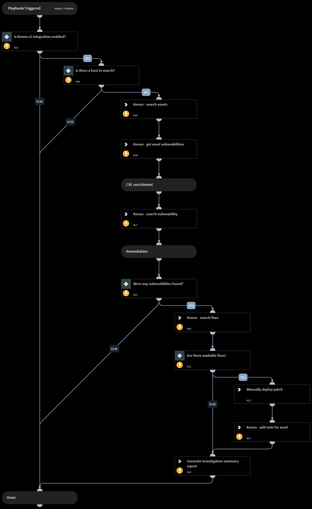

This playbook accepts an asset, then searches for vulnerabilities on that asset using the Kenna integration. If a vulnerability exists, it looks for relevant patches, lets the analyst deploy them and then generates an investigation summary report.

## Dependencies

This playbook uses the following sub-playbooks, integrations, and scripts.

### Sub-playbooks

This playbook does not use any sub-playbooks.

### Integrations

This playbook does not use any integrations.

### Scripts

* GenerateInvestigationSummaryReport

### Commands

* kenna-search-vulnerabilities
* kenna-search-assets
* kenna-update-asset
* kenna-search-fixes
* kenna-get-asset-vulnerabilities

## Playbook Inputs

---

| **Name** | **Description** | **Default Value** | **Required** |
| --- | --- | --- | --- |
| hostname | Hostname to search. |  | Optional |
| host_id | Kenna host ID to search. |  | Optional |

## Playbook Outputs

---

| **Path** | **Description** | **Type** |
| --- | --- | --- |
| Report.Name | Report file name. | string |
| Report.FileID | File ID of the report. | string |
| Kenna.Vulnerabilities.ID | The vulnerability ID. | unknown |
| Kenna.VulnerabilitiesOfAsset.ID | The ID of the vulnerability associated with the the asset. | unknown |
| Kenna.Fixes.ID | The fix ID. | unknown |
| Kenna.Fixes.Assets.ID | The asset ID related to the current fix. | unknown |
| Kenna.Fixes.Vulnerabilities.ID | The vulnerability ID related to the current fix. | unknown |

## Playbook Image

---

