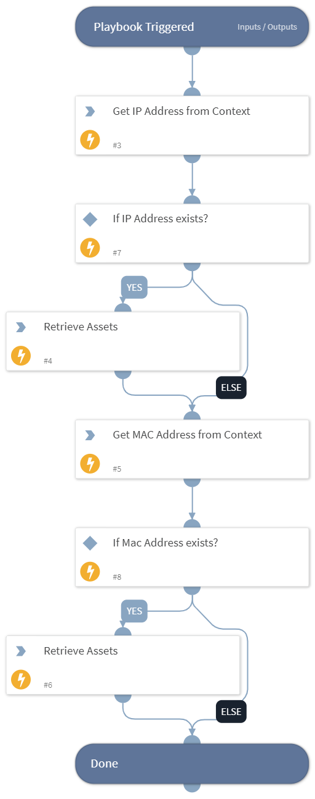

Lansweeper is an application that gathers information of computers and other devices on the network for management, compliance and audit purposes.

**What does this pack do?**

The Lansweeper content pack provides the following capabilities:
- Allows users to search specific assets.
- Retrieves asset details for the provided IP address from the Lansweeper platform. 
- Retrieves asset details for the provided MAC address from the Lansweeper platform.
- Provides detailed information about each asset such as it’s type, operating system, serial number and much more contextual information.

### Playbooks

This content pack includes the following playbook:

#### Retrieve Asset Details - Lansweeper
Get contextual information of asset based on IP/MAC from Lansweeper.
