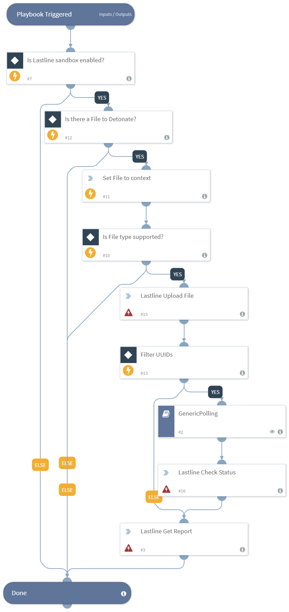

Detonates a file using the Lastline sandbox.

Lastline supports the following File Types:
EXE, SYS, DLL, COM, SCR, CPL, OCX, CGI, DOC, DOTM, DOCX, DOTX, XLS, PPAM, XSLX, PPS, XLSB, PPSX, XLSM, PPSM, PPT, PPTX, PPTM, RTF, SHS, XLTM, SLDM, XLTX, SLDX, XLAM, THMX, DOCM, XAR, JTD, JTDC, PDF, SWF, GZ, 7Z, TGZ, MSI, ZIP, LZH, CAB, LZMA, APK, JAR, CLASS, JPEG, PNG, GIF, CMD, ACE, BAT, ARJ, VBS, CHM, XML, LNK, URL, MOF, HTM, OCX, HTML, POTM, EML, POTX, MSG, PS, |VB, REG, VBA, WSC, VBE, WSF, VBS, WSH

## Dependencies
This playbook uses the following sub-playbooks, integrations, and scripts.

### Sub-playbooks
* GenericPolling

### Integrations
This playbook does not use any integrations.

### Scripts
* Set

### Commands
* lastline-get-report
* lastline-check-status
* lastline-upload-file

## Playbook Inputs
---

| **Name** | **Description** | **Default Value** | **Source** | **Required** |
| --- | --- | --- | --- | --- |
| File | The file to detonate. The file is taken from the context. | None | File | Optional |
| Interval | The polling frequency. How often the polling command should run (in minutes). | 1 | - | Optional |
| Timeout | The amount of time to wait before a timeout occurs (in minutes). | 15 |-  | Optional |

## Playbook Outputs
---

| **Path** | **Description** | **Type** |
| --- | --- | --- |
| DBotScore.Type | The type of the indicator (only in case of report type=json). | string |
| InfoFile.EntryID | The EntryID of the report file. | string |
| DBotScore.Vendor | The vendor used to calculate the score (only in case of report type=json). | string |
| IP.Address | The IP addresses's relevant to the sample. | string |
| DBotScore.Score | The actual score (only in case of report type=json). | number |
| DBotScore.Indicator | The indicator that was tested (only in case of report type=json). | string |
| InfoFile.Extension | The extension of the report file. | string |
| InfoFile.Name | The name of the report file. | string |
| InfoFile.Info | The info of the report file. | string |
| InfoFile.Size | The size of the report file. | number |
| InfoFile.Type | The type of the report file. | string |
| URL.Data | The list of malicious URLs identified by Lastline analysis. | string |
| URL.Malicious.Vendor | The vendor that made the decision that the URL is malicious. | string |
| URL.Malicious.Description | The reason the vendor made the decision that the URL is malicious. | string |
| URL.Malicious.Score | The score from the vendor that decided the URL is malicious. | number |
| File.MD5 | The bad MD5 hash of the file. | string |
| File.SHA1 | The bad SHA1 hash of the file. | string |
| File.SHA256 | The bad SHA256 hash of the file. | string |
| File.Malicious.Vendor | The vendor that made the decision that the file is malicious. | string |
| File.Malicious.Score | The score from the vendor that made the decision that the file is malicious. | number |
| Lastline.Submission.Status | The status of the submission. | string |
| Lastline.Submission.DNSqueries | The list of DNS queries done by the analysis subject. | string |
| Lastline.Submission.NetworkConnections | The list of network connections done by the analysis subject. | string |
| Lastline.Submission.DownloadedFiles | The list of files that were downloaded using the Microsoft Windows file-download API functions. Each element is a tuple of file-origin URL and a File element. | string |
| Lastline.Submission.UUID | The task UUID of submitted sample. | number |
| Lastline.Submission.YaraSignatures.name | The Yara signature's name. | string |
| Lastline.Submission.YaraSignatures.score | The score according to the yara signatures. Must be from 0 to 100. | number |
| Lastline.Submission.Process.arguments | The argument of the process. | string |
| Lastline.Submission.Process.process_id | The process ID. | string |
| Lastline.Submission.Process.executable.abs_path | The absolute path of the executable of the process. | string |
| Lastline.Submission.Process.executable.filename | The filename of the executable. | string |
| Lastline.Submission.Process.executable.yara_signature_hits | The Yara signature of the executable of the process. | string |
| Lastline.Submission.Process.executable.ext_info | The executable info of the process. | string |
| Lastline.Submission.YaraSignatures.internal | Whether the signature is only for internal usage. | boolean |
| File | The file object. | unknown |
| File.Malicious | The file's malicious object. | unknown |
| DBotScore | The DBot score object. | unknown |
| Lastline.Submission | The Lastline submission object. | unknown |

## Playbook Image
---

